# Tableau {#tableau}

## Generalidades {#generalidades}

### ¿Qué es Tableau?

Tableau es una plataforma de análisis visual que transforma la forma en que usamos los datos para resolver problemas, lo que permite a las personas y organizaciones aprovechar al máximo sus datos.  Esta plataforma hace que sea más fácil para las personas explorar y administrar datos, y más rápido para descubrir y compartir información que puede cambiar las empresas y el mundo, todo lo creado por esta plataforma esta impulsado por ayudar a las personas a ver y comprender los datos, porque sus productos están diseñados para poner al usuario en primer lugar, ya sea un analista, un científico de datos, un estudiante, un profesor, un ejecutivo o un usuario empresarial. Desde la conexión hasta la colaboración, Tableau es la plataforma de análisis de un extremo a otro más potente, seguro y flexible. 

Tableau se fundo en 2003 como resultado de un proyecto de informática en Stanford que tenia como objetivo mejorar el flujo de análisis y hacer que los datos fueran más accesibles para las personas a través de la visualización. Los cofundadores Chris Stolte, Pat Hanrahan y Christian Chabot desarrollaron y patentaron la tecnología fundamental de Tableau, VizQL, que expresa visualmente los datos al traducir las acciones de arrastrar y soltar en consultas de datos a través de una interfaz intuitiva. Desde su fundación han invertido continuamente en investigación y desarrollo, creando así soluciones para ayudar a cualquier persona que trabaje con datos a obtener respuestas más rápido y descubrir información no anticipada, este desarrollo e investigación incluye hacer que el aprendizaje automático, las estadísticas, el lenguaje natural y la preparación inteligente de datos sean más útiles para aumentar la creatividad humana en el análisis. 

### Principales ventajas de Tableau

-	Puedes ver y entender tus datos

Es la misión de la compañía, “ayudar a las personas a ver y comprender sus    datos”. Con Tableau está cambiando la forma en la que las personas resuelven  sus preguntas, analizando sus datos de forma rápida, sencilla y visual.
Tableau es una herramienta revolucionaria que está permitiendo acceder y      analizar los datos -que son el petróleo del SXXI- a todas las personas,       democratizando el análisis de datos de forma visual.

-	Adaptable a diferentes situaciones y entornos 

Existen diversas formas de utilizar Tableau, de forma individual puedes utilizar Tableau Desktop en tu ordenador para diseñar las visualizaciones de datos.
Si necesitas un entorno para organizaciones o empresas, Tableau Server ofrece un entorno colaborativo y seguro al que puedes acceder simplemente con un navegador web. También existe Tableau Online que es equivalente, pero toda la plataforma funciona en la nube de Tableau, sin necesidad de tener infraestructura propia.

- Rápido y fácil, es posible utilizar Tableau para:
    * Crear dashboards e informes visuales.
    * Navegar y visualizar datos de múltiples formas.
    * Tener un autoservicio de BI.
    * Realizar algunos análisis estadísticos, ver tendencias y pronósticos.

No es complejo de utilizar ya que Tableau está diseñado para que sea fácil de usar, enfocado al autoservicio y no requiere de usuarios técnicos.

-	Es compatible con múltiples fuentes de datos, Tableau soporta diferentes fuentes de datos y puede conectar a más de 40 diferentes fuentes, algunos ejemplos son:
    * Ficheros Excel, CSV, PDF, etc.
    * Bases de datos relacionales como SQL Server, MySQL, etc.
    * Fuentes OLAP: Microsoft Analysis Services, SAP Hana, etc.
    * Fuentes online como Google Analytics, etc.
    * Conectores a servicios web.


- Juega con tus bases de datos: 

Además de conectarse a fuentes de datos diferentes, en Tableau puedes conectarte a diferentes vistas de datos a la vez, crear extracciones, hacer transformaciones, unir y dividir datos, combinar diferentes fuentes de datos, crear grupos y conjuntos, etc.

-	No necesitas programar: 

Todas las funcionalidades de Tableau funcionan con arrastrar y soltar, incluso la creación de cálculos (que tienen su propio asistente de ayuda) puedes hacerla así, simplemente con el ratón.
Eso no quita que, si lo deseas, puedas integrar y utilizar Tableau con herramientas y lenguajes más complejos como Python o R para la analítica de datos.

- Tiene una comunidad enorme:

En Internet es posible encontrar multitud de usuarios que comparten su trabajo y aprender de ellos, ver y compartir visualizaciones en las galerías de [Tableau Public](https://public.tableau.com/en-us/s/), formarte en la plataforma gratuita de [Tableau Training](https://www.tableau.com/learn/training/20203), resolver dudas en [Tableau Community](https://community.tableau.com/s/), conocer a otros usuarios en los [Tableau User Group](https://usergroups.tableau.com/).

### Principales desventajas de Tableau

- Se requiere preparación de datos inicial.
- Las características pueden parecer demasiado especializadas y restrictivas, ya que Tableau esta diseñado para un uso más amplio. 
- Aunque es excelente para fines analíticos, no puede reemplazar las aplicaciones de informes financieros. 	
- Brinda la capacidad de establecer seguridad de “nivel bajo” en el nivel de datos, pero lo implementa de una manera un poco precaria. 
- Tableau se ha especializado en el factor de facilidad de uso. Sin embargo, a medida que los usuarios van obteniendo habilidades y experiencia desean hacer más, y Tableau posee una capacidad limitada de ampliación que no siempre les permite ir a donde desean.
- Los usuarios especializados en herramientas de Inteligencia Empresarial suelen considerar mejor contar con una arquitectura abierta. 

### Productos de Tableau

-	[Tableau Public](https://public.tableau.com/en-us/s/): es una plataforma gratuita en línea para explorar visualizaciones de datos y compartir con el público general.
    * Las visualizaciones publicadas en Tableau Public están disponibles para consultarlas en línea, es una plataforma de datos públicos. 
    * No es posible guardar visualizaciones localmente.
    * Solo es posible la Conexión a archivos CSV, Excel, y archivos de texto.
    * No es posible cargar más de 15 millones de filas. 
    * No permite conexión en tiempo real con los datos, solo es posible la conexión por medio de extracción. 
    * [Recursos de aprendizaje guiados](https://public.tableau.com/es-es/s/resources). 
    * [Desafíos virtuales](https://public.tableau.com/es-es/s/resources).
    * [Datos de muestra](https://public.tableau.com/es-es/s/resources).

-	[Tableau Desktop](https://www.tableau.com/products/desktop): es la versión profesional, de escritorio y paga de Tableau.
    * Las visualizaciones se pueden guardar localmente en nuestro computador. 
    * Cantidad ilimitada de datos.
    * Conexión a todas las fuentes de datos, tanto locales como en la nube.

- [Tableau Prep](https://www.tableau.com/trial/tableau-prep?utm_campaign_id=2017049&utm_campaign=Prospecting-CORE-ALL-ALL-ALL-ALL&utm_medium=Paid+Search&utm_source=Google+Search&utm_language=EN&utm_country=RoLAC&kw=%2Btableau%20%2Bprep&adgroup=CTX-Brand-Tableau+Prep-EN-B&adused=335523927259&matchtype=b&placement=&gclid=CjwKCAjw0On8BRAgEiwAincsHMNUqIicWtve96Be3NVOstpKxXYHS87VxJn-dxW5W3dLcqPzrbZDjRoClTkQAvD_BwE&gclsrc=aw.ds): proporciona una forma visual y directa de combinar, dar forma y limpiar datos, así como automatizar los flujos de preparación de datos, lo que le ayuda a obtener análisis y conocimientos más rápidamente, se compone de dos productos:
    * Tableau Prep Builder para crear sus flujos de datos. Si desea editar un valor, seleccione y edite directamente. Cambie su tipo de unión y vea el resultado de inmediato. Con cada acción, ve instantáneamente cambiar sus datos, incluso en millones de filas de datos. Tableau Prep Builder le brinda la libertad de reordenar los pasos y experimentar sin consecuencias. Utilice funciones inteligentes para solucionar problemas comunes de preparación de datos. Tableau Prep Builder emplea agrupaciones difusas para convertir tareas repetitivas, como agrupar por pronunciación, en operaciones de un solo clic.
    * Tablear Prep Conductor permite publicar y ejecutar flujos fácilmente en su entorno de servidor. Comparta sus fuentes de datos de forma segura con Tableau Server o Tableau Online. Cree un entorno en el que todos los miembros de su organización puedan trabajar con datos preparados y actualizados.

- [Tableau Server](https://www.tableau.com/trial/tableau-server?utm_campaign_id=2017049&utm_campaign=Prospecting-PROD-ALL-ALL-ALL-ALL&utm_medium=Paid+Search&utm_source=Google+Search&utm_language=EN&utm_country=RoLAC&kw=tableau%20server&adgroup=CTX-Brand-Tableau+Server-EN-E&adused=335523921559&matchtype=e&placement=&gclid=CjwKCAjw0On8BRAgEiwAincsHCZqPLQEPe2h4IAzln5xZCifMpCslooGEQsI1lydcdCjsnXsw-JCSxoCdqgQAvD_BwE&gclsrc=aw.ds): servidor que permite colaborar de forma segura y compartir la información a partir de los datos que ya hayamos subido a través de Tableau Desktop.

- [Tableau Online](https://www.tableau.com/trial/tableau-online?utm_campaign_id=2017049&utm_campaign=Prospecting-PROD-ALL-ALL-ALL-ALL&utm_medium=Paid+Search&utm_source=Google+Search&utm_language=EN&utm_country=RoLAC&kw=tableau%20online&adgroup=CTX-Brand-Tableau+Online-EN-E&adused=335550600371&matchtype=e&placement=&gclid=CjwKCAjw0On8BRAgEiwAincsHKCBtZUhZ2zpL8R-ozsGupggrrqr_lCJBaOS-znSXDBANWonewDlDBoCBKEQAvD_BwE&gclsrc=aw.ds): se trata de una versión de Tableau Server alojada en la nube que permite acceder a los datos sin necesidad de hacer instalaciones. 

- [Tableau Mobile](https://www.tableau.com/products/mobile): se trata de una aplicación complementaria gratuita para Tableau Server o Tableau Online que permite un acceso a los datos y la información guardada en nuestra cuenta.

### Precios de Tableau 

- Para individuos existe “Creador de Tableau”, tiene un costo de $70 USD por usuario mensual. Incluye Tableau Desktop, Tableau Prep Builder y una licencia de Creator en Tableau Server o Tableau Online.

- Para equipos y organizaciones: Se tiene la opción de implementar con Tableau Server o implementar con Tableau Online, ambas implementaciones requieren al menos un usuario Creador de Tableau y proporcionan la opción de elegir entre dos roles de usuario, pero varían en los precios.
    * Implementación con Tableau Server:
        * Creador de Tableau, tiene un costo de $70 USD por usuario mensual. Incluye Tableau Desktop, Tableau Prep Builder y una licencia de creador en Tableau Server.
        * Explorador de Tableau, permite explorar datos confiables y responder sus propias preguntas más rápido con análisis completos de autoservicio, tiene un costo de $35 USD por usurario mensual y se requieren mínimo 5 exploradores. Incluye una licencia de Explorer de Tableau Server.
        * Visor de Tableau, permite ver e interactuar con paneles y visualizaciones en una plataforma segura y fácil de usar, posee un costo de $12 USD por usuario mensual y se requieren mínimo 100 espectadores. Incluye una licencia de Viewer de Tableau Sever.
        
    * Implementación con Tableau Online:
        * Creador de Tableau, permite al usuario descubrir información valiosa con un potente conjunto de productos que respaldan su flujo de trabajo de análisis de un extremo a otro, tiene un costo de $70 USD por usuario mensual. Incluye Tableau Desktop, Tableau Prep Builder y una licencia de Creator en Tableau Online.
        * Explorador de Tableau, permite explorar datos confiables y responder sus propias preguntas más rápido con análisis completos de autoservicio, tiene un costo de $42 USD por usurario mensual y se requieren mínimo 5 exploradores. Incluye una licencia de Explorer de Tableau Online. 
        * Visor de Tableau, permite ver e interactuar con paneles y visualizaciones en una plataforma segura y fácil de usar, posee un costo de $15 USD por usuario mensual y se requieren mínimo 100 espectadores. Incluye una licencia de Viewer de Tableau Online.

Para mayor información acerca de los precios puede visitar [Tableau Pricing](https://www.tableau.com/pricing/individual).

### Compartir el trabajo realizado en Tableau {#compartirtrabajo}

Cuando se usa Tableau Desktop, hay varias formas de guardar y compartir el trabajo realizado:

1. Guardar automáticamente un libro de trabajo: Tableau Desktop guarda automáticamente el trabajo realizado cada pocos minutos; por lo que no se perderán horas de trabajo si Tableau Desktop se cierra inesperadamente. Esta función está habilitada de forma predeterminada.
Si Tableau falla, se crea automáticamente una versión recuperada del libro de trabajo con una extensión $.twbr$ y se guarda en la misma ubicación que el archivo original o en su carpeta Mi repositorio / libros de Tableau . Los libros de trabajo nuevos se guardan con el nombre "Libro1" más un ID numérico. Cuando vuelve a abrir Tableau, un cuadro de diálogo de recuperación muestra una lista de los archivos recuperados que puede seleccionar y abrir para continuar en su flujo.

2. Guardar un libro de trabajo: cuando abre Tableau Desktop, crea automáticamente un nuevo libro de trabajo. Los libros de trabajo contienen el trabajo que crea y constan de una o más hojas de trabajo. Cada hoja de trabajo contiene una vista particular de sus datos. Para guardar un libro de trabajo de Tableau:
    * Seleccione Archivo > Guardar.
    * Especifique el nombre del archivo del libro de trabajo en el cuadro de
    diálogo Guardar como.
    De forma predeterminada, Tableau guarda el archivo con la extensión .twb.
    De forma predeterminada, Tableau guarda su libro de trabajo en la carpeta
    Libros de trabajo de su repositorio Mi Tableau. Puede encontrar este
    repositorio en su carpeta Documentos. Sin embargo, puede guardar los
    libros de trabajo de Tableau en cualquier directorio que elija.
    * Para guardar una copia de un libro de trabajo que tiene abierto:
        * Seleccione Archivo > Guardar como y guarde el archivo con un nombre
        nuevo.
        
3. Guardar un libro de trabajo empaquetado: estos libros de trabajo contienen el libro de trabajo junto con una copia de cualquier fuente de datos de archivo local e imágenes de fondo. El libro de trabajo ya no está vinculado a las imágenes y las fuentes de datos originales. Estos libros de trabajo se guardan con una extensión de archivo .twbx. Otros usuarios pueden abrir el libro de trabajo empaquetado con Tableau Desktop o Tableau Reader y no necesitan acceder a las fuentes de datos que incluye el libro de trabajo.

4. Guardar un marcador: puede guardar una sola hoja de trabajo como marcador de Tableau. Cuando guarda el marcador, Tableau crea una instantánea de la hoja de trabajo. Se puede acceder a los marcadores desde cualquier libro utilizando el menú Marcadores. Cuando abre una hoja de trabajo marcada como favorita, agrega la hoja de trabajo a su libro de trabajo en el estado en que estaba cuando se marcó. Nunca se actualizará ni cambiará automáticamente. Los marcadores son convenientes cuando tiene hojas de trabajo que usa con frecuencia. Para guardar un marcador de Tableau:
    * Seleccione Archivo > Marcador > Crear marcador.
    * Especifique el nombre y la ubicación del archivo de marcador en el
    cuadro de diálogo Crear marcador.
    
Tableau guarda el archivo con la extensión .tbm. La ubicación predeterminada es la carpeta Marcadores en el repositorio de Tableau. Sin embargo, puede guardar marcadores en cualquier ubicación que elija. Los marcadores que no están almacenados en el repositorio de Tableau no aparecen en el menú Marcador.

Es posible compartir libros de trabajo y marcadores con sus compañeros de trabajo, siempre que puedan acceder a las fuentes de datos relevantes que utiliza el libro de trabajo. Si sus compañeros de trabajo no tienen acceso a las fuentes de datos, puede guardar un libro de trabajo empaquetado.

Los campos personalizados como medidas agrupadas, campos calculados, grupos y conjuntos se guardan con libros de trabajo y marcadores.

5. Libros de trabajo empaquetados: estos libros contienen el libro de trabajo junto con una copia de cualquier fuente de datos de archivo local e imágenes de fondo. El libro de trabajo ya no está vinculado a las imágenes y las fuentes de datos originales. Estos libros de trabajo se guardan con una extensión de archivo .twbx. Otros usuarios pueden abrir el libro de trabajo empaquetado con Tableau Desktop o Tableau Reader.
   * Cree un .twbx con fuentes de datos basadas en archivos
       1. Seleccione Archivo> Guardar como.
       2. Especifique un nombre de archivo para el libro empaquetado en el
       cuadro de diálogo Guardar como.
       3. Seleccione Libros de trabajo empaquetados de Tableau en la lista
       desplegable Guardar como tipo .
       4.	Haga clic en Guardar .
      La ubicación predeterminada es la carpeta Workbooks del repositorio de        Tableau. Sin embargo, puede guardar libros de trabajo empaquetados en         cualquier directorio que elija.
      
      Los siguientes archivos se incluyen en los libros de trabajo                  empaquetados:
       * Imágenes de fondo.
       * Geocodificación personalizada.
       * Formas personalizadas.
       * Archivos de cubo locales.
       * Archivos de Microsoft Access.
       * Archivos de Microsoft Excel.
       * Archivos de extracción de Tableau (.hyper o .tde).
       * Archivos de texto (.csv, .txt, etc.)
    * Cree un .twbx con fuentes de datos no basadas en archivos 
    Si el libro de trabajo contiene conexiones a fuentes de datos 
    empresariales u otras fuentes de datos no basadas en archivos, como 
    Microsoft SQL, Oracle o MySQL, los datos deben extraerse de las fuentes de
    datos para que se incluyan en un libro de trabajo empaquetado (.twbx ).
       1. En el libro de trabajo, haga clic con el botón derecho en la fuente
       de datos en el panel Datos y elija Extraer datos. 
       2. En el cuadro de diálogo Extraer datos, haga clic en el botón Extraer
       para extraer todos los datos de la fuente de datos. Una vez que se
       completa la extracción, el icono de la fuente de datos cambia para
       indicar que hay una extracción activa para esa fuente de datos. En
       lugar de un solo cilindro, hay dos cilindros conectados por una flecha.
       3. Opcional: repita los pasos anteriores para cada fuente de datos en
       el libro de trabajo.
       4. Seleccione Archivo > Guardar como.
       5. En el menú desplegable Guardar como tipo , seleccione Libro de
       trabajo empaquetado de Tableau (* .twbx).
Una vez que se hayan creado los extractos para todas las fuentes de datos no basadas en archivos y se haya guardado el libro de trabajo empaquetado, puede enviar su libro de trabajo.
    * Cree un .twbx con fuentes de datos de Tableau Server, si el libro de trabajo contiene conexiones a una fuente de datos de Tableau Server publicada, debe descargar una copia local de la fuente de datos de Tableau Server, tomar un extracto y luego reemplazar la conexión a la copia local para que se incluya en un libro de trabajo empaquetado. (.twbx).
        1. En el libro de trabajo, haga clic con el botón derecho en la fuente de datos publicada en el panel Datos y luego seleccione Crear copia local. Se agrega una copia de la fuente de datos publicada al panel Datos.
        2. Haga clic con el botón derecho en la copia local y seleccione Extraer datos.
        3. En el cuadro de diálogo Extraer datos, haga clic en el botón Extraer para extraer todos los datos de la fuente de datos. La creación de un extracto de la fuente de datos le permite a la persona con la que está compartiendo el libro tener acceso a una copia de la fuente de datos.
        4. En el panel Datos, haga clic con el botón derecho en la fuente de datos publicada y luego seleccione Reemplazar fuente de datos.
        5. Verifique que la fuente de datos publicada sea reemplazada por la fuente de datos local y luego haga clic en Aceptar.
        6. Haga clic con el botón derecho en la fuente de datos publicada y luego haga clic en Cerrar.
        7. Seleccione Archivo > Guardar como.
        8. En el menú desplegable Guardar como tipo , seleccione Libro de trabajo empaquetado de Tableau (* .twbx).
   * Desempaquetar un .twbx, los libros empaquetados se pueden descomprimir.
   En una computadora con Windows o macOS, cambie el nombre del archivo con
   una extensión .zip (por ejemplo, de myfile.twbx a myfile.zip) y luego haga
   doble clic en él.
   Cuando desempaqueta un libro de trabajo, obtiene un archivo de libro de trabajo normal (.twb), junto con una carpeta que contiene las fuentes de datos y las imágenes que se empaquetaron con el libro de trabajo.
   
Hay varias formas de obtener vistas y libros de trabajo de Tableau Desktop y convertirlos en una presentación, informe o página web. 

- Copiar una vista como imagen, puede copiar rápidamente una vista individual como una imagen y pegarla en otra aplicación, como Microsoft Word o Excel. Si usa Tableau Desktop en macOS, se copia una imagen TIFF (formato de archivo de imagen con etiquetas) al portapapeles. En Windows, se copia una imagen BMP (mapa de bits).
    1. Seleccione Hoja de trabajo > Copiar > Imagen.
    2. En el cuadro de diálogo Copiar imagen, seleccione los elementos que desea incluir en la imagen. Si la vista contiene una leyenda, en Opciones de imagen, seleccione el diseño de la leyenda.
    3. Haga clic en Copiar.
    4. Abra la aplicación de destino y pegue la imagen del portapapeles.
    
- Exportar una vista como un archivo de imagen, para crear un archivo de imagen que pueda reutilizar, exporte la vista en lugar de copiarla. Puede elegir el formato BMP, JPEG o PNG en macOS.
    1. Seleccione Hoja de trabajo > Exportar > Imagen. 
    2. En el cuadro de diálogo Exportar imagen, seleccione los elementos que desea incluir en la imagen. Si la vista contiene una leyenda, en Opciones de imagen, seleccione el diseño de la leyenda.
    3. Haga clic en Guardar.
    4. En el cuadro de diálogo Guardar imagen, especifique la ubicación, el nombre y el formato del archivo. Luego haga clic en Guardar.
    
- Exportar como una presentación de PowerPoint, cuando exporta un libro a formato de Microsoft PowerPoint, las hojas seleccionadas se convierten en imágenes PNG estáticas en diapositivas independientes. Si exporta una hoja de historia, todos los puntos de la historia se exportan como diapositivas independientes. Todos los filtros aplicados actualmente en Tableau se reflejan en la presentación exportada. Para exportar un libro a PowerPoint:
    1. Seleccione Archivo > Exportar como PowerPoint.
    2. Seleccione las hojas que desea incluir en la presentación. (También se pueden incluir hojas ocultas). El archivo de PowerPoint exportado refleja el nombre de archivo de su libro y la diapositiva de título indica el nombre del libro y la fecha en que se generó.
    
- Exportar a PDF, para crear un archivo basado en vectores que incorpore las fuentes de Tableau, imprima en PDF. Después de personalizar el diseño de los elementos de la página mediante el cuadro de diálogo Archivo > Configurar página , elija Archivo > Imprimir en PDF.

Al crear, editar e interactuar con vistas en Tableau Server o Tableau Online, existen formas diferentes de guardar su trabajo:

1. Guardar un libro de trabajo: cuando crea un libro de trabajo nuevo o edita un libro de trabajo existente en Tableau Server o Tableau Online, puede guardar su trabajo en cualquier momento. Para guardar un libro de trabajo:
    * En el modo de edición web, seleccione Archivo > Guardar.
    
2. Guardar una copia de un libro de trabajo: A veces, no desea sobrescribir una vista existente con sus cambios. En casos como estos, puede guardar una copia de un libro de trabajo existente. Cuando hace esto, el libro de trabajo existente permanece sin cambios y se crea una copia para que pueda editarlo como desee. Para guardar una copia de un libro de trabajo:
    * En el modo de edición web, seleccione Archivo > Guardar como .
    * En el cuadro de diálogo Guardar libro de trabajo que se abre, haga lo
    siguiente:
        * Para el nombre: introduzca un nombre para el libro.
        * Para proyecto: seleccione el proyecto en el que le gustaría guardar
        el libro de trabajo.
    * Haga clic en Guardar.
    
3. Guardar cambios como una vista personalizada: una vista personalizada no cambia la original, pero está relacionada con ella. Si la vista original se actualiza o se vuelve a publicar, la vista personalizada también se actualiza. También puede elegir si sus vistas personalizadas son visibles para otros usuarios (públicas) o solo para usted (privadas).

Cuando se usa Tableau Public solo se tiene la opción de guardar el libro de trabajo en el repositorio público, para el cual debe seguir estos pasos:

   1. Con su libro de trabajo abierto en Tableau Desktop Public Edition, seleccione Archivo > Guardar en Tableau Public como...
   
```{r guardar1-fig, echo=FALSE, fig.align='center', fig.asp=.75, fig.cap='Guardar trabajo', out.width='40%'}
knitr::include_graphics("Imágenes/imagen1.png")
```   
   
   2. Inicie sesión con su cuenta de Tableau Public. Si no tiene una cuenta, seleccione el enlace para crear una nueva.
   
```{r iniciosesion-fig, echo=FALSE, fig.align='center', fig.asp=.75, fig.cap='Iniciar sesión', out.width='60%'}
knitr::include_graphics("Imágenes/imagen5.JPG")
```    
  
   3. Escriba un nombre para el libro y haga clic en Guardar. Cuando guarda un libro de trabajo en Tableau Public, el proceso de publicación crea un extracto de la conexión de datos.
   
```{r nombrelibro-fig, echo=FALSE, fig.align='center', fig.asp=.75, fig.cap='Asignar nombre al libro de trabajo', out.width='60%'}
knitr::include_graphics("Imágenes/Imagen3.png")
``` 
   
   4. Una vez publicado el libro de trabajo, se le redirige a su cuenta en el sitio web de Tableau Public.(El enlace se abre en una nueva ventana).
   5. Una vez en el sitio web de la visualización haga clic en el botón con el icono de compartir y copie el enlace para agregarlo en el sitio web o donde desee publicar el trabajo. 
   
```{r compartir-fig, echo=FALSE, fig.align='center', fig.asp=.75, fig.cap='Compartir trabajo', out.width='40%'}
knitr::include_graphics("Imágenes/Imagen4.png")
``` 

Para obtener más información acerca de los pasos de publicación del trabajo puede visitar [Ayuda de Tableau](https://help.tableau.com/current/pro/desktop/en-us/save_savework.htm).

## Instalación de Tableau Desktop Public

El proceso de instalación de la versión de escritorio de Tableau Public se realiza mediante los siguientes pasos:

   1. Dirigirse a la página principal de [Tableau Public](https://public.tableau.com/en-us/s/), ingrese un correo electrónico con el cual quiere vincular su descarga y cuenta de Tableau Public, luego clic en "DOWNLOAD THE APP", inmediantamente se inicia la descarga.
   
```{r descargapublic-fig, echo=FALSE, fig.align='center', fig.asp=.75, fig.cap='Descarga de Tableau Public', out.width='80%'}
knitr::include_graphics("Imágenes/descargapublic.JPG")
```
   
   2. Una vez se complete la descarga abra el archivo, lea los términos de licencia, selecciones "He leído y acepto los términos de acuerdo de licencia" y finalmente clic en "Instalar".

```{r descarga2-fig, echo=FALSE, fig.align='center', fig.asp=.75, fig.cap='Descarga de Tableau Public', out.width='60%'}
knitr::include_graphics("Imágenes/descarga2.JPG")
```

   3. Cuando términe el proceso de instalación se creará un acceso directo en el escirtorio a la aplicación, una vez creadas las visualizaciones puede continuar con el proceso de publicación del trabajo mostrado en la sección \@ref(compartirtrabajo). 

## Forma de navegación {#formadenavegacion}

Al momento de abrir Tableau esta es la pantalla con la que se encuentra, en el panel del lateral izquierdo encontrará el tipo de fuentes a las que se puede conectar, en la parte central se ubican los proyectos que ya se han realizado usando este software, en el panel lateral derecho encuentra videos paso a paso sobre conexión a datos y realización de gráficos, en la parte inferior de este panel encontrara visualizaciones alojadas en la galería de Tableau, conjunto de datos de muestra y capacitaciones.  

```{r paginaprincipal-fig, echo=FALSE, fig.align='center', fig.asp=.75, fig.cap='Página principal de Tableau', out.width='90%'}
knitr::include_graphics("Imágenes/Interfaz1.JPG")
```

Sin conectarse a alguna fuente de datos puede hacer clic en el icono de Tableau que se encuentra debajo de la pestaña archivo, se abrirá la siguiente pantalla:

```{r ventanacreacion-fig, echo=FALSE, fig.align='center', fig.asp=.75, fig.cap='Área de trabajo', out.width='90%'}
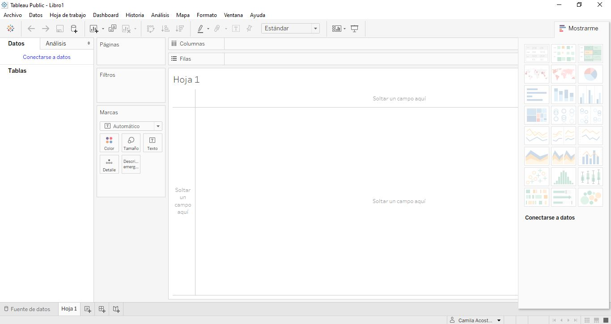
```

Esta es la ventana donde se pueden crear todas las visualizaciones, en la esquina superior izquierda se encuentra el nombre del libro de trabajo, recuerde que un libro de trabajo puede incluir hojas, dashboard o historias, después de esto se encuentran varias pestañas que permiten abrir libros de trabajo anteriores o guardar el trabajo que se está creando, permite conectarnos a nuevas fuentes de datos, crear hojas de trabajo dashboard e historias, editar formatos de mapas y ventanas, y finalmente una pestaña de ayuda, en la cual encontrara soporte, configuraciones de idioma y capacitaciones. 
Luego esta ubicada la barra de herramientas esta contiene diferentes botones como el icono de Tableau que permite navegar hacia la página de inicio que se muestra en la figura \@ref(fig:paginaprincipal-fig), posee botones de deshacer y rehacer, guardar y conectar a una nueva fuente de datos, también posee botones para agregar, duplicar o eliminar hojas de trabajo, intercambiar medidas, organizar de forma descendente o ascendente, opciones de texto, de tamaño y para ocultar o visualizar tarjetas. 

En el panel lateral izquierdo en la pestaña datos encontrara el nombre de la fuente de datos con la que tiene conexión, en la parte tabla se ubican el nombre de todas las variables que contenga la base de datos, estas variables se dividen en  dimensiones y medidas, con dimensiones se refiere a todas las variables categóricas que contenga la base y medidas se refiere a las columnas con datos numéricos, estos dos tipos de variables son las que se arrastran al lienzo en blanco que se encuentra en la mitad de la pantalla para crear las visualizaciones. Si en los datos subyacentes no se incluyen todos los campos que necesita para responder a las preguntas, puede crear nuevos campos en Tableau usando cálculos y luego guardarlos como parte de la fuente de datos. Estos campos se llaman campos calculados. También existe la posibilidad de crear conjuntos, que so campos personalizados que se crean a partir de dimensiones y especificaciones realizadas por el usuario, a demás de estos tipos de datos ya mencionados existen los parámetros que sin valores que pueden usarse como marcadores de posición en fórmulas, o sustituir valores constantes en campos calculados y filtros. En la pestaña Análisis este panel permite agregar líneas constantes, de promedio, diagramas de cajas y bigotes, pronósticos de líneas de tendencia y otros elementos a la vista, las opciones de esta pestaña se muestran en la figura \@ref(fig:analisis-fig), algunas de estas opciones serán exploradas en la sección \@ref(analisisdedatos).

```{r analisis-fig, echo=FALSE, fig.align='center', fig.asp=.75, fig.cap='Opciones del panel análisis', out.width='20%'}
knitr::include_graphics("Imágenes/Interfaz4.JPG")
```
Al lado derecho del panel lateral que se describió anteriormente se encuentran los estantes Páginas y Filtro y la tarjeta Marcas. El estante Páginas permite dividir una vista en una serie de páginas para que pueda analizar mejor cómo un campo específico afecta al resto de los datos en una vista. Cuando coloca una dimensión en el estante Páginas, está añadiendo una nueva fila por cada miembro de la dimensión. Cuando coloca una medida en el estante Páginas, Tableau convierte la medida automáticamente en una medida discreta. El estante Filtros le permite especificar qué datos incluir y excluir, Puede filtrar los datos usando medidas, dimensiones o ambas al mismo tiempo. Finalmente se encuentra La tarjeta Marcas que es un elemento fundamental del análisis visual en Tableau. Al arrastrar campos a distintas propiedades en la tarjeta Marcas, puede añadir contexto y detalles a las marcas de la vista, esta tarjeta sirve para definir el tipo de marca, esto se refiere a la forma de los datos en la visualización, las marcas disponibles se muestran en la figura \@ref(fig:marcas-fig), también es posible el color, el tamaño, la forma, el texto y los detalles de los datos. 
```{r marcas-fig, echo=FALSE, fig.align='center', fig.asp=.75, fig.cap='Opciones de marca', out.width='20%'}
knitr::include_graphics("Imágenes/Interfaz3.JPG")
```

En la parte central se encuentran ubicados los estantes Columnas y Filas, estos permiten dominar el eje x y eje y respectivamente. El estante Columnas crea las columnas de una tabla, mientras que el estante Filas crea las filas. Puede colocar todos los campos que quiera en estos estantes.
Al colocar una dimensión en los estantes Filas o Columnas, se crean los encabezados de los miembros de dicha dimensión. Al colocar una medida en el estante Filas o Columnas, se crean ejes cuantitativos para esa medida. A medida que agrega más campos a la vista, se incluyen encabezados y ejes adicionales en la tabla y obtiene una imagen cada vez más detallada de sus datos.

La creación de vistas en Tableau es muy sencilla, existen dos opciones principales; la primera es usando los estantes de filas o columnas para añadir las medidas y las dimensiones, la sunga opción consiste es seleccionar los campos que quiere incluir en la vista y luego dar clic en el botón “Mostrarme” que se ubica e la esquina superior derecha de la barra de herramientas, le permite elegir un tipo de vista resaltando los tipos de vista que mejor se adapten a los tipos de campo que ha seleccionado de sus datos. Alrededor del tipo de gráfico más adecuado para sus datos aparece un contorno de color naranja, los tipos de vista disponibles con esta funcionalidad se presentan en la figura \@ref(fig:mostrarme-fig).

```{r mostrarme-fig, echo=FALSE, fig.align='center', fig.asp=.75, fig.cap='Opciones de la funcionalidad Mostrarme', out.width='30%'}
knitr::include_graphics("Imágenes/Interfaz5.JPG")
```

En la parte inferior del área de trabajo se ubican 5 compartimientos, el primero llamado Fuente de datos, permite conectarse a una nueva fuente de datos o en el caso de no estar conectado a una lo dirige a la página principal donde se puede hacer la conexión, después se sitúa la hoja de trabajo que se esta usando en el momento, a continuación, se encuentran las opciones de agregar una nueva hoja, dashboard o historia. Como se había mencionado anteriormente los libros de trabajo pueden estar compuestos de hojas, dashboards o historias. Una hoja de trabajo es donde se crean vistas de sus datos al arrastrar y soltar campos en los estantes, contiene una sola vista con estantes, tarjetas, leyendas y los paneles Datos y Análisis en la barra lateral. Un dashboard es una combinación de varias vistas que puede organizar para presentación o para supervisar. Una historia es una secuencia de vistas o dashboards que se utilizan de forma conjunta para mostrar información.

## Flujo de trabajo

### Conexión a fuentes de datos 

Antes de poder crear y analizar los datos debe conectar Tableau a estos, en este caso la conexión se hará a través de un archivo de Excel, inicialmente se hará la conexión a las bases de datos de estudiantes graduados a nivel de micro datos para mostrar las funcionalidades de unión que tiene Tableau, para hacer estas conexiones debe seguir estos pasos:

1.	Abrir Tableau desde el acceso directo creado en su escritorio al momento de la instalación, la pantalla que se debe ver es la mostrada en la figura \@ref(fig:paginaprincipal-fig).

2.	Hacer clic en el botón “Microsoft Excel” si su archivo posee este formato, al hacer clic en este botón se abre una ventana que permite navegar a través de las carpetas de su equipo para ubicar la localización de las bases de datos. Debe seleccionar una de las bases y dar clic en el botón “Abrir”.

```{r carpetas-fig, echo=FALSE, fig.align='center', fig.asp=.75, fig.cap='Navegación entre carpetas', out.width='60%'}
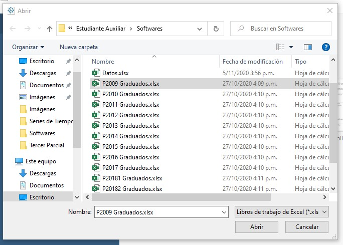
```
Con esta conexión a la fuente de datos se obtiene la siguiente pantalla 

```{r pantallaconexiondatos-fig, echo=FALSE, fig.align='center', fig.asp=.75, fig.cap='Vista previa de la conexión', out.width='80%'}
knitr::include_graphics("Imágenes/conexiondatos2.jpg")
``` 

En el panel lateral izquierdo encontrara el nombre del archivo al que se conecto en este caso “P2009 Graduados”, debajo de esto se ubican las hojas que componen el archivo para esta base solo se tiene una hoja llamada “P2009G”, luego se encuentra un botón llamado “Nueva unión”. La parte central de la conexión a datos es el lienzo en blanco dispuesto en la parte superior allí se deben arrastrar las hojas a las que se quiere conectar, en la parte inferior se encuentra una vista previa de la base de datos, los campos marcados con “#” indica que son medidas, “Abc” indica que el campo es una dimensión y finalmente las variables relacionadas con ubicaciones geográficas como latitud y longitud tiene como icono un globo terráqueo, haciendo clic sobre estos iconos se puede editar el tipo de dato, por ejemplo la variable Snies Sede Mat Tableau la tomo como una medida cuando en realidad esta variable hace referencia a la categorización establecida para las sedes de la universidad, la podemos editar dando clic en el icono “#” y en el menú desplegable seleccionar Cadena. 

```{r cambiartipocampo-fig, echo=FALSE, fig.align='center', fig.asp=.75, fig.cap='Cambiar el tipo de un campo', out.width='20%'}
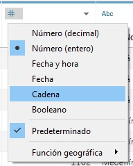
``` 
En la esquina superior derecha del lienzo, se observa una etiqueta llamada Filtros y un botón añadir, al hacer clic en este botón se abre un cuadro de diálogo que permite añadir, editar o eliminar filtros, a modo de ejemplo se creara un filtro que seleccione únicamente las filas en las que el campo Sede Nombre Adm sea Medellín,

-	Clic en el botón añadir ubicado en la parte superior derecha del lienzo.

-	En el cuadro de dialogo hacer clic en “Añadir”.

```{r crearfiltro-fig, echo=FALSE, fig.align='center', fig.asp=.75, fig.cap='Crear un filtro', out.width='60%'}
knitr::include_graphics("Imágenes/conexiondatos4.jpg")
``` 
-	Terminado el paso anterior se abre una nueva ventana que contiene el nombre de todas las columnas de la base de datos, aquí se debe seleccionar la columna por la que se quiere filtrar, en este caso Sede Nombre Adm y dar clic en aceptar.

```{r nombrecamposfiltro-fig, echo=FALSE, fig.align='center', fig.asp=.75, fig.cap='Nombre de los campos', out.width='50%'}
knitr::include_graphics("Imágenes/conexiondatos5.jpg")
``` 
-	Con esto se abre una nueva pestaña que contiene los valores de la columna seleccionada para filtrar, para el ejemplo se selección Medellín y finalmente Aceptar. 

```{r valoresdelcampo-fig, echo=FALSE, fig.align='center', fig.asp=.75, fig.cap='Valores de la columna seleccionada', out.width='60%'}
knitr::include_graphics("Imágenes/conexiondatos6.jpg")
```
Ahora la vista previa de la base se modificó, solo contiene las observaciones en las cuales se cumple el filtro aplicado, es decir donde Sede Nombre Adm sea Medellín.

Este mismo tipo de filtros se puede aplicar a medidas, definiendo un intervalo para los valores o seleccionando un valor mínimo o máximo o un cálculo especial. 
Otra opción ofrecida por Tableau es hacer uniones entre tablas de datos, esto es útil cuando se tiene la información en distintas bases de datos con la misma estructura como en este caso que se tiene la información de estudiantes graduados desde el año 2009 hasta el 2020 semestre 1 a nivel de microdatos, es decir los archivos están separados. 

Existen dos métodos básicos para combinar conjuntos de datos en Tableau la unión de columnas y la unión de filas, se pueden combinar las columnas de dos conjuntos de datos o bien filas de dos o mas conjuntos de datos, primero debe conectarse a las tablas que desea combinar cabe aclarar que estas tablas deben pertenecer al mismo archivo, en este caso como se está usando archivos Excel las tablas a unir deben ser dos hojas del archivo, a modo de ejemplo se creara un archivo en Excel que contenga en una hoja la información de los graduados en el año 2009 y en otra hoja los registros de los graduados en el año 2010 y se hará la conexión a los datos, cuando realice dicha conexión en el panel lateral izquierdo se ubica el nombre del archivo Excel, en este caso llamado “P2009-2010 Graduados” y más abajo el nombre de las dos hojas que contiene dicho archivo llamadas “P2009G” y “P2010G”, como se ilustra en la figura \@ref(fig:hojas-fig).

```{r hojas-fig, echo=FALSE, fig.align='center', fig.asp=.75, fig.cap='Nombre del archivo y hojas', out.width='40%'}
knitr::include_graphics("Imágenes/conexiondatos7.jpg")
```

La unión por columnas es útil cuando se quiere trabajar con dos columnas que se encuentran en diferentes conjuntos de datos, existen cuatro formas de realizar las uniones por columnas:

-	Interior: devuelve únicamente los registros que están presentes en ambas tablas.

-	Izquierda: devuelve todos los registros de la tabla de la izquierda y solo los registros que coinciden con la tabla de la derecha.

-	Derecha: devuelve todos los registros de la tabla de la derecha y solo los registros que coinciden con la tabla de la izquierda. 

-	Exterior: devuelve todos los registros de ambas tablas. 

En los conjuntos de datos que se están usando todos tienen las mismas columnas por lo que el interés se centra en realizar unión por filas y no por columnas para realizar este tipo de unión se tiene dos opciones:

1.	Arrastrar y soltar; este método consiste en arrastrar la primera hoja al lienzo, arrastrar la otra hoja que se quiere unir y no soltar hasta que aparezca el cuadro “Unión de filas” en color naranja, solo se debe soltar la hoja cuando este cuadro aparezca. 

```{r unionarrastrar-fig, echo=FALSE, fig.align='center', fig.asp=.75, fig.cap='Unión: Método de arrastrar y soltar', out.width='80%'}
knitr::include_graphics("Imágenes/conexiondatos8.jpg")
```
2.	Usando el panel “Nueva unión”; este panel se encuentra ubicado en el lateral izquierdo justo debajo del nombre de las hojas como se muestra en la figura \@ref(fig:hojas-fig). Para usar esta opción se debe hacer doble clic en este panel, se abre una ventana en la cual se debe asegurar que este seleccionado Especifico (manual), se deben arrastrar las hojas a unir al espacio en blanco que tiene esta ventana, finalmente hacer clic en Aceptar.

```{r unionnueva-fig, echo=FALSE, fig.align='center', fig.asp=.75, fig.cap='Unión: Método Nueva unión', out.width='40%'}
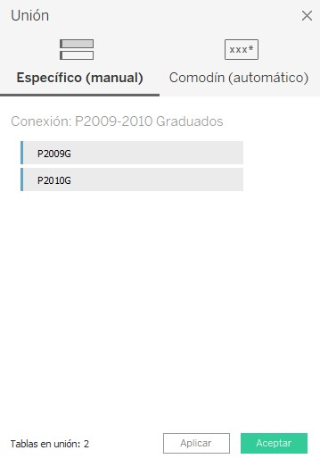
```
Tableau crea dos columnas adicionales a las que contiene a la base que ayuda a la identificación de la hoja y tabla a la que pertenecen las observaciones; si se edita la cantidad de filas que se muestra en la vista previa del conjunto de datos se puede observar los registros de ambas hojas. 

```{r nuevascolumnas-fig, echo=FALSE, fig.align='center', fig.asp=.75, fig.cap='Columnas Nuevas', out.width='80%'}
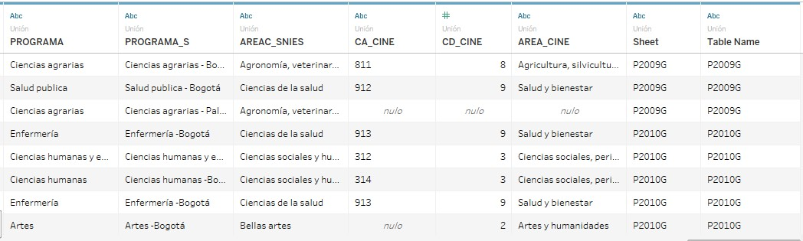
```
Siguiendo con un análisis detallado de lo mostrado por Tableau en la vista previa del conjunto de datos, se observan columnas problemáticas, la variable Ciu_Nac presenta una combinación de números y texto como se muestra en la figura \@ref(fig:columaciunac-fig), existe una función llamada división personalizada que se puede ver al hacer clic en el menú desplegable de la columna, dicha función necesita un separador para hacer la división pero en este caso no es posible usarla ya que no existe separador alguno entre el numero y el texto, esto en un problema que no puede solucionarse desde Tableau. 

```{r columaciunac-fig, echo=FALSE, fig.align='center', fig.asp=.75, fig.cap='Problema columna Ciu_Nac', out.width='80%'}
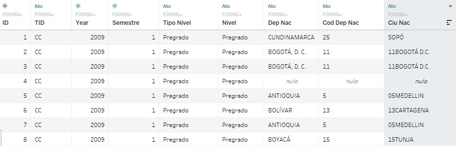
```

En este mismo menú desplegable se encuentra una opción llamada Describir, al dar clic en esta opción Tableau abre una ventana que muestra una descripción corta de la base de datos, algo similar a la función summary() de R. En la figura \@ref(fig:descripcion-fig) se muestra la descripción de la variable Dep_Nac, esta permite visualizar el tipo de campo en este caso es dicreto, contiene valores faltantes y en la parte inferior muestra una lista de los miembros más dominantes en este caso 20 de los 31 miembros totales. 

```{r descripcion-fig, echo=FALSE, fig.align='center', fig.asp=.75, fig.cap='Descripción columna Dep_Nac', out.width='80%'}
knitr::include_graphics("Imágenes/conexiondatos12.jpg")
```
Hacia las ultimas columnas de la base de datos nos encontramos con un campo llamado Programa_S, esta compuesto por el nombre del programa y la sede a la que pertenece estos dos atributos se encuentran separados por un guion, en este caso particular si es posible usar la función División, ya que el campo posee un separador.

Hacer clic en el menú desplegable de la columna de interés y seleccionar División. 

```{r división-fig, echo=FALSE, fig.align='center', fig.asp=.75, fig.cap='División de columnas', out.width='50%'}
knitr::include_graphics("Imágenes/conexiondatos13.jpg")
```

Con esto se obtiene una nueva columna llamada Programa_S División 1 que contiene el nombre del programa, es decir que elimino todo lo que se encontraba a la derecha del guion (sede), como se puede observar en la descripción de esta nueva variable. 

```{r divisióndescripcion-fig, echo=FALSE, fig.align='center', fig.asp=.75, fig.cap='Descripción de división', out.width='80%'}
knitr::include_graphics("Imágenes/conexiondatos14.jpg")
```
En el caso en que se quiera obtener ambas columnas, es decir una columna que contenga el programa y otra que contenga la sede es necesario usar División Personalizada, que también se encuentra en el menú desplegable de la columna. 

1.	Hacer clic en el menú desplegable de la columna y seleccionar división personalizada. 

```{r divisiónpersonalizada-fig, echo=FALSE, fig.align='center', fig.asp=.75, fig.cap='División personalizada', out.width='50%'}
knitr::include_graphics("Imágenes/conexiondatos15.jpg")
```

2.	En el campo Usar separador escribir – que es el separador de la columna de interés, en el campo División Desactivada se debe seleccionar Todas, para poder obtener las columnas de programa y Sede.

```{r divisiónpersonalizadapasos-fig, echo=FALSE, fig.align='center', fig.asp=.75, fig.cap='Ventana de división personalizada', out.width='50%'}
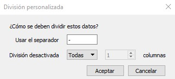
```
Finalmente se obtiene tres columnas una que contiene el programa, otra la sede y una que aparentemente posee los espacios.

```{r camposdivididospersonalizado-fig, echo=FALSE, fig.align='center', fig.asp=.75, fig.cap='Campos divididos', out.width='60%'}
knitr::include_graphics("Imágenes/conexiondatos17.jpg")
```
En este caso se considera correcto eliminar la columna División 3 ya que la información relevante de la columna original se encuentra almacenada en los campos llamados División 1 y 2. 

Una funcionalidad importante que también que se ubica en el menú desplegable de las columnas de tipo numérico como Edad_Mod es Crear grupos que permite agrupar las edades de los graduados en categorías, algo similar a los que se tiene en la columna Cat_Edad. 

1.	Hacer clic en el menú desplegable de la columna Edad_Mod y seleccionar Crear grupos.

```{r creargrupos-fig, echo=FALSE, fig.align='center', fig.asp=.75, fig.cap='Crear grupos', out.width='40%'}
knitr::include_graphics("Imágenes/conexiondatos18.jpg")
```
2.	El primer grupo estará conformado por las edades de 23 o menos años, para esto con ctrl sostenido y clic seleccionamos las edades que cumplen esta condición, luego clic en Grupo y se edita el nombre del grupo.

```{r crearprimergrupo-fig, echo=FALSE, fig.align='center', fig.asp=.75, fig.cap='Creación de grupos de edad', out.width='50%'}
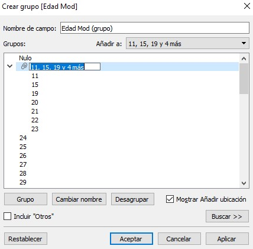
```
3.	Repita el paso anterior hasta crear las categorías de edad que considere pertinentes y luego de clic en Aceptar, con esto se obtiene una columna llamada Edad_Mod (grupo), que asigna a cada observación el grupo que pertenece.

```{r gruposedad-fig, echo=FALSE, fig.align='center', fig.asp=.75, fig.cap='Agrupamiento de la columna Edad_Mod', out.width='30%'}
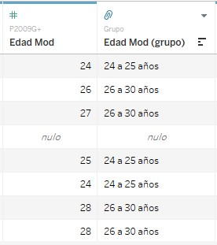
```
Para el campo Estrato_Orig también es posible crear grupos para obtener la categorización mostrada en el campo Estrato. 

Tableau no permite hacer una limpieza y preparación de datos, por tal razón la limpieza del conjunto de datos se realizo en R, se eliminaron columnas innecesarias, esto se podía hacer desde Tableau con la opción de ocultar columnas en la vista previa del archivo de datos, pero se decidió hacer en R ya que era necesario analizar la cantidad de valores faltantes por columnas y en base a esto se eliminaron; también se corrigieron espacios, mayúsculas, números y ortografía de algunas columnas de cadenas de caracteres ya que tenían varios valores que en realidad eran iguales pero por tildes, espacios o mayúsculas se contaban como diferentes. Se realizo una unión de todas las bases ya que se tenían a nivel de microdatos, el archivo a conectar con Tableau es llamado “Datos.xlsx”.

La primera observación al conectarse al conjunto de datos Datos.xlsx es que hay algunas columnas que no se tomaron como debería, por ejemplo, las variables relacionadas con la ubicación geográfica Latitud y longitud de la cuidad de nacimiento, para esto se debe,

1.	Hacer clic en el icono “Abc” y en el menú que se despliega seleccionar Número(decimal).

```{r geograficas-fig, echo=FALSE, fig.align='center', fig.asp=.75, fig.cap='Cambiar tipo de columna', out.width='40%'}
knitr::include_graphics("Imágenes/conexiondatos21.jpg")
```

2.	Cuando el icono del campo sea “#”, hacer clic nuevamente en este icono y seleccionar Función geográfica, luego clic en latitud para el caso de la variable Lat_Ciu_Nac y longitud para la otra variable. 

```{r geograficolatitud-fig, echo=FALSE, fig.align='center', fig.asp=.75, fig.cap='Convertir a latitud un campo', out.width='40%'}
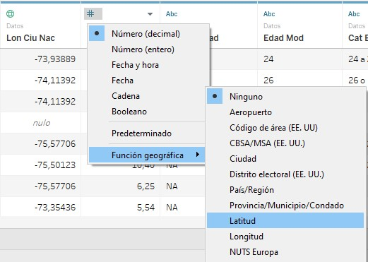
```
La variable Edad_Mod debe ser numérica y no una dimensión discreta, por tanto se debe editar seleccionando Número (entero), la variable Snies_Progra es numérica y debe ser discreta ya que se refiere a una categorización de los programas, edítela seleccionando Cadena en el menú desplegable del icono “#”.  Luego de tener la base de datos lista hacer clic en Hoja1, recuadro que aparece en la parte inferior izquierda. Ya en el lienzo de trabajo en el panel lateral izquierdo en Tablas se ubican el nombre de todas las columnas de la fuente de datos como se mencionó en la sección \@ref(formadenavegacion), recuerde que los iconos azules se refieren a dimensiones y los verdes a medidas, en la parte inferior de este panel se encuentran ubicados cuatro variables numéricas dos de ellas son Semestre y Snies_Progra que eran originales del conjunto de datos, pero hay otros dos campos llamados Datos (Recuento) y Valores de medias, estos dos campos fueron creados de manera automática por Tableau; Datos (Recuento) se refiere al total de filas de la base de datos en este caso $101.840$, Valores de medida contiene un recuento de las dos variables numéricas leídas por Tableau, el Semestre y el total de datos, la suma de semestre es $151.469$. 

```{r tablas-fig, echo=FALSE, fig.align='center', fig.asp=.75, fig.cap='Nombre de columnas desde el panel Tablas', out.width='20%'}
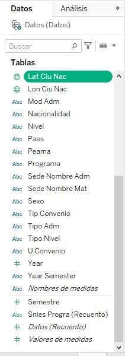
```
Realmente estas variables no son de interés en el análisis por lo que se ocultara Datos (Recuento) haciendo clic en el menú desplegable dl campo y seleccionando ocultar, el campo Valores de medidas no es posible ocultarlo o eliminarlo, se dejara allí pero no se usara como campo para la realización de gráficos. 

```{r ocultarcolumnas-fig, echo=FALSE, fig.align='center', fig.asp=.75, fig.cap='Ocultar columnas innecesarias', out.width='40%'}
knitr::include_graphics("Imágenes/conexiondatos23.jpg")
```
El campo Semestre debe ser arrastrado hacia la parte superior para convertirlo en dimensión, luego de verificar que los campos hayan sido leídos correctamente por Tableau es momento de iniciar con las visualizaciones.

### Análisis de datos {#analisisdedatos}

#### Gráfico de líneas {#graficodelineas}

Se iniciara con gráficos similares a los presentados en la sección cifras generales y graduados la página de las [estadísticas](http://estadisticas.unal.edu.co/home/) de la Universidad Nacional, en principio se hará un gráfico de líneas que muestre la evolución histórica de los estudiantes graduados en los periodos de 2009-1 a 2020-1. 

1.	Tome la columna Year-Semester, arrástrela hasta el estante columnas, tome nuevamente este campo y arrástrelo al estante filas.

```{r paso1lineas-fig, echo=FALSE, fig.align='center', fig.asp=.75, fig.cap='Campos en los estantes columnas y filas', out.width='80%'}
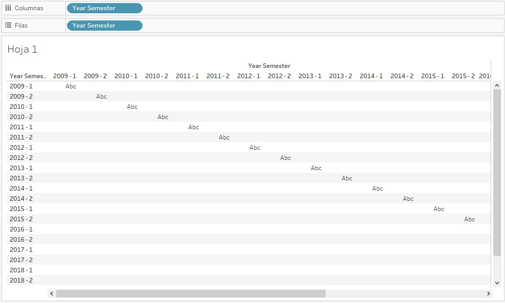
```
2.	En el campo Year-Semester ubicado en el estande filas, haga clic en el menú desplegable y seleccione medida y recuento. 

```{r paso2lineas-fig, echo=FALSE, fig.align='center', fig.asp=.75, fig.cap='Editar agregación en el estante filas', out.width='60%'}
knitr::include_graphics("Imágenes/analisis2.jpg")
```
Con esto se obtiene un grafico de barras, donde cada barra representa el periodo y la altura de dicha barra en la cantidad de estudiantes graduados en ese periodo. 

3.	Se quiere realizar un gráfico de líneas y no de barras, para cambiarlo en el estante marcas haga clic en el menú desplegable que en el momento se encuentra en “Automático” y seleccione línea. 

```{r paso3lineas-fig, echo=FALSE, fig.align='center', fig.asp=.75, fig.cap='Cambiar la marca Automático por Línea', out.width='60%'}
knitr::include_graphics("Imágenes/analisis3.jpg")
```
Hasta el momento la visualización se ve de esta manera.

```{r paso3-1lineas-fig, echo=FALSE, fig.align='center', fig.asp=.75, fig.cap='Vista previa de la viasualización', out.width='80%'}
knitr::include_graphics("Imágenes/analisis4.jpg")
```
4.	Observe que hay un espacio vacío en el lienzo para ajustar la visualización a todo el lienzo, ubíquese en la barra de herramientas y haga clic en el menú desplegable de “Estándar” y seleccione “Ajustar anchura”, con esto el grafico de líneas ocupara todo el lienzo. 

```{r paso4lineas-fig, echo=FALSE, fig.align='center', fig.asp=.75, fig.cap='Ajustar tamaño de la visualización', out.width='20%'}
knitr::include_graphics("Imágenes/analisis5.jpg")
```
```{r paso4-1lineas-fig, echo=FALSE, fig.align='center', fig.asp=.75, fig.cap='Vista en el lienzo completo', out.width='80%'}
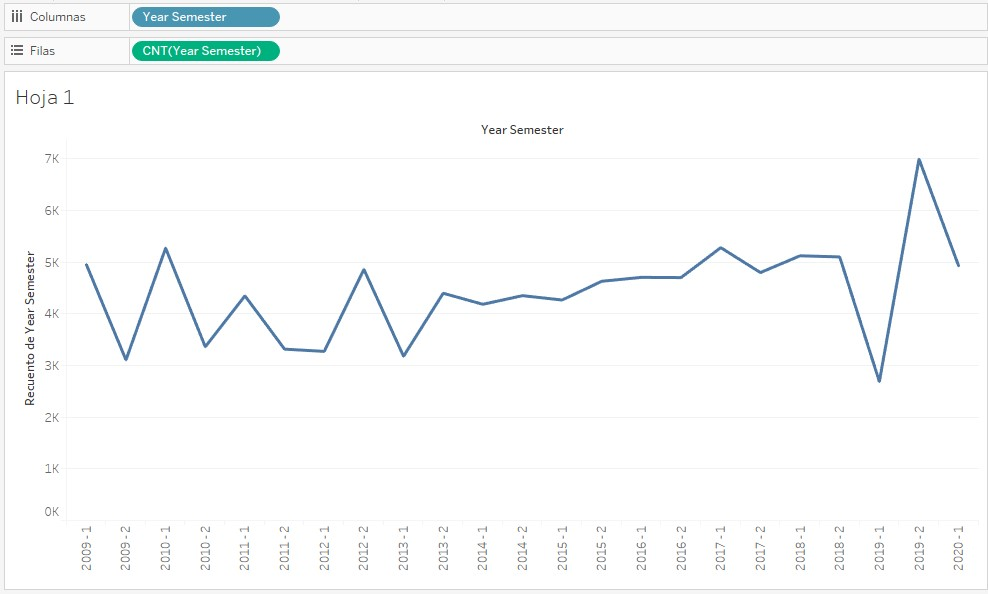
```
5.	Observe que hay detalles como el título del gráfico, títulos de los ejes que no están claros, para agregar un título a la visualización hay dos opciones:

   -	Asignar un nombre a la hoja de trabajo en la parte inferior izquierda donde dice hoja 1, para esto haga doble clic sobre Hoja 1 y escriba el titulo que desea para su visualización, por ejemplo, evolución histórica del total de estudiantes graduados. 

   -	Hacer clic derecho en el título de la visualización que en este momento es hoja 1 y seleccionar editar título, con esto se abre un cuadro de dialogo que permite escribir y editar el tipo de fuente, tamaño y color del texto. 
   
```{r paso5-11lineas-fig, echo=FALSE, fig.align='center', fig.asp=.75, fig.cap='Editar título de la vista', out.width='60%'}
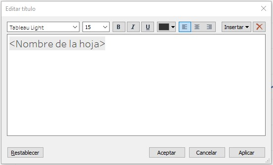
```
Elimine el texto <Nombre de la hoja> y escriba Evolución histórica del total de estudiantes graduados. 

6. Para editar el título del eje Y, haga clic derecho sobre el y seleccione editar eje, en el cuadro de dialogo cambie el título del eje por Número de estudiantes graduados y para el subtítulo haga clic en el cuadro Automático y escriba k: miles en el espacio para subtítulo.

```{r paso6-11lineas-fig, echo=FALSE, fig.align='center', fig.asp=.75, fig.cap='Editar eje Y', out.width='20%'}
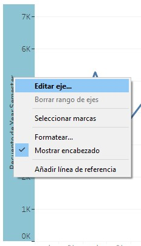
```

```{r paso6-2lineas-fig, echo=FALSE, fig.align='center', fig.asp=.75, fig.cap='Editar título del eje Y', out.width='40%'}
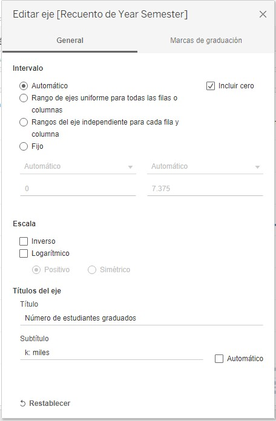
```

7. Para el eje X que en este caso es llamado Year Semester no es posible editarlo como el caso del eje Y por tanto se debe ocultar, para esto haga clic derecho sobre esta etiqueta y seleccione Ocultar etiquetas de campo para columnas.

```{r paso7lineas-fig, echo=FALSE, fig.align='center', fig.asp=.75, fig.cap='Ocultar título del eje X', out.width='60%'}
knitr::include_graphics("Imágenes/analisis10.jpg")
```

Se obtiene la siguiente visualización.

```{r paso7-1lineas-fig, echo=FALSE, fig.align='center', fig.asp=.75, fig.cap='Vista previa de la visualización con algunas ediciones', out.width='80%'}
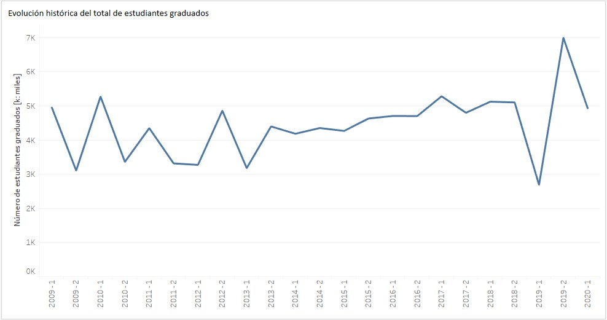
```

8. Cuando se pasa el puntero por la línea, aparece un cuadro que contiene la información del periodo y el recuento de estudiantes graduados, pero la información en este cuadro no coincide con el nombre del eje Y. 

```{r paso8-1lineas-fig, echo=FALSE, fig.align='center', fig.asp=.75, fig.cap='Descripción emergente', out.width='40%'}
knitr::include_graphics("Imágenes/analisis12.jpg")
```
Para que esta descripción sea más clara se debe cambiar Year Smester por Periodo y Recuento de Year Semester por Número de estudiantes graduados, en la tarjeta marcas haga clic en el recuadro que dice descripción emergente, con esto se abre una ventana que contiene la información del recuadro mostrado en la figura \@ref(fig:paso8-1lineas-fig), en este cuadro cambie cambiar Year Smester por Periodo, Recuento de Year Semester por Número de estudiantes graduados y luego clic en Aceptar.

```{r paso8-2lineas-fig, echo=FALSE, fig.align='center', fig.asp=.75, fig.cap='Editar información de la dscripción emergente', out.width='70%'}
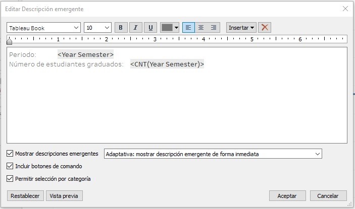
```
Ahora la descripción emergente de la visualización es mucho más clara. 

```{r paso8-3lineas-fig, echo=FALSE, fig.align='center', fig.asp=.75, fig.cap='Descripción emergente editada', out.width='40%'}
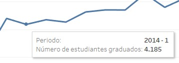
```

Estos son los pasos básicos para hacer que las visualizaciones creadas en Tableau se vean claras y estéticas. 

#### Gráfico de líneas segmentado por una dimensión {#graficodelineassegmentado}

La siguiente visualización que se encuentra en la página de estadísticas de la Universidad Nacional de Colombia, en un gráfico de líneas por modalidad de formación, una tabla que contiene la misma información y un gráfico circular que contiene la información por modalidad de formación para el periodo actual es decir 2020-1.

1.	Repita los pasos 1, 2, 3, 4 presentados en \@ref(graficodelineas).
2.	En el paso 5 mostrado en la sección \@ref(graficodelineas), en el nombre de la hoja escriba Serie y en el titulo de la visualización escriba Evolución del número de estudiantes graduados por modalidad de formación. 
3.	Edite los ejes X y Y como se mostro en los pasos 6 y 7 de \@ref(graficodelineas).
4.	Arrastre el campo Tipo Nivel a color en el estante Marcas, con esto se crean dos líneas en el gráfico, una para los estudiantes graduados de Pregrado y otra para los graduados de Postgrado.

```{r paso4lineassegmentada-fig, echo=FALSE, fig.align='center', fig.asp=.75, fig.cap='Gráfico de líneas por Tipo Nivel', out.width='80%'}
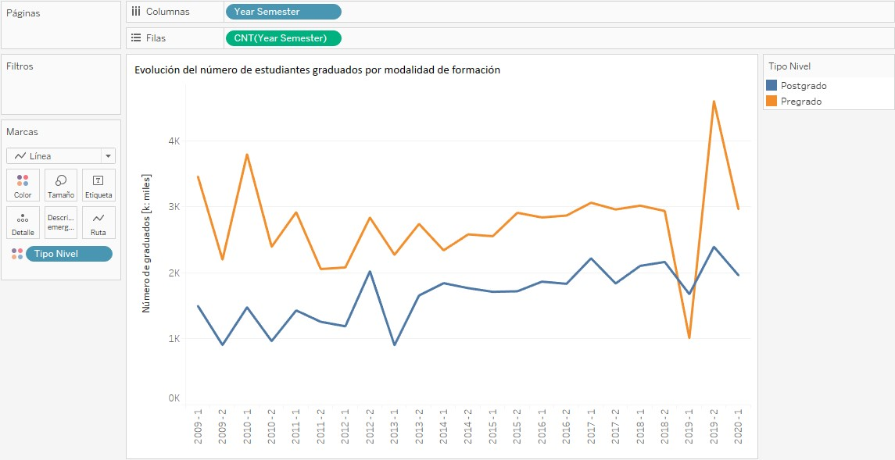
```

5.	Para cambiar los colores, clic en color, editar colores; en la ventana emergente que se abre seleccione Postgrado y clic en el color naranja, seleccione Pregrado y clic en el color verde, finalmente clic en aceptar.

```{r paso5lineassegmentada-fig, echo=FALSE, fig.align='center', fig.asp=.75, fig.cap='Editar colores', out.width='20%'}
knitr::include_graphics("Imágenes/analisis16.jpg")
```

```{r paso5-1lineassegmentada-fig, echo=FALSE, fig.align='center', fig.asp=.75, fig.cap='Asignación de colores a Tipo Nivel', out.width='45%'}
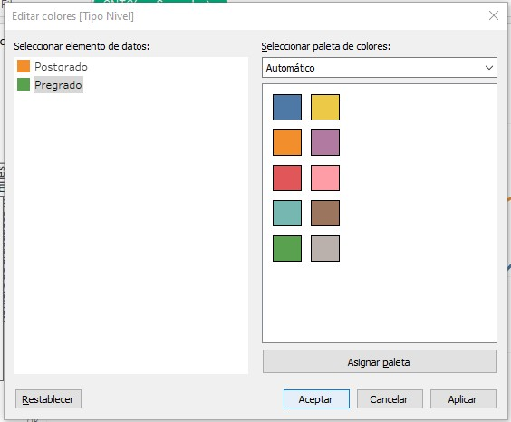
```

6.	En la leyenda de colores ubicada en el panel letaral derecho de la visualizacion, como se muestra en la figura \@ref(fig:paso4lineassegmentada-fig), haga clic en el menú desplegable y seleccione Editar título,  en el cuadro de texto borre Tipo Nivel y escriba Modalidad de formación y clic en aceptar.

```{r paso6lineassegmentada-fig, echo=FALSE, fig.align='center', fig.asp=.75, fig.cap='Editar título de leyenda de colores', out.width='20%'}
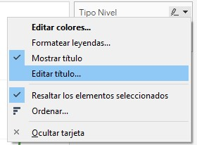
```

```{r paso6-1lineassegmentada-fig, echo=FALSE, fig.align='center', fig.asp=.75, fig.cap='Asignación de título a leyenda de colores', out.width='45%'}
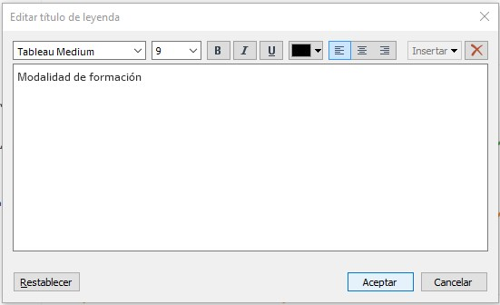
```

7.	Finalmente, la tarjeta de descripción emergente no es clara por lo que es necesario editarla, para esto siga el paso 8 de \@ref(graficodelineas); cambiando Tipo Nivel por Modalidad de formación, Year Semester por Periodo y Recuento de Year Smester por Total Graduados. 

La visualización obtenida es:

```{r lineassegmentada-fig, echo=FALSE, fig.align='center', fig.asp=.75, fig.cap='Visualización de la evolución de estudiantes graduados por modalidad de formación', out.width='80%'}
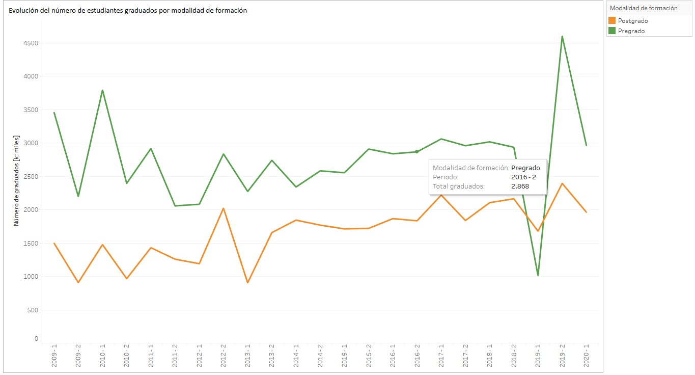
```
Otra opción para crear esta vista de líneas segmentada es duplicando la visualización creada en la sección anterior, es decir el grafico de líneas, para duplicar esta vista ubíquese en la hoja llamada Evolución histórica del total de estudiantes graduados y en la barra de herramientas haga clic en el icono que tiene dos hojas, con esto se crea una nueva hoja que contiene un duplicado del grafico de líneas.

```{r duplicarhoja-fig, echo=FALSE, fig.align='center', fig.asp=.75, fig.cap='Duplicar hojas de trabajo', out.width='80%'}
knitr::include_graphics("Imágenes/analisis21.jpg")
```

El título de a visualización y de la hoja duplicada es Evolución histórica del total de estudiantes graduados (2), por lo que debe cambiar el nombre de la hoja a Serie y el título de visualización a Evolución del número de estudiantes graduados por modalidad de formación. Finalmente repita los pasos 4, 5 y 6 mostrados en \@ref(graficodelineassegmentado), la visualización se ve de esta manera.

```{r lineassegmentadoporduplicacion-fig, echo=FALSE, fig.align='center', fig.asp=.75, fig.cap='Gráfico de líneas segmentado', out.width='80%'}
knitr::include_graphics("Imágenes/analisis22.jpg")
```
Note que la descripción emergente no muestra la modalidad de formación a la que pertenece cada estudiante graduado por lo tanto se debe editar, agregando “Modalidad de formación: <Tipo Nivel>” donde :  y <Tipo Nivel> se encuentran separados con un Tab; Modalidad de formación: debe ser escrito en el gris más oscuro disponible en la paleta y <Tipo Nivel> en negro. 

```{r lineassegmentadodescripcion-fig, echo=FALSE, fig.align='center', fig.asp=.75, fig.cap='Editar descripción emergente', out.width='80%'}
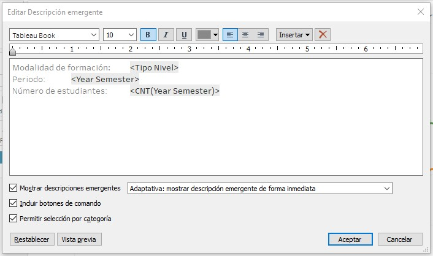
```
Finalmente se obtiene la visualización presentada en la figura \@ref(fig:lineassegmentada-fig). 

Si se observa detalladamente la descripción emergente de la visualización presentada en la página de las estadísticas de la Universidad se identifica que contiene el porcentaje de graduados por modalidad para añadir esto a la descripción emergente se debe:

1.	Crear un campo calculado, haciendo clic en el menú desplegable ubicado entre Datos y Tablas, seleccionar Crear campo calculado, asignar un nombre útil al cálculo por ejemplo Conteo de estudiantes graduados por periodo, en el panel en blanco escriba COUNT([Year Semester]) y clic en Aceptar. Con esto se obtiene un nuevo campo que se ubica en la parte inferior del panel Tablas. 

```{r crearcampocalculadopaso1-fig, echo=FALSE, fig.align='center', fig.asp=.75, fig.cap='Crear campo calculado', out.width='30%'}
knitr::include_graphics("Imágenes/analisis24.jpg")
```

```{r crearcampocalculadopaso1-1-fig, echo=FALSE, fig.align='center', fig.asp=.75, fig.cap='Edición del campo calculado', out.width='60%'}
knitr::include_graphics("Imágenes/analisis25.jpg")
```

2.	Luego tener el campo calculado creado debe arrastrarlo a la tarjeta etiqueta ubicada en el estante Marcas.

```{r etiquetas-fig, echo=FALSE, fig.align='center', fig.asp=.75, fig.cap='Etiquetas del total de estudiantes graduados', out.width='80%'}
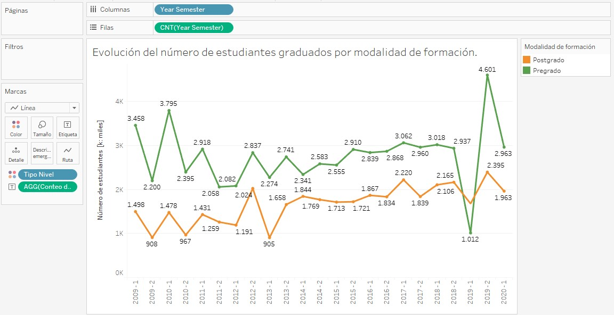
```

3.	En el menú desplegable del campo AGG(Conteo de estudiantes graduados por periodo), seleccione Añadir calculo de tabla. 

```{r crearcalculodetabla-fig, echo=FALSE, fig.align='center', fig.asp=.75, fig.cap='Añadir cálculo de tabla', out.width='30%'}
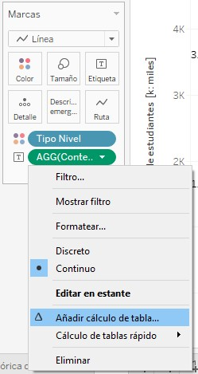
```

4.	En la ventana calculo de tablas en tipo de cálculo seleccione Porcentaje del total y en Calcular usando seleccione Tabla (abajo) y cierre la ventana.

```{r editarcalculodetabla-fig, echo=FALSE, fig.align='center', fig.asp=.75, fig.cap='Seleccionar cálculo y alcance', out.width='40%'}
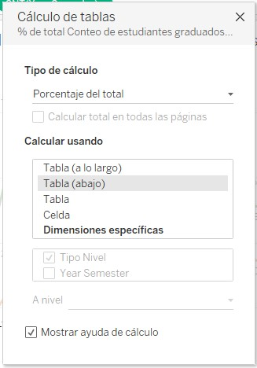
```

5.	Ahora la visualización muestra el porcentaje de estudiantes graduados por modalidad de formación, por ejemplo, para el periodo 2009-1 el $60.77\%$ de los graduados son fueron de pregrado y el restante $30.33\%$ de postgrado. 

```{r etiquetasenporcentaje-fig, echo=FALSE, fig.align='center', fig.asp=.75, fig.cap='Visualización con etiquetas de porcentaje', out.width='80%'}
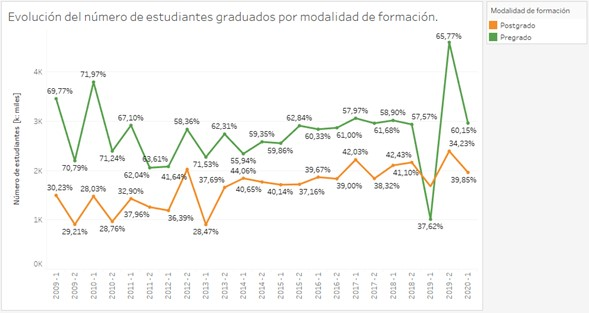
```

6.	Para que estas etiquetas no se muestren sobre la línea si no en la tarjeta de descripción emergente Luego tener el campo calculado creado haga clic sobre descripción emergente y agregue esta línea de texto “Porcentaje del total: <% de total AGG(Conteo de estudiantes graduados por periodo)>”, edite el color y el tamaño para que coincida con lo demás que contiene esta tarjeta y clic en Aceptar.

```{r añadircalculodetablaadescripcion-fig, echo=FALSE, fig.align='center', fig.asp=.75, fig.cap='Añadir cálculo de tabla a la descripción emergente', out.width='80%'}
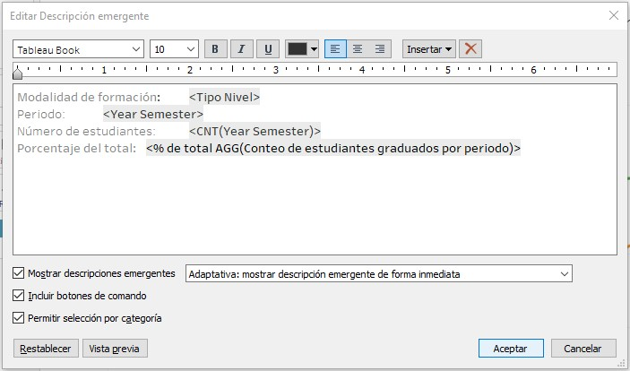
```
6.	Haga clic en la tarjeta Etiqueta del estante marcas y desactive la opción Mostrar etiquetas de marca; finalmente la visualización se ve como se deseaba. 

```{r descripcionconporcentaje-fig, echo=FALSE, fig.align='center', fig.asp=.75, fig.cap='Visualizacion segmentada y con porcentajes', out.width='80%'}
knitr::include_graphics("Imágenes/analisis30.jpg")
```

#### Tablas de texto

Una forma útil y clara de mostrar los datos es usar tablas de texto, en este caso se presentara la forma de hacer una tabla de texto que contenga la información del número de estudiantes graduados por modalidad de formación. 

1.	Agregue una nueva hoja de trabajo y cambie el nombre por Tabla.

2.	Arrastre el campo Tipo Nivel al estante Columnas, los campos Year y Semestre cámbielos a cadena haciendo clic en el icono # y luego seleccione Cadena, arrastre estos campos modificados al estante filas, primero Year y luego Semestre. 

```{r paso2tablatexto-fig, echo=FALSE, fig.align='center', fig.asp=.75, fig.cap='Arrastrar campos para crear tablas de texto', out.width='80%'}
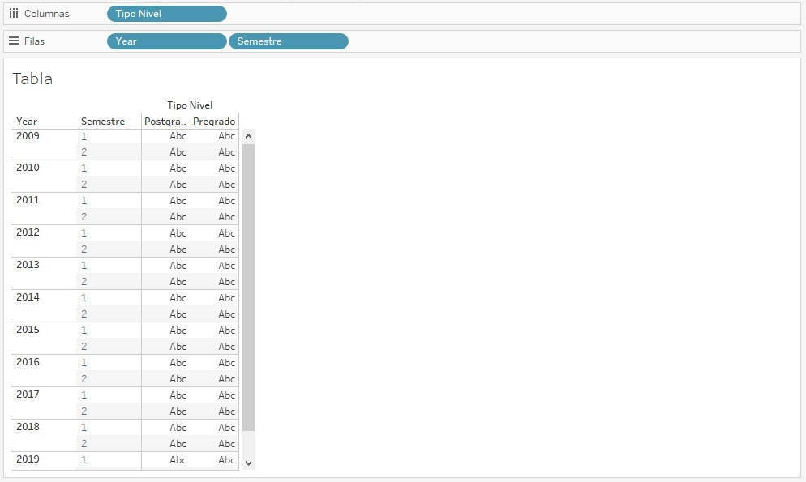
```

3.	Ajuste el tamaño de la vista en la barra de herramientas seleccionando Vista completa. 

4.	Arrastre el campo Recuento por periodo a la tarjeta Texto en el estante marcas. 

```{r paso4tablatexto-fig, echo=FALSE, fig.align='center', fig.asp=.75, fig.cap='Añadir el texto a la tabla', out.width='80%'}
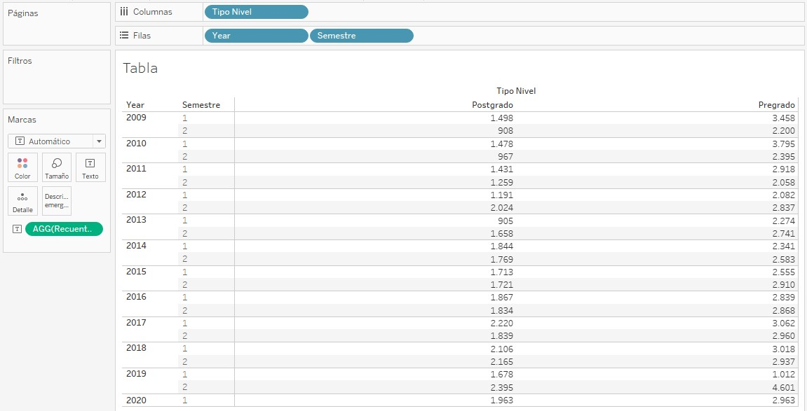
```

5.	Los nombres de los campos utilizados en la vista no tienen nombres adecuados, por lo que se deben cambiar, desde el panel lateral Tablas seleccionando el menú desplegable del campo y haciendo clic en cambiar nombre, por ejemplo, Year debe ser cambiado por Año y Tipo Nivel por Modalidad de Formación.

```{r paso5tablatexto-fig, echo=FALSE, fig.align='center', fig.asp=.75, fig.cap='Editar nombres de los campos', out.width='40%'}
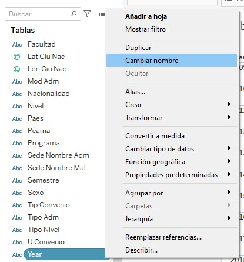
```

6.	El uso de filtros es útil para permitir que el usuario seleccione los años o semestres específicos que desea ver en la tabla, por lo cual se añadirá un filtro con el campo Año y otro con el campo Semestre. Arrastre el campo Año al estante filtro y en la ventana asegúrese de que todos los años estén seleccionados y luego haga clic en aceptar. 

```{r paso6tablatexto-fig, echo=FALSE, fig.align='center', fig.asp=.75, fig.cap='Añadir filtro', out.width='45%'}
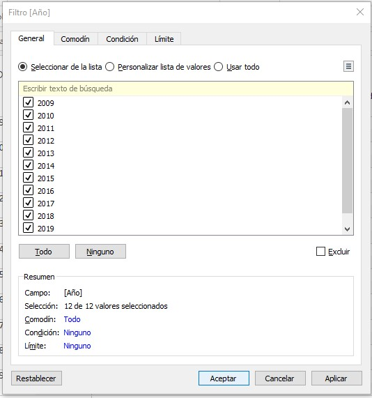
```

7.	En el estante Filtros haga clic en el menú desplegable del campo Año y seleccione mostrar filtro, con esto aparece una tarjeta en el panel lateral derecho que contiene el filtro. 

```{r paso7tablatexto-fig, echo=FALSE, fig.align='center', fig.asp=.75, fig.cap='Mostrar el filtro', out.width='30%'}
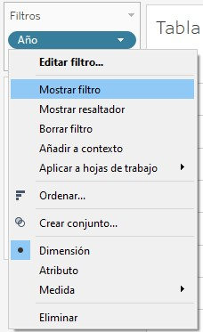
```

La tabla de texto se visualiza de esta manera.

```{r paso7-1tablatexto-fig, echo=FALSE, fig.align='center', fig.asp=.75, fig.cap='Vista previa de la tabla de texto', out.width='80%'}
knitr::include_graphics("Imágenes/analisis37.jpg")
```

8.	En el panel lateral derecho esta el filtro que permite seleccionar los valores de años que el usuario desea ver, repita el paso 6 y 7 para crear un filtro con el campo semestre. 

9.	Cambie el título de la visualización por Evolución del número de estudiantes graduados por modalidad de formación.

Finalmente se muestra la visualización obtenida que permite al usuario seleccionar diferentes valores para el campo año y semestre. 

```{r tablatexto-fig, echo=FALSE, fig.align='center', fig.asp=.75, fig.cap='Tabla de texto con filtros', out.width='80%'}
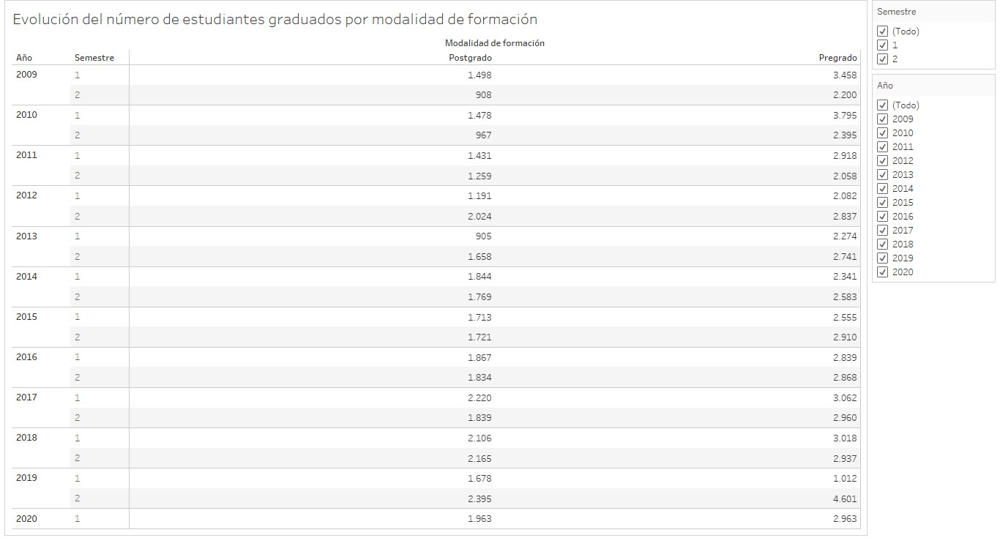
```

#### Gráfico circular {#graficocircular}

Los gráficos circulares son un recurso estadístico muy utilizado para representar porcentajes y proporciones, en este caso se hará un grafico circular que permita ver la distribución del total de estudiantes graduados por modalidad de formación para el periodo actual es decir 2020-1.

1.	Cree una nueva hoja de trabajo y llámela Distribución de graduados por modalidad de formación, periodo 2020-1. 

2.	Arrastre el campo modalidad de formación a la tarjeta Color ubicada en el estante marcas. 

3.	Cambie la forma de Automático a circular en el menú desplegable de este mismo estante. 

```{r cambiarmarcaparagraficotorta-fig, echo=FALSE, fig.align='center', fig.asp=.75, fig.cap='Cambiar marca por circular', out.width='20%'}
knitr::include_graphics("Imágenes/analisis39.jpg")
```

4.	Arrastre el campo calculado llamado Recuento por modalidad de formación a la tarjeta ángulo. 

5.	Ajuste el tamaño de la vista seleccionando Vista completa en la barra de herramientas, la visualización debe versa de esta manera.

```{r graficocircular-fig, echo=FALSE, fig.align='center', fig.asp=.75, fig.cap='Vista previa grafico circular', out.width='80%'}
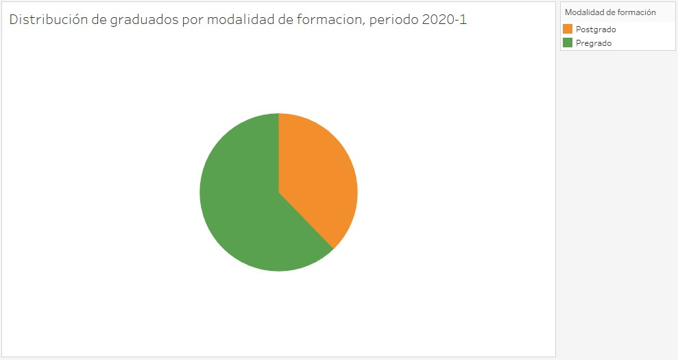
```

6.	Se deben añadir etiquetas que indiquen la modalidad de formación correspondiente a cada color, para esto arrastre el campo Modalidad de formación a la tarjeta etiquetas.

7.	Es importante visualizar los porcentajes que corresponden a cada modalidad, para esto se creara un nuevo campo calculado que contenga el conteo de los graduados por modalidad, como se mostro en \@ref(graficodelineassegmentado) y llámelo Recuento por modalidad de formación.

8.	Arrastre el campo calculado creado a la tarjeta etiqueta, se obtiene una etiqueta en el gráfico que muestra la cantidad de estudiantes graduados para todos los periodos por el nivel de formación. 

```{r paso8graficocircular-fig, echo=FALSE, fig.align='center', fig.asp=.75, fig.cap='Añadir etiquetas', out.width='80%'}
knitr::include_graphics("Imágenes/analisis41.jpg")
```

9.	Se desea que esta visualización solo muestre los datos del periodo 2020-1, para esto cree un filtro con el campo Year semestre y seleccione únicamente el periodo 2020-1, no es necesario que muestre el filtro.

10.	En realidad, no interesa que la visualización muestre el número de estudiantes graduados por nivel si no el porcentaje de esto, para esto se debe añadir un calculo de tabla en la etiqueta del campo calculado, haga clic en el menú desplegable del ultimo campo del estante Marcas y seleccione Añadir calculo de tabla. 

```{r paso10graficocircular-fig, echo=FALSE, fig.align='center', fig.asp=.75, fig.cap='Añadir cálculo de tabla a las etiquetas', out.width='30%'}
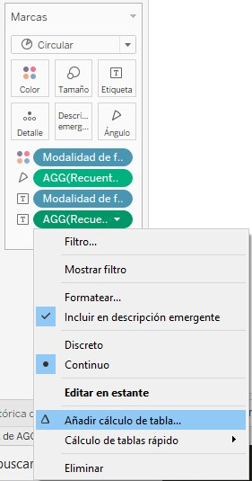
```

11.	En la venta de cálculos de tablas, en Tipo de cálculo seleccione Porcentaje del total y calcular usando seleccione Tabla (a lo largo).

12.	Se debe editar la decepción emergente para que sea mas clara, cambie % de total Recuento por modalidad de formación junto con Tabla (a lo largo) por Porcentaje y Recuento por periodo por Número de graduados. Finalmente, se obtiene un gráfico circular que muestra el porcentaje de graduados por modalidad de formación y con una descripción emergente clara. 

```{r graficocircularfinal-fig, echo=FALSE, fig.align='center', fig.asp=.75, fig.cap='Gráfico circular para el periodo 2020-1', out.width='80%'}
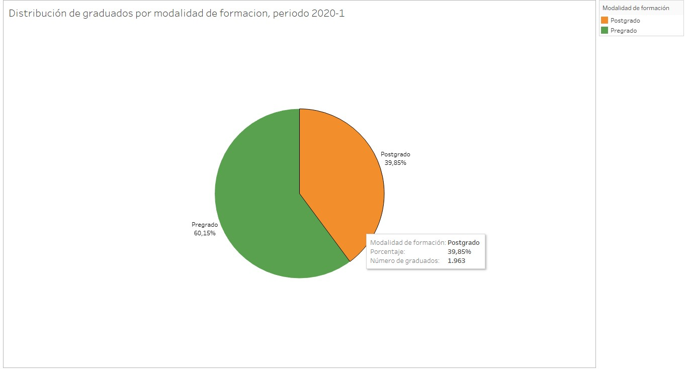
```
#### Gráfico de barras {#graficodebarras}

Estos gráficos son útiles para representar las frecuencias de las clases de alguna variable de interés, en este caso se realizará un gráfico de barras horizontales que muestre la frecuencia y el porcentaje de estudiantes graduados por nivel de formación para el periodo 2020-1.

1.	Cree una nueva hoja de trabajo y llámela Distribución de estudiantes graduados por nivel de formación, periodo 2020-1.

2.	Arrastre el campo Nivel a filas y arrástrelo nuevamente desde el panel Tablas al estante columnas. 

3.	En el menú desplegable del campo Nivel ubicado en el estante columnas seleccione medida y luego recuento como se mostro en el paso 2 de \@ref(graficodelineas). Debe obtener un grafico como este, 

```{r paso3graficobarras-fig, echo=FALSE, fig.align='center', fig.asp=.75, fig.cap='Gráfico de barras', out.width='80%'}
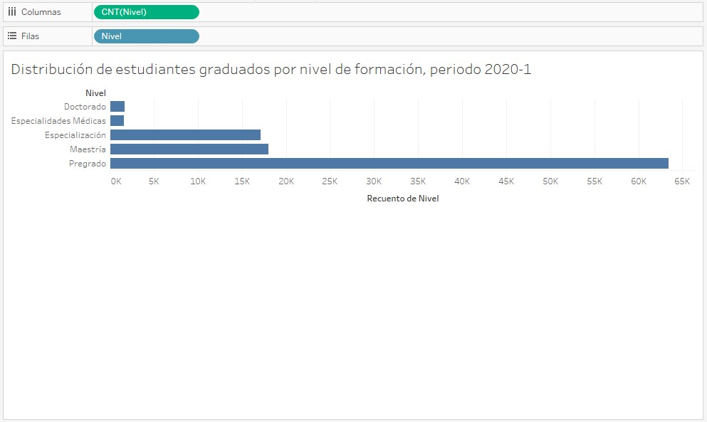
```

4.	Ajuste el tamaño de la vista seleccionando vista completa en la barra de herramientas. 

5.	Arrastre el campo Nivel a la tarjeta color ubicada en el estante marcas.

6.	Edite los colores de cada barra como se mostro en el paso 5 de \@ref(graficodelineassegmentado). Asigne el color verde a Pregrado, rojo a maestría, azul a especialización, amarillo a especialidades medicas y gris a doctorado.

7.	Luego haga clic en el botón que señala orden descendente ubicado en la barra de herramientas. Hasta el momento su visualización debe verse así,

```{r paso7graficobarras-fig, echo=FALSE, fig.align='center', fig.asp=.75, fig.cap='Gráfico de barras con colores asignados', out.width='80%'}
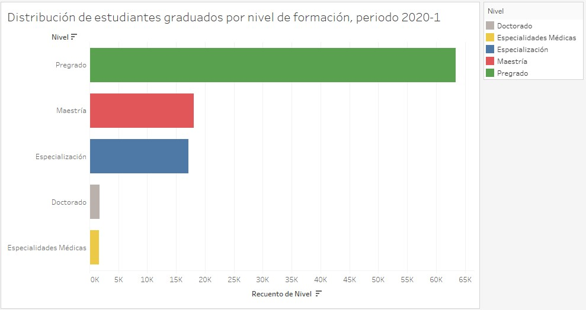
```

8.	Observe que el recuento de nivel se esta haciendo para todos los periodos que contiene la base es decir desde 2009-1 hasta el 2020-1, para que solo muestre los del periodo actual debe añadir un filtro con el campo Year Semester y seleccionar únicamente el periodo de interés, no es necesario que muestre el filtro. 

9.	Edite el eje x cambiando el título, escriba como título Número de graduados; también edite la descripción emergente cambiando Recuento de nivel por Número de graduados.

10.	Como etiqueta de cada barra se debería mostrar el total de estudiantes graduados en ese nivel, para esto arrastre el campo Nivel a la tarjeta etiqueta, en el menú desplegable del campo seleccione Medida y luego recuento. 

```{r paso10graficobarras-fig, echo=FALSE, fig.align='center', fig.asp=.75, fig.cap='Gráfico de barras con etiquetas', out.width='80%'}
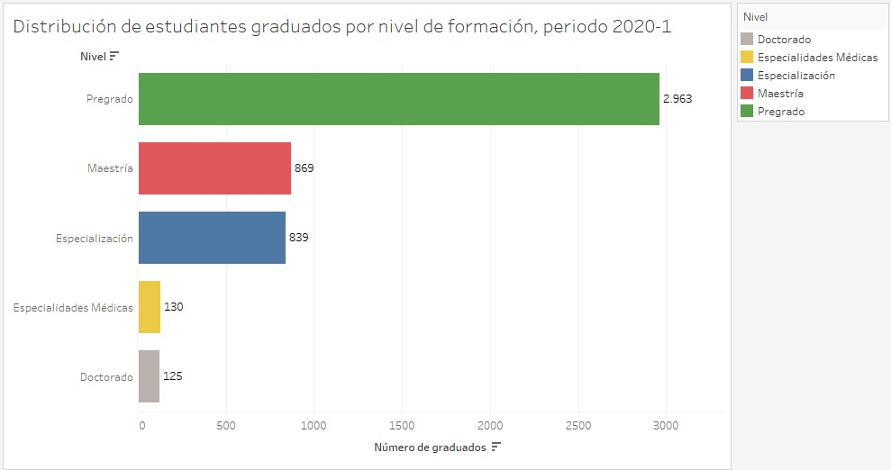
```

11.	Es importante que en la descripción emergente se muestre el porcentaje de cada nivel de formación, para esto arrastre el campo Nivel a la tarjeta descripción emergente en el menú desplegable seleccione media y recuento.

```{r paso11graficobarras-fig, echo=FALSE, fig.align='center', fig.asp=.75, fig.cap='Añadir porcentaje a descripción emergente', out.width='40%'}
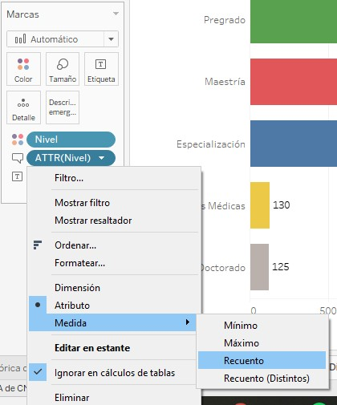
```
12.	Haga clic en este mismo menú después de haber realizado en el paso anterior y seleccione añadir cálculo de tabla, en la ventana de cálculos de tabla en Tipo de cálculo seleccione Porcentaje del total y en calcular usando seleccione Tabla (abajo), en este momento la descripción emergente se ve así, 

```{r paso12graficobarras-fig, echo=FALSE, fig.align='center', fig.asp=.75, fig.cap='Edición de la descripción emergente', out.width='60%'}
knitr::include_graphics("Imágenes/analisis48.jpg")
```
13.	Cambie Recuento de nivel por Número de graduados y % de total Recuento de nivel junto con Tabla (abajo) por Porcentaje y de clic en aceptar. 

El gráfico de barras horizontales para el nivel de formación para el periodo 2020-1 se muestra a continuación.

```{r graficobarras-fig, echo=FALSE, fig.align='center', fig.asp=.75, fig.cap='Gráfico de barras por nivel de formación, periodo 2020-1', out.width='80%'}
knitr::include_graphics("Imágenes/analisis49.jpg")
```

#### Mapas de árbol {#mapasdearbol}

Estos mapas usan rectángulos anidados para mostrar datos jerárquicos como parte de un todo. La forma cuadrada permite comparar más fácilmente tamaños relativos, para crear un mapa de árbol es necesario una medida y una dimensión. En este caso se hará un mapa de árbol que permita identificar cual sede de la Universidad Nacional tuvo más graduados a lo largo de los periodos que se tienen en la base de datos. 

1.	Cree una nueva hoja de trabajo y llámela Distribución de graduados por sede de admisión.

2.	Arrastre el campo Sede Nombre Adm a la tarjeta color y nuevamente desde el panel tablas arrastre este mismo campo a la tarjeta tamaño.

```{r paso2mapaarbol-fig, echo=FALSE, fig.align='center', fig.asp=.75, fig.cap='Añadir los campos a la tarjeta marcas', out.width='80%'}
knitr::include_graphics("Imágenes/analisis50.jpg")
```

3.	En el menú desplegable de los campos ubicados en el estante marcas, seleccione medida y recuento, para ambas variables.

4.	Arrastre nuevamente Sede Nombre Adm a la tarjeta Detalles.

```{r paso4mapaarbol-fig, echo=FALSE, fig.align='center', fig.asp=.75, fig.cap='Mapa de árbol base', out.width='80%'}
knitr::include_graphics("Imágenes/analisis51.jpg")
```

5.	El cuadrado mas grande y en el azul más fuerte identifica a la sede con mas graduados, que en este caso es la sede Bogotá, esta información se ubica en la descripción emergente, pero es necesario ubicarla como etiquetas de los cuadrados para que la visualización sea mas clara, para esto arrastre Sede Nombre Adm a la tarjeta etiqueta, presione la tecla ctrl y clic sobre alguno de los dos campos en verde ubicados en marcas y arrástrelo hasta etiqueta. Ahora su visualización muestra la sede de admisión y el total de estudiantes graduados.

```{r paso5mapaarbol-fig, echo=FALSE, fig.align='center', fig.asp=.75, fig.cap='Añadir etiquetas al mapa de árbol', out.width='80%'}
knitr::include_graphics("Imágenes/analisis52.jpg")
```

6.	Los mapas de árbol son útiles para mostrar porcentajes del total, para esto repita los pasos 10 y 11 de \@ref(graficocircular). 

7.	Edite la descripción emergente para que el nombre de los campos sea más claro; cambie Sede Nombre Adm por Sede de admisión, Recuento de Sede Nombre Adm por Número de estudiantes graduados y % de total Recuento de Sede Nombre Adm junto con Tabla (a lo largo) por porcentaje. 

8.	Edite el nombre de la tarjeta ubicada en el lateral derecho haciendo clic en el menú desplegable y seleccione editar título, el nuevo título es Número de estudiantes graduados.

El mapa de árbol obtenido es claro y consistente con la información que se desea visualizar:

```{r mapaarbol-fig, echo=FALSE, fig.align='center', fig.asp=.75, fig.cap='Mapa de árbol por sede de admisión', out.width='80%'}
knitr::include_graphics("Imágenes/analisis53.jpg")
```

Una variación de los mapas de árbol que también permite mostrar la jerarquía que existe en los datos son el gráfico de burbujas y nube de palabras. 

Para realizar un grafico de burbujas duplique la hoja distribución de graduados por sede de admisión y llámela Gráfico de burbujas para la distribución de graduados por sede de admisión, luego haga clic en el botón Mostrarme y seleccione burbujas agrupadas.

```{r 1burbujas-fig, echo=FALSE, fig.align='center', fig.asp=.75, fig.cap='Gráfico de burbujas base por sede de admisión', out.width='80%'}
knitr::include_graphics("Imágenes/analisis80.jpg")
```

Note que la descripción emergente no está clara por lo que es necesario cambie Sede Nombre Adm por Sede de admisión, Recuento de Sede Nombre Adm por Número de estudiantes graduados y % de total Recuento de Sede Nombre Adm junto con Sede Nombre Adm por porcentaje; duplique el campo correspondiente a color y llévelo a etiqueta, ajuste el tamaño de la visualización a vista completa, edite el titulo de la leyenda de la clave de color, asigne como nuevo título porcentaje.  Finalmente, su visualización al igual que el mapa de árbol permite identificar cual sede de la Universidad Nacional tuvo más graduados a lo largo de los periodos registrados en el conjunto de datos.

```{r burbujas-fig, echo=FALSE, fig.align='center', fig.asp=.75, fig.cap='Gráfico de burbujas por sede de admisión', out.width='80%'}
knitr::include_graphics("Imágenes/analisis81.jpg")
```

La otra forma de visualizar la distribución de los estudiantes graduados es usando una nube de palabras, esta muestra la frecuencia de uso. Nuevamente duplique la hoja en la que se creo el mapa de árbol y llámela Nube de palabras para la distribución de graduados por sede de admisión, en el estante marcas cambie automático por texto.

```{r nubepalabras-fig, echo=FALSE, fig.align='center', fig.asp=.75, fig.cap='Gráfico base de nube de palabras por sede de admisión', out.width='80%'}
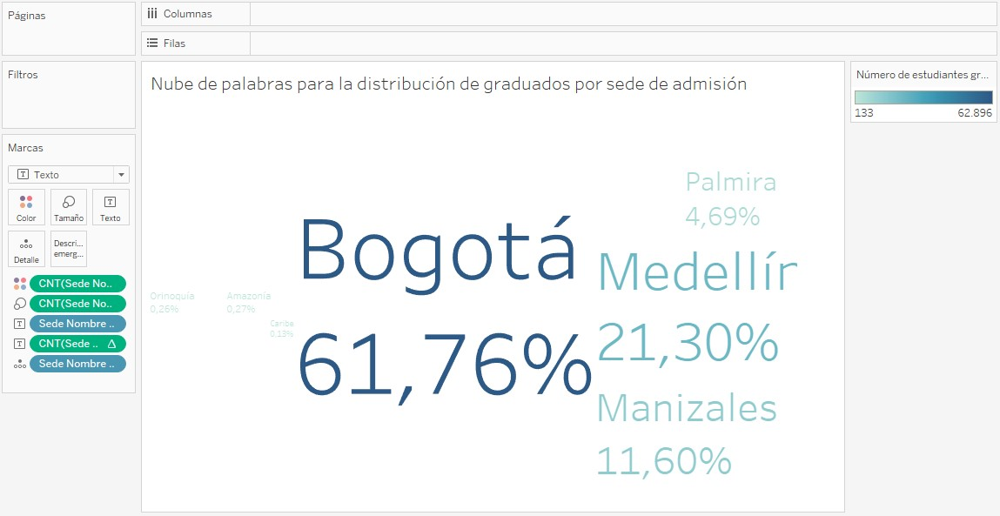
```

En este tipo de gráficos no es conveniente mostrar el porcentaje, ya que el enfoque se debe dar al nombre de la sede, arrastre el campo CNT(Sede Nombre Adm) de la tarjeta etiqueta a la tarjeta detalles.

```{r nubepalabraseditada-fig, echo=FALSE, fig.align='center', fig.asp=.75, fig.cap='Nube de palabras por sede de admisión, sin porcentaje', out.width='80%'}
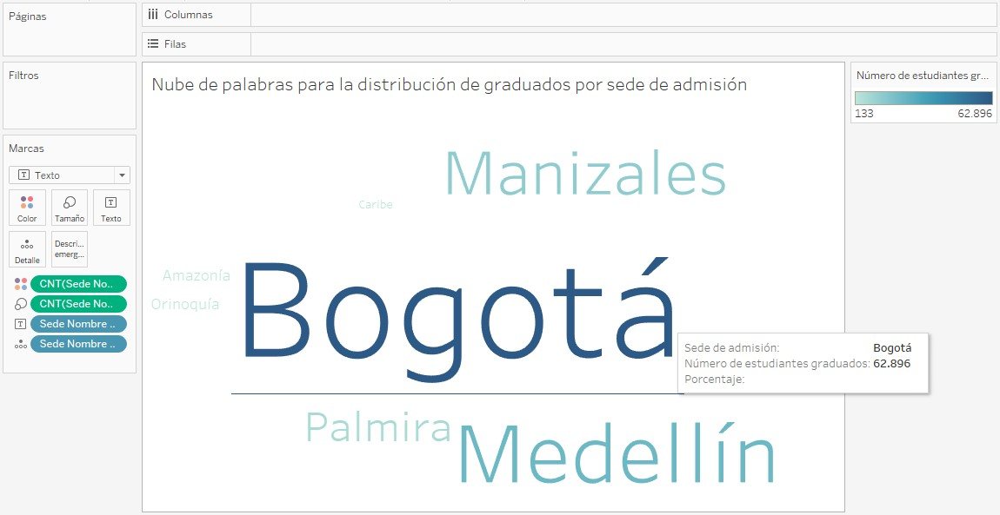
```

Note que de la descripción emergente se elimino el campo que mostraba el porcentaje, para recuperarlo en la descripción emergente al lado de Porcentaje escriba <% de total CNT(Sede Nombre Adm)>, que es la expresión que usa Tableau para calcular el Porcentaje.

```{r nubepalabrasfinal-fig, echo=FALSE, fig.align='center', fig.asp=.75, fig.cap='Nube de palabras por sede de admisión', out.width='80%'}
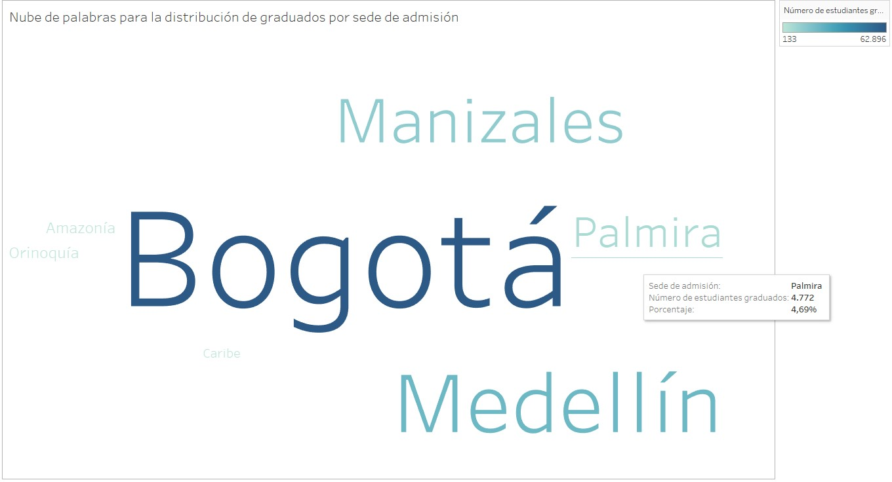
```

#### Gráfico de control {#graficodecontrol}

Este tipo de gráficos se usan para evaluar cómo cambia un proceso en el tiempo. Se parecen mucho a los gráficos de líneas sencillos, pero se debe agregar una línea de promedio, un límite de control inferior y uno superior. Estos gráficos son una herramienta estadística de control de procesos, para determinar si un proceso de fabricación comercial está dentro o fuera de los límites. 
En este caso se considera importante visualizar si los graduados a través del tiempo siguen un proceso controlado, cabe resaltar que este proceso se puede ver afectado por muchos factores tales como la deserción, paros estudiantiles, la sede, considerando únicamente la sede de matrícula; la facultad y el programa a que pertenecen; se hará un gráfico general y luego un desglose de esta información mencionada para tener más claridad sobre el comportamiento de estas cifras.

1.	Duplique la hoja que contiene el gráfico de líneas mostrado en \@ref(graficodelineas).

2.	Cambie el nombre de la hoja duplicada por Gráfico de control general.

3.	Arrastre el campo calculado llamado Recuento por periodo al lado derecho del campo ubicado en el estante filas.

```{r paso3graficodecontrol-fig, echo=FALSE, fig.align='center', fig.asp=.75, fig.cap='Añadir campo calculado al estante filas', out.width='80%'}
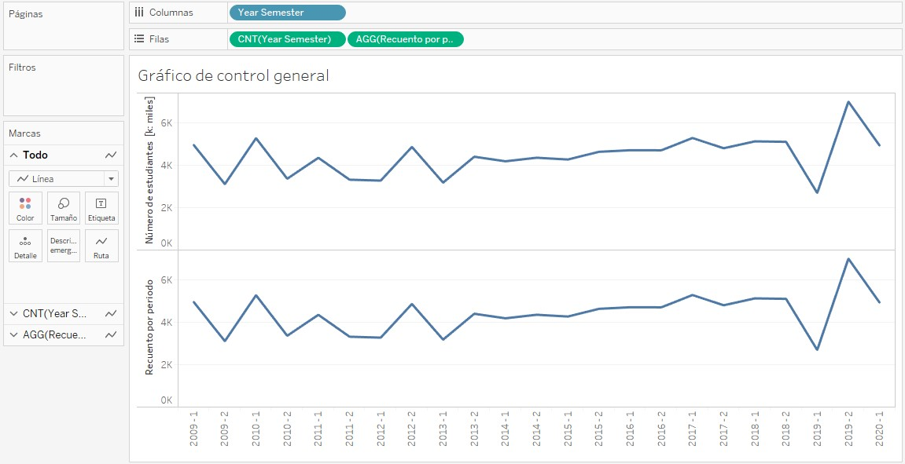
```

4.	En el menú desplegable del campo AGG(Recuento por periodo) seleccione Eje doble.

```{r paso4graficodecontrol-fig, echo=FALSE, fig.align='center', fig.asp=.75, fig.cap='Asignar eje dole', out.width='80%'}
knitr::include_graphics("Imágenes/analisis55.jpg")
```

5.	En el estante marcas cambie línea por círculos para el campo AGG(Recuento por periodo).

```{r paso5graficodecontrol-fig, echo=FALSE, fig.align='center', fig.asp=.75, fig.cap='Asignar marca circular', out.width='80%'}
knitr::include_graphics("Imágenes/analisis56.jpg")
```

6.	Oculte la tarjeta ubicada en el lateral derecho. 

7.	Asigne el mismo color tanto a las líneas como a los puntos, en este caso ambas se dejarán en color azul. 

8.	Haga clic en el panel Análisis ubicado en el lateral izquierdo, en personalizado arrastre línea de referencia a la visualización y suéltela sobre panel. 

```{r paso8graficodecontrol-fig, echo=FALSE, fig.align='center', fig.asp=.75, fig.cap='Añadir línea de referencia', out.width='80%'}
knitr::include_graphics("Imágenes/analisis57.jpg")
```

9.	En la ventana emergente asegúrese que en el campo valor este CNT(Year Semester) y promedio, puede agregar intervalos de confianza y dar formato a la línea, en este caso no es necesario ya que solo se debe agregar la línea de promedio. 

```{r paso9graficodecontrol-fig, echo=FALSE, fig.align='center', fig.asp=.75, fig.cap='Editar línea de referencia', out.width='60%'}
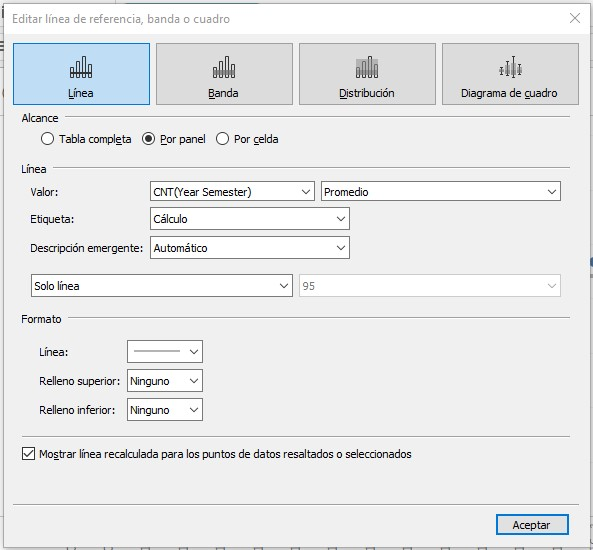
```

10.	Es momento de implementar un parámetro que permita al usuario controlar cuantas desviaciones estándar por debajo y por encima del promedio se ubicaran los límites. En el menú del panel tablas seleccione crear parámetro, en la ventana emergente asigne el nombre de Desviaciones estándar al parámetro, tipo de dato cámbielo por entero, en valores permitidos seleccione lista y añada los valores de 1, 2 y 3, finalmente haga clic en aceptar.

```{r paso10graficodecontrol-fig, echo=FALSE, fig.align='center', fig.asp=.75, fig.cap='Crear parámetro para desviaciones estándar', out.width='60%'}
knitr::include_graphics("Imágenes/analisis59.jpg")
```

11.	Los límites inferior y superior serán campos calculados,  nuevamente el menú del panel tablas seleccione crear campo calculado asigne el nombre de Límite superior y escriba **WINDOW_AVG(COUNT([Year Semester])) + WINDOW_STDEV(COUNT([Year Semester])) * [Desviaciones estándar]**

```{r paso11graficodecontrol-fig, echo=FALSE, fig.align='center', fig.asp=.75, fig.cap='Límite superior', out.width='60%'}
knitr::include_graphics("Imágenes/analisis60.jpg")
```

12.	Para el límite inferior repita el paso anterior, pero en lugar de sumar la desviación estándar la debe restar. 

13.	Agregue los limites de control a la tarjeta detalle ubicada en el estante marcas.

14.	Nuevamente desde el panel Análisis en personalizado arrastre banda de referencia hacia la visualización y suéltela en panel. 

15.	 En la ventana emergente, en la sección banda desde para valor asigne límite inferior y mínimo, en la etiqueta seleccione ninguno; para la sección banda hasta para valor asigne límite superior y máximo, en la etiqueta seleccione ninguno, para el formato de la imagen seleccione línea punteada en color gris oscuro y un relleno gris más claro.

```{r paso15graficodecontrol-fig, echo=FALSE, fig.align='center', fig.asp=.75, fig.cap='Editar banda de referencia', out.width='60%'}
knitr::include_graphics("Imágenes/analisis61.jpg")
```

16.	Para tener aun mas claridad en la vista e creara un campo calculado que identifique si el punto esta fuera o dentro de los límites de control. Cree un nuevo campo calculado y asigne el nombre de “¿Está dentro del límite de control?” y en el espacio en blanco escriba

**IF COUNT([Year Semester]) > [Límite superior]**

**or COUNT([Year Semester]) < [Límite inferior]**

**THEN "No" ELSE "Si"**

**END**

17.	Asignar este campo calculado a la tarjeta colores del conteo que tiene como forma círculos, de el color rojo a la categoría No y verde a Si. 

```{r paso17graficodecontrol-fig, echo=FALSE, fig.align='center', fig.asp=.75, fig.cap='Gráfico de control con una desviación estándar', out.width='80%'}
knitr::include_graphics("Imágenes/analisis62.jpg")
```

18.	Muestre el control del parámetro creado en el paso 10, haciendo clic derecho sobre el parámetro que se encuentra ubicado en la parte inferior del panel tablas y seleccionando Mostrar parámetro. 

Finalmente, la visualización obtenida permite identificar en que periodos se observa desviaciones fuertes en el número de graduados y el parámetro permite al usuario controlar cuantas desviaciones estándar se aginan a los límites. 

```{r graficodecontrol-fig, echo=FALSE, fig.align='center', fig.asp=.75, fig.cap='Gráfico de control con interacción de cantidad de desviciones estándar', out.width='80%'}
knitr::include_graphics("Imágenes/analisis63.jpg")
```
Cabe aclarar que lo observado en este gráfico de control tiene una información de trasfondo que puede hacer que las conclusiones obtenidas no sean completamente ciertas. 

Ahora se realizará este mismo gráfico de control, pero discriminado por Sede de Matricula es decir la sede en la cual matricularon el último semestre del programa.

1.	Duplique la hoja de trabajo que contiene el gráfico de control general.

2.	Cambie el nombre de la hoja duplicada por Gráfico de control por sede de matrícula.

3.	Arrastre el campo Sede Nombre Mat al estante filas, ubíquelo al lado izquierdo de las dos medidas que ya se tienen en este estante.

```{r paso3controlsede-fig, echo=FALSE, fig.align='center', fig.asp=.75, fig.cap='Añadir campo Sede de matrícula a la visualización', out.width='80%'}
knitr::include_graphics("Imágenes/analisis64.jpg")
```

4.	Es necesario ajustar el tamaño a Vista completa y reducir la magnitud de los puntos, esto último lo puede hacer desde la tarjeta tamaño ubicada en el estante marcas.

5.	Oculte el encabezado del eje Y, también oculte el encabezado ubicado en la parte superior del nombre de la sede de matrícula.

Se obtiene una visualización que permite ver el comportamiento de los graduados a través de un periodo de tiempo discriminado por la sede de matrícula.

```{r controlsede-fig, echo=FALSE, fig.align='center', fig.asp=.75, fig.cap='Gráfico de control por sede de matrícula', out.width='80%'}
knitr::include_graphics("Imágenes/analisis65.jpg")
```

Observe que para sede Caribe hay periodos en los cuales no se graduaron estudiantes, esto puede ser una causa de los puntos fuera del limite de control en la figura \@ref(fig:graficodecontrol-fig).

También es de vital importancia visualizar este comportamiento a nivel de facultades para cada sede, ya que no todas las facultades poseen el mismo número de graduados y por ende puede causar que el número de estudiantes graduados de la sede a al que pertenece esa facultad este por encima o por debajo de los límites de control.

1.	Duplique esta última visualización creada y llame a esta hoja duplicada Gráfico de control por facultad. 

2.	Retire el campo Sede Nombre Mat del estante filas y llévelo al estante filtros, seleccione todas las sedes y haga clic en aceptar.

3.	En el menú desplegable del filtro seleccione mostrar filtro, en este momento su visualización debe verse de esta manera. 

```{r paso3controlfacultad-fig, echo=FALSE, fig.align='center', fig.asp=.75, fig.cap='Filtrar por sede de matrícula', out.width='80%'}
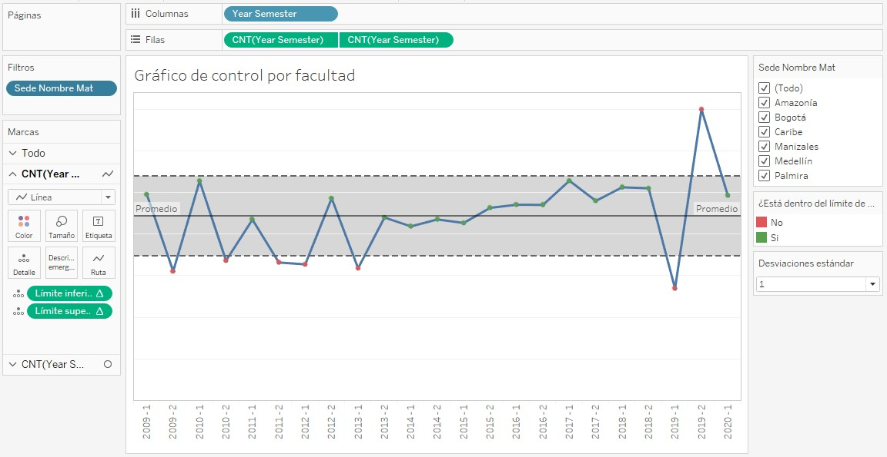
```

4.	Como solo se quiere mostrar una sede a la vez es necesario editar la lista desplegable del filtro que se ubica en el panel lateral derecho, haga clic en el menú desplegable y seleccione Valor Individual (lista).

```{r paso4controlfacultad-fig, echo=FALSE, fig.align='center', fig.asp=.75, fig.cap='Edición del control de filtro', out.width='20%'}
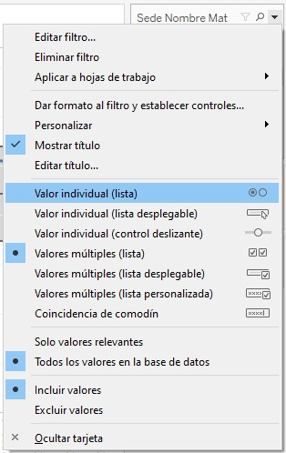
```

5.	Edite el titulo del filtro, ponga como nuevo titulo Sede de matrícula. 

6.	Arrastre la variable Facultad al estante filas, ubíquelo al lado izquierdo de las dos medidas que ya se tienen en este estante.

Por ejemplo, si selecciona sede Palmira y 2 desviaciones estándar, su gráfico de control se ve de la siguiente manera. 

```{r controlfacultad-fig, echo=FALSE, fig.align='center', fig.asp=.75, fig.cap='Gráfico de control por facultad', out.width='80%'}
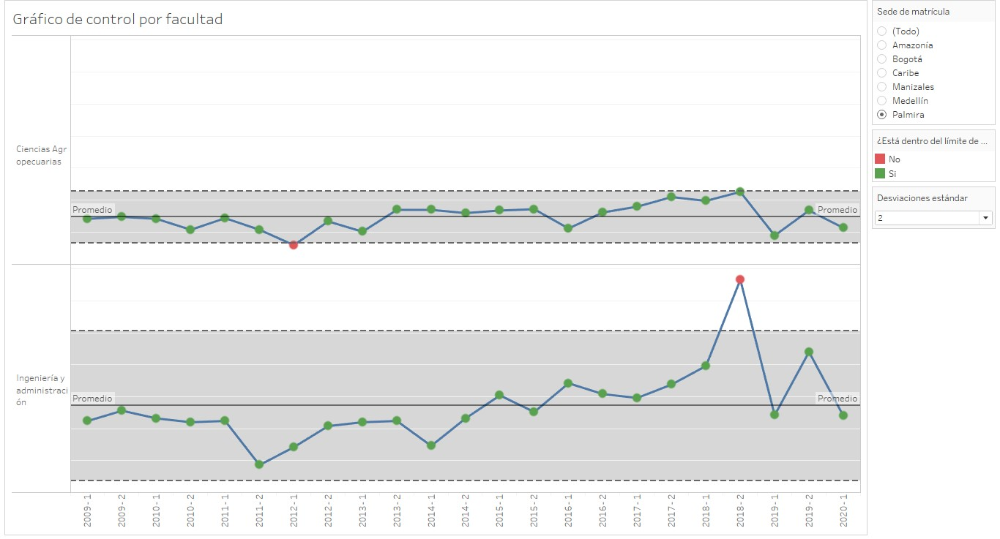
```

 Es claro que la cantidad de graduados de la facultad de Ingeniería y administración tiene una tendencia de asenso y su promedio es superior a la facultad de Ciencias Agropecuarias. La facultad de ciencias agropecuarias no presenta una alta variabilidad en el número de graduados por periodo en la ventana de tiempo analizada.

#### Gráfico de pendientes {#graficopendientes}

Estos gráficos muestran los cambios en la clasificación o la posición de una dimensión desde un punto de inicio hasta un punto final, es útil para mostrar si una dimensión especifica aumento o disminuyo entre dos puntos en el tiempo.
Para los datos que se están analizando este tipo de gráficos pueden ser utilizados para mostrar la cantidad de estudiantes graduados por año de cada programa de las distintas sedes de matrícula, teniendo como año de inicio el 2009 y año final el 2019, cabe aclarar que el conjunto de datos posee registros para el año 2020 pero solo para el 1 semestre, por tanto, la comparación no será equitativa ya que no se tienen registros para los dos semestres del año como en el caso de 2009. Para crear un grafico de pendientes siga estos pasos, 

1.	Cree una nueva hoja de trabajo y llámela Gráfico de pendientes para la sede Amazonía.

2.	Arrastre el campo Año al campo columnas y nuevamente desde el panel tablas arrástrelo al estante filas, allí seleccione medida y recuento. 

3.	Cambie la marca por línea, ajuste la visualización a vista completa.

4.	Añada la variable año al estante filas y seleccione únicamente los años 2009 y 2019 ya que son los años que se quieren visualizar en el gráfico de pendiente. Hasta el momento su visualización se ve de esta manera, 

```{r paso4graficopendiente-fig, echo=FALSE, fig.align='center', fig.asp=.75, fig.cap='Filtrar la visualización por los años deseados', out.width='80%'}
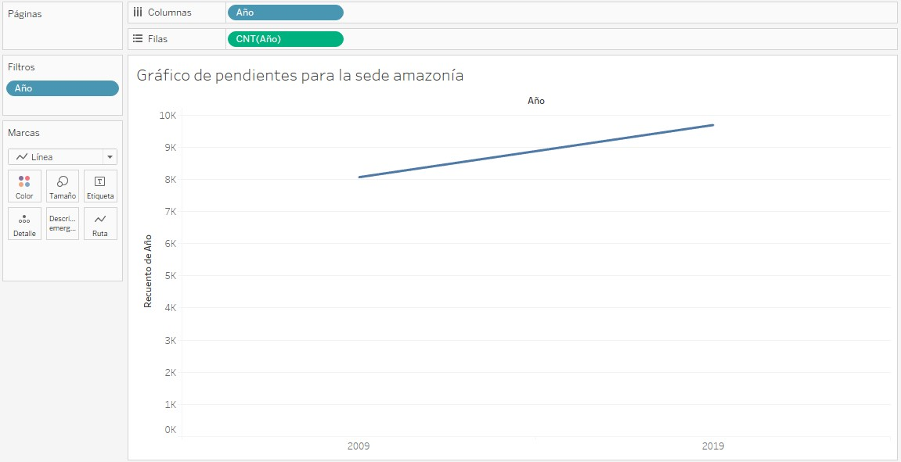
```

5.	Se quiere visualizar la sede Amazonía, por tanto, añada el campo Sede Nombre Mat a filtros y seleccione Amazonía.

6.	Añada programa a la tarjeta color del estante marcas. 

7.	En la advertencia seleccione añadir todos los miembros.

```{r paso7graficopendiente-fig, echo=FALSE, fig.align='center', fig.asp=.75, fig.cap='Añadir todos los miembros', out.width='60%'}
knitr::include_graphics("Imágenes/analisis71.jpg")
```

8.	Quite la selección de mostrar encabezado en eje y, haciendo clic derecho sobre este eje.

9.	Nuevamente arrastre el campo Año a la tarjeta etiqueta ubicada en el estante marcas, seleccione medida y recuento ene l menú desplegable del campo. 

10.	Edite la descripción emergente cambiando Recuento de Año por Número de graduados. 

La visualización obtenida es muy simple, ya que para esta sede no se tienen programas específicos. 

```{r graficopendienteamazonia-fig, echo=FALSE, fig.align='center', fig.asp=.75, fig.cap='Gráfico de pendiente para la sede Amazonía', out.width='80%'}
knitr::include_graphics("Imágenes/analisis72.jpg")
```

Para realizar la visualización para las demás sedes únicamente debe duplicar la vista anterior y cambiar el nombre de la hoja por la sede a la que pertenece, en el campo Sede Nombre Mat ubicado en la tarjeta filtros, haga clic derecho y seleccione editar filtro, en la ventana emergente seleccione Bogotá. 

```{r paso1graficopendientebogota-fig, echo=FALSE, fig.align='center', fig.asp=.75, fig.cap='Filtrar por sede Bogotá', out.width='80%'}
knitr::include_graphics("Imágenes/analisis73.jpg")
```

La gráfica en este momento es poco entendible ya que la para la sede Bogotá hay muchos programas y se están mezclando las dos modalidades de formación por lo que es útil agregar un filtro que permita seleccionar la modalidad que se quiere ver. Añada el campo modalidad de formación al estante filtros, seleccione ambas modalidades y haga clic en aceptar; muestre el filtro y seleccione valor individual (lista), si selecciona pregrado en modalidad de formación su visualización se ve así.

```{r paso2graficopendientebogota-fig, echo=FALSE, fig.align='center', fig.asp=.75, fig.cap='Añadir filtro de modalidad de formación', out.width='80%'}
knitr::include_graphics("Imágenes/analisis74.jpg")
```

Note que aún hay saturación en la gráfica, el ultimo desglose que se puede hacer es filtrar la visualización por las facultades. Añada el campo Facultad al estante filtros, seleccione todas las facultades, muestre el filtro y finalmente seleccione valor individual (lista), a modo de ejemplo seleccione la facultad de ciencias, su visualización se verá así.

```{r graficopendientebogota-fig, echo=FALSE, fig.align='center', fig.asp=.75, fig.cap='Gráfico de pendiente para la sede Bogotá', out.width='80%'}
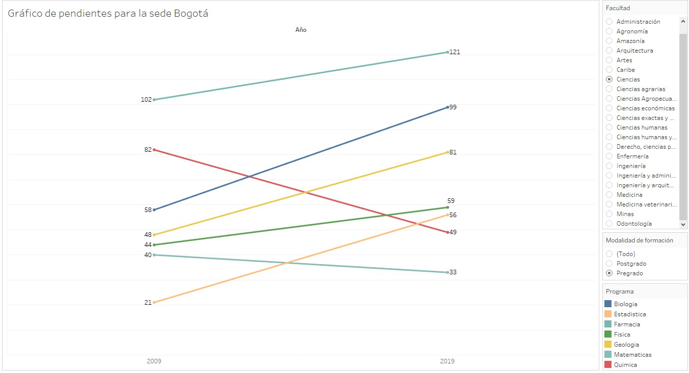
```

Esta visualización permite identificar que los programas de estadística, física, geología, biología y farmacia han aumentado en la cantidad de estudiantes graduados, mientras que los demás programas de los que se tienen registro que ofrece la facultad de ciencias han disminuido en el número de estudiantes graduados, cabe aclarar que en esta visualización no se esta teniendo en cuenta lo que sucede con estos programas en los años intermedios. 

Observe que en el lateral derecho donde se muestra el filtro de facultad se están mostrando todas las facultades que posee la universidad, cuando en realidad solo interesa mostrar las 12 facultades que pertenecen a la sede Bogotá, esto sucede ya que Tableau de manera predeterminada calcula los filtros de manera independiente, es decir, cada filtro accede a todas las filas con independencia de la existencia de otros filtros, para solucionar esto existen los filtros de contexto, el filtro que defina como contexto tendrá acceso a todas las filas del conjunto de datos mientras que los otros filtros dependerán del filtro de contexto, es decir que solo tienen acceso a las filas que cumplen el filtro de contexto. 

En este caso añadir el campo Sede Nombre Mat como filtro de contexto será de gran utilidad ya que el filtro facultad dependerá de los registros que coincidan con la sede seleccionada. 

Para crear el filtro de contexto haga clic en el menú desplegable del campo Sede Nombre Mat y seleccione añadir a contexto.

```{r contextobogota-fig, echo=FALSE, fig.align='center', fig.asp=.75, fig.cap='Añadir filtro de contexto', out.width='20%'}
knitr::include_graphics("Imágenes/analisis76.jpg")
```

El campo sede se tornará de color gris y quedará al inicio de los demás filtros. 
```{r 1contextobogota-fig, echo=FALSE, fig.align='center', fig.asp=.75, fig.cap='Filtro de contexto', out.width='20%'}
knitr::include_graphics("Imágenes/analisis77.jpg")
```

Ahora debe ser editado el filtro facultad desde el menú desplegable de la leyenda del filtro, en el panel lateral derecho muestre el menú desplegable del filtro facultad y seleccione Todos los valores en contexto.

```{r facultadcontextobogota-fig, echo=FALSE, fig.align='center', fig.asp=.75, fig.cap='Edición filtro Facultad', out.width='30%'}
knitr::include_graphics("Imágenes/analisis78.jpg")
```

Ahora el gráfico de pendientes para la sede Bogotá solo contiene las facultades que pertenecen a dicha sede. 

```{r graficopendientecontextobogota-fig, echo=FALSE, fig.align='center', fig.asp=.75, fig.cap='Gráfico de pendientes sede Bogotá con filtro de contexto', out.width='80%'}
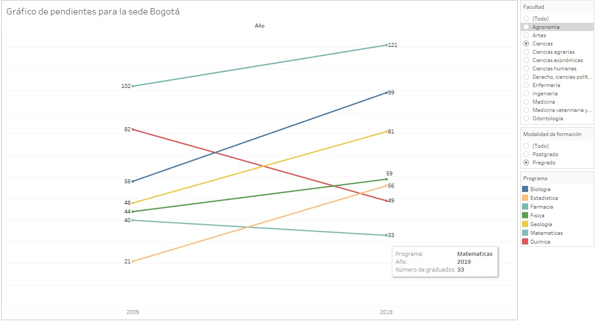
```

Para las demás sedes de la universidad puede duplicar la ultima hoja creada, cambiar su nombre por la sede a la que pertenece y en el filtro Sede Nombre Mat seleccionar la sede que quiere visualizar, al final obtendrá 6 gráficos de pendientes, uno para cada sede, estas hojas de trabajo podrán ser reunidas en una historia, este procedimiento se mostrara en la siguiente sección.

### Compartir las visualizaciones
