# Power BI {#powerbi}

## Generalidades {#generalidadespowerbi}

### ¿Qué es Power BI?

Microsoft Power BI es una colección de servicios de software, aplicaciones y conectores que ayudan a las organizaciones a recopilar, administrar y analizar datos de una variedad de fuentes, a través de una interfaz fácil de usar. Funcionan en conjunto para convertir sus fuentes de datos no relacionadas en conocimientos coherentes, visualmente inmersivos e interactivos. Ya sea que sus datos sean un simple libro de trabajo de Microsoft Excel o una colección de almacenes de datos híbridos locales y basados en la nube, Power BI le permite conectarse fácilmente a sus fuentes de datos, limpiar y modelar sus datos sin afectar la fuente subyacente, visualizar o descubrir lo que es importante para compartirlo con su organización.

Esta aplicación fue concebida originalmente por Thierry D'Hers y Amir Netz del equipo de SQL Server Reporting Services en Microsoft. Fue diseñado originalmente por Ron George en el verano de 2010 y nombrado Proyecto Crescent, estaba disponible inicialmente para su descarga pública el 11 de julio de 2011 incluido con SQL Server Codename Denali. Más tarde renombrado a Power BI, Microsoft lo dio a conocer en septiembre de 2013 como Power BI para Office 365. La primera versión de Power BI se basó en complementos de Microsoft Excel: Power Query, Power Pivot y Power View. Con el tiempo, Microsoft también agregó muchas características adicionales como preguntas y respuestas, conectividad de datos de nivel empresarial y opciones de seguridad a través de las puertas de enlace de Power BI. Power BI fue lanzado por primera vez al público en general el 24 de julio de 2015. 

En febrero de 2019, Gartner confirmó a Microsoft como líder en el “Cuadrante Mágico de Gartner 2019 para Análisis y Plataforma de Inteligencia de Negocios” como resultado de las capacidades de la plataforma Power BI. Esto representó el duodécimo año consecutivo de reconocimiento de Microsoft como proveedor líder en esta categoría cuadrante mágico (a partir de 3 años antes de que se creara esta herramienta).

### Principales ventajas de Power BI

- Intuitiva y fácil de usar

Permite crear informes y paneles básicos sin conocimientos técnicos, sobre todo en la versión Desktop. Aunque a medida que se profundice en la herramienta es necesario poseer una formación para extraer el máximo provecho de esta herramienta.

- Integración perfecta con Microsoft Excel

Es posible exportar y conectar fácilmente los datos de Excel con los paneles de Power Bi; esto es una gran ventaja, ya que muchas empresas usan hojas de cálculo de Excel como herramienta de análisis de datos.

- Permite hacer múltiples análisis complejos en un solo panel

Logrando una visualización única y muy atractiva. Además, los paneles se pueden publicar y compartir con toda la organización, lo que ayuda a fomentar la cultura de análisis de datos e inteligencia empresarial en la organización.


- Se actualiza constantemente

Esto genera un análisis de datos en tiempo real, permite a las organizaciones tomar decisiones basadas en lo que ocurre en el momento.

- Incorpora herramientas de Power View y Power Map

Lo cual permite visualizar imágenes y gráficos en tres dimensiones y visualización de datos en mapas geográficos. Existe una integración con ArcGIS Maps de ESRI, la compañía líder mundial en geomarketing, lo que permite un análisis espacial avanzado. Los mapas de ArcGIS incorporan capas de información sociodemográfica y otras variables, para proporcionar contexto a los datos y relacionar la ubicación con otras variables críticas.

- Herramienta de inteligencia artificial

No solo analiza lo que ha sucedido en el pasado y lo que esta ocurriendo en la actualidad dentro de la organización, además permite detectar tendencias y hacer predicciones de lo que puede pasar a futuro. 

- Almacena la información en la nube de Azure

Microsoft Azure es una plataforma de cloud computing o servicio en la nube alojado en la red global de centros de datos de Microsoft. Esto permite el acceso a los datos y paneles de Power BI desde cualquier lugar y dispositivo, con total seguridad y privacidad.

- Es compatible con múltiples fuentes de datos, Power BI soporta diferentes fuentes de datos, algunas de ellas son:
   * Ficheros Excel, CSV, PDF, etc.
   * Bases de datos relacionadas como SQL Server, MySQL, Oracle, entre otras.
   * Servicios de Azure.
   * Fuentes online como Google Analytics, etc.
   * Algunos conectores a servicios Web.

- Tiene una gran comunidad

Existe una gran comunidad de expertos y usuarios de Power BI a nivel mundial, que ayudan a resolver todas las dudas en miles de artículos foros y blogs, [Power BI Community]( https://community.powerbi.com/#).

### Principales desventajas de Power BI

- No tiene la capacidad de publicar informes con todos los datos asociados, lo cual significa que algunos datos pueden quedar fuera de las visualizaciones.

- Limitaciones de fuentes de datos para la versión gratuita.

- Limites de GB para las versiones no premium.

- Interfaz más compleja, pero de gran utilidad. 


### Productos de Power BI

- [Power BI Desktop](https://powerbi.microsoft.com/es-es/desktop/): es una aplicación de escritorio gratuita, se puede instalar directamente el su equipo y ayuda a explorar los datos de manera profunda y avanzada.
   * Las visualizaciones creadas son guardadas de manera local.
   * Múltiples conexiones a orígenes de datos tanto locales como basados en la nube tales como Dynamics 365, Salesforce, Azure SQL DB, Excel y SharePoint.
   * Preparación de datos a través de la herramienta Power Query.
   * Uso del lenguaje natural que permite hacer preguntas a Power BI sobre sus datos.
   * Uso del lenguaje DAX, para la creación de funciones como medidas rápidas, agrupación, entre otras.
   * [Recursos de aprendizaje guiado]( https://docs.microsoft.com/en-us/learn/)
   * Ejemplos de [código](https://docs.microsoft.com/en-us/samples/browse/) de las herramientas y tecnologías de Microsoft.

- [Power BI Pro](https://powerbi.microsoft.com/es-es/power-bi-pro/): es una licencia de Power BI que posee funciones más extensas que la versión gratuita. 
   * Permite la colaboración entre miembros de un equipo mediante la creación de grupos de trabajo. 
   * Crear publicar y ver paquetes de contenido organizativo: de manera que periódicamente y las personas que desees reciban alertas con información y datos de preparados. 
   * Control de acceso a los datos con seguridad de nivel de fila para usuarios y grupos. 
   * Infinidad de conexión a fuentes de datos. 
   * El tamaño máximo de un conjunto de datos individual es de 1GB.
   * Posee un almacenamiento máximo de 10GB por usuario.
   * Cuenta con servicio en la nube.
   * Inserción de contenido en otras interfaces, como las de Teams, SharePoint u otras aplicaciones SaaS.

- [Power BI Premium](https://powerbi.microsoft.com/es-es/power-bi-premium/): es una extensión de Power BI Pro que ofrece la posibilidad de obtener un mejor y más fiable rendimiento. 
   * Inteligencia de negocio para empresas.
   * Análisis de macrodatos, informes en la nube y en el entorno local.
   * Recursos de almacenamiento y proceso en la nube dedicados.
   * El tamaño máximo de un conjunto de datos individual es de 10GB.
   * Posee un almacenamiento máximo de 100 TB.
   * Permite Almacenar datos de Power BI en Azure Data Lake Storage Gen2.
   * Seguridad y cifrado de datos.
   * Modelado de datos basado en IA usando AutoML, Cognitive Services y Azure Machine Learning.
   
### Compartir el trabajo realizado en Power BI

Cuando se trabaja con la versión Pro o Premium se tiene diversas formas de compartir y colaborar con las personas de la organización. 

-	Guardar el área de trabajo de forma local en su computadora, haciendo clic en archivo, guardar como, añadir un nombre para el archivo y finalmente clic en guardar.

```{r guardarinforme-fig, echo=FALSE, fig.align='center', fig.asp=.75, fig.cap='Guardar informe como archivo local', out.width='60%'}
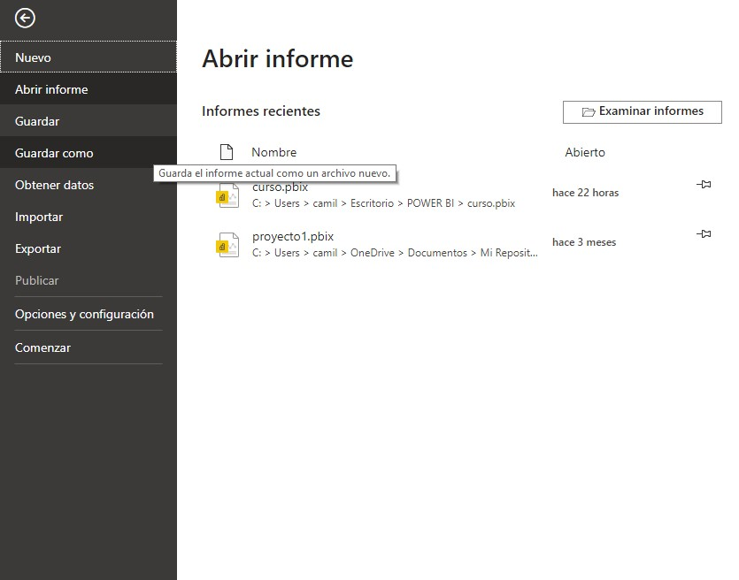
```

```{r guardararchivo2-fig, echo=FALSE, fig.align='center', fig.asp=.75, fig.cap='Asignar nombre al archivo para guardarlo', out.width='60%'}
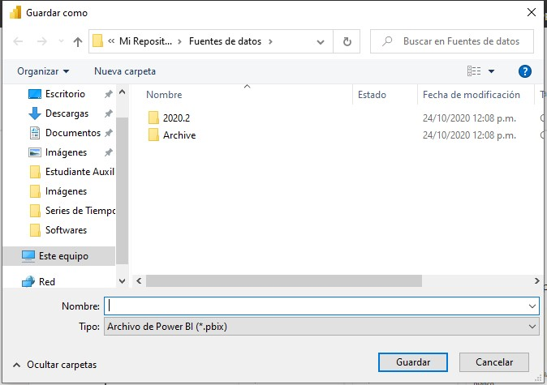
```

-	Publicar informe en el servicio de Power BI, hacer clic en archivo y seleccionar publicar, se abre un cuadro de dialogo pidiendo el inicio de sesión en el servicio de Power BI.

-	Insertar informes en paginas web, esto es posible hacerlo usando [SharePoint Online](https://docs.microsoft.com/es-es/power-bi/collaborate-share/service-embed-report-spo) o directamente en una [página web](https://docs.microsoft.com/es-es/power-bi/collaborate-share/service-embed-secure) al extraer la URL del informe.

-	Imprimir o guardar en formato PDF, haciendo clic en archivo, seleccionar exportar y finalmente exportar a PDF. 

```{r exportarinforme-fig, echo=FALSE, fig.align='center', fig.asp=.75, fig.cap='Exportar informe a PDF', out.width='60%'}
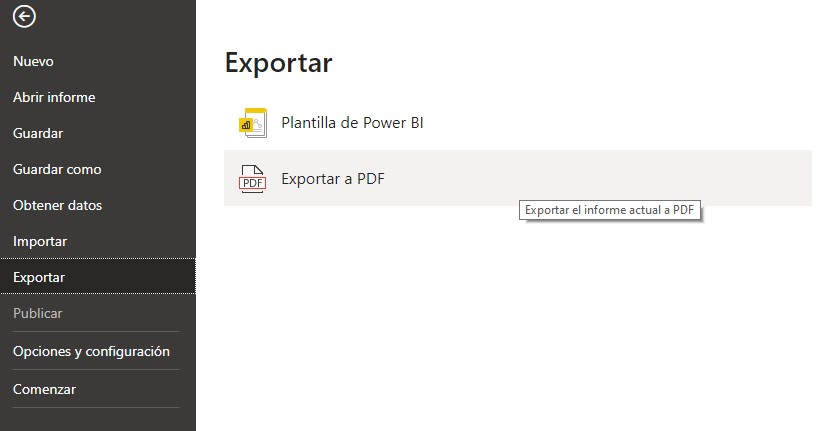
```

Al usar la versión gratuita de Power BI, es decir el producto Power BI Desktop solo es posible guardar el área de trabajo de manera local y exportar los informes como PDF.  

## Instalación de Power BI Desktop

La descarga de este software de visualización se realiza desde la [aplicación de la tienda de Windows](https://aka.ms/pbidesktopstore), hacer clic en instalar.

```{r instalacionpowerbi-fig, echo=FALSE, fig.align='center', fig.asp=.75, fig.cap='Instalar Power BI', out.width='60%'}
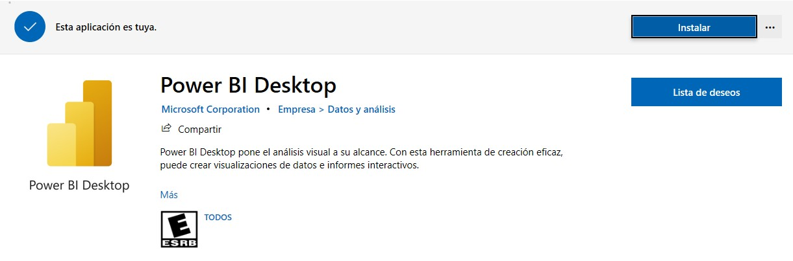
```

Cuando se complete la descarga haga clic en iniciar, de esta manera ya tiene el software e su computador y se actualizara automáticamente.

## Forma de navegación {#formadenavegacionpower}

Al momento de iniciar Power BI esta es la pantalla con la que se encuentra, aparece un cuadro de dialogo de introducción que en su panel lateral izquierdo contiene pestañas para conectarse a fuentes de datos, proyectos realizados con el software y la opción de abrir otros informes; en el panel central se muestra la opción para iniciar sesión y comprar licencias pagas de Power BI; finalmente, el panel derecho posee información sobre novedades, blogs, foros y tutoriales útiles sobre el uso de esta herramienta de visualización.

```{r pantallainicialpowerbi-fig, echo=FALSE, fig.align='center', fig.asp=.75, fig.cap='Pantalla inicial de Power BI', out.width='80%'}
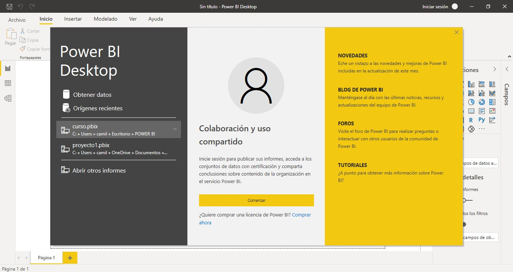
```

Cierre este cuadro de dialogo introductorio para explorar el entorno de creación, dicho entorno se verá así:

```{r entornocreacionpowerbi-fig, echo=FALSE, fig.align='center', fig.asp=.75, fig.cap='Entorno de creación', out.width='80%'}
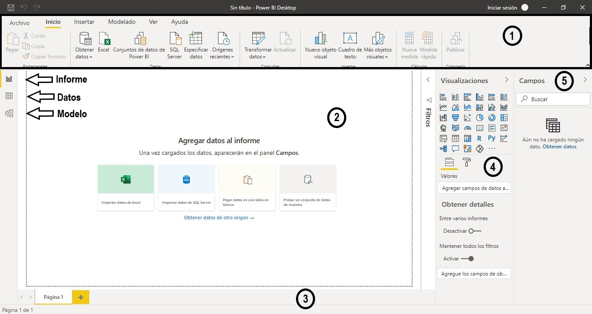
```

Contiene $5$ espacios principales que le permitirán crear informes con diferentes visualizaciones, el panel superior denominado $1$ contiene algunos botones útiles tales como Archivo que permite guardar y exportar los informes creados, inicio que contiene herramientas asociadas a los informes como al conexión a fuentes de datos, transformación de datos, insertar elementos visuales, cuadros de texto entre otros, una sección llamada cálculos que permite crear medidas y finalmente el botón publicar. El botón insertar contiene opciones para insertar diferentes elementos, la pestaña modelado contiene herramientas para editar relaciones, cálculos, creación de parámetros, seguridad y preguntas y respuestas; la pestaña ver contiene elementos de diseño de página como temas, diseño para móvil, opciones de página y mostrar algunos paneles que se usen para crear visualizaciones; por ultimo se ubica la pestaña ayuda, dicha pestaña posee información sobre el software, aprendizaje guiado, videos tutoriales, soporte técnico, documentación, ejemplos y la comunidad de Power BI.

La sección número $2$ representa la vista de informe o lienzo, este es el espacio donde se crean y organizan las visualizaciones, si hace clic en el icono de datos se encontrará con la tabla de datos a la que se encuentra conectado, finalmente el icono de modelo administra las relaciones existentes entre diversas fuentes de datos en el caso en que usted este conectado a varias fuentes y estas tengan alguna relación. La barra denominada área $3$ es la pestaña de páginas, la cual permite navegar entre paginas y crear nuevas.

En el contenedor número $4$ se ubican las visualizaciones que se pueden crear con Power BI, debajo de las opciones de visualización se ubican dos campos uno llamado valores y otro llamado formato con un icono de rodillo, el primer campo contiene los estantes para ubicar las variables en los ejes X y Y, estos estantes cambian dependiendo de la visualización que se elija; el campo formato permite editar el color de los elementos en la visualización, titulo, leyendas, entre otras opciones.

Finalmente, en el panel campos se ubica el nombre de todas las variables que contenga la base de datos, dichas variables se dividen en categóricas y numéricas, las categóricas no tienen icono asociado, mientras que las variables numéricas tienen asociadas un icono de $\Sigma$, como se muestra a continuación.

```{r campospowerbi-fig, echo=FALSE, fig.align='center', fig.asp=.75, fig.cap='Campos', out.width='20%'}
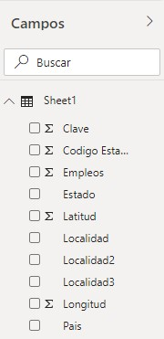
```

Observe entonces que los campos Estado, Localidad, Localidad2, Localidad3 y país con categóricos, mientras que los demás campos que contiene esa fuente son numéricos y se les asigna el icono mencionado anteriormente.

## Flujo de trabajo {#flujotrabajopowerbi}

### Conexión a fuentes de datos {#conexionfuentesdatospowerbi}

Antes de iniciar con la creación de visualizaciones y el análisis de datos debe conectar Power BI a estos, este software de visualización permite conectarse a muchos tipos de fuentes de datos, incluidas bases de datos locales, libros de trabajo de Microsoft Excel y servicios en la nube, puede explorar todas las opciones de conexión haciendo clic en obtener datos en la pantalla introductoria de Power BI.

```{r obtenerdatospbi-fig, echo=FALSE, fig.align='center', fig.asp=.75, fig.cap='Obtener datos', out.width='60%'}
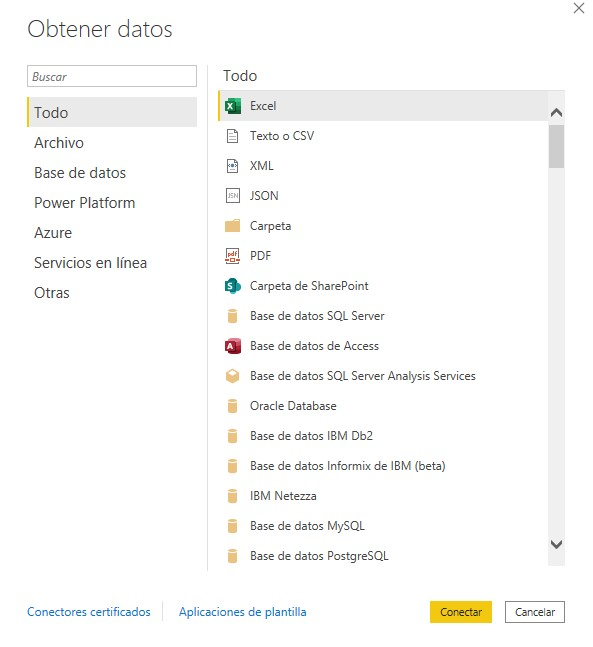
```

En este caso la conexión a datos se hará a través de un archivo Excel, inicialmente se hará la conexión a las bases de datos de estudiantes graduados a nivel de microdatos para explorar algunas funcionalidades del panel Power Query.

1.	 Abrir Power BI y hacer clic en obtener datos.

```{r conexiondatos1-fig, echo=FALSE, fig.align='center', fig.asp=.75, fig.cap='Pantalla inicial', out.width='80%'}
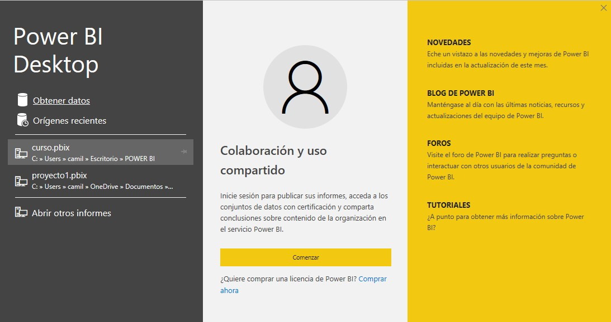
```

2.	En el cuadro de dialogo Obtener datos debe seleccionar Excel y hacer clic en conectar, al hacer esto se abre un cuadro de dialogo que permite navegar a través de las carpetas de su equipo para ubicar la localización de las bases de datos. Debe seleccionar una de las bases y dar clic en botón “Abrir”.

```{r conexiondatos2-fig, echo=FALSE, fig.align='center', fig.asp=.75, fig.cap='Navegación entre carpetas', out.width='60%'}
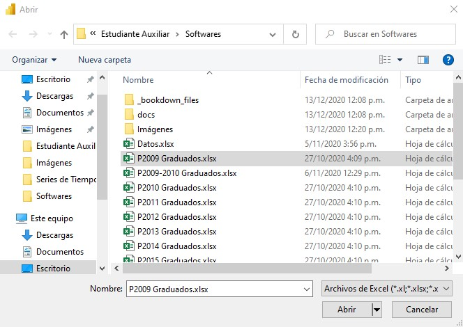
```

3.	Completado el paso anterior se abre un nuevo cuadro de dialogo llamado Navegar que en su panel izquierdo se ubica una lista de las hojas de trabajo que componen el archivo Excel, debe seleccionar una y luego hacer clic en Cargar.

```{r conexiondatos3-fig, echo=FALSE, fig.align='center', fig.asp=.75, fig.cap='Navegador', out.width='80%'}
knitr::include_graphics("Imágenes/powerbi11.jpg")
```

4.	Después de cargados los datos haga clic en Transformar datos, ubicado en la barra de herramientas, obtendrá una nueva ventana llamada Editor de Power Query que permite realizar algunas transformaciones sobre la base de datos.

```{r conexiondatos4-fig, echo=FALSE, fig.align='center', fig.asp=.75, fig.cap='Panel Power Query', out.width='80%'}
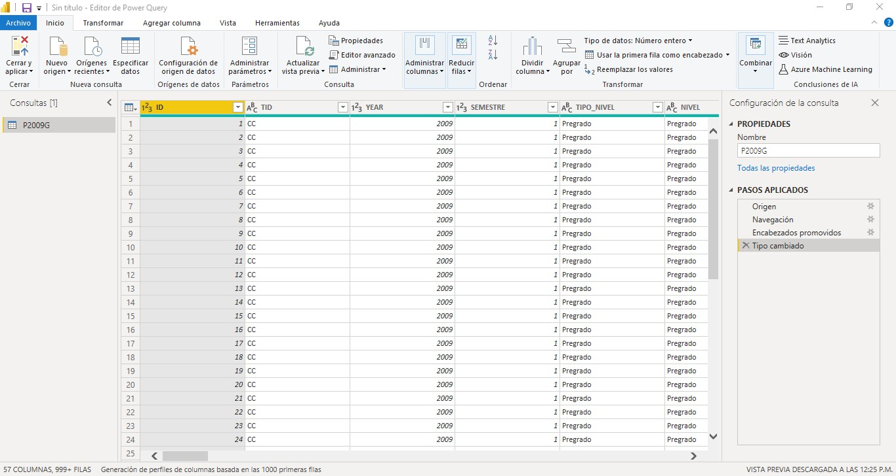
```

Este editor en su barra de herramientas contiene botones útiles que permiten interactuar con los datos, como transformaciones, creación de nuevas columnas, herramientas y ayuda. En el panel lateral izquierdo encontrara una lista de las tablas a las que se encuentra conectado, en este caso la hoja del archivo Excel a la cual se realizó la conexión es “P2009G”, en la parte central del editor se ubica una vista previa de los datos, por último, el panel Configuración de la consulta muestra las propiedades y los pasos aplicados para transformar la base de datos.

Observe que cada columna tiene asociado un icono que indica si es una variable numérica o de texto, puede editar este tipo de datos haciendo clic sobre el icono y seleccionando el tipo de dato, por ejemplo, la columna semestre debe cambiarse de numérica a texto.

```{r cambiartipodato-fig, echo=FALSE, fig.align='center', fig.asp=.75, fig.cap='Cambiar tipo de dato', out.width='30%'}
knitr::include_graphics("Imágenes/powerbi13.jpg")
```

Al hacer clic en el menú desplegable de cada variable encontrara información sobre los datos que contiene, opciones de orden como ascendente y descendente, eliminar vacíos y añadir filtros de texto, muy similar a lo encontrado en Excel cuando se quiere aplicar filtros a los datos. En la pestaña filtros de texto se tiene diversas opciones para filtrar los datos que permiten especificar si es igual o no, el inicio o final, entre otras opciones.

```{r opcionesfiltrado-fig, echo=FALSE, fig.align='center', fig.asp=.75, fig.cap='Menú de cada variable', out.width='50%'}
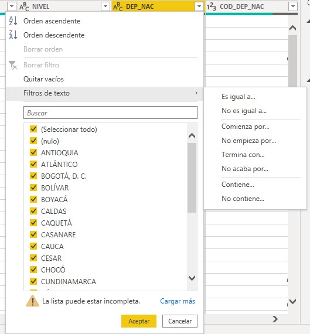
```

A modo de ejemplo puede seleccionar únicamente Antioquia y obtendrá una base de datos que solo contiene las observaciones en las cuales se cumple el filtro aplicado, es decir donde DEP_NAC sea Antioquia.

Haciendo clic derecho sobre el nombre de una variable se despliega un menú con diversas opciones, entre ellas copiar, quitar, duplicar, reemplazar, dividir, agrupar, entre otras; como se muestra en la figura \@ref(fig:opcionesdecolumna-fig).

```{r opcionesdecolumna-fig, echo=FALSE, fig.align='center', fig.asp=.75, fig.cap='Opciones de cada variable', out.width='40%'}
knitr::include_graphics("Imágenes/powerbi15.jpg")
```

Al final de la base de datos se agregaron dos columnas llamadas columna56 y columna57 respectivamente, es necesario eliminarlas ya que no hacen parte del conjunto de variables a analizar, para esto haga clic derecho sobre el nombre de la columna y seleccione quitar.

```{r quitarcolumnas-fig, echo=FALSE, fig.align='center', fig.asp=.75, fig.cap='Eliminar columnas', out.width='50%'}
knitr::include_graphics("Imágenes/powerbi16.jpg")
```

La opción dividir columna presenta diferentes alternativas para realizar divisiones de columna tales como división por un delimitador, número de caracteres, posiciones y algunas opciones de texto como mayúsculas, minúsculas y dígitos; tal y como se muestra en la figura \@ref(fig:opcionesdedivision-fig).

```{r opcionesdedivision-fig, echo=FALSE, fig.align='center', fig.asp=.75, fig.cap='Alternativas para dividir columnas', out.width='40%'}
knitr::include_graphics("Imágenes/powerbi20.jpg")
```

La siguiente columna que presenta problemas es la llamada CIU_NAC puesto que presenta una combinación de números y texto, para solucionar esto se debe usar la opción de división de dígito a no dígito.

-	Haga clic derecho sobre la columna, en el menú desplegable seleccione dividir columna y de dígito a no dígito.

```{r dividirdigitoanodigito-fig, echo=FALSE, fig.align='center', fig.asp=.75, fig.cap='Dividir columnas usando de dígito a no dígito', out.width='70%'}
knitr::include_graphics("Imágenes/powerbi21.jpg")
```

Con esto se obtienen dos columnas, una de ellas contiene el número que en este caso corresponde al código del departamento y la otra variable contiene el nombre, tal y como se muestra en la figura \@ref(fig:columnasdivididas-fig).

```{r columnasdivididas-fig, echo=FALSE, fig.align='center', fig.asp=.75, fig.cap='Vista previa de la columna Ciudad dividida', out.width='80%'}
knitr::include_graphics("Imágenes/powerbi22.jpg")
```

Un detalle importante es que el primer registro que pertenece a la ciudad de Sopó no contenía números por lo tanto para esta fila no se hizo la división.

Cuando se tiene un separador en la columna es útil usar la división de columna por delimitador, en este caso la variable PROGRAMA_S se compone del nombre del programa y la sede a la que pertenece, estos dos atributos se encuentran separados por un guion el cual se usara como delimitador para realizar la división. 

-	Haga clic derecho sobre la columna de interés, seleccione división y por delimitador.

```{r columnasdivididasdelimitador-fig, echo=FALSE, fig.align='center', fig.asp=.75, fig.cap='Dividir columnas usando un delimitador', out.width='70%'}
knitr::include_graphics("Imágenes/powerbi17.jpg")
```

-	En la ventana emergente llamada dividir columna por delimitador seleccione personalizado y escriba un – en el siguiente espacio, por último, en la sección dividir en seleccione cada aparición del delimitador.

```{r configuraciondeldelimitador-fig, echo=FALSE, fig.align='center', fig.asp=.75, fig.cap='Configuración del delimitador', out.width='80%'}
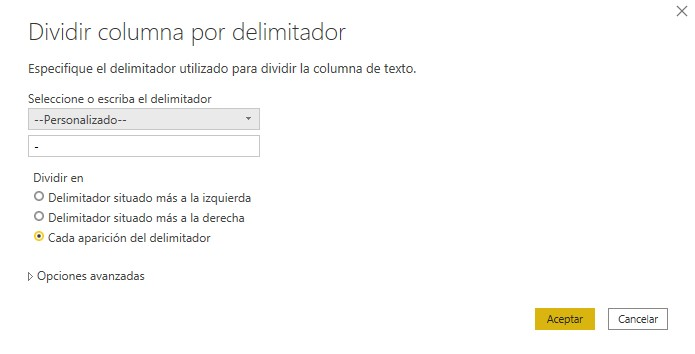
```

Al seleccionar cada aparición del delimitador se obtienen dos columnas, una de ellas contiene el programa y la otra la sede a la que pertenece.

```{r columnadivididacondelimitador-fig, echo=FALSE, fig.align='center', fig.asp=.75, fig.cap='Columna programa- sede dividida', out.width='80%'}
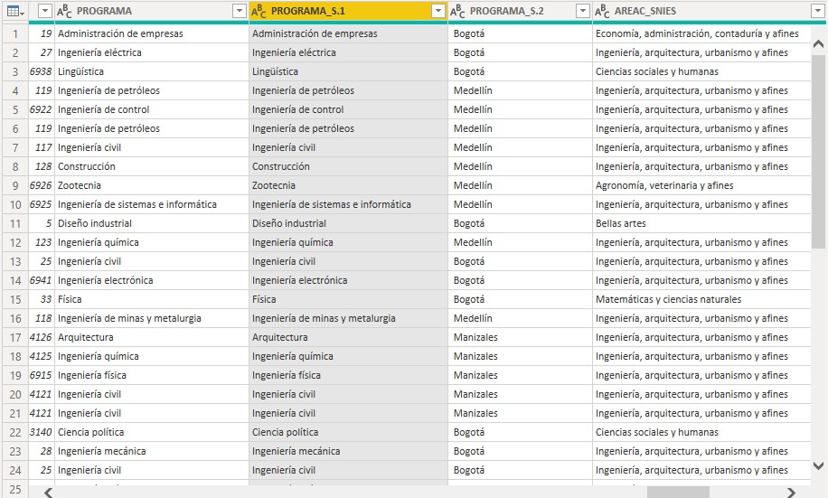
```


