# Flourish {#flourish}

## Generalidades {#generalidadesflourish}

### ¿Qué es Flourish?

Flourish es una aplicación web especializada en crear presentaciones y visualizaciones de gran impacto y utilidad a partir de datos, uno de los objetivos principales de esta compañía es explorar y explicar los datos con hermosas visualizaciones e historias, es posible publicar, presentar o descargar el trabajo realizado sin la necesidad de codificar ni instalar un software.

Esta aplicación fue cofundada por Duncan Clark y Robin Houston. El primero de ellos tiene experiencia en narración de historias en periodismo de datos y publicación, mientras que Robin es matemático y desarrollador, esta pareja comenzó a trabajar en visualizaciones como un proyecto paralelo en 2012, sus primeros proyectos generaron tanto interés que decidieron crean in estudio de visualizaciones llamado Kiln. Durante los siguientes años trabajaron con diversos clientes entre los cuales se encuentran Google, la OMS y LSE, y algunos premios.  Durante todo este tiempo, Duncan y Robin trabajaron en una idea: una herramienta que permitiera a los no codificadores crear visualizaciones e historias de alta calidad sin el costo y las demoras de encargar proyectos a medida. Para 2016, tenían una visión clara para tal herramienta y nació Flourish.

### Principales ventajas de Flourish

- Sencillez de manejo 

Para acceder a la versión gratuita es necesario la creación de una cuenta o perfil, una vez realizado esto se puede iniciar a trabajar inmediatamente, la curva de aprendizaje es muy rápida y corta, todas las visualizaciones que se pueden realizar con esta herramienta están apoyadas por ejemplos prefabricados con datos falsos, lo único que se deba hacer es adaptar nuestros datos a la forma en la que se encuentran en los ejemplos.

- Capacidad de personalización

Permite usar temas personalizados que se alinean con las pautas de su marca o empresa, existe la posibilidad de crear o encargar plantillas a medida usando el SDK para desarrolladores. 

- Variedad de visualizaciones

El portafolio ofrecido por Flourish es bastante amplio, incluye todo tipo de gráficos y mapas atractivos, ofrece desde gráficos tradicionales como barras, áreas, líneas hasta mapas en los cuales se pueden marcar tanto localidades concretas como polígonos geográficos. Una de sus funcionalidades más atractivas es incluir movimiento en los gráficos de una forma automatizada a través del uso de fechas.

- Mejora continua de la plataforma

La herramienta posee un [blog propio]( https://flourish.studio/blog/) en el cual se informa a los usuarios las novedades en las cuales se encuentran trabajando, una de esas novedades es la posibilidad de tomar datos en tiempo real lo que permite que los gráficos evolucionen en función de una variable temporal.

- Adaptación a diversos tamaños de pantalla

Las visualizaciones creadas usando Flourish funcionan en todos los tamaños de pantalla, solo es necesario generar una vista previa al momento de desarrollar los gráficos y publicarla.

- Conexión a varias fuentes de datos

Permite la conexión a hojas de cálculo, conexión a fuentes en vivo o integración con la API.

- Sin instalación

Esta aplicación no requiere instalación, ya que es completamente web solo es necesario poseer un navegador para empezar a crear.

- Flujos de trabajo

Los flujos de trabajo permiten al editor decidir quienes puede publicar de manera libre o quienes deben tener su aprobación.

- Recurso de ayudas

Todas las versiones disponen de recursos prácticos como las plantillas de gráficos y una página web de [ayuda](https://help.flourish.studio/), pero el asesoramiento y soporte técnico esta dedicado a los clientes empresariales.

- Alianzas

Flourish cuenta con una alianza importante con el Google News Lab con la cual se logra acceso a las condiciones premium para medios de comunicación y estudiantes.
Facilidad para compartir el trabajo 
Permite al usuario publicar y compartir visualizaciones o incrustarlas en un sitio web.

### Principales desventajas de Flourish

- Al usar la versión gratuita los trabajos realizados usando esta herramienta permanecerán públicos y cualquiera puede acceder a ellos, esto es bueno para comunicadores y medios, pero no para organizaciones que manejan información sensible.

- Preparación inicial de datos.

- La forma de funcionamiento se basa en plantillas prefabricadas que ayudan con la facilidad de uso, pero es posible tener que cambiar la estructura de sus datos para que se acomoden a la forma que posee cada plantilla.

- No posee material de apoyo como videos o aprendizaje guiado.

- Solo permite la creación de historias tipo diapositiva y no tableros que combinen varios objetos visuales.

### Productos de Flourish 
- Flourish Público: este producto es la versión gratuita de Flourish con la cual se puede crear, publicar y compartir visualizaciones, pero todos los datos son públicos, es una herramienta útil para explorar o de uso educativo.
    * Todos los datos y proyectos son públicos.
    * Compartir e insertar proyectos.
    * Crear historias y presentaciones.
    * Compatible con dispositivos móviles y tabletas.

- Flourish Personal: es una licencia que ofrece privacidad y soporte ideal para particulares y trabajo con datos sensibles.
    * Ofrece todos los servicios de Flourish Público.
    * Posibilidad de mantener los datos y proyectos privados.
    * Compartir, insertar o auto alojar con atribucuón.
    * Soporte por correo electrónico.

- Flourish Business Lite: es un plan ideal para inicios de negocio con características de marca y equipo, adicional a los servicios ofrecidos en la versión Personal, también ofrece:
    * Incorporación de varios usuarios en equipo.
    * Tema personalizado con fuente de Google.
    * Publicación protegida por contraseña.
    * Soporte prioritario.

- Flourish Business Pro y Enterprise: al acceder a este producto se liberan todos los servicios y utilidades de la plataforma Flourish, sus paquetes pueden incluir:
    * Plantillas y funciones premium.
    * Temas personalizados en sus fuentes/estilos.
    * Escritura de desplazamiento sin código en su CMS.
    * Conexión a CSV en vivo o Google sheets.
    * SDK para plantillas personalizadas privadas.
    * Gestor de cuentas y planes de formación.

### Precios de Flourish 
La versión personal de Flourish tiene un costo de $\$69$ USD por mes y permite cancelación en cualquier momento, Business Lite posee un costo anual desde los $\$4999$ USD, finalmente la versión Business Pro y Enterprise no tiene un costo ya que los paquetes pueden ser construidos según las necesidades de la organización.

### ¿Cómo compartir el trabajo?

Como ya se mencionó desde la versión gratuita es posible publicar y compartir o incrustar en un sitio web y descargar los gráficos como imágenes planas, para esto en la esquina superior derecha se ubica un botón llamado Exportar y publicar, al hacer clic sobre el encontrara la opción de publicar para compartir e insertar, descargar imagen o descargar HTML, este último es válido para la versión premium o personal de Flourish.

```{r compartirtrabajoflourish-fig, echo=FALSE, fig.align='center', fig.asp=.75, fig.cap='Opciones de exportación y publicación', out.width='40%'}
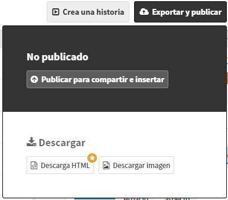
```

Al hacer clic sobre Publicar para compartir e insertar aparecerá un mensaje en cual debe confirmar la publicación, luego de publicado se habilita un enlace y un código para incrustación web.

```{r compartirtrabajoflourishpublicar-fig, echo=FALSE, fig.align='center', fig.asp=.75, fig.cap='Opciones de publicación', out.width='40%'}
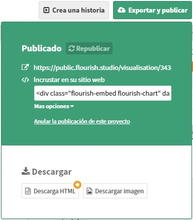
```

También es posible descargar la imagen de la visualización creada, para esto haga clic sobre descargar imagen, en la ventana de descarga debe asignar un nombre a la imagen, seleccionar un formato y elegir un tamaño.

```{r compartirtrabajoflourishdescargarimagen-fig, echo=FALSE, fig.align='center', fig.asp=.75, fig.cap='Descarga de imágenes', out.width='40%'}
knitr::include_graphics("Imágenes/flourish3.jpg")
```

### Instalación de Flourish 

Para usar esta herramienta de visualización no es necesario la instalación de softwares ya que es una aplicación completamente web, lo que si es necesario es crear una cuenta o perfil para iniciar a crear gráficos y analizar los datos; debe ingresar a la página principal de [Flourish]( https://flourish.studio/) y seleccionar la opción registrarse ubicada en la esquina superior derecha. Al hacer clic sobre este botón le pedirá el inicio de sesión si ya se encuentra registrado o también inicia sesión por medio de su cuenta de Google, finalmente presenta la alternativa de inscribirse si aún no se encuentra registrado o no se desea iniciar con Google.

```{r crearcuentaflourish-fig, echo=FALSE, fig.align='center', fig.asp=.75, fig.cap='Registro en Flourish', out.width='85%'}
knitr::include_graphics("Imágenes/flourish4.jpg")
```

## Forma de navegación {#formanavegacionflourish}

La pantalla inicial de Flourish cuando inicia sesión, permite administrar por carpetas los proyectos, ordenarlos y crear nuevas visualizaciones o historias, en la parte central se ubicarán los proyectos de visualización realizados.

```{r pantallainicialflourish-fig, echo=FALSE, fig.align='center', fig.asp=.75, fig.cap='Pantalla inicial', out.width='85%'}
knitr::include_graphics("Imágenes/flourish5.jpg")
```

El icono de interrogación ubicado en la esquina inferior derecha contiene respuestas instantáneas a preguntas comunes o básicas sobre creación de visualizaciones o historias, formas de compartir el trabajo, crear video o GIF, agregar los datos a una plantilla, entre otras; también ofrece la posibilidad de buscar el tema de interés o duda a resolver.

```{r respuestasinstantaneas-fig, echo=FALSE, fig.align='center', fig.asp=.75, fig.cap='Respuestas instantáneas', out.width='40%'}
knitr::include_graphics("Imágenes/flourish6.jpg")
```

A modo de exploración de la interfaz de trabajo debe hacer clic sobre el botón nueva visualización, al hacer esto se encontrará con una galería de plantillas que incluye todo tipo de gráficos, entre los cuales se encuentran gráficos de barras, líneas, circulares, mapas y mapas en 3D, dispersión, jerarquía, tarjetas, mapas de calor, carrera de grafico de barras y líneas, gráficos de pendientes, entre muchas otras opciones.

```{r galeriadeplantillas-fig, echo=FALSE, fig.align='center', fig.asp=.75, fig.cap='Galería de plantillas', out.width='85%'}
knitr::include_graphics("Imágenes/flourish7.jpg")
```
Con el fin de explorar e interactuar con el lienzo de trabajo seleccione la plantilla de gráfico de columnas, obtendrá un espacio de trabajo compuesto por tres espacios básicos.

```{r interfazdetrabajoflourish-fig, echo=FALSE, fig.align='center', fig.asp=.75, fig.cap='Interfaz de trabajo', out.width='85%'}
knitr::include_graphics("Imágenes/flourish8.jpg")
```

El contenedor número uno, permite ir a la página inicial de Flourish mostrada en \@ref(fig:pantallainicialflourish-fig), editar el nombre del gráfico realizado, crear historia, exportar y publicar, sobre la franja gris de este mismo contenedor se ubican botones útiles para obtener vista completa en una nueva ventana, vista previa en distintos tamaños de pantalla tales como escritorio, tableta, dispositivo y tamaño personalizado, en la parte central de esta franja se ubican dos pestañas, la primera de ellas llamada avance, en la cual se ubica el gráfico que se esté creando, la siguiente pestaña es datos la cual presenta la estructura del conjunto de datos que usa esta visualización.

```{r pestanadatosflourish-fig, echo=FALSE, fig.align='center', fig.asp=.75, fig.cap='Pestaña de datos', out.width='85%'}
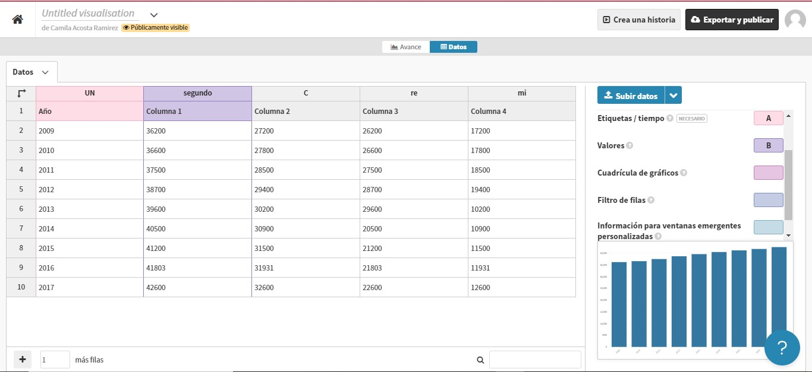
```

Esta pestaña de datos se compone de dos paneles básicos, el primero de ellos contiene los datos ficticios que usa la plantilla es importante analizar la estructura que poseen estos datos, ya que la base de datos a cargar debe tener la misma, el panel lateral derecho se encuentra la opción para cargar datos, al hacer clic en la flecha o menú desplegable de esta opción se presentan dos alternativas, una de ellas para subir archivo de datos y la otra para cargar datos y fusionar.

```{r pestanadatossubirdatosflourish-fig, echo=FALSE, fig.align='center', fig.asp=.75, fig.cap='Subir archivo de datos', out.width='40%'}
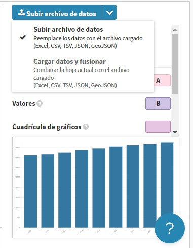
```

La opción subir archivo de datos permite reemplazar los datos ficticios con un archivo cargado, la función cargar datos y fusionar realiza una combinación entre la hoja actual con un nuevo archivo cargado, cabe resaltar que esta unión es de columnas y no de filas, para ambas alternativas de carga de datos las posibilidades de archivos son Excel, CSV, TSV, JSON y GeoJSON. 

Siguiendo en este mismo panel derecho se ubican estantes que dan forma al gráfico, el primero de ellos es etiquetas/tiempo que se refiere el eje x de la visualización para el ejemplo que usa la plantilla a este estante se encuentra asignada la columna A la cual contiene información de años. El siguiente estante o campo es valores el cual debe ser una o más columnas numéricas ya que darán la altura de cada barra; cuadricula de gráficos permite crear mini gráficos separados para cada uno de los valores de la columna asignada a este estante, la siguiente opción llamada filtro de filas permite crear un control de fila orientado al usuario; por último se encuentra información para ventanas emergentes especializadas aquí se puede añadir diferentes columnas con la información que se quiere mostrar en las descripciones emergentes. Si desea obtener una pequeña explicación sobre cada estante puede hacer clic sobre el signo de interrogación ubicado al lado de cada uno.

El contenedor número dos es el lienzo de trabajo y simplemente mostrara la visualización que se está creando, el espacio número tres es de alguna manera el más importante ya que incluye las opciones de formato, tales como tipo de gráfico, controles y filtros, colores, etiquetas, ejes, tipo de datos, leyendas, ventanas emergentes, diseño, entre otras, estas pestañas se exploraran cuando se inicie a crear gráficos.


## Flujo de trabajo

El flujo de trabajo dentro de Flourish es diferente al visto en los softwares Tableau y Power BI ya que para trabajar en estos últimos inicialmente se realiza la conexión a los datos, seguido de esto se realizan las visualizaciones y por último son compartidas, la diferencia radica en que Flourish se basa en plantillas donde cada una tiene una estructura de datos propia y el flujo de trabajo se repite para cada visualización que se desee crear, el primer paso siempre será seleccionar una plantilla, luego analizar la estructura de datos y cargar un archivo con los datos que se quieren visualizar que tengan esta misma estructura, asignar las columnas a los estantes y usar las pestañas de formato para personalizar el gráfico, por esta razón se hará directamente la sección análisis de datos omitiendo la sección de conexión a datos ya que es un paso a realizar en cada una de las visualizaciones que se elaboraran.

### Análisis de datos

Debe recordar que las visualizaciones creadas se basan en las estadísticas oficiales de la Universidad Nacional de Colombia que se presentan en su página oficial sección cifras generales y [graduados]( http://estadisticas.unal.edu.co/menu-principal/cifras-generales/cifras-generales/?tx_estadisticaunal_listcategorias%5Bcategoria%5D=16&tx_estadisticaunal_listcategorias%5Baction%5D=show&tx_estadisticaunal_listcategorias%5Bcontroller%5D=Categoria&cHash=bd354edbd23f35d536276c079984177c), las visualizaciones allí mostradas involucran gráficos de líneas, tablas de texto, gráficos circulares, gráficos de barras y mapas, se iniciara construyendo este tipo de visualizaciones y luego se exploran las diferentes opciones de gráficos ofrecidas por Flourish.

#### Gráfico de líneas {#graficolineasflourish}

Lo primero que se debe hacer al seleccionar una plantilla es identificar la estructura del conjunto de datos, es de resaltar que las plantillas que pertenecen a una misma categoría en este caso líneas, barras y circulares tendrán la misma estructura y la creación de cada gráfico va a diferir en la asignación de las columnas a los ejes. En este caso la estructura del gráfico de líneas coincide con la mostrada en la imagen \@ref(fig:pestanadatosflourish-fig), como se mencionó anteriormente se desea visualizar la evolución del número de estudiantes graduados a través de todos los periodos de los que se tiene registro, para realizar esto es necesario crear una base de datos que en su primera columna contenga el periodo y en la segunda el conteo que representara el total de estudiantes, para esto se tendrá la ayuda de R, si desea revisar el código utilizado para la creación de las bases a usar para este software puede consultar el archivo R llamado “DataFlourish.R”. Para la creación del gráfico de líneas debe seguir estos pasos.

1.	Luego de seleccionada la plantilla de grafico de líneas debe hacer clic sobre subir datos, navegar en las carpetas, seleccionar el archivo “evoluciongeneral.csv” y hacer clic en abrir para cargar los datos, luego de esto se presentará un aviso en su pantalla en el que se informa que los datos serán visibles públicamente debido a que se está usando la versión gratuita, debe hacer clic en el botón importar públicamente.

```{r advertenciadedatospublicosflourish-fig, echo=FALSE, fig.align='center', fig.asp=.75, fig.cap='Advertencia de datos públicos', out.width='40%'}
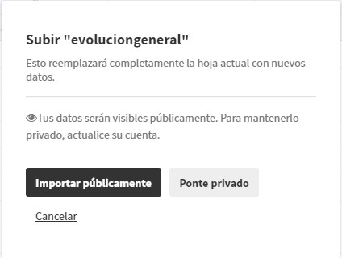
```

2.	Al importar los datos obtendrá un nuevo aviso que indica la cantidad de filas que han sido cargadas y un botón que indica que le paso siguiente es asignar columnas a los estantes, la columna A debe ser asignada al estante Labels/time (Etiquetas/ tiempo) y la columna B al estante Values (Valores).

```{r asignarcolumnasflourish-fig, echo=FALSE, fig.align='center', fig.asp=.75, fig.cap='Asignación de columnas a estantes', out.width='85%'}
knitr::include_graphics("Imágenes/flourish12.jpg")
```

Desde este panel de conexión a datos no es posible transformar el tipo de datos o realizar campos calculados, solo es posible insertar columnas y filas para digitarlas de manera manual, remover columnas, ordenarlas y filtrar los datos, las opciones son muy limitadas por lo cual sus datos deben tener la estructura adecuada y deseada para mostrar en las visualizaciones.

3.	Volviendo a la pestaña avance su visualización debe verse de la siguiente manera.

```{r graficolineasbaseflourish-fig, echo=FALSE, fig.align='center', fig.asp=.75, fig.cap='Gráfico de líneas base', out.width='85%'}
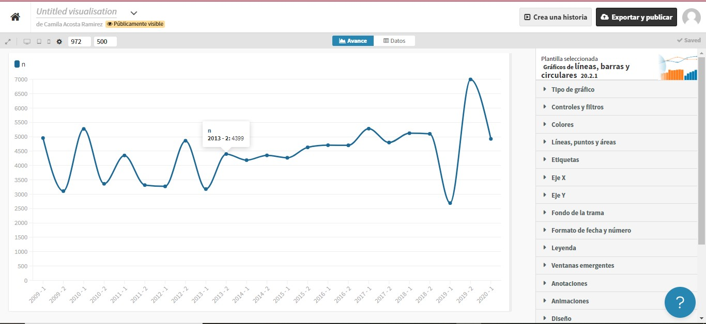
```

Observe que se identifican algunos problemas con la descripción emergente, también se tiene una leyenda en la esquina superior izquierda que identifica el color de la línea, algo que no es necesario ya que solo se tiene una línea, con la ayuda del panel lateral derecho se corregirán estos problemas.

4.	La primera pestaña para explorar y dar formato al gráfico será Colors (colores), allí debe desplegar el campo paleta y seleccionar editar paleta de colores, elimine los colores que posee esta paleta dejando solo uno el cual debe reemplazar el color con “#358DC8”.

```{r editarpaletadecoloresflourish-fig, echo=FALSE, fig.align='center', fig.asp=.75, fig.cap='Editar paleta de colores', out.width='85%'}
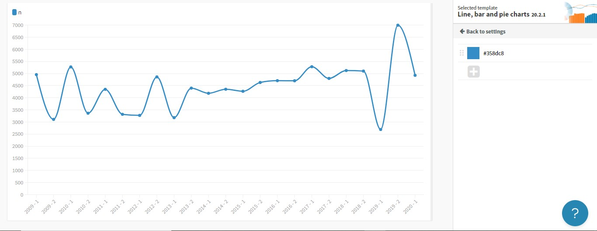
```

5.	La siguiente pestaña es Líneas, puntos y áreas sobre el campo curva lineal debe seleccionar derecho, esto con el fin de eliminar la curva suave que se está presentado en el gráfico.

```{r fromatodelacurvaflourish-fig, echo=FALSE, fig.align='center', fig.asp=.75, fig.cap='Cambiar el estilo de la curva', out.width='85%'}
knitr::include_graphics("Imágenes/flourish15.jpg")
```

Hacia el final de esta pestaña encontrara una sección llamada Puntos, debe asegurarse de que se encuentre en apagado para eliminar los puntos que se presentan en la visualización.

6.	Es momento de editar los ejes, para esto haga clic sobre la pestaña eje x, en el cajón texto debe escribir Periodo y activar el botón para dar estilo, debe seleccionar negrita en color negro y tamaño 1.3.

```{r editarejexflourish-fig, echo=FALSE, fig.align='center', fig.asp=.75, fig.cap='Formato y edición del eje X', out.width='85%'}
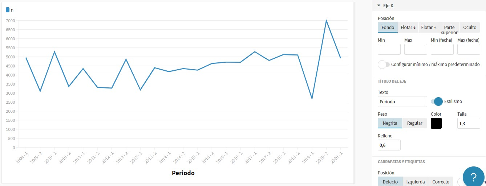
```

7.	En esta misma pestaña se ubica una sección para las etiquetas, la posición se dejará por defecto, active el botón para dar estilo, aumente el tamaño a 1 en color negro.

```{r editarejexetiquetasflourish-fig, echo=FALSE, fig.align='center', fig.asp=.75, fig.cap='Formato de etiquetas del eje X', out.width='85%'}
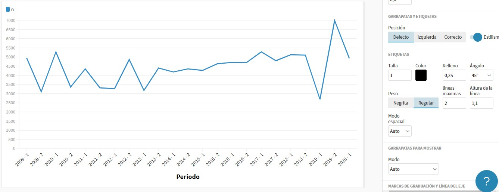
```

8.	Nuevamente sobre la pestaña eje x se encuentra una sección dedicada a las marcas de graduación y líneas del eje, cambie el color de línea por “#BDC3C7”, active las líneas de cuadricula y su botón de estilo, allí debe asignar el mismo color de línea en un estilo punteado.

```{r marcasdegraduacionylineasdelejeflourish-fig, echo=FALSE, fig.align='center', fig.asp=.75, fig.cap='Formato de marcas de gradaución y líneas del eje', out.width='85%'}
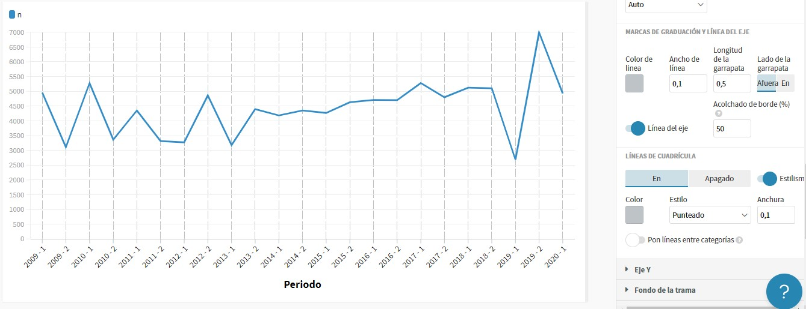
```

9.	Repita los pasos 6, 7 y 8 para editar el eje y, tenga en cuenta que el título de este debe ser Número de graduados.

```{r formatodeambosejesflourish-fig, echo=FALSE, fig.align='center', fig.asp=.75, fig.cap='Gráfico con ambos ejes editados', out.width='85%'}
knitr::include_graphics("Imágenes/flourish19.jpg")
```

10.	La pestaña fondo de la trama permite usar ya sean colores o imágenes para el fondo de la visualización, en este caso se usara un color por lo que debe activar este campo y asignar el color “#ECF0F1”.

```{r fondodetramaflourish-fig, echo=FALSE, fig.align='center', fig.asp=.75, fig.cap='Asignación de un color al fondo del gráfico', out.width='85%'}
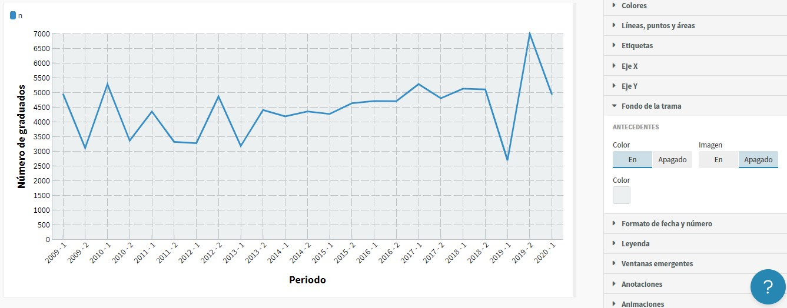
```

11.	La leyenda ubicada en la esquina superior izquierda debe ser desactivada usando la pestaña leyenda la cual debe establecer en apagado.

```{r desactivarleyendaflourish-fig, echo=FALSE, fig.align='center', fig.asp=.75, fig.cap='Desactivar leyenda', out.width='85%'}
knitr::include_graphics("Imágenes/flourish21.jpg")
```

12.	En la imagen \@ref(fig:graficolineasbaseflourish-fig) se puede observar que la descripción emergente del gráfico no es clara y debe ser editada, inicialmente debe ir a la pestaña datos y agregar la columna A al estante información para ventanas emergentes personalizadas y regrese a la pestaña avance.

13.	Dentro de las pestañas para dar formato al gráfico se ubica una llamada ventanas emergentes, debe seleccionar contenido personalizado, escribir lo que se muestra en la siguiente imagen, activar el estilo personalizado para seleccionar color negro, alineación izquierda y un tamaño de fuente de 13.

```{r contenidopersonalizadoventasemergentesflourish-fig, echo=FALSE, fig.align='center', fig.asp=.75, fig.cap='Contenido personalizado en ventanas emergentes', out.width='85%'}
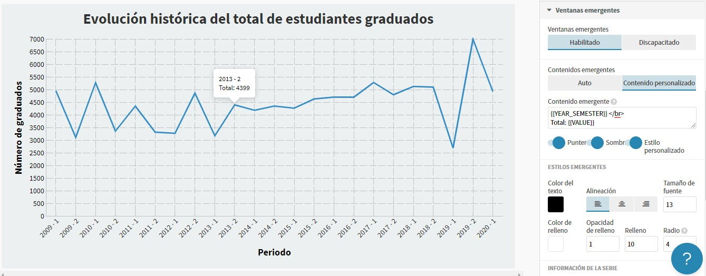
```

14.	Debe asignar el color de fondo “#ECF0F1” en la sección antecedentes ubicada en diseño.

```{r colordefondoflourish-fig, echo=FALSE, fig.align='center', fig.asp=.75, fig.cap='Agregar un color de fondo para toda la visualización', out.width='85%'}
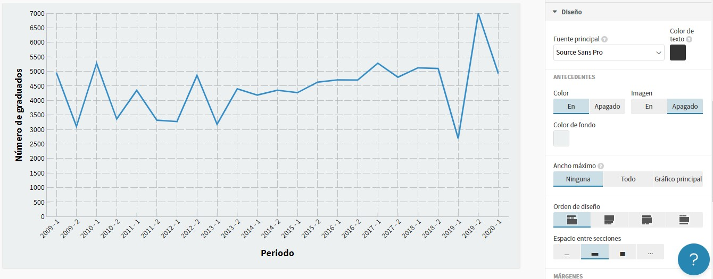
```

15.	Con la pestaña encabezamiento se asigna título al gráfico creado, seleccione alineación central y como título escriba Evolución histórica del total de estudiantes graduados, active el cambio de estilo y seleccione la A mayúscula grande en talla.

```{r titulodelgraficoflourish-fig, echo=FALSE, fig.align='center', fig.asp=.75, fig.cap='Añadir un título al gráfico creado', out.width='85%'}
knitr::include_graphics("Imágenes/flourish23.jpg")
```

16.	Por último, asigne un nombre a la visualización en el espacio ubicado en la parte superior al lado del icono de casa, dicho nombre debe ser evolución general. Cerca al botón exportar y publicar encontrara un chulo con la palabra saved que indica que los cambios en el gráfico han sido guardados.

Después de verificado que los cambios se han guardado haga clic sobre el icono de casa para regresar a todos sus proyectos y poder crear nuevas visualizaciones usando el botón de nueva visualización.

#### Gráfico de líneas segmentado por una dimensión {#graficolineassegmentadoflourish}

Esta visualización también pertenece a la sección de plantillas de gráficos de líneas, barras y circulares y se usara la plantilla del gráfico anterior solo que esta vez se incorpora la modalidad de formación, la base de datos a cargar debe contener mínimo tres columnas, la primera de ellas con el periodo y las siguientes dos corresponden a pregrado y postgrado, adicional a esto es de vital importancia mostrar el número de estudiantes graduados como porcentaje del total por periodo, por tal razón se generan otras dos columnas con los respetivos porcentajes para cada modalidad de formación. 

1.	Elija la plantilla gráfico de líneas y cargue el archivo llamado “modalidadformacion.csv”.

2.	La columna A debe ser asignada al estante Labels/time (Etiquetas/ tiempo), las columnas B y C al estante Values (Valores), finalmente todas la columnas es decir de la A a la E deben ubicarse en información para ventanas emergentes personalizadas.

```{r asignaciondecamposflourish-fig, echo=FALSE, fig.align='center', fig.asp=.75, fig.cap='Asignar columnas a los estantes correspondienetes', out.width='85%'}
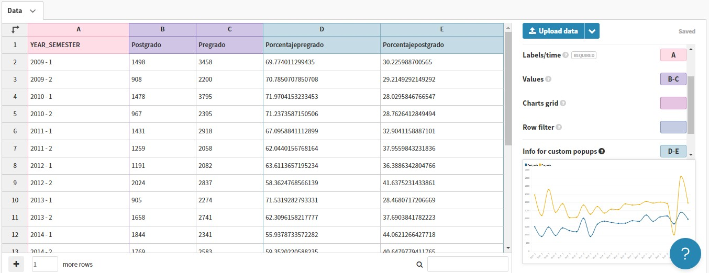
```

3.	Al regresar a la pestaña avance se encuentran algunos problemas de formato tales como colores de datos, posición de la leyenda, etiquetas y títulos, inicialmente use la pestaña colores para editar la paleta y asignar el color “#8CC63F” a pregrado y “#F15A24” a postgrado.

```{r editarcoloresflourish-fig, echo=FALSE, fig.align='center', fig.asp=.75, fig.cap='Editar paleta de colores', out.width='85%'}
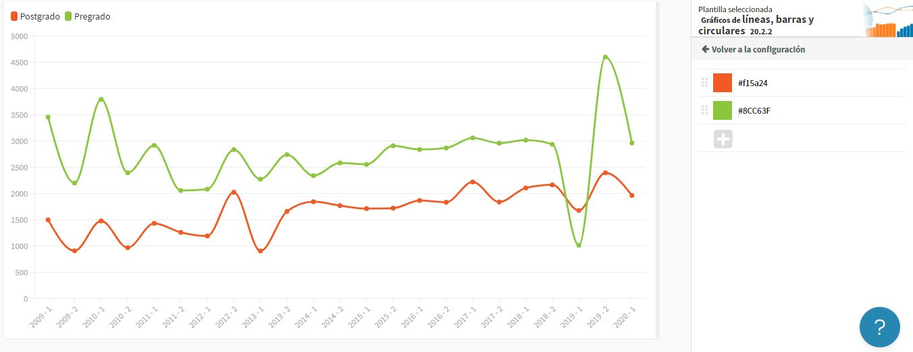
```

4.	Debe repetir los pasos del 5 a 9 mostrados en la sección \@ref(graficolineasflourish).

```{r formatodevisualizacionflourish-fig, echo=FALSE, fig.align='center', fig.asp=.75, fig.cap='Editar las líneas, ejes y cuadrícula', out.width='85%'}
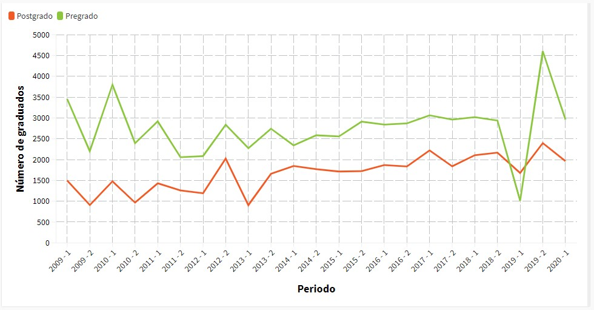
```

5.	Por medio de la pestaña fondo de trama use el color “#ECF0F1” como fondo de la visualización.

```{r fondodetramamodalidadfromacionflourish-fig, echo=FALSE, fig.align='center', fig.asp=.75, fig.cap='Asignar un color al fonde de trama del gráfico', out.width='85%'}
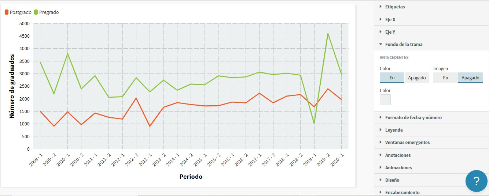
```

6.	Sobre la pestaña leyenda es posible modificar la posición y el formato de esta, modo de leyenda se debe establecer en automático, debe apagar la opción que permite filtrar datos haciendo clic sobre la leyenda, el tamaño del texto debe ser uno y estar en negrita, hacia el final de esta pestaña se ubica la posición de la leyenda para la cual debe seleccionar abajo, las leyendas siempre se ubicaran en las esquinas, al elegir abajo se ubica en la esquina inferior izquierda.

```{r cambiarposicionleyendaflourish-fig, echo=FALSE, fig.align='center', fig.asp=.75, fig.cap='Cambiar la posición de la leyenda', out.width='85%'}
knitr::include_graphics("Imágenes/flourish29.jpg")
```
7.	El contenido de las ventanas emergentes será personalizado e incluirá todas las columnas de la base de datos, en el espacio de contenido emergente debe escribir:

{{YEAR_SEMESTER}}  </br>
Pregrado: {{Pregrado}} ({{Porcentajepregrado}}%) </br>
Postgrado: {{Postgrado}} ({{Porcentajepostgrado}}%) </br>

También debe activar la opción de estilo personalizado para cambiar el color del texto a negro y aumentar el tamaño de fuente a 13.

```{r paso7lineassegmentadaflourish-fig, echo=FALSE, fig.align='center', fig.asp=.75, fig.cap='Contenido personalizado para ventanas emergentes', out.width='85%'}
knitr::include_graphics("Imágenes/flourish49.jpg")
```

8.	Debe repetir los pasos 14, 15 y 16 del grafico de líneas, para el paso 15 el título de la visualización debe ser Evolución del número de estudiantes graduados por modalidad de formación y para el paso 16 será Modalidad de formación.

```{r paso8lineassegmentadaflourish-fig, echo=FALSE, fig.align='center', fig.asp=.75, fig.cap='Evolución del número de estudiantes graduados por modalidad de formación', out.width='85%'}
knitr::include_graphics("Imágenes/flourish30.jpg")
```

#### Tabla de texto {#tablatextoflourish}
El tablero mostrado en la página web de las estadísticas oficiales de la Universidad Nacional para la modalidad de formación se compone de tres elementos principales, un gráfico de líneas que se realizó anteriormente, una tabla de texto y por último un gráfico circular; es momento de realizar la tabla de texto la cual debe contener cuatro columnas, la primera será el año, seguida del semestre y las modalidades de formación ofrecidas por la universidad, la tabla guía o de referencia posee un botón que permite mostrar el total de los estudiantes graduados, esto no es posible de construir en Flourish por tanto el conjunto de datos a cargar contendrá cinco columnas las cuales son Año, Semestre, Pregrado, Postgrado y Total.

1.	Haga clic en nueva visualización, navegue en la página de plantillas y en la sección Table elija 
Default.

```{r paso1tablatextoflourish-fig, echo=FALSE, fig.align='center', fig.asp=.75, fig.cap='Seleccionar plantilla para tabla', out.width='85%'}
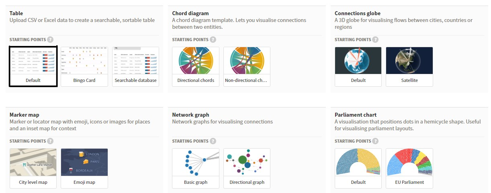
```

2.	Después de seleccionada la plantilla para realizar una tabla se identifica una funcionalidad útil e interesante para mostrar los datos, en las últimas dos columnas de la plantilla se usan mini gráficos para visualizar información, se debe identificar la estructura de datos y explorar las pestañas de formato para hacer uso de los mini gráficos.

3.	Sobre la pestaña datos de puede observar que el conjunto de datos posee doce columnas de las cuales la E y F son usadas para el mini gráfico de barras, de a G hasta la L se usan para el mini gráfico de áreas, el conjunto de datos a montar tendrá siete variables, las cinco que se han mencionado anteriormente y dos más que contendrán los porcentajes de cada modalidad de formación; cargue el archivo llamado “modalidadformaciontabla.csv”.

```{r paso3tablatextoflourish-fig, echo=FALSE, fig.align='center', fig.asp=.75, fig.cap='Cargar archivo de datos', out.width='85%'}
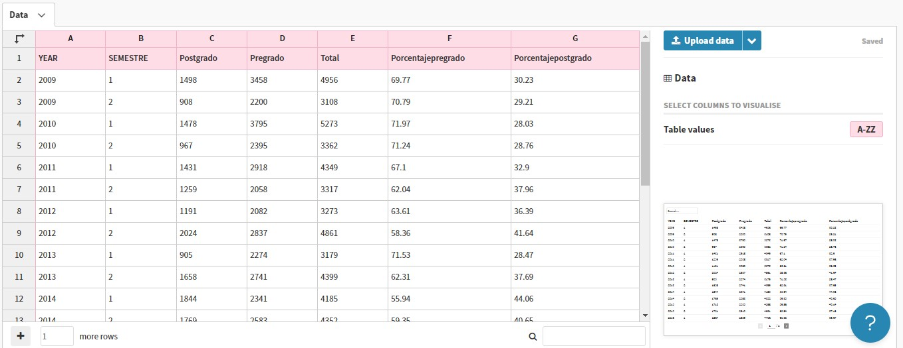
```

4.	Haciendo doble clic sobre el nombre de cada columna puede editarlo, el nombre de la primera columna debe ser Año y la segunda columna debe ser cambiada por Semestre.

5.	Regrese a la sección avance y  sobre la pestaña Table elija doce como el número de filas por página.

```{r paso5tablatextoflourish-fig, echo=FALSE, fig.align='center', fig.asp=.75, fig.cap='Editar el número de filas por página', out.width='85%'}
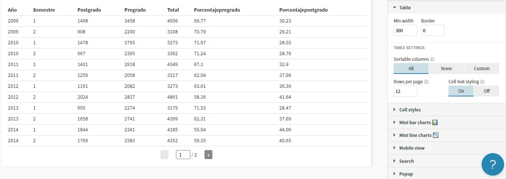
```

6.	En la pestaña estilos de celda debe seleccionar centrar para la alineación horizontal.

7.	La pestaña gráficos de mini barras permite agregar un pequeño gráfico de barras en una nueva columna que combina dos que ya se tengan, en este caso se usaran las columnas Porcentajepregrado y Porcentajepostgrado para generar este gráfico que se ubicara en una columna llamada Porcentaje.

```{r paso7tablatextoflourish-fig, echo=FALSE, fig.align='center', fig.asp=.75, fig.cap='Agregar mini gráfico de barras para visualizar porcentajes', out.width='85%'}
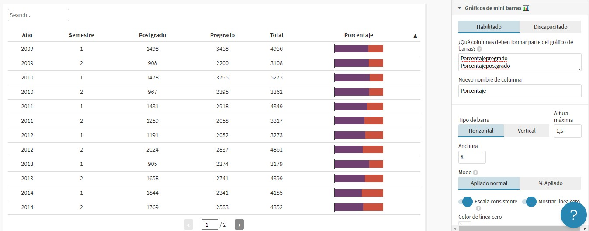
```

8.	Sobre esta misma pestaña deberá editar la paleta de colores, los colores a usar serán “#8CC63F” y “#F15A24”, debe notar que los colores mostrado en las barras de la tabla no coinciden con los colores asignados, esto se debe a que se tiene activado el botón ampliar, por tanto, deberá desactivarlo; finalmente en la sección etiquetas debe seleccionar en línea.

```{r paso8tablatextoflourish-fig, echo=FALSE, fig.align='center', fig.asp=.75, fig.cap='Editar el formato de las barras', out.width='85%'}
knitr::include_graphics("Imágenes/flourish35.jpg")
```

9.	Active las fronteras en la pestaña diseño y asigne el color negro a las cuatro fronteras 

10.	Ubíquese sobre la pestaña buscar y deshabilite esta opción, con la pestaña encabezamiento asigne el título Total estudiantes graduados por modalidad de formación en alineación central, su visualización debe verse como se muestra a continuación.

```{r tablatextomodalidadfromacionflourish-fig, echo=FALSE, fig.align='center', fig.asp=.75, fig.cap='Tabla: Total de estudiantes graduados por modalidad de formación', out.width='85%'}
knitr::include_graphics("Imágenes/flourish36.jpg")
```

#### Gráfico circular {#graficocircularflourish}

Este gráfico circular debe mostrar la distribución de estudiantes graduados por modalidad de formación para el último periodo del cual se tiene registro, para realizar esta visualización se tienen dos opciones la primera de ellas es incorporar la variable YEAR_SEMESTER como filtro de filas, esto permitiría al usuario seleccionar cualquier periodo; la segunda opción es no incluir esta variable y por tanto no generar el filtro, se realizaran ambas opciones para explorar cómo funcionan los filtros en este software.

1.	Desde la galería de plantillas debe seleccionar gráfico circular, cargar la fuente de datos llamada “modalidadformacioncricular.csv”, para el estante Labels/Time debe asignar la columna B ya que esta contiene la modalidad de formación, la columna E debe ir en el estante Values debido a que se quiere mostrar los porcentajes, la columna A será usada como filtro de fila, finalmente al estante de información para ventanas emergentes personalizadas se deben asignar las columnas B y C.

```{r paso1graficocircularflourish-fig, echo=FALSE, fig.align='center', fig.asp=.75, fig.cap='Carga de datos y asignación de columnas', out.width='85%'}
knitr::include_graphics("Imágenes/flourish37.jpg")
```

2.	Regrese a la pestaña avance y en controles y filtros explore los diferentes tipos de control disponibles, aumente el tamaño del texto a 1.2 y altura 0.6, active estilos de borde desplegable y seleccione todos los lados.

```{r paso2graficocircularflourish-fig, echo=FALSE, fig.align='center', fig.asp=.75, fig.cap='Formato al filtro de periodo', out.width='85%'}
knitr::include_graphics("Imágenes/flourish38.jpg")
```

3.	Use la pestaña colores para editar la paleta y asignar el color “#F15A24” a postgrado y “#8CC63F” a pregrado.

4.	En la pestaña etiqueta debe seleccionar ambos para el campo contenido de la etiqueta, esto con el fin de mostrar tanto la modalidad de formación como el porcentaje correspondiente.

```{r paso4graficocircularflourish-fig, echo=FALSE, fig.align='center', fig.asp=.75, fig.cap='Edición de etiqueta de datos', out.width='85%'}
knitr::include_graphics("Imágenes/flourish39.jpg")
```

5.	Debe cambiar la ubicación de la leyenda para que esta quede en la parte inferior. El texto de la ventana emergente será personalizado y contener lo que se muestra en la siguiente imagen.

```{r paso5graficocircularflourish-fig, echo=FALSE, fig.align='center', fig.asp=.75, fig.cap='Personalización de la ventana emergente', out.width='85%'}
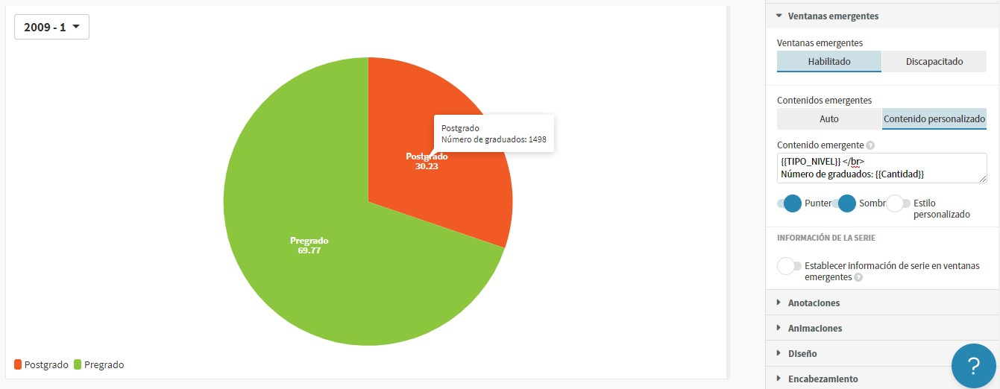
```

6.	Sobre la pestaña diseño active la opción fronteras y asigne color negro a todas.

7.	Con ayuda de la sección encabezamiento seleccione alineación central y escriba como título Distribución de graduados por modalidad de formación, periodo, este titulo debe estar en negrita y su tamaño debe ser la A mayúscula más grande.

La visualización obtenida muestra la distribución de estudiantes graduados por modalidad de formación según el periodo que el usuario seleccione en el filtro, por ejemplo, en el periodo 2018-1 el $58.9\%$ de los estudiantes graduados pertenecían a pregrado.

```{r graficocircularconfiltroflourish-fig, echo=FALSE, fig.align='center', fig.asp=.75, fig.cap='Distibución de estudiantes graduados por modalidad de formación', out.width='85%'}
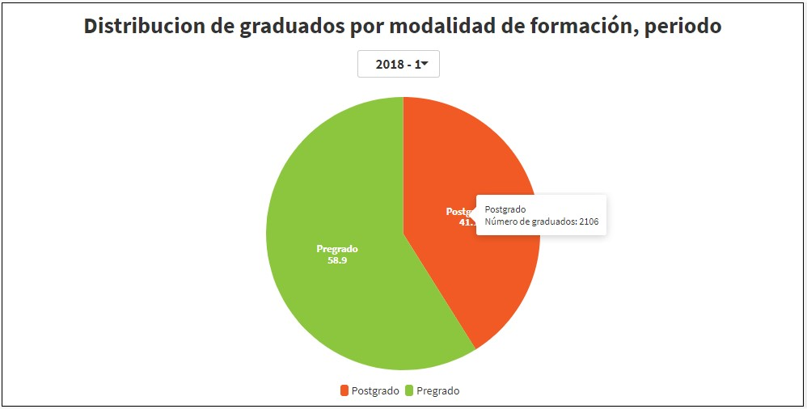
```
Para la segunda opción de este tipo de gráfico el cual no contendrá filtro debe ir a la pagina principal donde se ubican todos sus proyectos y duplicar la visualización creada anteriormente, sobre la pestaña datos debe cargar el archivo “modalidadformacioncircularfiltrada.csv” y reasignar las columnas a los campos disponibles, B debe ir el Labels, D se agina a Values y nuevamente las columnas B y C se usarán para las ventanas emergentes personalizadas.

```{r graficocircularflourish-fig, echo=FALSE, fig.align='center', fig.asp=.75, fig.cap='Asignación de campos a estantes', out.width='85%'}
knitr::include_graphics("Imágenes/flourish42.jpg")
```

Lo único que deberá editar es el título agregando el periodo, es decir, Distribución de graduados por modalidad de formación, periodo 2020-1.

```{r graficocircularflourishsinfiltro-fig, echo=FALSE, fig.align='center', fig.asp=.75, fig.cap='Distribución de estudiantes graduados por modalidad de formación, periodo 2020-1', out.width='85%'}
knitr::include_graphics("Imágenes/flourish43.jpg")
```

#### Gráfico de barras

El gráfico de barras a realizar debe mostrar la cantidad de graduados por nivel de formación para el periodo 2020-1 con su respectivo porcentaje, al igual que en el gráfico circular realizado anteriormente se tienen dos opciones una de ellas incluye un filtro dentro de la visualización que permite al usuario interactuar y elegir un periodo, y la segunda opción es no incluir este filtro y únicamente mostrar las cifras relacionadas con el periodo 2020-1, en este caso se realizara la segunda opción ya que con el gráfico anterior se identifico como funcionan los filtros.

1.	Desde la galería de plantillas debe seleccionar la de gráfico de barras y cargar el archivo de datos llamado “nivelformacion.csv”.

2.	La columna B debe ser asignada al estante Labels/time el cual representa cada barra, la columna Cantidad (C) debe ir en Values y finalmente las columnas B y E a información para ventanas emergentes personalizadas.

3.	Ubíquese sobre la pestaña avance para visualizar el gráfico, debe observar algunos problemas con la descripción emergente, colores y leyenda.

```{r paso3graficobarrasflourish-fig, echo=FALSE, fig.align='center', fig.asp=.75, fig.cap='Asignación de columnas a estantes disponibles', out.width='85%'}
knitr::include_graphics("Imágenes/flourish44.jpg")
```

4.	En la pestaña colores debe seleccionar por fila el modo de color y editar la paleta de colores, pregrado debe estar en color “#8CC63F”, Maestría en color “#C1272D”, especialización “#29ABE2”, especialidades médicas en color “#6D6666” y por último doctorado “#FBB03B”.

```{r paso4graficobarrasflourish-fig, echo=FALSE, fig.align='center', fig.asp=.75, fig.cap='Cambio de paleta de colores', out.width='85%'}
knitr::include_graphics("Imágenes/flourish45.jpg")
```

5.	Sobre la pestaña barras debe aumentar la opacidad de la barra a 1, el estilo de la etiqueta debe ser eje, también debe activar la opción de mostrar etiquetas de puntos de datos; esta configuración debe realizarse en la pestaña etiquetas.

6.	Es momento de editar los ejes para esto haga clic sobre eje X y asigne como título Número de graduados en color negro, negrita y tamaño 1.3, las etiquetas también deben estar en color negro y tamaño 1; también debe activar las líneas de cuadricula.

```{r paso6graficobarrasflourish-fig, echo=FALSE, fig.align='center', fig.asp=.75, fig.cap='Formato del eje X', out.width='85%'}
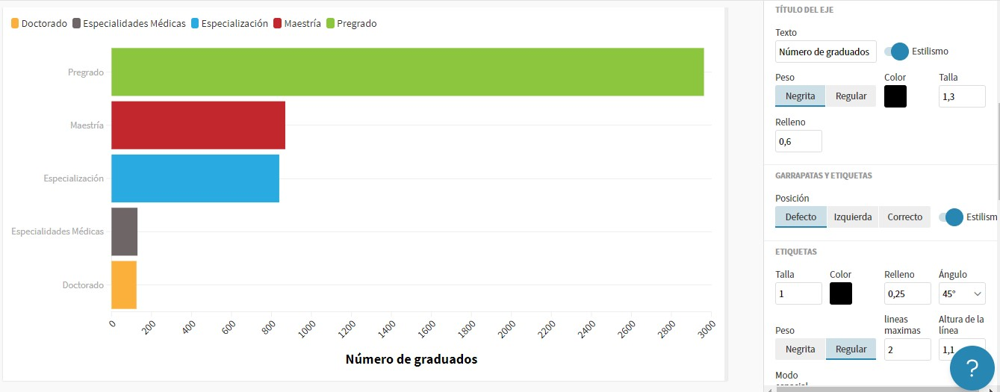
```

7.	Para el eje Y las etiquetas deben tener el mismo estilo, color negro, negrita y tamaño 1; desactive la leyenda, su visualización debe verse de la siguiente manera.

```{r paso7graficobarrasflourish-fig, echo=FALSE, fig.align='center', fig.asp=.75, fig.cap='Formato del eje Y', out.width='85%'}
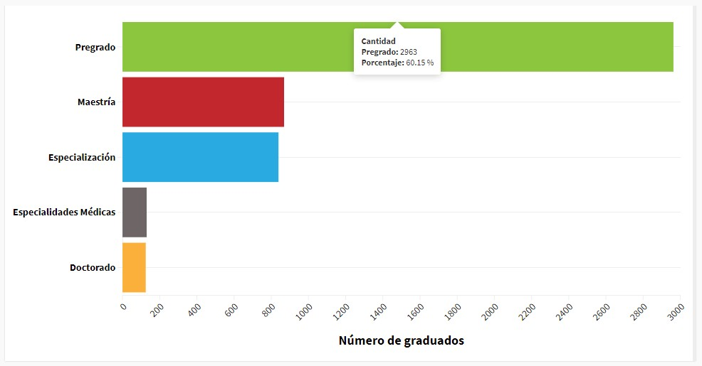
```

8.	Las ventanas emergentes tendrán contenido personalizado con el nivel de formación, el porcentaje y el número de estudiantes graduados. 

```{r paso8graficobarrasflourish-fig, echo=FALSE, fig.align='center', fig.asp=.75, fig.cap='Ventanas emergentes personalizadas', out.width='85%'}
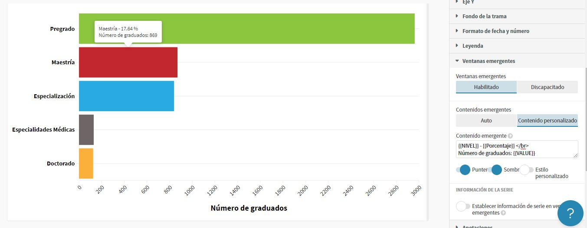
```

9.	Active las fronteras de la visualización como ya se mostró en gráficos anteriores y como título del gráfico debe escribir Distribución de graduados por nivel de formación, periodo 2020-1. 

El gráfico de barras obtenido muestra la distribución del número de estudiantes graduados por nivel de formación para el periodo 

```{r graficobarrasflourish-fig, echo=FALSE, fig.align='center', fig.asp=.75, fig.cap='Distribución de graduados por nivel de formación, periodo 2020-1', out.width='85%'}
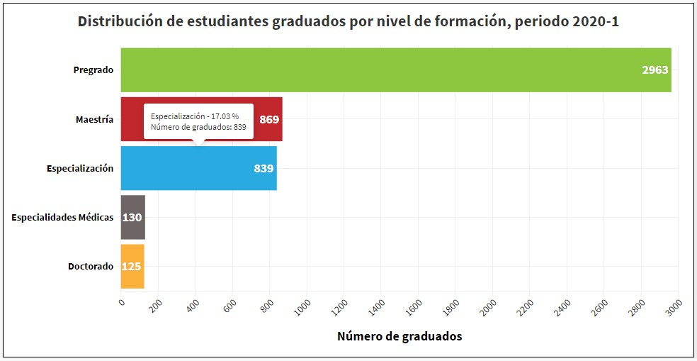
```

#### Mapa de proyección {#mapadeproyecciónflourish}

Esta plantilla permite crear mapas de datos con sombreado de región y/o puntos, dentro de las plantillas disponibles se encuentran algunos continentes divididos por países o regiones y algunos países fraccionado por estados o provincias, también existe una plantilla en blanco para añadir el archivo propio de datos para crear un continente o país que no se encuentre en las plantillas existentes. 

Con el fin de ilustrar las capas que componen este tipo de mapas debe seleccionar la plantilla del mundo ubicada en la parte inferior de la sección mapa de proyección de la galería de plantillas de Flourish.

```{r plantillasmapaproyeccionflourish-fig, echo=FALSE, fig.align='center', fig.asp=.75, fig.cap='Galería de plantillas para mapas de proyección', out.width='85%'}
knitr::include_graphics("Imágenes/flourish51.jpg")
```

Esta plantilla consiste en un mapa mundial de dos capas, la primera de ellas contiene la información geométrica de los países y la segunda dibuja un punto sobre cada país que representa la población de este, también se añade una leyenda de color que identifica la región a la que pertenece cada lugar del mundo, dicha clasificación esta basada en el banco mundial (World bank region); a continuación, se presenta una imagen del ejemplo mencionado.

```{r ejemplomapamundoflourish-fig, echo=FALSE, fig.align='center', fig.asp=.75, fig.cap='Ejemplo de la plantilla mundial', out.width='85%'}
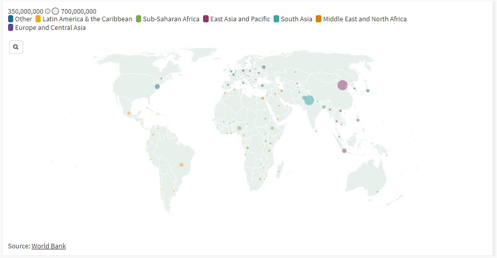
```

Después de observar la visualización creada es momento de analizar la estructura de datos que permite crearla, para esto haga clic sobre la pestaña datos allí encontrara dos secciones o capas la primera de ellas llamada regiones y la segunda puntos. Los datos para ubicar en la capa de región será un archivo tipo GeoJson que debe contener un FeatureCollection y cada elemento debe ser un Polygon o MultiPolygon en coordenadas no proyectadas (WGS84). Cada característica se convertirá en una fila en la hoja de datos con la geometría en la primera columna y las propiedades en las columnas siguientes.

```{r hojaregionesflourish-fig, echo=FALSE, fig.align='center', fig.asp=.75, fig.cap='Hoja de datos para regiones', out.width='85%'}
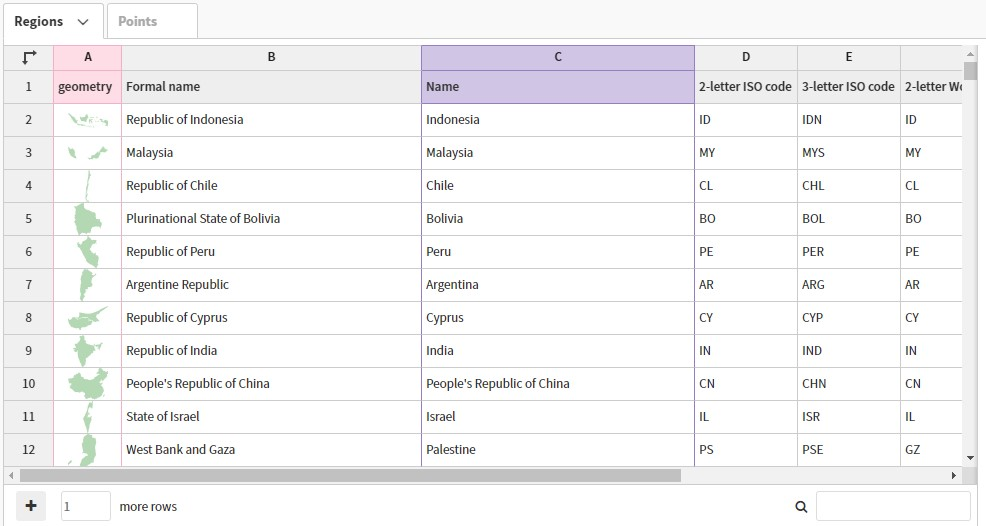
```

La capa de puntos puede ser un archivo Excel o CSV y se requiere una fila por punto con al menos una columna para longitud y otra para latitud ambas deben estar en grados decimales, también es posible añadir más columnas para determinar el tamaño o color de los puntos. 

```{r hojapuntosflourish-fig, echo=FALSE, fig.align='center', fig.asp=.75, fig.cap='Hoja de datos para puntos', out.width='85%'}
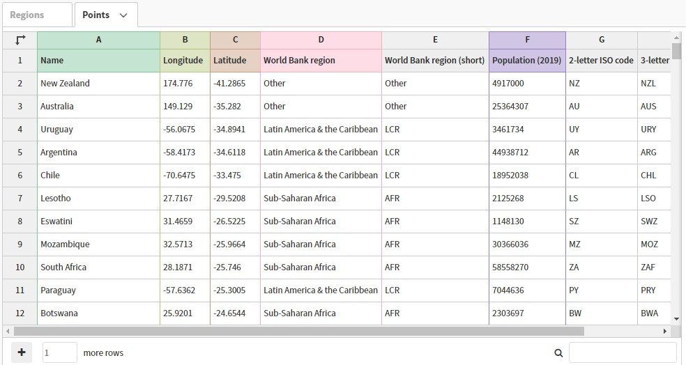
```

Como ya se ha mencionado en varias ocasiones la idea es realizar algunos de los gráficos presentados en la web de las estadísticas oficiales de la Universidad Nacional de Colombia, en la sección cifras generales y graduados se ubican algunos mapas que muestran el lugar de nacimiento por departamento y municipio de los estudiantes graduados en un periodo determinado, en este caso el periodo a trabajar será 2020-1.

El primer mapa para realizar será el que representa el total de graduados por departamentos, para esto es necesario tener un archivo GeoJson con la geometría de cada departamento, este tipo de archivos son fáciles de conseguir en la web y dentro del repositorio donde se crea este documento ya se encuentra un archivo llamado “colombiageo.json”, cabe resaltar que este archivo fue extraído de un [repositorio de GitHub]( https://gist.github.com/john-guerra/43c7656821069d00dcbc), con la ayuda de R se crea una base de datos llamada “deptos” la cual contiene el total de estudiantes graduados por departamento en el periodo 2020-1, luego de esto se carga el archivo “colombiageo.json” y se identifica que la estructura de este es de listas y se agrega una nueva propiedad con el total de graduados que se obtuvo en la base “deptos”, finalmente el archivo modificado es exportado con formato Json y con el nombre “depts.json”.

Uno de los requisitos para realizar mapas con sombreado de regiones es que el archivo GeoJson debe tener coordenadas no proyectadas, para esto se hará uso de la herramienta gratuita [mapshaper]( https://mapshaper.org/), arrastre el archivo “depts.json” a la herramienta mencionada y asegúrese de que la opción seleccionada sea detectar líneas de intersección y haga clic en importar.

```{r importararchivosamapshaper-fig, echo=FALSE, fig.align='center', fig.asp=.75, fig.cap='Importar archivos a Mapshaper', out.width='85%'}
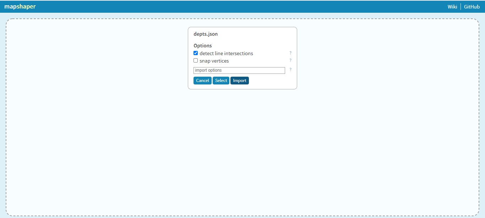
```

Luego de que el archivo sea importado deberá abrir la consola, escribir este comando “-proj wgs84” y presionar el botón enter de su teclado, luego de esto debe hacer clic sobre exportar, seleccionar formato GeoJson y clic sobre el botón exportar.

```{r exportararchivosamapshaper-fig, echo=FALSE, fig.align='center', fig.asp=.75, fig.cap='Exportar archivos de Mapshaper', out.width='85%'}
knitr::include_graphics("Imágenes/flourish56.jpg")
```

Al finalizar el proceso mencionado anteriormente se descarga un archivo con el mismo nombre del que fue importado es decir “depts.json”, este se debe mover al repositorio sobre el cual se trabaja y cambiar el nombre por “departamentos.json” para evitar reemplazar archivos. Es de resaltar que al mostrar este proceso el repositorio ya contiene los archivos usados, es decir que no es necesario repetirlo, pero si debe tenerse en cuenta para el caso de crear otros mapas.

Es momento de volver a Flourish, seleccionar la plantilla en blanco e importar el archivo “departamentos.json” en la sección regiones de la pestaña datos. Las columnas por usar en esta visualización son A, C y G que deben ubicarse en los estantes geometría, nombre y valor respectivamente, estas dos últimas columnas también deben ser asignadas al estante metadatos para ventanas emergentes.

```{r regionesmapadeptosflourish-fig, echo=FALSE, fig.align='center', fig.asp=.75, fig.cap='Carga de datos para la capa de regiones y asignación de columnas', out.width='85%'}
knitr::include_graphics("Imágenes/flourish57.jpg")
```

Nuevamente sobre el archivo “DataFlourish.R” se extraen los municipios con sus respectivas latitudes, longitudes y conteo de estudiantes graduados, luego se crea un vector llamado capitales con el fin de extraer únicamente las capitales de la base municipios, únicamente se seleccionan estas ya que solo se quiere añadir un punto por departamento que representa la capital; dicha base llamada capitales es exportada y luego importada a Flourish en la sección puntos, deberá asignar las columnas A, B y C a los estantes nombre, longitud y latitud respectivamente.

```{r puntosmapadeptosflourish-fig, echo=FALSE, fig.align='center', fig.asp=.75, fig.cap='Carga de datos para la capa de puntos y asignación de columnas', out.width='85%'}
knitr::include_graphics("Imágenes/flourish58.jpg")
```

Ahora debe regresar a la pestaña avance para comenzar a dar formato y personalizar el mapa creado, en este momento su visualización asigno un color a cada municipio dependiendo del conteo de este y posee puntos en color gris oscuro que representan cada capital.

```{r vistapreviamapadeptosflourish-fig, echo=FALSE, fig.align='center', fig.asp=.75, fig.cap='Vista previa del mapa creado', out.width='85%'}
knitr::include_graphics("Imágenes/flourish59.jpg")
```

1.	La primera pestaña por editar será capa de puntos en la cual debe establecer el radio en dos, la opacidad de relleno debe aumentarse a uno y cambiar el color de relleno por “#C9501A”.

```{r paso1mapadeptosflourish-fig, echo=FALSE, fig.align='center', fig.asp=.75, fig.cap='Formato a la capa de puntos', out.width='85%'}
knitr::include_graphics("Imágenes/flourish60.jpg")
```

2.	Continuando con la capa de regiones debe asignar el color “#88AD84” a los contornos, los reflejos de trazo interior y exterior deben estar en color “#E2E4E2”, el ancho del trazo debe reducirse a 1.5.

```{r paso2mapadeptosflourish-fig, echo=FALSE, fig.align='center', fig.asp=.75, fig.cap='Formato a la capa de regiones', out.width='85%'}
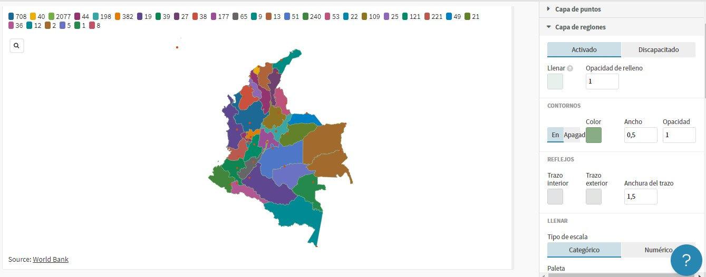
```

3.	Sobre la capa de regiones se ubica una sección llamada llenar la cual se refiere al relleno de cada departamento dentro del mapa, el tipo de escala debe ser numérico, secuencial y binned, el modo de agrupamiento será de umbrales personalizados los cuales son “20; 50; 200; 1000” y se usa una paleta de azules.

```{r paso3mapadeptosflourish-fig, echo=FALSE, fig.align='center', fig.asp=.75, fig.cap='Edición del relleno de regiones', out.width='85%'}
knitr::include_graphics("Imágenes/flourish62.jpg")
```

4.	Debe continuar con la ventana popups y paneles en la cual debe seleccionar contenido emergente personalizado, el encabezado será el nombre del departamento y el contenido será la cantidad de graduados y para la ventana emergente de los puntos no sebe modificar nada.

```{r paso4mapadeptosflourish-fig, echo=FALSE, fig.align='center', fig.asp=.75, fig.cap='Contenido personalizado para ventanas emergentes', out.width='85%'}
knitr::include_graphics("Imágenes/flourish63.jpg")
```

5.	Otra pestaña para editar y personalizar el gráfico es caja de búsqueda, con esta se da formato a la opción de búsqueda; el texto del marcado será “Buscar…” y debe activar las opciones de mostrar sugerencias desplegables y expandir el cuadro de búsqueda.

```{r paso5mapadeptosflourish-fig, echo=FALSE, fig.align='center', fig.asp=.75, fig.cap='Formato a la caja de búsqueda', out.width='85%'}
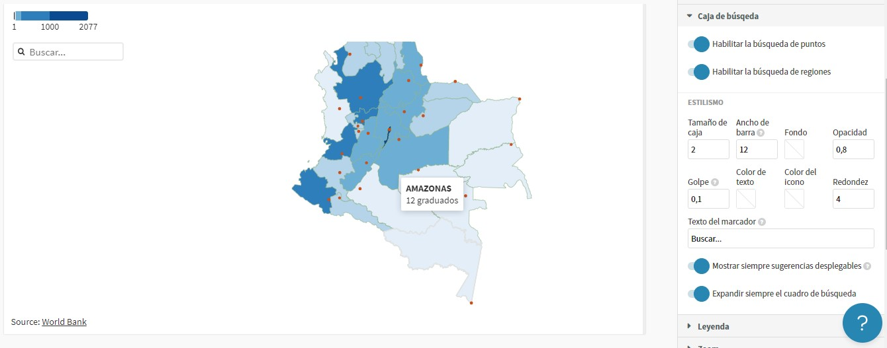
```

6.	Como color de fondo debe asignar “#EFEFEF”, activar las fronteras y ponerlas en color negro, estos ajustes deben hacerse desde la pestaña diseño.

7.	Con ayuda de la pestaña encabezamiento debe escribir “Graduados 2020-1” como título con el tamaño más pequeño posible; por último, el nombre de la visualización será Total por departamentos.

La visualización obtenida permite identificar la cantidad de estudiantes graduados en el periodo 2020-1 según su lugar de nacimiento, a pesar de que el grafico logra ser estético y agradable quedan faltando algunos detalles como etiquetas con el nombre del departamento y su capital.

```{r mapadeptosflourish-fig, echo=FALSE, fig.align='center', fig.asp=.75, fig.cap='Total estudiantes gradaudos por departamento en el periodo 2020-1', out.width='85%'}
knitr::include_graphics("Imágenes/flourish65.jpg")
```
