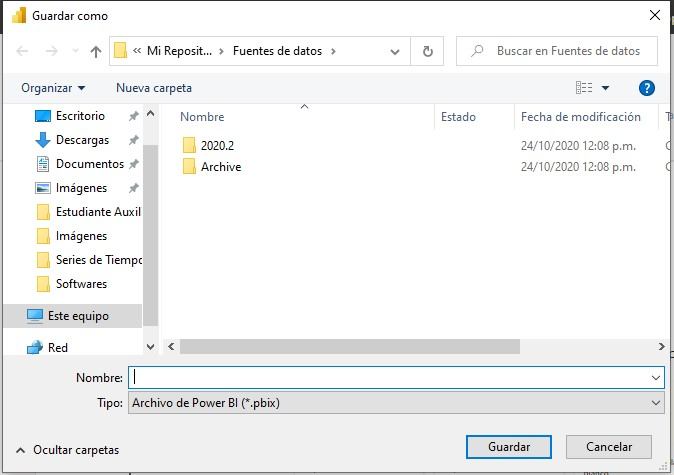
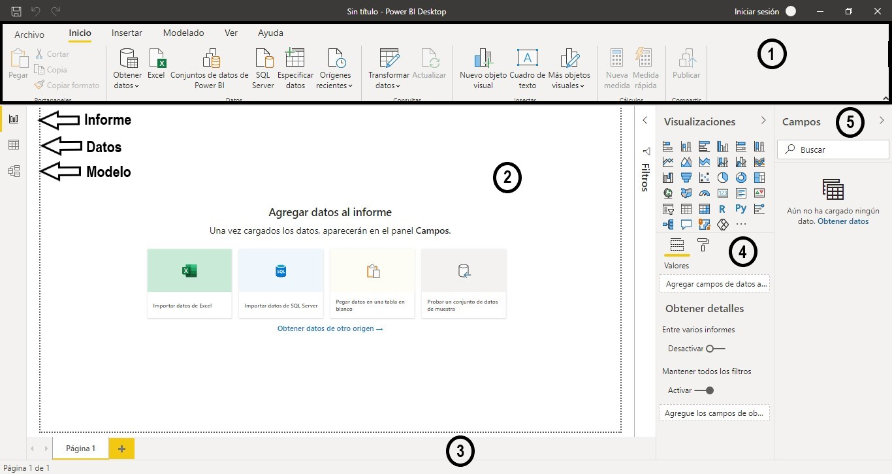
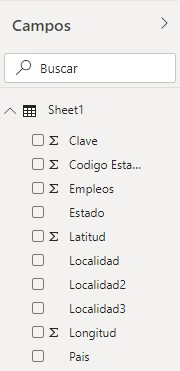
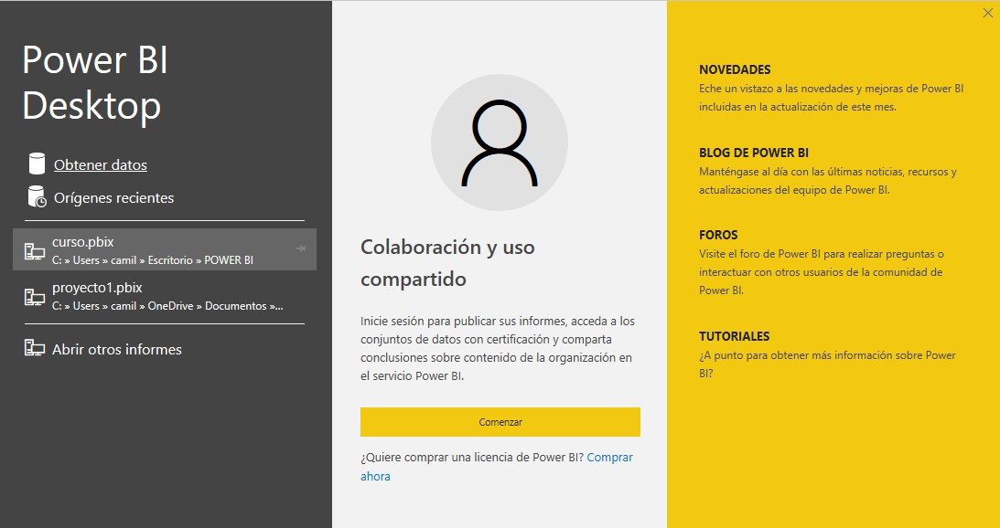

--- 
title: "Softwares para la visualización estadística"
author: "Camila Acosta Ramirez"
date: "`r Sys.Date()`"
site: bookdown::bookdown_site
output: bookdown::gitbook
documentclass: book
bibliography: [book.bib, packages.bib]
biblio-style: apalike
link-citations: yes
---

# Portada{-}

Espacio para la portada ....

<!--chapter:end:index.Rmd-->

# Introduccción {#intro}

You can label chapter and section titles using `{#label}` after them, e.g., we can reference Chapter \@ref(intro). If you do not manually label them, there will be automatic labels anyway, e.g., Chapter \@ref(tableau).

Figures and tables with captions will be placed in `figure` and `table` environments, respectively.

```{r nice-fig, fig.cap='Here is a nice figure!', out.width='80%', fig.asp=.75, fig.align='center'}
par(mar = c(4, 4, .1, .1))
plot(pressure, type = 'b', pch = 19)
```

Reference a figure by its code chunk label with the `fig:` prefix, e.g., see Figure \@ref(fig:nice-fig). Similarly, you can reference tables generated from `knitr::kable()`, e.g., see Table \@ref(tab:nice-tab).

```{r nice-tab, tidy=FALSE}
knitr::kable(
  head(iris, 20), caption = 'Here is a nice table!',
  booktabs = TRUE
)
```

You can write citations, too. For example, we are using the **bookdown** package [@R-bookdown] in this sample book, which was built on top of R Markdown and **knitr** [@xie2015].

<!--chapter:end:01-intro.Rmd-->

# Tableau {#tableau}

## Generalidades {#generalidades}

### ¿Qué es Tableau?

Tableau es una plataforma de análisis visual que transforma la forma en que usamos los datos para resolver problemas, lo que permite a las personas y organizaciones aprovechar al máximo sus datos.  Esta plataforma hace que sea más fácil para las personas explorar y administrar datos, y más rápido para descubrir y compartir información que puede cambiar las empresas y el mundo, todo lo creado por esta plataforma esta impulsado por ayudar a las personas a ver y comprender los datos, porque sus productos están diseñados para poner al usuario en primer lugar, ya sea un analista, un científico de datos, un estudiante, un profesor, un ejecutivo o un usuario empresarial. Desde la conexión hasta la colaboración, Tableau es la plataforma de análisis de un extremo a otro más potente, seguro y flexible. 

Tableau se fundó en 2003 como resultado de un proyecto de informática en Stanford que tenia como objetivo mejorar el flujo de análisis y hacer que los datos fueran más accesibles para las personas a través de la visualización. Los cofundadores Chris Stolte, Pat Hanrahan y Christian Chabot desarrollaron y patentaron la tecnología fundamental de Tableau, VizQL, que expresa visualmente los datos al traducir las acciones de arrastrar y soltar en consultas de datos a través de una interfaz intuitiva. Desde su fundación han invertido continuamente en investigación y desarrollo, creando así soluciones para ayudar a cualquier persona que trabaje con datos a obtener respuestas más rápido y descubrir información no anticipada, este desarrollo e investigación incluye hacer que el aprendizaje automático, las estadísticas, el lenguaje natural y la preparación inteligente de datos sean más útiles para aumentar la creatividad humana en el análisis. 

### Principales ventajas de Tableau

-	Puedes ver y entender tus datos

Es la misión de la compañía, “ayudar a las personas a ver y comprender sus    datos”. Con Tableau está cambiando la forma en la que las personas resuelven  sus preguntas, analizando sus datos de forma rápida, sencilla y visual.
Tableau es una herramienta revolucionaria que está permitiendo acceder y      analizar los datos -que son el petróleo del siglo XXI- a todas las personas,       democratizando el análisis de datos de forma visual.

-	Adaptable a diferentes situaciones y entornos 

Existen diversas formas de utilizar Tableau, de forma individual puede utilizar Tableau Desktop en su ordenador para diseñar las visualizaciones de datos.
Si necesita un entorno para organizaciones o empresas, Tableau Server ofrece un entorno colaborativo y seguro al que puede acceder simplemente con un navegador web. También existe Tableau Online que es equivalente, pero toda la plataforma funciona en la nube de Tableau, sin necesidad de tener infraestructura propia.

- Rápido y fácil, es posible utilizar Tableau para:
    * Crear dashboards e informes visuales.
    * Navegar y visualizar datos de múltiples formas.
    * Tener un autoservicio de BI.
    * Realizar algunos análisis estadísticos, ver tendencias y pronósticos.

No es complejo de utilizar ya que Tableau está diseñado para que sea fácil de usar, enfocado al autoservicio y no requiere de usuarios técnicos.

-	Es compatible con múltiples fuentes de datos, Tableau soporta diferentes fuentes de datos y puede conectar a más de 40 diferentes, algunos ejemplos son:
    * Ficheros Excel, CSV, PDF, etc.
    * Bases de datos relacionales como SQL Server, MySQL, etc.
    * Fuentes OLAP como Microsoft Analysis Services, SAP Hana, etc.
    * Fuentes online como Google Analytics, etc.
    * Conectores a servicios web.


- Juegue con sus bases de datos: 

Además de conectarse a fuentes de datos diferentes, en Tableau puede conectarse a diferentes vistas de datos a la vez, crear extracciones, hacer transformaciones, unir y dividir datos, combinar diferentes fuentes de datos, crear grupos y conjuntos, etc.

-	No necesita programar: 

Todas las funcionalidades de Tableau funcionan con arrastrar y soltar, incluso la creación de cálculos (que tienen su propio asistente de ayuda) puede hacerlas así, simplemente con el ratón.
Eso no quita que, si lo desea, pueda integrar y utilizar Tableau con herramientas y lenguajes más complejos como Python o R para la analítica de datos.

- Tiene una comunidad enorme:

En Internet es posible encontrar multitud de usuarios que comparten su trabajo y aprender de ellos, ver y compartir visualizaciones en las galerías de [Tableau Public](https://public.tableau.com/en-us/s/), formarse en la plataforma gratuita de [Tableau Training](https://www.tableau.com/learn/training/20203), resolver dudas en [Tableau Community](https://community.tableau.com/s/), conocer a otros usuarios en los [Tableau User Group](https://usergroups.tableau.com/).

### Principales desventajas de Tableau

- Se requiere preparación de datos inicial.
- Las características pueden parecer demasiado especializadas y restrictivas, ya que Tableau esta diseñado para un uso más amplio. 
- Aunque es excelente para fines analíticos, no puede reemplazar las aplicaciones de informes financieros. 	
- Brinda la capacidad de establecer seguridad de “nivel bajo” en el nivel de datos, pero lo implementa de una manera un poco precaria. 
- Tableau se ha especializado en el factor de facilidad de uso. Sin embargo, a medida que los usuarios van obteniendo habilidades y experiencia desean hacer más, y Tableau posee una capacidad limitada de ampliación que no siempre les permite ir a donde desean.
- Los usuarios especializados en herramientas de Inteligencia Empresarial suelen considerar mejor contar con una arquitectura abierta. 

### Productos de Tableau

-	[Tableau Public](https://public.tableau.com/en-us/s/): es una plataforma gratuita en línea para explorar visualizaciones de datos y compartir con el público general.
    * Las visualizaciones publicadas en Tableau Public están disponibles para consultarlas en línea, es una plataforma de datos públicos. 
    * No es posible guardar visualizaciones localmente.
    * Solo es posible la Conexión a archivos CSV, Excel, y archivos de texto.
    * No es posible cargar más de 15 millones de filas. 
    * No permite conexión en tiempo real con los datos, solo es posible la conexión por medio de extracción. 
    * [Recursos de aprendizaje guiados](https://public.tableau.com/es-es/s/resources). 
    * [Desafíos virtuales](https://public.tableau.com/es-es/s/resources).
    * [Datos de muestra](https://public.tableau.com/es-es/s/resources).

-	[Tableau Desktop](https://www.tableau.com/products/desktop): es la versión profesional, de escritorio y paga de Tableau.
    * Las visualizaciones se pueden guardar de manera local. 
    * Cantidad ilimitada de datos.
    * Conexión a todas las fuentes de datos, tanto locales como en la nube.

- [Tableau Prep](https://www.tableau.com/trial/tableau-prep?utm_campaign_id=2017049&utm_campaign=Prospecting-CORE-ALL-ALL-ALL-ALL&utm_medium=Paid+Search&utm_source=Google+Search&utm_language=EN&utm_country=RoLAC&kw=%2Btableau%20%2Bprep&adgroup=CTX-Brand-Tableau+Prep-EN-B&adused=335523927259&matchtype=b&placement=&gclid=CjwKCAjw0On8BRAgEiwAincsHMNUqIicWtve96Be3NVOstpKxXYHS87VxJn-dxW5W3dLcqPzrbZDjRoClTkQAvD_BwE&gclsrc=aw.ds): proporciona una forma visual y directa de combinar, dar forma y limpiar datos, así como automatizar los flujos de preparación de datos, lo que le ayuda a obtener análisis y conocimientos más rápidamente, se compone de dos productos:
    * Tableau Prep Builder para crear sus flujos de datos. Si desea editar un valor, seleccione y edite directamente. Cambie su tipo de unión y vea el resultado de inmediato. Con cada acción, ve instantáneamente cambiar sus datos, incluso en millones de filas de datos. Tableau Prep Builder le brinda la libertad de reordenar los pasos y experimentar sin consecuencias. Utilice funciones inteligentes para solucionar problemas comunes de preparación de datos. Tableau Prep Builder emplea agrupaciones difusas para convertir tareas repetitivas, como agrupar por pronunciación, en operaciones de un solo clic.
    * Tablear Prep Conductor permite publicar y ejecutar flujos fácilmente en su entorno de servidor. Comparta sus fuentes de datos de forma segura con Tableau Server o Tableau Online. Cree un entorno en el que todos los miembros de su organización puedan trabajar con datos preparados y actualizados.

- [Tableau Server](https://www.tableau.com/trial/tableau-server?utm_campaign_id=2017049&utm_campaign=Prospecting-PROD-ALL-ALL-ALL-ALL&utm_medium=Paid+Search&utm_source=Google+Search&utm_language=EN&utm_country=RoLAC&kw=tableau%20server&adgroup=CTX-Brand-Tableau+Server-EN-E&adused=335523921559&matchtype=e&placement=&gclid=CjwKCAjw0On8BRAgEiwAincsHCZqPLQEPe2h4IAzln5xZCifMpCslooGEQsI1lydcdCjsnXsw-JCSxoCdqgQAvD_BwE&gclsrc=aw.ds): servidor que permite colaborar de forma segura y compartir la información a partir de los datos que ya han sido cargados a través de Tableau Desktop.

- [Tableau Online](https://www.tableau.com/trial/tableau-online?utm_campaign_id=2017049&utm_campaign=Prospecting-PROD-ALL-ALL-ALL-ALL&utm_medium=Paid+Search&utm_source=Google+Search&utm_language=EN&utm_country=RoLAC&kw=tableau%20online&adgroup=CTX-Brand-Tableau+Online-EN-E&adused=335550600371&matchtype=e&placement=&gclid=CjwKCAjw0On8BRAgEiwAincsHKCBtZUhZ2zpL8R-ozsGupggrrqr_lCJBaOS-znSXDBANWonewDlDBoCBKEQAvD_BwE&gclsrc=aw.ds): se trata de una versión de Tableau Server alojada en la nube que permite acceder a los datos sin necesidad de hacer instalaciones. 

- [Tableau Mobile](https://www.tableau.com/products/mobile): es una aplicación complementaria gratuita para Tableau Server o Tableau Online que permite un acceso a los datos y la información guardada en su cuenta.

### Precios de Tableau 

- Para individuos existe “Creador de Tableau”, tiene un costo de $70 USD por usuario mensual. Incluye Tableau Desktop, Tableau Prep Builder y una licencia de Creator en Tableau Server o Tableau Online.

- Para equipos y organizaciones: Se tiene la opción de implementar con Tableau Server o implementar con Tableau Online, ambas implementaciones requieren al menos un usuario Creador de Tableau y proporcionan la opción de elegir entre dos roles de usuario, pero varían en los precios.
    * Implementación con Tableau Server:
        * Creador de Tableau, tiene un costo de $70 USD por usuario mensual. Incluye Tableau Desktop, Tableau Prep Builder y una licencia de creador en Tableau Server.
        * Explorador de Tableau, permite explorar datos confiables y responder sus propias preguntas más rápido con análisis completos de autoservicio, tiene un costo de $35 USD por usurario mensual y se requieren mínimo 5 exploradores. Incluye una licencia de Explorer de Tableau Server.
        * Visor de Tableau, permite ver e interactuar con paneles y visualizaciones en una plataforma segura y fácil de usar, posee un costo de $12 USD por usuario mensual y se requieren mínimo 100 espectadores. Incluye una licencia de Viewer de Tableau Sever.
        
    * Implementación con Tableau Online:
        * Creador de Tableau, permite al usuario descubrir información valiosa con un potente conjunto de productos que respaldan su flujo de trabajo de análisis de un extremo a otro, tiene un costo de $70 USD por usuario mensual. Incluye Tableau Desktop, Tableau Prep Builder y una licencia de Creator en Tableau Online.
        * Explorador de Tableau, permite explorar datos confiables y responder sus propias preguntas más rápido con análisis completos de autoservicio, tiene un costo de $42 USD por usurario mensual y se requieren mínimo 5 exploradores. Incluye una licencia de Explorer de Tableau Online. 
        * Visor de Tableau, permite ver e interactuar con paneles y visualizaciones en una plataforma segura y fácil de usar, posee un costo de $15 USD por usuario mensual y se requieren mínimo 100 espectadores. Incluye una licencia de Viewer de Tableau Online.

Para mayor información acerca de los precios puede visitar [Tableau Pricing](https://www.tableau.com/pricing/individual).

### Compartir el trabajo realizado en Tableau {#compartirtrabajo}

Cuando se usa Tableau Desktop, hay varias formas de guardar y compartir el trabajo realizado:

1. Guardar automáticamente un libro de trabajo: Tableau Desktop guarda automáticamente el trabajo realizado cada pocos minutos; por lo que no se perderán horas de trabajo si Tableau Desktop se cierra inesperadamente. Esta función está habilitada de forma predeterminada.
Si Tableau falla, se crea automáticamente una versión recuperada del libro de trabajo con una extensión $.twbr$ y se guarda en la misma ubicación que el archivo original o en su carpeta Mi repositorio / libros de Tableau. Los libros de trabajo nuevos se guardan con el nombre "Libro1" más un ID numérico. Cuando vuelve a abrir Tableau, un cuadro de diálogo de recuperación muestra una lista de los archivos recuperados que puede seleccionar y abrir para continuar en su flujo.

2. Guardar un libro de trabajo: cuando abre Tableau Desktop, crea automáticamente un nuevo libro de trabajo. Los libros de trabajo contienen el trabajo que crea y constan de una o más hojas de trabajo. Cada hoja de trabajo contiene una vista particular de sus datos. Para guardar un libro de trabajo de Tableau:
    * Seleccione Archivo > Guardar.
    * Especifique el nombre del archivo del libro de trabajo en el cuadro de
    diálogo Guardar como.
    De forma predeterminada, Tableau guarda el archivo con la extensión .twb.
    también guarda su libro de trabajo en la carpeta
    Libros de trabajo de su repositorio Mi Tableau. Puede encontrar este
    repositorio en su carpeta Documentos. Sin embargo, puede guardar los
    libros de trabajo de Tableau en cualquier directorio que elija.
    * Para guardar una copia de un libro de trabajo que tiene abierto:
        * Seleccione Archivo > Guardar como y guarde el archivo con un nombre
        nuevo.
        
3. Guardar un libro de trabajo empaquetado: estos libros de trabajo contienen el libro de trabajo junto con una copia de cualquier fuente de datos de archivo local e imágenes de fondo. El libro de trabajo ya no está vinculado a las imágenes y las fuentes de datos originales. Estos libros de trabajo se guardan con una extensión de archivo .twbx. Otros usuarios pueden abrir el libro de trabajo empaquetado con Tableau Desktop o Tableau Reader y no necesitan acceder a las fuentes de datos que incluye el libro de trabajo.

4. Guardar un marcador: puede guardar una sola hoja de trabajo como marcador de Tableau. Cuando guarda el marcador, Tableau crea una instantánea de la hoja de trabajo. Se puede acceder a los marcadores desde cualquier libro utilizando el menú Marcadores. Cuando abre una hoja de trabajo marcada como favorita, agrega la hoja de trabajo a su libro de trabajo en el estado en que estaba cuando se marcó. Nunca se actualizará ni cambiará automáticamente. Los marcadores son convenientes cuando tiene hojas de trabajo que usa con frecuencia. Para guardar un marcador de Tableau:
    * Seleccione Archivo > Marcador > Crear marcador.
    * Especifique el nombre y la ubicación del archivo de marcador en el
    cuadro de diálogo Crear marcador.
    
Tableau guarda el archivo con la extensión .tbm. La ubicación predeterminada es la carpeta Marcadores en el repositorio de Tableau. Sin embargo, puede guardar marcadores en cualquier ubicación que elija. Los marcadores que no están almacenados en el repositorio de Tableau no aparecen en el menú Marcador.

Es posible compartir libros de trabajo y marcadores con sus compañeros de trabajo, siempre que puedan acceder a las fuentes de datos relevantes que utiliza el libro de trabajo. Si sus compañeros de trabajo no tienen acceso a las fuentes de datos, puede guardar un libro de trabajo empaquetado.

Los campos personalizados como medidas agrupadas, campos calculados, grupos y conjuntos se guardan con libros de trabajo y marcadores.

5. Libros de trabajo empaquetados: estos libros contienen el libro de trabajo junto con una copia de cualquier fuente de datos de archivo local e imágenes de fondo. El libro de trabajo ya no está vinculado a las imágenes y las fuentes de datos originales. Estos libros de trabajo se guardan con una extensión de archivo .twbx. Otros usuarios pueden abrir el libro de trabajo empaquetado con Tableau Desktop o Tableau Reader.
   * Cree un .twbx con fuentes de datos basadas en archivos
       1. Seleccione Archivo> Guardar como.
       2. Especifique un nombre de archivo para el libro empaquetado en el
       cuadro de diálogo Guardar como.
       3. Seleccione Libros de trabajo empaquetados de Tableau en la lista
       desplegable Guardar como tipo.
       4.	Haga clic en Guardar.
      La ubicación predeterminada es la carpeta Workbooks del repositorio de        Tableau. Sin embargo, puede guardar libros de trabajo empaquetados en         cualquier directorio que elija.
      
      Los siguientes archivos se incluyen en los libros de trabajo                  empaquetados:
       * Imágenes de fondo.
       * Geocodificación personalizada.
       * Formas personalizadas.
       * Archivos de cubo locales.
       * Archivos de Microsoft Access.
       * Archivos de Microsoft Excel.
       * Archivos de extracción de Tableau (.hyper o .tde).
       * Archivos de texto (.csv, .txt, etc.)
    * Cree un .twbx con fuentes de datos no basadas en archivos,
    si el libro de trabajo contiene conexiones a fuentes de datos 
    empresariales u otras fuentes de datos no basadas en archivos, como 
    Microsoft SQL, Oracle o MySQL, los datos deben extraerse de las fuentes de
    datos para que se incluyan en un libro de trabajo empaquetado (.twbx).
       1. En el libro de trabajo, haga clic con el botón derecho en la fuente
       de datos en el panel Datos y elija Extraer datos. 
       2. En el cuadro de diálogo Extraer datos, haga clic en el botón Extraer
       para extraer todos los datos de la fuente de datos. Una vez que se
       completa la extracción, el icono de la fuente de datos cambia para
       indicar que hay una extracción activa para esa fuente de datos. En
       lugar de un solo cilindro, hay dos cilindros conectados por una flecha.
       3. Opcional: repita los pasos anteriores para cada fuente de datos en
       el libro de trabajo.
       4. Seleccione Archivo > Guardar como.
       5. En el menú desplegable Guardar como tipo , seleccione Libro de
       trabajo empaquetado de Tableau (*.twbx).
Una vez que se hayan creado los extractos para todas las fuentes de datos no basadas en archivos y se haya guardado el libro de trabajo empaquetado, puede enviar su libro de trabajo.
    * Cree un .twbx con fuentes de datos de Tableau Server, si el libro de trabajo contiene conexiones a una fuente de datos de Tableau Server publicada, debe descargar una copia local de la fuente de datos de Tableau Server, tomar un extracto y luego reemplazar la conexión a la copia local para que se incluya en un libro de trabajo empaquetado (.twbx).
        1. En el libro de trabajo, haga clic con el botón derecho en la fuente de datos publicada en el panel Datos y luego seleccione Crear copia local. Se agrega una copia de la fuente de datos publicada al panel Datos.
        2. Haga clic con el botón derecho en la copia local y seleccione Extraer datos.
        3. En el cuadro de diálogo Extraer datos, haga clic en el botón Extraer para extraer todos los datos de la fuente de datos. La creación de un extracto de la fuente de datos le permite a la persona con la que está compartiendo el libro tener acceso a una copia de la fuente de datos.
        4. En el panel Datos, haga clic con el botón derecho en la fuente de datos publicada y luego seleccione Reemplazar fuente de datos.
        5. Verifique que la fuente de datos publicada sea reemplazada por la fuente de datos local y luego haga clic en Aceptar.
        6. Haga clic con el botón derecho en la fuente de datos publicada y luego haga clic en Cerrar.
        7. Seleccione Archivo > Guardar como.
        8. En el menú desplegable Guardar como tipo, seleccione Libro de trabajo empaquetado de Tableau (*.twbx).
   * Desempaquetar un .twbx, los libros empaquetados se pueden descomprimir.
   En una computadora con Windows o macOS, cambie el nombre del archivo con
   una extensión .zip (por ejemplo, de myfile.twbx a myfile.zip) y luego haga
   doble clic en él.
   Cuando desempaqueta un libro de trabajo, obtiene un archivo de libro de trabajo normal (.twb), junto con una carpeta que contiene las fuentes de datos y las imágenes que se empaquetaron con el libro de trabajo.
   
Hay varias formas de obtener vistas y libros de trabajo de Tableau Desktop y convertirlos en una presentación, informe o página web. 

- Copiar una vista como imagen, puede copiar rápidamente una vista individual como una imagen y pegarla en otra aplicación, como Microsoft Word o Excel. Si usa Tableau Desktop en macOS, se copia una imagen TIFF (formato de archivo de imagen con etiquetas) al portapapeles. En Windows, se copia una imagen BMP (mapa de bits).
    1. Seleccione Hoja de trabajo > Copiar > Imagen.
    2. En el cuadro de diálogo Copiar imagen, seleccione los elementos que desea incluir en la imagen. Si la vista contiene una leyenda, en Opciones de imagen, seleccione el diseño de la leyenda.
    3. Haga clic en Copiar.
    4. Abra la aplicación de destino y pegue la imagen del portapapeles.
    
- Exportar una vista como un archivo de imagen, para crear un archivo de imagen que pueda reutilizar, exporte la vista en lugar de copiarla. Puede elegir el formato BMP, JPEG o PNG en macOS.
    1. Seleccione Hoja de trabajo > Exportar > Imagen. 
    2. En el cuadro de diálogo Exportar imagen, seleccione los elementos que desea incluir en la imagen. Si la vista contiene una leyenda, en Opciones de imagen, seleccione el diseño de la leyenda.
    3. Haga clic en Guardar.
    4. En el cuadro de diálogo Guardar imagen, especifique la ubicación, el nombre y el formato del archivo. Luego haga clic en Guardar.
    
- Exportar como una presentación de PowerPoint, cuando exporta un libro a formato de Microsoft PowerPoint, las hojas seleccionadas se convierten en imágenes PNG estáticas en diapositivas independientes. Si exporta una hoja de historia, todos los puntos de la historia se exportan como diapositivas independientes. Todos los filtros aplicados actualmente en Tableau se reflejan en la presentación exportada. Para exportar un libro a PowerPoint:
    1. Seleccione Archivo > Exportar como PowerPoint.
    2. Seleccione las hojas que desea incluir en la presentación. (También se pueden incluir hojas ocultas). El archivo de PowerPoint exportado refleja el nombre de archivo de su libro y la diapositiva de título indica el nombre del libro y la fecha en que se generó.
    
- Exportar a PDF, para crear un archivo basado en vectores que incorpore las fuentes de Tableau, imprima en PDF. Después de personalizar el diseño de los elementos de la página mediante el cuadro de diálogo Archivo > Configurar página, elija Archivo > Imprimir en PDF.

Al crear, editar e interactuar con vistas en Tableau Server o Tableau Online, existen formas diferentes de guardar su trabajo:

1. Guardar un libro de trabajo: cuando crea un libro de trabajo nuevo o edita un libro de trabajo existente en Tableau Server o Tableau Online, puede guardar su trabajo en cualquier momento. Para guardar un libro de trabajo:
    * En el modo de edición web, seleccione Archivo > Guardar.
    
2. Guardar una copia de un libro de trabajo: a veces, no desea sobrescribir una vista existente con sus cambios. En casos como estos, puede guardar una copia de un libro de trabajo existente. Cuando hace esto, el libro de trabajo existente permanece sin cambios y se crea una copia para que pueda editarlo como desee. Para guardar una copia de un libro de trabajo:
    * En el modo de edición web, seleccione Archivo > Guardar como.
    * En el cuadro de diálogo Guardar libro de trabajo que se abre, haga lo
    siguiente:
        * Para el nombre: introduzca un nombre para el libro.
        * Para proyecto: seleccione el proyecto en el que le gustaría guardar
        el libro de trabajo.
    * Haga clic en Guardar.
    
3. Guardar cambios como una vista personalizada: una vista personalizada no cambia la original, pero está relacionada con ella. Si la vista original se actualiza o se vuelve a publicar, la vista personalizada también se actualiza. También puede elegir si sus vistas personalizadas son visibles para otros usuarios (públicas) o solo para usted (privadas).

Cuando se usa Tableau Public solo se tiene la opción de guardar el libro de trabajo en el repositorio público, para el cual debe seguir estos pasos:

   1. Con su libro de trabajo abierto en Tableau Desktop Public Edition, seleccione Archivo > Guardar en Tableau Public como...
   
```{r guardar1-fig, echo=FALSE, fig.align='center', fig.asp=.75, fig.cap='Guardar trabajo', out.width='40%'}
knitr::include_graphics("Imágenes/imagen1.png")
```   
   
   2. Inicie sesión con su cuenta de Tableau Public. Si no tiene una cuenta, seleccione el enlace para crear una nueva.
   
```{r iniciosesion-fig, echo=FALSE, fig.align='center', fig.asp=.75, fig.cap='Iniciar sesión', out.width='60%'}
knitr::include_graphics("Imágenes/imagen5.JPG")
```    
  
   3. Escriba un nombre para el libro y haga clic en Guardar. Cuando guarda un libro de trabajo en Tableau Public, el proceso de publicación crea un extracto de la conexión de datos.
   
```{r nombrelibro-fig, echo=FALSE, fig.align='center', fig.asp=.75, fig.cap='Asignar nombre al libro de trabajo', out.width='60%'}
knitr::include_graphics("Imágenes/Imagen3.png")
``` 
   
   4. Una vez publicado el libro de trabajo, se le redirige a su cuenta en el sitio web de Tableau Public.(El enlace se abre en una nueva ventana).
   5. Una vez en el sitio web de la visualización haga clic en el botón con el icono de compartir y copie el enlace para agregarlo en el sitio web o donde desee publicar el trabajo. 
   
```{r compartir-fig, echo=FALSE, fig.align='center', fig.asp=.75, fig.cap='Compartir trabajo', out.width='40%'}
knitr::include_graphics("Imágenes/Imagen4.png")
``` 

Para obtener más información acerca de los pasos de publicación del trabajo puede visitar [Ayuda de Tableau](https://help.tableau.com/current/pro/desktop/en-us/save_savework.htm).

## Instalación de Tableau Desktop Public

El proceso de instalación de la versión de escritorio de Tableau Public se realiza mediante los siguientes pasos:

   1. Dirigirse a la página principal de [Tableau Public](https://public.tableau.com/en-us/s/), ingrese un correo electrónico con el cual quiere vincular su descarga y cuenta de Tableau Public, luego clic en "DOWNLOAD THE APP", inmediantamente se inicia la descarga.
   
```{r descargapublic-fig, echo=FALSE, fig.align='center', fig.asp=.75, fig.cap='Descarga de Tableau Public', out.width='80%'}
knitr::include_graphics("Imágenes/descargapublic.JPG")
```
   
   2. Una vez se complete la descarga abra el archivo, lea los términos de licencia, seleccione "He leído y acepto los términos de acuerdo de licencia" y finalmente clic en "Instalar".

```{r descarga2-fig, echo=FALSE, fig.align='center', fig.asp=.75, fig.cap='Descarga de Tableau Public', out.width='60%'}
knitr::include_graphics("Imágenes/descarga2.JPG")
```

   3. Cuando términe el proceso de instalación se creará un acceso directo en el escirtorio a la aplicación, una vez creadas las visualizaciones puede continuar con el proceso de publicación del trabajo mostrado en la sección \@ref(compartirtrabajo). 

## Forma de navegación {#formadenavegacion}

Al momento de abrir Tableau esta es la pantalla con la que se encuentra, en el panel del lateral izquierdo encontrará el tipo de fuentes a las que se puede conectar, en la parte central se ubican los proyectos que ya se han realizado usando este software, en el panel lateral derecho encuentra videos paso a paso sobre conexión a datos y realización de gráficos, en la parte inferior de este panel encontrara visualizaciones alojadas en la galería de Tableau, conjunto de datos de muestra y capacitaciones.  

```{r paginaprincipal-fig, echo=FALSE, fig.align='center', fig.asp=.75, fig.cap='Página principal de Tableau', out.width='90%'}
knitr::include_graphics("Imágenes/Interfaz1.JPG")
```

Sin conectarse a alguna fuente de datos puede hacer clic en el icono de Tableau que se encuentra debajo de la pestaña archivo, se abrirá la siguiente pantalla:

```{r ventanacreacion-fig, echo=FALSE, fig.align='center', fig.asp=.75, fig.cap='Área de trabajo', out.width='90%'}
knitr::include_graphics("Imágenes/Interfaz2.JPG")
```

Esta es la ventana donde se pueden crear todas las visualizaciones, en la esquina superior izquierda se encuentra el nombre del libro de trabajo, recuerde que un libro de trabajo puede incluir hojas, dashboard o historias, después de esto se encuentran varias pestañas que permiten abrir libros de trabajo anteriores o guardar el trabajo que se está creando, permite conectarse a nuevas fuentes de datos, crear hojas de trabajo dashboard e historias, editar formatos de mapas y ventanas, y finalmente una pestaña de ayuda, en la cual encontrara soporte, configuraciones de idioma y capacitaciones. 
Luego esta ubicada la barra de herramientas esta contiene diferentes botones como el icono de Tableau que permite navegar hacia la página de inicio que se muestra en la figura \@ref(fig:paginaprincipal-fig), posee botones de deshacer y rehacer, guardar y conectar a una nueva fuente de datos, también posee botones para agregar, duplicar o eliminar hojas de trabajo, intercambiar medidas, organizar de forma descendente o ascendente, opciones de texto, de tamaño y para ocultar o visualizar tarjetas. 

En el panel lateral izquierdo en la pestaña datos encontrara el nombre de la fuente de datos con la que tiene conexión, en la parte tabla se ubican el nombre de todas las variables que contenga la base de datos, estas variables se dividen en  dimensiones y medidas, con dimensiones se refiere a todas las variables categóricas que contenga la base y medidas se refiere a las columnas con datos numéricos, estos dos tipos de variables son las que se arrastran al lienzo en blanco que se encuentra en la mitad de la pantalla para crear las visualizaciones. Si en los datos subyacentes no se incluyen todos los campos que necesita para responder a las preguntas, puede crear nuevos campos en Tableau usando cálculos y luego guardarlos como parte de la fuente de datos. Estos campos se llaman campos calculados. También existe la posibilidad de crear conjuntos, que son campos personalizados que se crean a partir de dimensiones y especificaciones realizadas por el usuario, a demás de estos tipos de datos ya mencionados existen los parámetros que son valores que pueden usarse como marcadores de posición en fórmulas, o sustituir valores constantes en campos calculados y filtros. En la pestaña Análisis se ubican opciones para agregar líneas constantes, de promedio, diagramas de cajas y bigotes, pronósticos de líneas de tendencia y otros elementos a la vista, las opciones de esta pestaña se muestran en la figura \@ref(fig:analisis-fig), algunas de estas opciones serán exploradas en la sección \@ref(analisisdedatos).

```{r analisis-fig, echo=FALSE, fig.align='center', fig.asp=.75, fig.cap='Opciones del panel análisis', out.width='20%'}
knitr::include_graphics("Imágenes/Interfaz4.JPG")
```
Al lado derecho del panel lateral que se describió anteriormente se encuentran los estantes Páginas, Filtro y la tarjeta Marcas. El estante Páginas permite dividir una vista en una serie de páginas para que pueda analizar mejor cómo un campo específico afecta al resto de los datos en una vista. Cuando coloca una dimensión en el estante Páginas, está añadiendo una nueva fila por cada miembro de la dimensión. Cuando coloca una medida en el estante Páginas, Tableau convierte la medida automáticamente en una medida discreta. El estante Filtros le permite especificar qué datos incluir y excluir, puede filtrar los datos usando medidas, dimensiones o ambas al mismo tiempo. Finalmente se encuentra La tarjeta Marcas que es un elemento fundamental del análisis visual en Tableau. Al arrastrar campos a distintas propiedades en la tarjeta Marcas, puede añadir contexto y detalles a las marcas de la vista, esta tarjeta sirve para definir el tipo de marca, esto se refiere a la forma de los datos en la visualización, las marcas disponibles se muestran en la figura \@ref(fig:marcas-fig), también es posible el color, el tamaño, la forma, el texto y los detalles de los datos. 
```{r marcas-fig, echo=FALSE, fig.align='center', fig.asp=.75, fig.cap='Opciones de marca', out.width='20%'}
knitr::include_graphics("Imágenes/Interfaz3.JPG")
```

En la parte central se encuentran ubicados los estantes Columnas y Filas, estos permiten dominar el eje X y Y respectivamente. El estante Columnas crea las columnas de una tabla, mientras que el estante Filas crea las filas. Puede colocar todos los campos que quiera en estos estantes.
Al colocar una dimensión en los estantes Filas o Columnas, se crean los encabezados de los miembros de dicha dimensión. Al colocar una medida en el estante Filas o Columnas, se crean ejes cuantitativos para esa medida. Cada vez que agrega más campos a la vista, se incluyen encabezados y ejes adicionales en la tabla y obtiene una imagen cada vez más detallada de sus datos.

La creación de vistas en Tableau es muy sencilla, existen dos opciones principales; la primera es usando los estantes de filas o columnas para añadir las medidas y las dimensiones, la segunda opción consiste en seleccionar los campos que quiere incluir en la vista y luego dar clic en el botón “Mostrarme” que se ubica e la esquina superior derecha de la barra de herramientas, le permite elegir un tipo de vista resaltando los tipos de vista que mejor se adapten a los tipos de campo que ha seleccionado de sus datos. Alrededor del tipo de gráfico más adecuado para sus datos aparece un contorno de color naranja, los tipos de vista disponibles con esta funcionalidad se presentan en la figura \@ref(fig:mostrarme-fig).

```{r mostrarme-fig, echo=FALSE, fig.align='center', fig.asp=.75, fig.cap='Opciones de la funcionalidad Mostrarme', out.width='30%'}
knitr::include_graphics("Imágenes/Interfaz5.JPG")
```

En la parte inferior del área de trabajo se ubican 5 compartimientos, el primero llamado Fuente de datos, permite conectarse a una nueva fuente de datos o en el caso de no estar conectado a una lo dirige a la página principal donde se puede hacer la conexión, después se sitúa la hoja de trabajo que se esta usando en el momento, a continuación, se encuentran las opciones de agregar una nueva hoja, dashboard o historia. Como se había mencionado anteriormente los libros de trabajo pueden estar compuestos de hojas, dashboards o historias. Una hoja de trabajo es donde se crean vistas de sus datos al arrastrar y soltar campos en los estantes, contiene una sola vista con estantes, tarjetas, leyendas y los paneles Datos y Análisis en la barra lateral. Un dashboard es una combinación de varias vistas que puede organizar para presentación o para supervisar. Una historia es una secuencia de vistas o dashboards que se utilizan de forma conjunta para mostrar información.

## Flujo de trabajo

### Conexión a fuentes de datos 

Antes de poder crear y analizar los datos debe conectar Tableau a estos, en este caso la conexión se hará a través de un archivo de Excel, inicialmente se establece la conexión a las bases de datos de estudiantes graduados a nivel de micro datos para mostrar las funcionalidades de unión que tiene Tableau, para hacer estas conexiones debe seguir estos pasos:

1.	Abrir Tableau desde el acceso directo creado en su escritorio al momento de la instalación, la pantalla que se debe ver es la mostrada en la figura \@ref(fig:paginaprincipal-fig).

2.	Hacer clic en el botón “Microsoft Excel” si su archivo posee este formato,  se abre una ventana que permite navegar a través de las carpetas de su equipo para ubicar las bases de datos. Debe seleccionar una de las bases y dar clic en el botón “Abrir”.

```{r carpetas-fig, echo=FALSE, fig.align='center', fig.asp=.75, fig.cap='Navegación entre carpetas', out.width='60%'}
knitr::include_graphics("Imágenes/conexiondatos1.jpg")
```
Con esta conexión a la fuente de datos se obtiene la siguiente pantalla 

```{r pantallaconexiondatos-fig, echo=FALSE, fig.align='center', fig.asp=.75, fig.cap='Vista previa de la conexión', out.width='80%'}
knitr::include_graphics("Imágenes/conexiondatos2.jpg")
``` 

En el panel lateral izquierdo encontrará el nombre del archivo al que se conectó en este caso “P2009 Graduados”, debajo de esto se ubican las hojas que componen el archivo para esta base solo se tiene una hoja llamada “P2009G”, luego se encuentra un botón llamado “Nueva unión”. La parte central de la conexión a datos es el lienzo en blanco dispuesto en la parte superior allí se deben arrastrar las hojas a las que se quiere conectar, en la parte inferior se encuentra una vista previa de la base de datos, los campos marcados con “#” indica que son medidas, “Abc” indica que el campo es una dimensión y finalmente las variables relacionadas con ubicaciones geográficas como latitud y longitud tiene como icono un globo terráqueo, haciendo clic sobre estos iconos se puede editar el tipo de dato, por ejemplo la variable "Snies Sede Mat" Tableau la tomo como una medida cuando en realidad esta variable hace referencia a la categorización establecida para las sedes de la universidad, la puede editar haciendo clic en el icono “#” y en el menú desplegable seleccionar Cadena. 

```{r cambiartipocampo-fig, echo=FALSE, fig.align='center', fig.asp=.75, fig.cap='Cambiar el tipo de un campo', out.width='20%'}
knitr::include_graphics("Imágenes/conexiondatos3.jpg")
``` 
En la esquina superior derecha del lienzo, se observa una etiqueta llamada Filtros y un botón añadir, al hacer clic en este botón se abre un cuadro de diálogo que permite añadir, editar o eliminar filtros, a modo de ejemplo se creará un filtro que seleccione únicamente las filas en las que el campo "Sede Nombre Adm" sea Medellín,

-	Clic en el botón añadir ubicado en la parte superior derecha del lienzo.

-	En el cuadro de dialogo hacer clic en “Añadir”.

```{r crearfiltro-fig, echo=FALSE, fig.align='center', fig.asp=.75, fig.cap='Crear un filtro', out.width='60%'}
knitr::include_graphics("Imágenes/conexiondatos4.jpg")
``` 
-	Terminado el paso anterior se abre una nueva ventana que contiene el nombre de todas las columnas de la base de datos, aquí se debe seleccionar la columna por la que se quiere filtrar, en este caso "Sede Nombre Adm" y dar clic en aceptar.

```{r nombrecamposfiltro-fig, echo=FALSE, fig.align='center', fig.asp=.75, fig.cap='Nombre de los campos', out.width='50%'}
knitr::include_graphics("Imágenes/conexiondatos5.jpg")
``` 
-	Con esto se abre una nueva pestaña que contiene los valores de la columna seleccionada para filtrar, para el ejemplo debe seleccionar Medellín y finalmente Aceptar. 

```{r valoresdelcampo-fig, echo=FALSE, fig.align='center', fig.asp=.75, fig.cap='Valores de la columna seleccionada', out.width='60%'}
knitr::include_graphics("Imágenes/conexiondatos6.jpg")
```
Ahora la vista previa de la base se modificó, solo contiene las observaciones en las cuales se cumple el filtro aplicado, es decir donde la sede de admisión sea Medellín.

Este mismo tipo de filtros se puede aplicar a medidas, definiendo un intervalo para los valores o seleccionando un valor mínimo o máximo o un cálculo especial. 
Otra opción ofrecida por Tableau es hacer uniones entre tablas de datos, esto es útil cuando se tiene la información en distintas bases de datos con la misma estructura como en este caso que se tiene la información de estudiantes graduados desde el año 2009 hasta el 2020 semestre 1 a nivel de microdatos, es decir los archivos están separados. 

Existen dos métodos básicos para combinar conjuntos de datos en Tableau la unión de columnas y la unión de filas, se pueden combinar las columnas de dos conjuntos de datos o bien filas de dos o más conjuntos de datos, primero debe conectarse a las tablas que desea combinar cabe aclarar que estas tablas deben pertenecer al mismo archivo, en este caso como se está usando archivos Excel las tablas a unir deben ser dos hojas del archivo, a modo de ejemplo se creara un archivo en Excel que contenga en una hoja la información de los graduados en el año 2009 y en otra hoja los registros de los graduados en el año 2010 y se hará la conexión a los datos, cuando realice dicha conexión en el panel lateral izquierdo se ubica el nombre del archivo Excel, en este caso llamado “P2009-2010 Graduados” y más abajo el nombre de las dos hojas que contiene dicho archivo llamadas “P2009G” y “P2010G”, como se ilustra en la figura \@ref(fig:hojas-fig).

```{r hojas-fig, echo=FALSE, fig.align='center', fig.asp=.75, fig.cap='Nombre del archivo y hojas', out.width='40%'}
knitr::include_graphics("Imágenes/conexiondatos7.jpg")
```

La unión por columnas es útil cuando se quiere trabajar con dos columnas que se encuentran en diferentes conjuntos de datos, existen cuatro formas de realizar las uniones por columnas:

-	Interior: devuelve únicamente los registros que están presentes en ambas tablas.

-	Izquierda: devuelve todos los registros de la tabla de la izquierda y solo los registros que coinciden con la tabla de la derecha.

-	Derecha: devuelve todos los registros de la tabla de la derecha y solo los registros que coinciden con la tabla de la izquierda. 

-	Exterior: devuelve todos los registros de ambas tablas. 

En los conjuntos de datos que se están usando todos tienen las mismas columnas por lo que el interés se centra en realizar unión por filas y no por columnas para realizar este tipo de unión se tiene dos opciones:

1.	Arrastrar y soltar; este método consiste en llevar la primera hoja al lienzo, arrastrar la otra hoja que se quiere unir y no soltar hasta que aparezca el cuadro “Unión de filas” en color naranja, solo se debe soltar la hoja cuando este cuadro aparezca. 

```{r unionarrastrar-fig, echo=FALSE, fig.align='center', fig.asp=.75, fig.cap='Unión: Método de arrastrar y soltar', out.width='80%'}
knitr::include_graphics("Imágenes/conexiondatos8.jpg")
```
2.	Usando el panel “Nueva unión”; este panel se encuentra ubicado en el lateral izquierdo justo debajo del nombre de las hojas como se muestra en la figura \@ref(fig:hojas-fig). Para usar esta opción se debe hacer doble clic en este panel, se abre una ventana en la cual se debe asegurar que este seleccionado Especifico (manual), se deben arrastrar las hojas a unir al espacio en blanco que tiene esta ventana, finalmente hacer clic en Aceptar.

```{r unionnueva-fig, echo=FALSE, fig.align='center', fig.asp=.75, fig.cap='Unión: Método Nueva unión', out.width='40%'}
knitr::include_graphics("Imágenes/conexiondatos9.jpg")
```
Tableau crea dos columnas adicionales que ayudan a la identificación de la hoja y tabla a la que pertenecen las observaciones; si se edita la cantidad de filas que se muestra en la vista previa del conjunto de datos se puede observar los registros de ambas hojas. 

```{r nuevascolumnas-fig, echo=FALSE, fig.align='center', fig.asp=.75, fig.cap='Columnas Nuevas', out.width='80%'}
knitr::include_graphics("Imágenes/conexiondatos10.jpg")
```
Siguiendo con un análisis detallado de lo mostrado por Tableau en la vista previa del conjunto de datos, se observan columnas problemáticas, la variable "Ciu Nac" presenta una combinación de números y texto como se muestra en la figura \@ref(fig:columaciunac-fig), existe una función llamada división personalizada que se puede ver al hacer clic en el menú desplegable de la columna, dicha función necesita un separador para realizar la división pero en este caso no es posible usarla ya que no existe separador alguno entre el numero y el texto, esto en un problema que no puede solucionarse desde Tableau. 

```{r columaciunac-fig, echo=FALSE, fig.align='center', fig.asp=.75, fig.cap='Problema columna Ciu_Nac', out.width='80%'}
knitr::include_graphics("Imágenes/conexiondatos11.jpg")
```

En este mismo menú desplegable se encuentra una opción llamada Describir, al dar clic en esta opción Tableau abre una ventana que muestra una descripción corta de la columna, algo similar a la función summary() de R. En la figura \@ref(fig:descripcion-fig) se muestra la descripción de la variable "Dep Nac", esta permite visualizar el tipo de campo que en este caso es dicreto, contiene valores faltantes y en la parte inferior muestra una lista de los miembros más dominantes en este caso 20 de los 31 miembros totales. 

```{r descripcion-fig, echo=FALSE, fig.align='center', fig.asp=.75, fig.cap='Descripción columna Dep_Nac', out.width='80%'}
knitr::include_graphics("Imágenes/conexiondatos12.jpg")
```

Hacia las últimas columnas de la base de datos se encuentra un campo llamado "Programa S", el cual esta compuesto por el nombre del programa y la sede a la que pertenece estos dos atributos se encuentran separados por un guion, en este caso particular si es posible usar la función División, ya que el campo posee un separador.

Hacer clic en el menú desplegable de la columna de interés y seleccionar División. 

```{r división-fig, echo=FALSE, fig.align='center', fig.asp=.75, fig.cap='División de columnas', out.width='50%'}
knitr::include_graphics("Imágenes/conexiondatos13.jpg")
```

Con esto se obtiene una nueva columna llamada "Programa_S División 1" que contiene el nombre del programa, es decir que elimino todo lo que se encontraba a la derecha del guion (sede), como se puede observar en la descripción de esta nueva variable. 

```{r divisióndescripcion-fig, echo=FALSE, fig.align='center', fig.asp=.75, fig.cap='Descripción de división', out.width='80%'}
knitr::include_graphics("Imágenes/conexiondatos14.jpg")
```
En el caso en que se quiera obtener ambas columnas, es decir una columna que contenga el programa y otra que contenga la sede es necesario usar División Personalizada, que también se encuentra en el menú desplegable de la columna. 

1.	Hacer clic en el menú desplegable de la columna y seleccionar división personalizada. 

```{r divisiónpersonalizada-fig, echo=FALSE, fig.align='center', fig.asp=.75, fig.cap='División personalizada', out.width='50%'}
knitr::include_graphics("Imágenes/conexiondatos15.jpg")
```

2.	En el campo Usar separador escribir "–" que es el separador de la columna de interés, en el campo División Desactivada se debe seleccionar Todas, para poder obtener las columnas de programa y Sede.

```{r divisiónpersonalizadapasos-fig, echo=FALSE, fig.align='center', fig.asp=.75, fig.cap='Ventana de división personalizada', out.width='50%'}
knitr::include_graphics("Imágenes/conexiondatos16.jpg")
```
Finalmente se obtienen tres columnas una que contiene el programa, otra la sede y una que aparentemente posee los espacios.

```{r camposdivididospersonalizado-fig, echo=FALSE, fig.align='center', fig.asp=.75, fig.cap='Campos divididos', out.width='60%'}
knitr::include_graphics("Imágenes/conexiondatos17.jpg")
```
En este caso se considera correcto eliminar la columna División 3 ya que la información relevante de la columna original se encuentra almacenada en los campos llamados División 1 y 2 respectivamente.

Una funcionalidad importante que también se ubica en el menú desplegable de las columnas de tipo numérico como "Edad_Mod" es Crear grupos lo cual permite agrupar las edades de los graduados en categorías, algo similar a los que se tiene en la columna "Cat_Edad".

1.	Hacer clic en el menú desplegable de la columna "Edad_Mod" y seleccionar Crear grupo.

```{r creargrupos-fig, echo=FALSE, fig.align='center', fig.asp=.75, fig.cap='Crear grupos', out.width='40%'}
knitr::include_graphics("Imágenes/conexiondatos18.jpg")
```
2.	El primer grupo estará conformado por las edades de 23 o menos años, para esto con ctrl sostenido y clic seleccione las edades que cumplen esta condición, luego clic en Grupo y se edita el nombre del grupo.

```{r crearprimergrupo-fig, echo=FALSE, fig.align='center', fig.asp=.75, fig.cap='Creación de grupos de edad', out.width='50%'}
knitr::include_graphics("Imágenes/conexiondatos19.jpg")
```
3.	Repita el paso anterior hasta crear las categorías de edad que considere pertinentes y luego de clic en Aceptar, con esto se obtiene una columna llamada "Edad_Mod (grupo)", que asigna a cada observación el grupo que pertenece.

```{r gruposedad-fig, echo=FALSE, fig.align='center', fig.asp=.75, fig.cap='Agrupamiento de la columna Edad_Mod', out.width='30%'}
knitr::include_graphics("Imágenes/conexiondatos20.jpg")
```
Para el campo "Estrato_Orig" también es posible crear grupos para obtener la categorización mostrada en la columna "Estrato". 

Tableau no permite hacer una limpieza y preparación de datos, por tal razón la limpieza del conjunto de datos se realizo en R, se eliminaron columnas innecesarias, esto se podía hacer desde Tableau con la opción de ocultar columnas en la vista previa del archivo de datos, pero se decidió hacer en R ya que era necesario analizar la cantidad de valores faltantes por columnas y en base a esto se eliminaron; también se corrigieron espacios, mayúsculas, números y ortografía de algunas columnas de cadenas de caracteres ya que tenían varios valores que en realidad eran iguales pero por tildes, espacios o mayúsculas se contaban como diferentes. Se realizo una unión de todas las bases que se tenían a nivel de microdatos, el archivo a conectar con Tableau es llamado “Datos.xlsx”.

La primera observación al conectarse al conjunto de datos "Datos.xlsx" es que hay algunas columnas que no se tomaron como debería, por ejemplo, las variables relacionadas con la ubicación geográfica como latitud y longitud de la cuidad de nacimiento, para esto se debe,

1.	Hacer clic en el icono “Abc” y en el menú que se despliega seleccionar Número(decimal).

```{r geograficas-fig, echo=FALSE, fig.align='center', fig.asp=.75, fig.cap='Cambiar tipo de columna', out.width='40%'}
knitr::include_graphics("Imágenes/conexiondatos21.jpg")
```

2.	Cuando el icono del campo sea “#”, hacer clic nuevamente sobre el y seleccionar Función geográfica, luego clic en latitud para el caso de la variable "Lat_Ciu_Nac" y longitud para la otra variable. 

```{r geograficolatitud-fig, echo=FALSE, fig.align='center', fig.asp=.75, fig.cap='Convertir a latitud un campo', out.width='40%'}
knitr::include_graphics("Imágenes/conexiondatos22.jpg")
```
La variable "Edad_Mod" debe ser numérica y no una dimensión discreta, por tanto se debe editar seleccionando Número (entero), la variable "Snies_Progra" es numérica y debe ser discreta ya que se refiere a una categorización de los programas, edítela seleccionando Cadena en el menú desplegable del icono “#”.  Luego de tener la base de datos lista hacer clic en Hoja1, recuadro que aparece en la parte inferior izquierda. Ya en el lienzo de trabajo en el panel lateral izquierdo en la sección Tablas se ubica el nombre de todas las columnas de la fuente de datos como se mencionó en la sección \@ref(formadenavegacion), recuerde que los iconos azules se refieren a dimensiones y los verdes a medidas, en la parte inferior de este panel se encuentran ubicados cuatro variables numéricas dos de ellas son "Semestre" y "Snies_Progra" que eran originales del conjunto de datos, pero hay otros dos campos llamados "Datos (Recuento)" y "Valores de medidas", estos dos campos fueron creados de manera automática por Tableau; Datos (Recuento) se refiere al total de filas de la base de datos en este caso $101.840$, Valores de medida contiene un recuento de las dos variables numéricas leídas por Tableau, el Semestre y el total de datos, la suma de semestre es $151.469$. 

```{r tablas-fig, echo=FALSE, fig.align='center', fig.asp=.75, fig.cap='Nombre de columnas desde el panel Tablas', out.width='20%'}
knitr::include_graphics("Imágenes/conexiondatos24.jpg")
```
Realmente estas variables no son de interés en el análisis por lo que se ocultará Datos (Recuento) haciendo clic en el menú desplegable del campo y seleccionando ocultar, el campo Valores de medidas no es posible ocultarlo o eliminarlo, se dejara allí pero no se usará como campo para la realización de gráficos. 

```{r ocultarcolumnas-fig, echo=FALSE, fig.align='center', fig.asp=.75, fig.cap='Ocultar columnas innecesarias', out.width='40%'}
knitr::include_graphics("Imágenes/conexiondatos23.jpg")
```
El campo Semestre debe ser arrastrado hacia la parte superior para convertirlo en dimensión, luego de verificar que los campos hayan sido leídos correctamente por Tableau es momento de iniciar con las visualizaciones.

### Análisis de datos {#analisisdedatos}

#### Gráfico de líneas {#graficodelineas}

Se iniciara con gráficos similares a los presentados en la sección cifras generales y graduados de la página de las [estadísticas](http://estadisticas.unal.edu.co/home/) oficiales de la Universidad Nacional, en principio se hará un gráfico de líneas que muestre la evolución histórica de los estudiantes graduados en los periodos de 2009-1 a 2020-1. 

1.	Tome la columna Year-Semester, arrástrela hasta el estante columnas, tome nuevamente este campo y arrástrelo al estante filas.

```{r paso1lineas-fig, echo=FALSE, fig.align='center', fig.asp=.75, fig.cap='Campos en los estantes columnas y filas', out.width='80%'}
knitr::include_graphics("Imágenes/analisis1.jpg")
```
2.	En el campo Year-Semester ubicado en el estande filas, haga clic en el menú desplegable y seleccione medida y recuento. 

```{r paso2lineas-fig, echo=FALSE, fig.align='center', fig.asp=.75, fig.cap='Editar agregación en el estante filas', out.width='60%'}
knitr::include_graphics("Imágenes/analisis2.jpg")
```
Con esto se obtiene un gráfico de barras, donde cada barra representa el periodo y la altura de dicha barra es la cantidad de estudiantes graduados en ese periodo. 

3.	Se quiere realizar un gráfico de líneas y no de barras, para cambiarlo en el estante marcas haga clic en el menú desplegable que en el momento se encuentra en “Automático” y seleccione línea. 

```{r paso3lineas-fig, echo=FALSE, fig.align='center', fig.asp=.75, fig.cap='Cambiar la marca Automático por Línea', out.width='60%'}
knitr::include_graphics("Imágenes/analisis3.jpg")
```
Hasta el momento la visualización se ve de esta manera.

```{r paso3-1lineas-fig, echo=FALSE, fig.align='center', fig.asp=.75, fig.cap='Vista previa de la viasualización', out.width='80%'}
knitr::include_graphics("Imágenes/analisis4.jpg")
```
4.	Observe que hay un espacio vacío en el lienzo para ajustar la visualización a todo el lienzo, ubíquese en la barra de herramientas y haga clic en el menú desplegable de “Estándar” y seleccione “Ajustar anchura”, con esto el grafico de líneas ocupara todo el lienzo. 

```{r paso4lineas-fig, echo=FALSE, fig.align='center', fig.asp=.75, fig.cap='Ajustar tamaño de la visualización', out.width='20%'}
knitr::include_graphics("Imágenes/analisis5.jpg")
```
```{r paso4-1lineas-fig, echo=FALSE, fig.align='center', fig.asp=.75, fig.cap='Vista en el lienzo completo', out.width='80%'}
knitr::include_graphics("Imágenes/analisis6.jpg")
```
5.	Observe que hay detalles como el título del gráfico, títulos de los ejes que no están claros, para agregar un título a la visualización hay dos opciones:

   -	Asignar un nombre a la hoja de trabajo en la parte inferior izquierda donde dice hoja 1, para esto haga doble clic sobre Hoja 1 y escriba el título que desea para su visualización, por ejemplo, evolución histórica del total de estudiantes graduados. 

   -	Hacer clic derecho en el título de la visualización que en este momento es hoja 1 y seleccionar editar título, con esto se abre un cuadro de diálogo que permite escribir y editar el tipo de fuente, tamaño y color del texto. 
   
```{r paso5-11lineas-fig, echo=FALSE, fig.align='center', fig.asp=.75, fig.cap='Editar título de la vista', out.width='60%'}
knitr::include_graphics("Imágenes/analisis7.jpg")
```
Elimine el texto <Nombre de la hoja> y escriba Evolución histórica del total de estudiantes graduados. 

6. Para editar el título del eje Y, haga clic derecho sobre el y seleccione editar eje, en el cuadro de diálogo cambie el título del eje por Número de estudiantes graduados y para el subtítulo haga clic en el cuadro Automático y escriba k: miles en el espacio para subtítulo.

```{r paso6-11lineas-fig, echo=FALSE, fig.align='center', fig.asp=.75, fig.cap='Editar eje Y', out.width='20%'}
knitr::include_graphics("Imágenes/analisis8.jpg")
```

```{r paso6-2lineas-fig, echo=FALSE, fig.align='center', fig.asp=.75, fig.cap='Editar título del eje Y', out.width='40%'}
knitr::include_graphics("Imágenes/analisis9.jpg")
```

7. Para el eje X que en este caso es llamado Year Semester no es posible editarlo como el caso del eje Y por tanto se debe ocultar, para esto haga clic derecho sobre esta etiqueta y seleccione Ocultar etiquetas de campo para columnas.

```{r paso7lineas-fig, echo=FALSE, fig.align='center', fig.asp=.75, fig.cap='Ocultar título del eje X', out.width='60%'}
knitr::include_graphics("Imágenes/analisis10.jpg")
```

Se obtiene la siguiente visualización.

```{r paso7-1lineas-fig, echo=FALSE, fig.align='center', fig.asp=.75, fig.cap='Vista previa de la visualización con algunas ediciones', out.width='80%'}
knitr::include_graphics("Imágenes/analisis11.jpg")
```

8. Cuando se pasa el puntero por la línea, aparece un cuadro que contiene la información del periodo y el recuento de estudiantes graduados, pero la información en este cuadro no coincide con el nombre del eje Y. 

```{r paso8-1lineas-fig, echo=FALSE, fig.align='center', fig.asp=.75, fig.cap='Descripción emergente', out.width='40%'}
knitr::include_graphics("Imágenes/analisis12.jpg")
```
Para que esta descripción sea más clara se debe cambiar Year Smester por Periodo y Recuento de Year Semester por Número de estudiantes graduados, en la tarjeta marcas haga clic en el recuadro llamado descripción emergente, con esto se abre una ventana que contiene la información del recuadro mostrado en la figura \@ref(fig:paso8-1lineas-fig), en este cuadro cambie Year Semester por Periodo, Recuento de Year Semester por Número de estudiantes graduados y luego clic en Aceptar.

```{r paso8-2lineas-fig, echo=FALSE, fig.align='center', fig.asp=.75, fig.cap='Editar información de la dscripción emergente', out.width='70%'}
knitr::include_graphics("Imágenes/analisis13.jpg")
```
Ahora la descripción emergente de la visualización es mucho más clara. 

```{r paso8-3lineas-fig, echo=FALSE, fig.align='center', fig.asp=.75, fig.cap='Descripción emergente editada', out.width='40%'}
knitr::include_graphics("Imágenes/analisis14.jpg")
```

Estos son los pasos básicos para hacer que las visualizaciones creadas en Tableau se vean claras y estéticas. 

#### Gráfico de líneas segmentado por una dimensión {#graficodelineassegmentado}

La siguiente visualización que se encuentra en la página de estadísticas de la Universidad Nacional de Colombia, en un gráfico de líneas por modalidad de formación, una tabla que contiene la misma información y un gráfico circular que contiene la información por modalidad de formación para el periodo actual que en este caso es 2020-1.

1.	Repita los pasos 1, 2, 3, 4 presentados en \@ref(graficodelineas).
2.	En el paso 5 mostrado en la sección \@ref(graficodelineas), en el nombre de la hoja escriba Serie y en el título de la visualización escriba Evolución del número de estudiantes graduados por modalidad de formación.
3.	Edite los ejes X y Y como se mostro en los pasos 6 y 7 de \@ref(graficodelineas).
4.	Arrastre el campo Tipo Nivel a color en el estante Marcas, con esto se crean dos líneas en el gráfico, una para los estudiantes graduados de Pregrado y otra para los graduados de Postgrado.

```{r paso4lineassegmentada-fig, echo=FALSE, fig.align='center', fig.asp=.75, fig.cap='Gráfico de líneas por Tipo Nivel', out.width='80%'}
knitr::include_graphics("Imágenes/analisis15.jpg")
```

5.	Para cambiar los colores, clic en color, editar colores; en la ventana emergente que se abre seleccione Postgrado y clic en el color naranja, seleccione Pregrado y clic en el color verde, finalmente clic en aceptar.

```{r paso5lineassegmentada-fig, echo=FALSE, fig.align='center', fig.asp=.75, fig.cap='Editar colores', out.width='20%'}
knitr::include_graphics("Imágenes/analisis16.jpg")
```

```{r paso5-1lineassegmentada-fig, echo=FALSE, fig.align='center', fig.asp=.75, fig.cap='Asignación de colores a Tipo Nivel', out.width='45%'}
knitr::include_graphics("Imágenes/analisis17.jpg")
```

6.	En la leyenda de colores ubicada en el panel letaral derecho de la visualizacion, como se muestra en la figura \@ref(fig:paso4lineassegmentada-fig), haga clic en el menú desplegable y seleccione Editar título,  en el cuadro de texto borre Tipo Nivel y escriba Modalidad de formación y clic en aceptar.

```{r paso6lineassegmentada-fig, echo=FALSE, fig.align='center', fig.asp=.75, fig.cap='Editar título de leyenda de colores', out.width='20%'}
knitr::include_graphics("Imágenes/analisis18.jpg")
```

```{r paso6-1lineassegmentada-fig, echo=FALSE, fig.align='center', fig.asp=.75, fig.cap='Asignación de título a leyenda de colores', out.width='45%'}
knitr::include_graphics("Imágenes/analisis19.jpg")
```

7.	Finalmente, la tarjeta de descripción emergente no es clara por lo que es necesario editarla, para esto siga el paso 8 de \@ref(graficodelineas); cambiando Tipo Nivel por Modalidad de formación, Year Semester por Periodo y Recuento de Year Semester por Total Graduados. 

La visualización obtenida es:

```{r lineassegmentada-fig, echo=FALSE, fig.align='center', fig.asp=.75, fig.cap='Visualización de la evolución de estudiantes graduados por modalidad de formación', out.width='80%'}
knitr::include_graphics("Imágenes/analisis20.jpg")
```
Otra opción para crear esta vista de líneas segmentada es duplicando la visualización creada en la sección anterior, es decir el grafico de líneas, para duplicar esta vista ubíquese en la hoja llamada Evolución histórica del total de estudiantes graduados y en la barra de herramientas haga clic en el icono que tiene dos hojas, con esto se crea una nueva hoja que contiene un duplicado del grafico de líneas.

```{r duplicarhoja-fig, echo=FALSE, fig.align='center', fig.asp=.75, fig.cap='Duplicar hojas de trabajo', out.width='80%'}
knitr::include_graphics("Imágenes/analisis21.jpg")
```

El título de a visualización y de la hoja duplicada es Evolución histórica del total de estudiantes graduados (2), por lo que debe cambiar el nombre de la hoja a Serie y el título de visualización a Evolución del número de estudiantes graduados por modalidad de formación. Finalmente repita los pasos 4, 5 y 6 mostrados en \@ref(graficodelineassegmentado), la visualización se ve de esta manera.

```{r lineassegmentadoporduplicacion-fig, echo=FALSE, fig.align='center', fig.asp=.75, fig.cap='Gráfico de líneas segmentado', out.width='80%'}
knitr::include_graphics("Imágenes/analisis22.jpg")
```
Note que la descripción emergente no muestra la modalidad de formación a la que pertenece cada estudiante graduado por lo tanto se debe editar, agregando “Modalidad de formación: <Tipo Nivel>” donde :  y <Tipo Nivel> se encuentran separados con un Tab; Modalidad de formación: debe ser escrito en el gris más oscuro disponible en la paleta y <Tipo Nivel> en negro. 

```{r lineassegmentadodescripcion-fig, echo=FALSE, fig.align='center', fig.asp=.75, fig.cap='Editar descripción emergente', out.width='80%'}
knitr::include_graphics("Imágenes/analisis23.jpg")
```
Finalmente se obtiene la visualización presentada en la figura \@ref(fig:lineassegmentada-fig). 

Si se observa detalladamente la descripción emergente de la visualización presentada en la página de las estadísticas de la Universidad se identifica que contiene el porcentaje de graduados por modalidad para añadir esto a la descripción emergente se debe:

1.	Crear un campo calculado, haciendo clic en el menú desplegable ubicado entre Datos y Tablas, seleccionar Crear campo calculado, asignar un nombre útil al cálculo por ejemplo Conteo de estudiantes graduados por periodo, en el panel en blanco escriba "COUNT([Year Semester])" y clic en Aceptar. Con esto se obtiene un nuevo campo que se ubica en la parte inferior del panel Tablas. 

```{r crearcampocalculadopaso1-fig, echo=FALSE, fig.align='center', fig.asp=.75, fig.cap='Crear campo calculado', out.width='30%'}
knitr::include_graphics("Imágenes/analisis24.jpg")
```

```{r crearcampocalculadopaso1-1-fig, echo=FALSE, fig.align='center', fig.asp=.75, fig.cap='Edición del campo calculado', out.width='60%'}
knitr::include_graphics("Imágenes/analisis25.jpg")
```

2.	Luego tener el campo calculado creado debe arrastrarlo a la tarjeta etiqueta ubicada en el estante Marcas.

```{r etiquetas-fig, echo=FALSE, fig.align='center', fig.asp=.75, fig.cap='Etiquetas del total de estudiantes graduados', out.width='80%'}
knitr::include_graphics("Imágenes/analisis26.jpg")
```

3.	En el menú desplegable del campo AGG(Conteo de estudiantes graduados por periodo), seleccione Añadir calculo de tabla. 

```{r crearcalculodetabla-fig, echo=FALSE, fig.align='center', fig.asp=.75, fig.cap='Añadir cálculo de tabla', out.width='30%'}
knitr::include_graphics("Imágenes/analisis27.jpg")
```

4.	En la ventana calculo de tablas en tipo de cálculo seleccione Porcentaje del total y en Calcular usando seleccione Tabla (abajo) y cierre la ventana.

```{r editarcalculodetabla-fig, echo=FALSE, fig.align='center', fig.asp=.75, fig.cap='Seleccionar cálculo y alcance', out.width='40%'}
knitr::include_graphics("Imágenes/analisis28.jpg")
```

5.	Ahora la visualización muestra el porcentaje de estudiantes graduados por modalidad de formación, por ejemplo, para el periodo 2009-1 el $60.77\%$ de los graduados son fueron de pregrado y el restante $30.33\%$ de postgrado. 

```{r etiquetasenporcentaje-fig, echo=FALSE, fig.align='center', fig.asp=.75, fig.cap='Visualización con etiquetas de porcentaje', out.width='80%'}
knitr::include_graphics("Imágenes/analisis31.jpg")
```

6.	Para que estas etiquetas no se muestren sobre la línea si no en la tarjeta de descripción emergente luego de tener el campo calculado creado haga clic sobre descripción emergente y agregue esta línea de texto “Porcentaje del total: <% de total AGG(Conteo de estudiantes graduados por periodo)>”, edite el color y el tamaño para que coincida con lo demás que contiene esta tarjeta y clic en Aceptar.

```{r añadircalculodetablaadescripcion-fig, echo=FALSE, fig.align='center', fig.asp=.75, fig.cap='Añadir cálculo de tabla a la descripción emergente', out.width='80%'}
knitr::include_graphics("Imágenes/analisis29.jpg")
```
6.	Haga clic en la tarjeta Etiqueta del estante marcas y desactive la opción Mostrar etiquetas de marca; finalmente la visualización se ve como se deseaba. 

```{r descripcionconporcentaje-fig, echo=FALSE, fig.align='center', fig.asp=.75, fig.cap='Visualizacion segmentada y con porcentajes', out.width='80%'}
knitr::include_graphics("Imágenes/analisis30.jpg")
```

#### Tablas de texto

Una forma útil y clara de mostrar los datos es usar tablas de texto, en este caso se presentara la forma de hacer una tabla de texto que contenga la información del número de estudiantes graduados por modalidad de formación. 

1.	Agregue una nueva hoja de trabajo y cambie el nombre por Tabla.

2.	Arrastre el campo Tipo Nivel al estante Columnas, los campos Year y Semestre cámbielos a cadena haciendo clic en el icono # y luego seleccione Cadena, arrastre estos campos modificados al estante filas, primero Year y luego Semestre. 

```{r paso2tablatexto-fig, echo=FALSE, fig.align='center', fig.asp=.75, fig.cap='Arrastrar campos para crear tablas de texto', out.width='80%'}
knitr::include_graphics("Imágenes/analisis32.jpg")
```

3.	Ajuste el tamaño de la vista en la barra de herramientas seleccionando Vista completa. 

4.	Arrastre el campo Recuento por periodo a la tarjeta Texto en el estante marcas. 

```{r paso4tablatexto-fig, echo=FALSE, fig.align='center', fig.asp=.75, fig.cap='Añadir el texto a la tabla', out.width='80%'}
knitr::include_graphics("Imágenes/analisis33.jpg")
```

5.	Los nombres de los campos utilizados en la vista no son adecuados, por lo que se deben cambiar, desde el panel lateral Tablas seleccionando el menú desplegable del campo y haciendo clic en cambiar nombre, por ejemplo, Year debe ser cambiado por Año y Tipo Nivel por Modalidad de Formación.

```{r paso5tablatexto-fig, echo=FALSE, fig.align='center', fig.asp=.75, fig.cap='Editar nombres de los campos', out.width='40%'}
knitr::include_graphics("Imágenes/analisis34.jpg")
```

6.	El uso de filtros es útil para permitir que el usuario seleccione los años o semestres específicos que desea ver en la tabla, por lo cual se añadirá un filtro con el campo Año y otro con el campo Semestre. Arrastre el campo Año al estante filtro y en la ventana asegúrese de que todos los años estén seleccionados y luego haga clic en aceptar. 

```{r paso6tablatexto-fig, echo=FALSE, fig.align='center', fig.asp=.75, fig.cap='Añadir filtro', out.width='45%'}
knitr::include_graphics("Imágenes/analisis35.jpg")
```

7.	En el estante Filtros haga clic en el menú desplegable del campo Año y seleccione mostrar filtro, con esto aparece una tarjeta en el panel lateral derecho que contiene el filtro. 

```{r paso7tablatexto-fig, echo=FALSE, fig.align='center', fig.asp=.75, fig.cap='Mostrar el filtro', out.width='30%'}
knitr::include_graphics("Imágenes/analisis36.jpg")
```

La tabla de texto se visualiza de esta manera.

```{r paso7-1tablatexto-fig, echo=FALSE, fig.align='center', fig.asp=.75, fig.cap='Vista previa de la tabla de texto', out.width='80%'}
knitr::include_graphics("Imágenes/analisis37.jpg")
```

8.	En el panel lateral derecho esta el filtro que permite seleccionar los valores de años que el usuario desea ver, repita el paso 6 y 7 para crear un filtro con el campo semestre. 

9.	Cambie el título de la visualización por Evolución del número de estudiantes graduados por modalidad de formación.

Finalmente se muestra la visualización obtenida que permite al usuario seleccionar diferentes valores para el campo año y semestre. 

```{r tablatexto-fig, echo=FALSE, fig.align='center', fig.asp=.75, fig.cap='Tabla de texto con filtros', out.width='80%'}
knitr::include_graphics("Imágenes/analisis38.jpg")
```

#### Gráfico circular {#graficocircular}

Los gráficos circulares son un recurso estadístico muy utilizado para representar porcentajes y proporciones, en este caso se hará un grafico circular que permita ver la distribución del total de estudiantes graduados por modalidad de formación para el último periodo del que se tiene registro, en este caso 2020-1.

1.	Cree una nueva hoja de trabajo y llámela Distribución de graduados por modalidad de formación, periodo 2020-1. 

2.	Arrastre el campo modalidad de formación a la tarjeta Color ubicada en el estante marcas. 

3.	Cambie la forma de Automático a circular en el menú desplegable de este mismo estante. 

```{r cambiarmarcaparagraficotorta-fig, echo=FALSE, fig.align='center', fig.asp=.75, fig.cap='Cambiar marca por circular', out.width='20%'}
knitr::include_graphics("Imágenes/analisis39.jpg")
```

4.	Arrastre el campo calculado llamado Recuento por modalidad de formación a la tarjeta ángulo. 

5.	Ajuste el tamaño de la vista seleccionando Vista completa en la barra de herramientas, la visualización se verá de esta manera.

```{r graficocircular-fig, echo=FALSE, fig.align='center', fig.asp=.75, fig.cap='Vista previa grafico circular', out.width='80%'}
knitr::include_graphics("Imágenes/analisis40.jpg")
```

6.	Se deben añadir etiquetas que indiquen la modalidad de formación correspondiente a cada color, para esto arrastre el campo Modalidad de formación a la tarjeta etiquetas.

7.	Es importante visualizar los porcentajes que corresponden a cada modalidad, para esto se creara un nuevo campo calculado que contenga el conteo de los graduados por modalidad, como se mostro en \@ref(graficodelineassegmentado) y llámelo Recuento por modalidad de formación.

8.	Arrastre el campo calculado creado a la tarjeta etiqueta, se obtiene una etiqueta en el gráfico que muestra la cantidad de estudiantes graduados para todos los periodos por el nivel de formación. 

```{r paso8graficocircular-fig, echo=FALSE, fig.align='center', fig.asp=.75, fig.cap='Añadir etiquetas', out.width='80%'}
knitr::include_graphics("Imágenes/analisis41.jpg")
```

9.	Se desea que esta visualización solo muestre los datos del periodo 2020-1, para esto cree un filtro con el campo Year semestre y seleccione únicamente el periodo 2020-1, no es necesario que muestre el filtro.

10.	En realidad, no interesa que la visualización muestre el número de estudiantes graduados por nivel si no el porcentaje de esto, para esto se debe añadir un calculo de tabla en la etiqueta del campo calculado, haga clic en el menú desplegable del último campo del estante Marcas y seleccione Añadir calculo de tabla. 

```{r paso10graficocircular-fig, echo=FALSE, fig.align='center', fig.asp=.75, fig.cap='Añadir cálculo de tabla a las etiquetas', out.width='30%'}
knitr::include_graphics("Imágenes/analisis42.jpg")
```

11.	En la ventana de cálculos de tablas, en Tipo de cálculo seleccione Porcentaje del total y calcular usando seleccione Tabla (a lo largo).

12.	Se debe editar la decepción emergente para que sea mas clara, cambie "% de total Recuento por modalidad de formación junto con Tabla (a lo largo)" por Porcentaje y Recuento por periodo por Número de graduados. Finalmente, se obtiene un gráfico circular que muestra el porcentaje de graduados por modalidad de formación y con una descripción emergente clara. 

```{r graficocircularfinal-fig, echo=FALSE, fig.align='center', fig.asp=.75, fig.cap='Gráfico circular para el periodo 2020-1', out.width='80%'}
knitr::include_graphics("Imágenes/analisis43.jpg")
```
#### Gráfico de barras {#graficodebarras}

Estos gráficos son útiles para representar las frecuencias de las clases de alguna variable de interés, en este caso se realizará un gráfico de barras horizontales que muestre la frecuencia y el porcentaje de estudiantes graduados por nivel de formación para el periodo 2020-1.

1.	Cree una nueva hoja de trabajo y llámela Distribución de estudiantes graduados por nivel de formación, periodo 2020-1.

2.	Arrastre el campo Nivel a filas y arrástrelo nuevamente desde el panel Tablas al estante columnas. 

3.	En el menú desplegable del campo Nivel ubicado en el estante columnas seleccione medida y luego recuento como se mostro en el paso 2 de \@ref(graficodelineas). Debe obtener un gráfico como este, 

```{r paso3graficobarras-fig, echo=FALSE, fig.align='center', fig.asp=.75, fig.cap='Gráfico de barras', out.width='80%'}
knitr::include_graphics("Imágenes/analisis44.jpg")
```

4.	Ajuste el tamaño de la vista seleccionando vista completa en la barra de herramientas. 

5.	Arrastre el campo Nivel a la tarjeta color ubicada en el estante marcas.

6.	Edite los colores de cada barra como se mostro en el paso 5 de \@ref(graficodelineassegmentado). Asigne el color verde a pregrado, rojo a maestría, azul a especialización, amarillo a especialidades médicas y gris a doctorado.

7.	Luego haga clic en el botón que señala orden descendente ubicado en la barra de herramientas. Hasta el momento su visualización debe verse así,

```{r paso7graficobarras-fig, echo=FALSE, fig.align='center', fig.asp=.75, fig.cap='Gráfico de barras con colores asignados', out.width='80%'}
knitr::include_graphics("Imágenes/analisis45.jpg")
```

8.	Observe que el recuento de nivel se esta haciendo para todos los periodos que contiene la base es decir desde 2009-1 hasta el 2020-1, para que solo muestre los graduados del periodo 2020-1 debe añadir un filtro con el campo Year Semester y seleccionar únicamente el periodo de interés, no es necesario que muestre el filtro. 

9.	Edite el eje X cambiando el título, escriba como título Número de graduados; también edite la descripción emergente cambiando Recuento de nivel por Número de graduados.

10.	Como etiqueta de cada barra se debería mostrar el total de estudiantes graduados en ese nivel, para esto arrastre el campo Nivel a la tarjeta etiqueta, en el menú desplegable del campo seleccione Medida y luego recuento. 

```{r paso10graficobarras-fig, echo=FALSE, fig.align='center', fig.asp=.75, fig.cap='Gráfico de barras con etiquetas', out.width='80%'}
knitr::include_graphics("Imágenes/analisis46.jpg")
```

11.	Es importante que en la descripción emergente se muestre el porcentaje de cada nivel de formación, para esto arrastre el campo Nivel a la tarjeta descripción emergente en el menú desplegable seleccione medida y recuento.

```{r paso11graficobarras-fig, echo=FALSE, fig.align='center', fig.asp=.75, fig.cap='Añadir porcentaje a descripción emergente', out.width='40%'}
knitr::include_graphics("Imágenes/analisis47.jpg")
```
12.	Haga clic en este mismo menú después de haber realizado en el paso anterior y seleccione añadir cálculo de tabla, en la ventana de cálculos de tabla en Tipo de cálculo seleccione Porcentaje del total y en calcular usando seleccione Tabla (abajo), en este momento la descripción emergente se ve así, 

```{r paso12graficobarras-fig, echo=FALSE, fig.align='center', fig.asp=.75, fig.cap='Edición de la descripción emergente', out.width='60%'}
knitr::include_graphics("Imágenes/analisis48.jpg")
```
13.	Cambie Recuento de nivel por Número de graduados y % de total Recuento de nivel junto con Tabla (abajo) por Porcentaje y de clic en aceptar. 

El gráfico de barras horizontales para el nivel de formación para el periodo 2020-1 se muestra a continuación.

```{r graficobarras-fig, echo=FALSE, fig.align='center', fig.asp=.75, fig.cap='Gráfico de barras por nivel de formación, periodo 2020-1', out.width='80%'}
knitr::include_graphics("Imágenes/analisis49.jpg")
```

#### Mapas de árbol {#mapasdearbol}

Estos mapas usan rectángulos anidados para mostrar datos jerárquicos como parte de un todo. La forma cuadrada permite comparar más fácilmente tamaños relativos, para crear un mapa de árbol es necesario una medida y una dimensión. En este caso se hará un mapa de árbol que permita identificar cual sede de la Universidad Nacional tuvo más graduados a lo largo de los periodos que se tienen en la base de datos. 

1.	Cree una nueva hoja de trabajo y llámela Distribución de graduados por sede de admisión.

2.	Arrastre el campo Sede Nombre Adm a la tarjeta color y nuevamente desde el panel tablas arrastre este mismo campo a la tarjeta tamaño.

```{r paso2mapaarbol-fig, echo=FALSE, fig.align='center', fig.asp=.75, fig.cap='Añadir los campos a la tarjeta marcas', out.width='80%'}
knitr::include_graphics("Imágenes/analisis50.jpg")
```

3.	En el menú desplegable de los campos ubicados en el estante marcas, seleccione medida y recuento, para ambas variables.

4.	Arrastre nuevamente Sede Nombre Adm a la tarjeta Detalles.

```{r paso4mapaarbol-fig, echo=FALSE, fig.align='center', fig.asp=.75, fig.cap='Mapa de árbol base', out.width='80%'}
knitr::include_graphics("Imágenes/analisis51.jpg")
```

5.	El cuadrado mas grande y en el azul más fuerte identifica a la sede con mas graduados, que en este caso es la sede Bogotá, esta información se ubica en la descripción emergente, pero es necesario ubicarla como etiquetas de los cuadrados para que la visualización sea mas clara, para esto arrastre Sede Nombre Adm a la tarjeta etiqueta, presione la tecla ctrl y clic sobre alguno de los dos campos en verde ubicados en marcas y arrástrelo hasta etiqueta. Ahora su visualización muestra la sede de admisión y el total de estudiantes graduados.

```{r paso5mapaarbol-fig, echo=FALSE, fig.align='center', fig.asp=.75, fig.cap='Añadir etiquetas al mapa de árbol', out.width='80%'}
knitr::include_graphics("Imágenes/analisis52.jpg")
```

6.	Los mapas de árbol son útiles para mostrar porcentajes del total, para esto repita los pasos 10 y 11 de \@ref(graficocircular). 

7.	Edite la descripción emergente para que el nombre de los campos sea más claro; cambie Sede Nombre Adm por Sede de admisión, Recuento de Sede Nombre Adm por Número de estudiantes graduados y % de total Recuento de Sede Nombre Adm junto con Tabla (a lo largo) por Porcentaje. 

8.	Edite el nombre de la tarjeta ubicada en el lateral derecho haciendo clic en el menú desplegable y seleccione editar título, el nuevo título es Número de estudiantes graduados.

El mapa de árbol obtenido es claro y consistente con la información que se desea visualizar:

```{r mapaarbol-fig, echo=FALSE, fig.align='center', fig.asp=.75, fig.cap='Mapa de árbol por sede de admisión', out.width='80%'}
knitr::include_graphics("Imágenes/analisis53.jpg")
```

Una variación de los mapas de árbol que también permite mostrar la jerarquía que existe en los datos son el gráfico de burbujas y nube de palabras. 

Para realizar un grafico de burbujas duplique la hoja distribución de graduados por sede de admisión y llámela Gráfico de burbujas para la distribución de graduados por sede de admisión, luego haga clic en el botón Mostrarme y seleccione burbujas agrupadas.

```{r 1burbujas-fig, echo=FALSE, fig.align='center', fig.asp=.75, fig.cap='Gráfico de burbujas base por sede de admisión', out.width='80%'}
knitr::include_graphics("Imágenes/analisis80.jpg")
```

Note que la descripción emergente no está clara por lo que es necesario editarla, para esto cambie Sede Nombre Adm por Sede de admisión, Recuento de Sede Nombre Adm por Número de estudiantes graduados y % de total Recuento de Sede Nombre Adm junto con Sede Nombre Adm por Porcentaje; duplique el campo correspondiente a color y llévelo a etiqueta, ajuste el tamaño de la visualización a vista completa, edite el título de la leyenda de la clave de color, asigne como nuevo título porcentaje.  Finalmente, su visualización al igual que el mapa de árbol permite identificar cual sede de la Universidad Nacional tuvo más graduados a lo largo de los periodos registrados en el conjunto de datos.

```{r burbujas-fig, echo=FALSE, fig.align='center', fig.asp=.75, fig.cap='Gráfico de burbujas por sede de admisión', out.width='80%'}
knitr::include_graphics("Imágenes/analisis81.jpg")
```

La otra forma de visualizar la distribución de los estudiantes graduados es usando una nube de palabras, esta muestra la frecuencia de uso. Nuevamente duplique la hoja en la que se creo el mapa de árbol y llámela Nube de palabras para la distribución de graduados por sede de admisión, en el estante marcas cambie automático por texto.

```{r nubepalabras-fig, echo=FALSE, fig.align='center', fig.asp=.75, fig.cap='Gráfico base de nube de palabras por sede de admisión', out.width='80%'}
knitr::include_graphics("Imágenes/analisis82.jpg")
```

En este tipo de gráficos no es conveniente mostrar el porcentaje, ya que el enfoque se debe dar al nombre de la sede, arrastre el campo CNT(Sede Nombre Adm) de la tarjeta etiqueta a la tarjeta detalles.

```{r nubepalabraseditada-fig, echo=FALSE, fig.align='center', fig.asp=.75, fig.cap='Nube de palabras por sede de admisión, sin porcentaje', out.width='80%'}
knitr::include_graphics("Imágenes/analisis83.jpg")
```

Note que de la descripción emergente se elimino el campo que mostraba el porcentaje, para recuperarlo en la descripción emergente al lado de Porcentaje escriba <% de total CNT(Sede Nombre Adm)>, que es la expresión que usa Tableau para calcular el Porcentaje.

```{r nubepalabrasfinal-fig, echo=FALSE, fig.align='center', fig.asp=.75, fig.cap='Nube de palabras por sede de admisión', out.width='80%'}
knitr::include_graphics("Imágenes/analisis84.jpg")
```

#### Gráfico de control {#graficodecontrol}

Este tipo de gráficos se usan para evaluar cómo cambia un proceso en el tiempo. Se parecen mucho a los gráficos de líneas sencillos, pero se debe agregar una línea de promedio, un límite de control inferior y uno superior. Estos gráficos son una herramienta estadística de control de procesos, para determinar si un proceso de fabricación comercial está dentro o fuera de los límites. 
En este caso se considera importante visualizar si los graduados a través del tiempo siguen un proceso controlado, cabe resaltar que este proceso se puede ver afectado por muchos factores tales como la deserción, paros estudiantiles, la sede, considerando únicamente la sede de matrícula; la facultad y el programa a que pertenecen; se hará un gráfico general y luego un desglose de esta información mencionada para tener más claridad sobre el comportamiento de estas cifras.

1.	Duplique la hoja que contiene el gráfico de líneas mostrado en \@ref(graficodelineas).

2.	Cambie el nombre de la hoja duplicada por Gráfico de control general.

3.	Arrastre el campo calculado llamado Recuento por periodo al lado derecho del campo ubicado en el estante filas.

```{r paso3graficodecontrol-fig, echo=FALSE, fig.align='center', fig.asp=.75, fig.cap='Añadir campo calculado al estante filas', out.width='80%'}
knitr::include_graphics("Imágenes/analisis54.jpg")
```

4.	En el menú desplegable del campo AGG(Recuento por periodo) seleccione Eje doble.

```{r paso4graficodecontrol-fig, echo=FALSE, fig.align='center', fig.asp=.75, fig.cap='Asignar eje dole', out.width='80%'}
knitr::include_graphics("Imágenes/analisis55.jpg")
```

5.	En el estante marcas cambie línea por círculos para el campo AGG(Recuento por periodo).

```{r paso5graficodecontrol-fig, echo=FALSE, fig.align='center', fig.asp=.75, fig.cap='Asignar marca circular', out.width='80%'}
knitr::include_graphics("Imágenes/analisis56.jpg")
```

6.	Oculte la tarjeta ubicada en el lateral derecho. 

7.	Asigne el mismo color tanto a las líneas como a los puntos, en este caso ambas se dejarán en color azul. 

8.	Haga clic en el panel Análisis ubicado en el lateral izquierdo, en personalizado arrastre línea de referencia a la visualización y suéltela sobre panel. 

```{r paso8graficodecontrol-fig, echo=FALSE, fig.align='center', fig.asp=.75, fig.cap='Añadir línea de referencia', out.width='80%'}
knitr::include_graphics("Imágenes/analisis57.jpg")
```

9.	En la ventana emergente asegúrese que en el campo valor este CNT(Year Semester) y promedio, puede agregar intervalos de confianza y dar formato a la línea, en este caso no es necesario ya que solo se debe agregar la línea de promedio. 

```{r paso9graficodecontrol-fig, echo=FALSE, fig.align='center', fig.asp=.75, fig.cap='Editar línea de referencia', out.width='60%'}
knitr::include_graphics("Imágenes/analisis58.jpg")
```

10.	Es momento de implementar un parámetro que permita al usuario controlar cuantas desviaciones estándar por debajo y por encima del promedio se ubicaran los límites. En el menú del panel tablas seleccione crear parámetro, en la ventana emergente asigne el nombre de Desviaciones estándar al parámetro, tipo de dato cámbielo por entero, en valores permitidos seleccione lista y añada los valores de 1, 2 y 3, finalmente haga clic en aceptar.

```{r paso10graficodecontrol-fig, echo=FALSE, fig.align='center', fig.asp=.75, fig.cap='Crear parámetro para desviaciones estándar', out.width='60%'}
knitr::include_graphics("Imágenes/analisis59.jpg")
```

11.	Los límites inferior y superior serán campos calculados,  nuevamente el menú del panel tablas seleccione crear campo calculado asigne el nombre de Límite superior y escriba **WINDOW_AVG(COUNT([Year Semester])) + WINDOW_STDEV(COUNT([Year Semester])) * [Desviaciones estándar]**

```{r paso11graficodecontrol-fig, echo=FALSE, fig.align='center', fig.asp=.75, fig.cap='Límite superior', out.width='60%'}
knitr::include_graphics("Imágenes/analisis60.jpg")
```

12.	Para el límite inferior repita el paso anterior, pero en lugar de sumar la desviación estándar la debe restar. 

13.	Agregue los limites de control a la tarjeta detalle ubicada en el estante marcas.

14.	Nuevamente desde el panel Análisis en personalizado arrastre banda de referencia hacia la visualización y suéltela en panel. 

15.	 En la ventana emergente, en la sección banda desde para valor asigne límite inferior y mínimo, en la etiqueta seleccione ninguno; para la sección banda hasta para valor asigne límite superior y máximo, en la etiqueta seleccione ninguno, para el formato de la imagen seleccione línea punteada en color gris oscuro y un relleno gris más claro.

```{r paso15graficodecontrol-fig, echo=FALSE, fig.align='center', fig.asp=.75, fig.cap='Editar banda de referencia', out.width='60%'}
knitr::include_graphics("Imágenes/analisis61.jpg")
```

16.	Para tener aun mas claridad en la vista e creara un campo calculado que identifique si el punto esta fuera o dentro de los límites de control. Cree un nuevo campo calculado y asigne el nombre de “¿Está dentro del límite de control?” y en el espacio en blanco escriba

**IF COUNT([Year Semester]) > [Límite superior]**

**or COUNT([Year Semester]) < [Límite inferior]**

**THEN "No" ELSE "Si"**

**END**

17.	Asignar este campo calculado a la tarjeta colores del conteo que tiene como forma círculos, de el color rojo a la categoría No y verde a Si. 

```{r paso17graficodecontrol-fig, echo=FALSE, fig.align='center', fig.asp=.75, fig.cap='Gráfico de control con una desviación estándar', out.width='80%'}
knitr::include_graphics("Imágenes/analisis62.jpg")
```

18.	Muestre el control del parámetro creado en el paso 10, haciendo clic derecho sobre el parámetro que se encuentra ubicado en la parte inferior del panel tablas y seleccionando Mostrar parámetro. 

Finalmente, la visualización obtenida permite identificar en que periodos se observa desviaciones fuertes en el número de graduados y el parámetro permite al usuario controlar cuantas desviaciones estándar se aginan a los límites. 

```{r graficodecontrol-fig, echo=FALSE, fig.align='center', fig.asp=.75, fig.cap='Gráfico de control con interacción de cantidad de desviciones estándar', out.width='80%'}
knitr::include_graphics("Imágenes/analisis63.jpg")
```
Cabe aclarar que lo observado en este gráfico de control tiene una información de trasfondo que puede hacer que las conclusiones obtenidas no sean completamente ciertas. 

Ahora se realizará este mismo gráfico de control, pero discriminado por Sede de Matricula es decir la sede en la cual matricularon el último semestre del programa.

1.	Duplique la hoja de trabajo que contiene el gráfico de control general.

2.	Cambie el nombre de la hoja duplicada por Gráfico de control por sede de matrícula.

3.	Arrastre el campo Sede Nombre Mat al estante filas, ubíquelo al lado izquierdo de las dos medidas que ya se tienen en este estante.

```{r paso3controlsede-fig, echo=FALSE, fig.align='center', fig.asp=.75, fig.cap='Añadir campo Sede de matrícula a la visualización', out.width='80%'}
knitr::include_graphics("Imágenes/analisis64.jpg")
```

4.	Es necesario ajustar el tamaño a Vista completa y reducir la magnitud de los puntos, esto último lo puede hacer desde la tarjeta tamaño ubicada en el estante marcas.

5.	Oculte el encabezado del eje Y, también oculte el encabezado ubicado en la parte superior del nombre de la sede de matrícula.

Se obtiene una visualización que permite ver el comportamiento de los graduados a través de un periodo de tiempo discriminado por la sede de matrícula.

```{r controlsede-fig, echo=FALSE, fig.align='center', fig.asp=.75, fig.cap='Gráfico de control por sede de matrícula', out.width='80%'}
knitr::include_graphics("Imágenes/analisis65.jpg")
```

Observe que para sede Caribe hay periodos en los cuales no se graduaron estudiantes, esto puede ser una causa de los puntos fuera del limite de control en la figura \@ref(fig:graficodecontrol-fig).

También es de vital importancia visualizar este comportamiento a nivel de facultades para cada sede, ya que no todas las facultades poseen el mismo número de graduados y por ende puede causar que el número de estudiantes graduados de la sede a la que pertenece esa facultad este por encima o por debajo de los límites de control.

1.	Duplique esta última visualización creada y llame a esta hoja duplicada Gráfico de control por facultad. 

2.	Retire el campo Sede Nombre Mat del estante filas y llévelo al estante filtros, seleccione todas las sedes y haga clic en aceptar.

3.	En el menú desplegable del filtro seleccione mostrar filtro, en este momento su visualización debe verse de esta manera. 

```{r paso3controlfacultad-fig, echo=FALSE, fig.align='center', fig.asp=.75, fig.cap='Filtrar por sede de matrícula', out.width='80%'}
knitr::include_graphics("Imágenes/analisis66.jpg")
```

4.	Como solo se quiere mostrar una sede a la vez es necesario editar la lista desplegable del filtro que se ubica en el panel lateral derecho, haga clic en el menú desplegable y seleccione Valor Individual (lista).

```{r paso4controlfacultad-fig, echo=FALSE, fig.align='center', fig.asp=.75, fig.cap='Edición del control de filtro', out.width='20%'}
knitr::include_graphics("Imágenes/analisis68.jpg")
```

5.	Edite el título del filtro, ponga como nuevo título Sede de matrícula. 

6.	Arrastre la variable Facultad al estante filas, ubíquela al lado izquierdo de las dos medidas que ya se tienen en este estante.

Por ejemplo, si selecciona sede Palmira y 2 desviaciones estándar, su gráfico de control se ve de la siguiente manera. 

```{r controlfacultad-fig, echo=FALSE, fig.align='center', fig.asp=.75, fig.cap='Gráfico de control por facultad', out.width='80%'}
knitr::include_graphics("Imágenes/analisis69.jpg")
```

Es claro que la cantidad de graduados de la facultad de Ingeniería y administración tiene una tendencia de asenso y su promedio es superior a la facultad de Ciencias Agropecuarias. La facultad de ciencias agropecuarias no presenta una alta variabilidad en el número de graduados por periodo en la ventana de tiempo analizada.

#### Gráfico de pendientes {#graficopendientes}

Estos gráficos muestran los cambios en la clasificación o posición de una dimensión desde un punto de inicio hasta un punto final, es útil para mostrar si una dimensión especifica aumento o disminuyo entre dos puntos en el tiempo.
Para los datos que se están analizando este tipo de gráficos pueden ser utilizados para mostrar la cantidad de estudiantes graduados por año de cada programa de las distintas sedes de matrícula, teniendo como año de inicio el 2009 y año final el 2019, cabe aclarar que el conjunto de datos posee registros para el año 2020 pero solo para el 1 semestre, por tanto, la comparación no será equitativa ya que no se tienen registros para los dos semestres del año como en el caso de 2009. Para crear un grafico de pendientes siga estos pasos, 

1.	Cree una nueva hoja de trabajo y llámela Gráfico de pendientes para la sede Amazonía.

2.	Arrastre el campo Año a columnas y nuevamente desde el panel tablas arrástrelo al estante filas, allí seleccione medida y recuento. 

3.	Cambie la marca por línea, ajuste la visualización a vista completa.

4.	Añada la variable año al estante filas y seleccione únicamente los años 2009 y 2019 ya que son los años que se quieren visualizar en el gráfico de pendiente. Hasta el momento su visualización se ve de esta manera, 

```{r paso4graficopendiente-fig, echo=FALSE, fig.align='center', fig.asp=.75, fig.cap='Filtrar la visualización por los años deseados', out.width='80%'}
knitr::include_graphics("Imágenes/analisis70.jpg")
```

5.	Se quiere visualizar la sede Amazonía, por tanto, añada el campo Sede Nombre Mat a filtros y seleccione Amazonía.

6.	Añada programa a la tarjeta color del estante marcas. 

7.	En la advertencia seleccione añadir todos los miembros.

```{r paso7graficopendiente-fig, echo=FALSE, fig.align='center', fig.asp=.75, fig.cap='Añadir todos los miembros', out.width='60%'}
knitr::include_graphics("Imágenes/analisis71.jpg")
```

8.	Quite la selección de mostrar encabezado en eje Y, haciendo clic derecho sobre este eje.

9.	Nuevamente arrastre el campo Año a la tarjeta etiqueta ubicada en el estante marcas, seleccione medida y recuento en el menú desplegable del campo. 

10.	Edite la descripción emergente cambiando Recuento de Año por Número de graduados. 

La visualización obtenida es muy simple, ya que para esta sede no se tienen programas específicos. 

```{r graficopendienteamazonia-fig, echo=FALSE, fig.align='center', fig.asp=.75, fig.cap='Gráfico de pendiente para la sede Amazonía', out.width='80%'}
knitr::include_graphics("Imágenes/analisis72.jpg")
```

Para realizar la visualización para las demás sedes únicamente debe duplicar la vista anterior y cambiar el nombre de la hoja por la sede a la que pertenece, en el campo Sede Nombre Mat ubicado en la tarjeta filtros, haga clic derecho y seleccione editar filtro, en la ventana emergente seleccione Bogotá. 

```{r paso1graficopendientebogota-fig, echo=FALSE, fig.align='center', fig.asp=.75, fig.cap='Filtrar por sede Bogotá', out.width='80%'}
knitr::include_graphics("Imágenes/analisis73.jpg")
```

La gráfica en este momento es poco entendible ya que la para la sede Bogotá hay muchos programas y se están mezclando las dos modalidades de formación por lo que es útil agregar un filtro que permita seleccionar la modalidad que se quiere ver. Añada el campo modalidad de formación al estante filtros, seleccione ambas modalidades y haga clic en aceptar; muestre el filtro y seleccione valor individual (lista), si selecciona pregrado en modalidad de formación su visualización se ve así.

```{r paso2graficopendientebogota-fig, echo=FALSE, fig.align='center', fig.asp=.75, fig.cap='Añadir filtro de modalidad de formación', out.width='80%'}
knitr::include_graphics("Imágenes/analisis74.jpg")
```

Note que aún hay saturación en la gráfica, el último desglose que se puede hacer es filtrar la visualización por las facultades. Añada el campo Facultad al estante filtros, seleccione todas las facultades, muestre el filtro y finalmente seleccione valor individual (lista), a modo de ejemplo seleccione la facultad de ciencias, su visualización se verá así.

```{r graficopendientebogota-fig, echo=FALSE, fig.align='center', fig.asp=.75, fig.cap='Gráfico de pendiente para la sede Bogotá', out.width='80%'}
knitr::include_graphics("Imágenes/analisis75.jpg")
```

Esta visualización permite identificar que los programas de estadística, física, geología, biología y farmacia han aumentado en la cantidad de estudiantes graduados, mientras que los demás programas de los que se tienen registro que ofrece la facultad de ciencias han disminuido en el número de estudiantes graduados, cabe aclarar que en esta visualización no se esta teniendo en cuenta lo que sucede con estos programas en los años intermedios. 

Observe que en el lateral derecho donde se muestra el filtro de facultad se están mostrando todas las facultades que posee la universidad, cuando en realidad solo interesa mostrar las 12 facultades que pertenecen a la sede Bogotá, esto sucede ya que Tableau de manera predeterminada calcula los filtros de manera independiente, es decir, cada filtro accede a todas las filas con independencia de la existencia de otros filtros, para solucionar esto existen los filtros de contexto, el filtro que defina como contexto tendrá acceso a todas las filas del conjunto de datos mientras que los otros filtros dependerán del filtro de contexto, es decir que solo tienen acceso a las filas que cumplen el filtro de contexto. 

En este caso añadir el campo Sede Nombre Mat como filtro de contexto será de gran utilidad ya que el filtro facultad dependerá de los registros que coincidan con la sede seleccionada. 

Para crear el filtro de contexto haga clic en el menú desplegable del campo Sede Nombre Mat y seleccione añadir a contexto.

```{r contextobogota-fig, echo=FALSE, fig.align='center', fig.asp=.75, fig.cap='Añadir filtro de contexto', out.width='20%'}
knitr::include_graphics("Imágenes/analisis76.jpg")
```

El campo sede se tornará de color gris y quedará al inicio de los demás filtros. 
```{r 1contextobogota-fig, echo=FALSE, fig.align='center', fig.asp=.75, fig.cap='Filtro de contexto', out.width='20%'}
knitr::include_graphics("Imágenes/analisis77.jpg")
```

Ahora debe ser editado el filtro facultad desde el menú desplegable de la leyenda del filtro, en el panel lateral derecho muestre el menú desplegable del filtro facultad y seleccione Todos los valores en contexto.

```{r facultadcontextobogota-fig, echo=FALSE, fig.align='center', fig.asp=.75, fig.cap='Edición filtro Facultad', out.width='30%'}
knitr::include_graphics("Imágenes/analisis78.jpg")
```

Ahora el gráfico de pendientes para la sede Bogotá solo contiene las facultades que pertenecen a dicha sede. 

```{r graficopendientecontextobogota-fig, echo=FALSE, fig.align='center', fig.asp=.75, fig.cap='Gráfico de pendientes sede Bogotá con filtro de contexto', out.width='80%'}
knitr::include_graphics("Imágenes/analisis79.jpg")
```

Para las demás sedes de la universidad puede duplicar la ultima hoja creada, cambiar su nombre por la sede a la que pertenece y en el filtro Sede Nombre Mat seleccionar la sede que quiere visualizar, al final obtendrá 6 gráficos de pendientes, uno para cada sede, estas hojas de trabajo podrán ser reunidas en una historia, este procedimiento se mostrara en la siguiente sección.

#### Gráfico de bala {#graficobala}

Este tipo de gráficos son una buena manera de mostrar la progresión en etapas hacia una meta, en este caso es de interés mostrar como avanza el número de graduados por Sede de matrícula hacia una meta establecida para cada una, estos valores objetivos se tomarán de manera arbitraria, para la sede Amazonía será 200, para Bogotá 65.000, Caribe tendrá un valor objetivo igual a 60, para Manizales 13.000, para la sede Medellín 23.000, finalmente el valor de meta para la sede Palmira será de 6.000.

La base de datos original no posee un campo que contenga estos valores de meta, por lo tanto es necesario la creación de un campo calculado que asigne el valor de meta a cada sede, cree una nuevo campo calculado y como nombre asigne Meta de graduados, la expresión clave para asignar el valor de meta según la sede será IF y también se hará uso de una función que identifique si la Sede empieza por ciertas letras que se le indican, dentro del campo calculado escriba lo siguiente:

**IF STARTSWITH([Sede Nombre Mat], "Ama") THEN "200" **

**ELSEIF STARTSWITH([Sede Nombre Mat], "Bo") THEN "65000"**

**ELSEIF STARTSWITH([Sede Nombre Mat], "Ca") THEN "60"**

**ELSEIF STARTSWITH([Sede Nombre Mat], "Ma") THEN "13000"**

**ELSEIF STARTSWITH([Sede Nombre Mat], "Me") THEN "23000"**

**ELSE "6000" END**

Por ejemplo, en el primer renglón se le esta indicando que si el campo Sede Nombre Mat inicia con “Ama” asigne como meta 200, finalmente haga clic en Aceptar para guardar el campo. 

```{r campocalculadometas-fig, echo=FALSE, fig.align='center', fig.asp=.75, fig.cap='Crear campo calculado con metas por sede', out.width='70%'}
knitr::include_graphics("Imágenes/analisis85.jpg")
```
Este campo se guardo como cadena y en realidad es un número entero, cambie el tipo de dato por Número (entero), haciendo clic sobre el icono Abc de Meta de graduados y seleccione Número (entero), debe notar que el icono del campo ahora es “#”. Después de haber creado el campo calculado y cambiar el tipo de dato, es momento de iniciar con la creación del gráfico de bala. 

1.	Cree una nueva hoja de trabajo y cambie su nombre por Gráfico de bala.

2.	Arrastre el campo Meta graduados a la tarjeta detalles del estante marcas, en el menú desplegable del campo seleccione Continuo.

3.	Añada Year Semester a columnas y seleccione medida y recuento, el campo Sede Nombre Mat debe se asignado a filas, ajuste el tamaño de la visualización seleccionando vista completa.

```{r paso3graficobala-fig, echo=FALSE, fig.align='center', fig.asp=.75, fig.cap='Paso 3 para la creación de un gráfico de barras', out.width='80%'}
knitr::include_graphics("Imágenes/analisis86.jpg")
```

4.	Edite la descripción emergente para que sea clara y concisa, también edite el eje X cambiando el título por Número de estudiantes graduados, oculte la etiqueta del eje Y.

5.	Es momento de añadir la línea de referencia que representa la meta por sede, para esto haga clic en el panel análisis en el lateral izquierdo, en personalizado arrastre línea de referencia hacia la vista y suéltela sobre celda, es necesario hacerlo sobre celda y no en las otras opciones que brinda ya que la meta de graduados es diferente para cada sede.

6.	En la ventana de edición de la línea, para valor seleccione Meta de graduados y promedio, asegúrese que etiqueta este en ninguno, para la descripción emergente seleccione personalizado y en el espacio del lado derecho escriba Meta de graduados =, en botón del al lado con el símbolo > seleccione valor, por último haga clic en aceptar para guardar los cambios.

```{r paso6graficobala-fig, echo=FALSE, fig.align='center', fig.asp=.75, fig.cap='Edición de la línea de referencia para las metas', out.width='60%'}
knitr::include_graphics("Imágenes/analisis87.jpg")
```
7.	Es momento de añadir una banda de referencia que muestre los porcentajes $50, 75 ~ y ~100$, nuevamente desde el panel análisis y personalizado arrastre banda de referencia y suéltela en celda. 

8.	En la ventana seleccione Distribución, en el menú desplegable de valor seleccione porcentaje, en el espacio de porcentajes escriba $50;75;100$, en porcentaje de seleccione Meta de graduados y promedio.

```{r paso8graficobala-fig, echo=FALSE, fig.align='center', fig.asp=.75, fig.cap='Edición de la banda de referencia para las metas', out.width='60%'}
knitr::include_graphics("Imágenes/analisis88.jpg")
```

9.	Para el campo etiqueta seleccione ninguno y para la descripción emergente seleccione automático. 

La visualización obtenida presenta el avance de cada sede hacia la meta de estudiantes graduados, cada tono de gris indica el percentil, por ejemplo, el gris más oscuro representa el percentil $50$. Estas metas fueron tomadas de manera arbitraria teniendo en cuenta la cantidad de estudiantes graduados por sede en todos los periodos para los cuales se tienen registro en el conjunto de datos

```{r graficobala-fig, echo=FALSE, fig.align='center', fig.asp=.75, fig.cap='Gráfico de bala por sede de matrícula', out.width='80%'}
knitr::include_graphics("Imágenes/analisis89.jpg")
```

#### Histogramas {#histograma}

Los histogramas son una representación gráfica de una variable en forma de barras, son útiles ya que proporcionan una vista general de la distribución de la población o de la muestra respecto a una característica, en este caso es útil mostrar el histograma para la variable edad ya que da una idea al usuario de la distribución de las edades que tiene los estudiantes que se graduaron en los periodos registrados en el conjunto de datos. Para crear un histograma siga estos pasos.

1.	Cree una nueva hoja de trabajo y cambie su nombre por Histograma para edades.

2.	Haga clic derecho sobre el campo Edad Mod, seleccione crear y Agrupaciones.

```{r paso2histograma-fig, echo=FALSE, fig.align='center', fig.asp=.75, fig.cap='Crear agrupaciones', out.width='60%'}
knitr::include_graphics("Imágenes/analisis90.jpg")
```

3.	En la ventana para editar las agrupaciones como nombre del campo escriba Agrupaciones para edad, Tableau sugiere que el tamaño de las agrupaciones es $7.8$, pero no es un tamaño adecuado ya que los registros para la variable edad son números enteros, por tanto, el tamaño será $5$, finalmente haga clic en aceptar.

```{r paso3histograma-fig, echo=FALSE, fig.align='center', fig.asp=.75, fig.cap='Editar agrupaciones', out.width='60%'}
knitr::include_graphics("Imágenes/analisis91.jpg")
```

4.  Añada el campo Edad mod al estante filtros, seleccione todos los valores y clic en aceptar. 

5.	En el menú desplegable del campo ubicado en filtros seleccione continuo se abrirá una ventana que permite editar el filtro seleccione intervalo de valores, cambie 11 por 15 y 118 por 70, esto con el fin de descartar esas edades atípicas ya que existe la posibilidad de que sean errores de digitación en los registros de la base de datos. 

```{r paso5histograma-fig, echo=FALSE, fig.align='center', fig.asp=.75, fig.cap='Filtrar valores atípicos de edad', out.width='60%'}
knitr::include_graphics("Imágenes/analisis92.jpg")
```

6. Arrastre el campo Edad Mod al estante filas, arrastre Agrupaciones para edad a columnas, en el menú desplegable del campo que ubico en filas seleccione medida y recuento; y para el campo en columnas seleccione continuo, su histograma debe verse así.

```{r paso6histograma-fig, echo=FALSE, fig.align='center', fig.asp=.75, fig.cap='Histograma con un valor nulo', out.width='80%'}
knitr::include_graphics("Imágenes/analisis93.jpg")
```
7.	Haga clic derecho en el eje X y seleccione editar eje, en título escriba Edad; en la pestaña Marcas de graduación seleccione fijo, origen de graduación cero e intervalo de graduación cinco para marcas de graduación principal.

```{r paso7histograma-fig, echo=FALSE, fig.align='center', fig.asp=.75, fig.cap='Editar eje x de agrupaciones', out.width='40%'}
knitr::include_graphics("Imágenes/analisis94.jpg")
```

8.	Cambie el título del eje Y por Número de graduados y edite la descripción emergente. 

El histograma obtenido permite concluir que las edades de los estudiantes graduados se concentran en el intervalo de 20 a 30 años.

```{r histogramabase-fig, echo=FALSE, fig.align='center', fig.asp=.75, fig.cap='Histograma general para las edades', out.width='80%'}
knitr::include_graphics("Imágenes/analisis95.jpg")
```

Existe la posibilidad de añadir un filtro que permita visualizar este histograma para la sede de matrícula, y así evidenciar si la concentración de edades es la misma para todas las sedes de las cuales se tiene registro. Arrastre el campo Sede Nombre Mat al estante filtro, seleccione todas las sedes, muestre el filtro, cambie el nombre de la leyenda del filtro por Sede de matrícula, también seleccione valor individual (lista). Por ejemplo, si se selecciona como sede de matricula a Caribe se evidencia que la concentración de edades se traslada al intervalo de 30 a 35 años.

```{r histogramafiltrosede-fig, echo=FALSE, fig.align='center', fig.asp=.75, fig.cap='Histograma por sede para las edades', out.width='80%'}
knitr::include_graphics("Imágenes/analisis96.jpg")
```

Otro factor que puede afectar esta distribución de edades es la modalidad de formación, se esperaría que para pregrado las personas sean más jóvenes que para postgrado, para añadir este nivel de detalle arrastre el campo modalidad de formación al estante columnas y suéltelo al lado izquierdo del campo agrupaciones para edad, también añada este campo a color. 

```{r histogramafiltrosedemodalidad-fig, echo=FALSE, fig.align='center', fig.asp=.75, fig.cap='Histograma por sede y modalidad de formación para las edades', out.width='80%'}
knitr::include_graphics("Imágenes/analisis97.jpg")
```

#### Box-plot {#boxplot}

Estos diagramas son una herramienta estadística muy útil ya que permite visualizar la dispersión y simetría de una variable, permite la identificación de posibles valores atípicos. Para el conjunto de datos que se esta trabajando puede ser de interés realizar un box-plot para la variable edad, con el fin de identificar valores por fuera del límite inferior o superior, observar que tan simétrica es la variable y la dispersión de esta.

1.	Cree una nueva hoja de trabajo y cambie su nombre por Boxplot para edad.

2.	Repita los pasos 4 y 5 del histograma mostrados en \@ref(histograma).

3.	Añada el campo Sede Nombre Mat al estante filtros, seleccione todo, muestre el filtro y cambie el modo de selección de la sede a Valor individual (lista), cambie el título de la leyenda por Sede de matrícula.

4.	Añada el campo Nivel al estante columnas y Edad Mod a filas clic derecho sobre este último campo, seleccione medida y promedio. 

```{r paso4boxplot-fig, echo=FALSE, fig.align='center', fig.asp=.75, fig.cap='Paso 4 para la creación de un boxplot', out.width='80%'}
knitr::include_graphics("Imágenes/analisis98.jpg")
```

5.	Añada los campos Sede Nombre Mat y Year Semester a la tarjeta detalles.

6.	Haga clic en el botón Mostrarme y seleccione diagramas de campos o valores. 

```{r paso6boxplot-fig, echo=FALSE, fig.align='center', fig.asp=.75, fig.cap='Uso del botón Mostrarme', out.width='80%'}
knitr::include_graphics("Imágenes/analisis99.jpg")
```

7.	Añada el campo Nivel a la tarjeta colores en el estante marcas y ajuste el tamaño de la vista a vista completa.

```{r paso7boxplot-fig, echo=FALSE, fig.align='center', fig.asp=.75, fig.cap='Añadir color por nivel de formación', out.width='80%'}
knitr::include_graphics("Imágenes/analisis100.jpg")
```

8.	Cada punto de la visualización representa el promedio de las edades por periodo para cada nivel de formación según la sede que se elija en el filtro, es de interés mostrar las edades una a una y no el promedio para esto es necesario desagregar las medidas. Haga clic en la pestaña análisis y haga clic en Agregar medidas para desactivar la opción.

```{r paso8boxplot-fig, echo=FALSE, fig.align='center', fig.asp=.75, fig.cap='Desagregar medidas', out.width='40%'}
knitr::include_graphics("Imágenes/analisis101.jpg")
```

9.	El eje Y de la visualización cambiara, ya que no representa el promedio de la edad si no la edad de cada estudiante. Finalmente edite la descripción emergente.

El gráfico realizado permite identificar la distribución de las edades por nivel de formación y realizar un filtro para la sede que se desea mostrar. Por ejemplo si se selecciona la sede Bogotá se observa un punto por debajo del límite inferior, al leer la descripción emergente de este punto se identifica que fue registrado para el periodo 2009-2 y la edad del estudiante es de 15 años, esto puede deberse a errores al momento de digitar la información en la base de datos. 

```{r boxplot-fig, echo=FALSE, fig.align='center', fig.asp=.75, fig.cap='Boxplot para edad por sede y nivel de formación', out.width='80%'}
knitr::include_graphics("Imágenes/analisis102.jpg")
```

#### Mapeo de datos {#mapeodatos}

La georreferenciación es una de las herramientas más apropiadas cuando se desea mostrar la procedencia de los registros a nivel de ciudad, municipio o departamento; en el conjunto de datos que se esta trabajando se tiene información sobre la longitud y la latitud de la ciudad de nacimiento, el nombre de la ciudad y el departamento. 

Inicialmente se deben asignar funciones geográficas a los campos que contienen el departamento y la ciudad de nacimiento ya que estas fueron leídas por Tableau como cadenas, haga clic sobre el icono “Abc” del campo Ciu Nac, seleccione función geográfica y Provincia/Municipio/Condado.

```{r funciongeografica-fig, echo=FALSE, fig.align='center', fig.asp=.75, fig.cap='Asignación de función geográfica', out.width='40%'}
knitr::include_graphics("Imágenes/analisis103.png")
```

Para el campo Dep Nac realice el mismo proceso, pero como función geográfica seleccione CC.AA./Estado/Provincia/Dpto. Debe notar que los iconos de estos campos cambiaron de “Abc” a un globo terráqueo que significa que ahora son variables con funciones geográficas. 

Luego de tener listas las variables a usar es momento de hacer mapas, inicialmente se hará un mapa que contenga el total de graduados por departamento para el periodo 2020-1.

1.	En una nueva hoja de trabajo llamada Total por departamento, periodo 2020-1 arrastre el campo Dep Nac a la tarjeta detalle, Tableau genera automáticamente los valores de latitud y longitud para los departamentos. 

```{r paso1mapeo-fig, echo=FALSE, fig.align='center', fig.asp=.75, fig.cap='Mapa base por departamentos', out.width='80%'}
knitr::include_graphics("Imágenes/analisis104.jpg")
```

2.	Haga clic en el botón 1 desconocido ubicado en la esquina inferior derecha, seleccione editar ubicaciones, se abrirá un cuadro de dialogo que permite identificar cual es el departamento que no coincide con los nombres que Tableau tiene internamente, se observa que la ubicación que no coincide es “NA”, es decir los datos vacíos.

```{r paso2mapeo-fig, echo=FALSE, fig.align='center', fig.asp=.75, fig.cap='Editar ubicaciones', out.width='60%'}
knitr::include_graphics("Imágenes/analisis105.jpg")
```

3.	Como son datos vacíos no es posible asignar una ubicación coincidente por lo tanto cierre el cuadro de dialogo mostrado en el paso anterior, nuevamente haga clic en el botón 1 desconocido y seleccione filtrar datos, esto con el fin de eliminar esos datos vacíos.

4.	En Marcas cambie automático por Mapa, esto lo que hace es rellenar el área que pertenece a cada departamento y no tener un solo punto por departamento.

```{r paso4mapeo-fig, echo=FALSE, fig.align='center', fig.asp=.75, fig.cap='Asignar áreas por departamento', out.width='80%'}
knitr::include_graphics("Imágenes/analisis106.jpg")
```

5.	Añada el campo Dep Nac a la tarjeta etiqueta, también debe añadirlo a color, en color seleccione medida y recuento. 

```{r paso5mapeo-fig, echo=FALSE, fig.align='center', fig.asp=.75, fig.cap='Agregar color y etiquetas', out.width='80%'}
knitr::include_graphics("Imágenes/analisis107.jpg")
```

6.	Interesa mostrar los registros para el periodo 2020-1, para esto arrastre el campo Year Semester al estante filtros y seleccione únicamente el periodo 2020-1.

7.	Edite la descripción emergente para que le quede de esta manera.

```{r paso7mapeo-fig, echo=FALSE, fig.align='center', fig.asp=.75, fig.cap='Editar adecuadamente la descripción emergente', out.width='60%'}
knitr::include_graphics("Imágenes/analisis108.jpg")
```

8.	Edite el título de la leyenda de color por Total de graduados.

A continuación, se presenta la visualización obtenida, la cual permite identificar la cantidad de graduados por departamento para el periodo 2020-1, por ejemplo, para este periodo se graduaron 2 estudiantes provenientes del departamento de Vichada.

```{r mapeodepartamentos-fig, echo=FALSE, fig.align='center', fig.asp=.75, fig.cap='Total por departamento, periodo 2020-1', out.width='80%'}
knitr::include_graphics("Imágenes/analisis109.jpg")
```

También es posible crear un mapa para mostrar el total de estudiantes graduados por municipio para el periodo 2020-1.

1.	Cree una nueva hoja de trabajo y asigne como nombre Total por municipio, periodo 2020-1.

2.	Arrastre el campo Ciu Nac y Dep Nac a detalle, obtendrá el mapa de Colombia con puntos que simbolizan cada ciudad para la que se tienen registros, en la esquina inferior encontrara el número de ciudades que Tableau no logro identificar que en este caso son 31, haga clic sobre ese botón y seleccione editar ubicaciones. Es posible que muchas ubicaciones no coincidan por tildes o mayúsculas por lo que es necesario ir asignando las ubicaciones. Por ejemplo, Cartagena de indias no se reconoció correctamente ya que la base interna de Tableau contiene solo Cartagena, por lo tanto, asigne Cartagena a Cartagena de Indias como ubicación coincidente, de esta manera asigne los demás que Tableau no logro reconocer.

```{r paso2mapeomunicipios-fig, echo=FALSE, fig.align='center', fig.asp=.75, fig.cap='Editar ubicaciones para ciudades', out.width='60%'}
knitr::include_graphics("Imágenes/analisis110.jpg")
```

3.	Después de asignar todos los municipios conocidos haga clic en aceptar, es posible que aun queden valores desconocidos, los cuales pertenecen a valores faltantes en los datos por lo tanto haga clic sobre el botón de desconocido y seleccione Filtrar datos.

4.	Nuevamente cambie la marca de automático a mapa para que las áreas se rellenen y añada el filtro de Year Semester seleccionando únicamente el periodo 2020-1.

```{r paso4mapeomunicipios-fig, echo=FALSE, fig.align='center', fig.asp=.75, fig.cap='Rellenar el mapa por ciudades', out.width='80%'}
knitr::include_graphics("Imágenes/analisis111.jpg")
```
5.	El mapa se ve con muchos espacios ya que solo se rellenan las áreas de las ciudades que pertenecen al periodo 2020-1. Añada el campo Ciu Nac a color y seleccione medida y recuento.

```{r paso5mapeomunicipios-fig, echo=FALSE, fig.align='center', fig.asp=.75, fig.cap='Añadir color por ciudades', out.width='80%'}
knitr::include_graphics("Imágenes/analisis112.jpg")
```

6.	En la pestaña mapa seleccione capas de mapa.

```{r paso6mapeomunicipios-fig, echo=FALSE, fig.align='center', fig.asp=.75, fig.cap='Editar las capas del mapa', out.width='40%'}
knitr::include_graphics("Imágenes/analisis113.jpg")
```

7.	Se mostrará un panel en el lateral izquierdo que permite seleccionar los atributos que se quieren mostrar en el mapa, en este caso se selecciona Nombres de estados/ provincias y Nombres de condados, esto hará que el mapa muestre el nombre de los municipios.

```{r paso7mapeomunicipios-fig, echo=FALSE, fig.align='center', fig.asp=.75, fig.cap='Agregar nombres de municipios', out.width='80%'}
knitr::include_graphics("Imágenes/analisis114.jpg")
```

8.	Edite la descripción emergente para que le quede de la siguiente manera.

```{r paso8mapeomunicipios-fig, echo=FALSE, fig.align='center', fig.asp=.75, fig.cap='Editar la descipción emergenete', out.width='60%'}
knitr::include_graphics("Imágenes/analisis115.jpg")
```

9.	Por último, edite el título de la leyenda de color. 

```{r mapeomunicipios-fig, echo=FALSE, fig.align='center', fig.asp=.75, fig.cap='Total por municipio, periodo 2020-1', out.width='80%'}
knitr::include_graphics("Imágenes/analisis116.jpg")
```
Este mapa permite visualizar el municipio de nacimiento de los estudiantes graduados en el periodo 2020-1, por ejemplo 2 de los estudiantes nacieron en Inírida (Guainía).

#### Gráfico de dispersión  {#dispersion}

Estos gráficos permiten identificar las relaciones existentes entre dos variables numéricas, en Tableau pueden ser creados agregando una medida al estante filas y otra al estante columnas, es posible añadir dimensiones para agregar detalle a su vista. El conjunto de datos con el cual se realizaron todas las visualizaciones anteriores no posee dos variables numéricas que permitan hacer gráficos de dispersión por esto es necesario conectarse a una nueva fuente de datos, se hará en un libro nuevo ya que a pesar de ser gráficos importantes no están relacionados con el conjunto trabajado anteriormente, para crear un nuevo libro de trabajo haga clic en archivo y seleccione nuevo. 

Conéctese a la fuente de datos Sample-Superstore.xls y seleccione la hoja Orders, este conjunto de datos contiene información sobre productos vendidos.

1.	A la hoja uno de trabajo llámela Diagrama de dispersión para ventas y beneficios.

2.	Arrastre el campo Sales a filas y el campo Profit a columnas y ajuste el tamaño de la vista.

```{r paso2dispersion-fig, echo=FALSE, fig.align='center', fig.asp=.75, fig.cap='Diagrama de dispersión base', out.width='80%'}
knitr::include_graphics("Imágenes/analisis117.jpg")
```

3.	Por defecto Tableau usa la agregación de suma para las medidas numéricas, para mostrar todos los puntos se deben desagregar las medidas, haga clic en la pestaña análisis y seleccione agregar medidas. Después de hacer eso su visualización contendrá todos los puntos para ventas y beneficios.

```{r paso3dispersion-fig, echo=FALSE, fig.align='center', fig.asp=.75, fig.cap='Diagrama de dispersión con medidas desagregadas', out.width='80%'}
knitr::include_graphics("Imágenes/analisis118.jpg")
```

4.	Este diagrama de dispersión tiene una mezcla de tres categorías de productos, por lo tanto, para agregar más detalle a la vista añada el campo Category a la tarjeta color.

```{r paso4dispersion-fig, echo=FALSE, fig.align='center', fig.asp=.75, fig.cap='Añadir color según categoría', out.width='80%'}
knitr::include_graphics("Imágenes/analisis119.jpg")
```

5.	Tableau permite añadir líneas de tendencia que representarían modelos de regresión lineal simple, desde el panel análisis en modelo arrastre línea de tendencia y suéltela en lineal, observe que Tableau proporciona más opciones tales como logarítmica, exponencial, polinómica y potencia. 

```{r paso5dispersion-fig, echo=FALSE, fig.align='center', fig.asp=.75, fig.cap='Opciones de línea de tendencia', out.width='80%'}
knitr::include_graphics("Imágenes/analisis120.jpg")
```

6.	Se agregarán tres modelos de regresión ya que la vista esta dividida en las categorías de los productos, para que la vista se divida y sea más clara añada el campo Category a columnas y ubíquelo a la derecha de Profit.

```{r paso6dispersion-fig, echo=FALSE, fig.align='center', fig.asp=.75, fig.cap='Dividir el eje según la categoría del producto', out.width='80%'}
knitr::include_graphics("Imágenes/analisis121.jpg")
```

7.	La descripción emergente de las líneas de tendencia ajustadas da información sobre la ecuación del modelo, la medida de $R^2$ y $valor-p$, valores útiles para realizar análisis estadísticos.

```{r paso7dispersion-fig, echo=FALSE, fig.align='center', fig.asp=.75, fig.cap='Descripción emergente de la línea de tendencia', out.width='80%'}
knitr::include_graphics("Imágenes/analisis122.jpg")
```

8.	Haciendo clic derecho sobre una de las líneas de tendencia y seleccionando describir línea de tendencia se abrirá un cuadro de diálogo que permite visualizar la ecuación del modelo, sus coeficientes, desviaciones estándar, valores del estadístico t y valores P.

```{r paso8dispersion-fig, echo=FALSE, fig.align='center', fig.asp=.75, fig.cap='Describir línea de tendencia', out.width='60%'}
knitr::include_graphics("Imágenes/analisis123.jpg")
```

9.	Haciendo clic derecho sobre una de las líneas de tendencia y seleccionando describir modelo de tendencia se abrirá un cuadro de dialogo que hace una descripción de como fue ajustado el modelo general.

```{r paso9dispersion-fig, echo=FALSE, fig.align='center', fig.asp=.75, fig.cap='Describir modelo de tendencia', out.width='80%'}
knitr::include_graphics("Imágenes/analisis124.jpg")
```

10.	Para editar el modelo de regresión ajustado, haga clic sobre una línea de tendencia y seleccione editar, en la ventana emergente que se abre encontrará diferentes opciones, como cambiar el tipo de modelo, hacer que los modelos se calculen de manera independiente según una dimensión y agregar objetos visuales como bandas de confianza.

```{r paso10dispersion-fig, echo=FALSE, fig.align='center', fig.asp=.75, fig.cap='Opciones de líneas de tendencia', out.width='60%'}
knitr::include_graphics("Imágenes/analisis125.jpg")
```

#### Pronósticos para series de tiempo univariadas

Tableau permite generar pronósticos para una serie de tiempo, para esto es necesario tener un campo con el tipo fecha y como mínimo una medida, se inicia con un gráfico de líneas básico y se añade el pronóstico.

1.	Cree una nueva hoja de trabajo y asigne como nombre evolución histórica de las ventas.

2.	Arrastre el campo Order Date a columnas y Sales a filas, ajuste el tamaño a Vista completa.

```{r paso2pronosticos-fig, echo=FALSE, fig.align='center', fig.asp=.75, fig.cap='Gráfico de líneas base con fecha discreta', out.width='80%'}
knitr::include_graphics("Imágenes/analisis126.jpg")
```

3.	En el menú desplegable del campo ubicado en columnas seleccione mes, observe que hay dos opciones para año, trimestre y mes, el primer bloque toma esto como discreto, por ejemplo, mes acumularía las ventas por mes de todos los años, pero si se selecciona mes del segundo bloque las fechas se trabajaran como continuas, es decir que se grafica cada mes de cada año. 

```{r paso3pronosticos-fig, echo=FALSE, fig.align='center', fig.asp=.75, fig.cap='Opciones del campo fecha', out.width='30%'}
knitr::include_graphics("Imágenes/analisis127.jpg")
```

4.	Obtendrá una serie de tiempo mensual para las ventas.

```{r paso4pronosticos-fig, echo=FALSE, fig.align='center', fig.asp=.75, fig.cap='Serie de tiempo mensual para las ventas', out.width='80%'}
knitr::include_graphics("Imágenes/analisis128.jpg")
```

5.	Es momento de añadir el pronostico de ventas, haga clic en el panel análisis y desde modelo arrastre pronóstico y suéltelo en añadir pronóstico.

```{r paso5pronosticos-fig, echo=FALSE, fig.align='center', fig.asp=.75, fig.cap='Serie de tiempo mensual para las ventas con pronóstico', out.width='80%'}
knitr::include_graphics("Imágenes/analisis129.jpg")
```

Note que Tableau automáticamente añade una leyenda de color que indica cuales son las observaciones reales y las estimaciones, por defecto la línea de pronósticos se añade con un intervalo de confianza del $95\%$, esto puede ser editado al hacer clic sobre un punto de la línea de pronostico y seleccionando editar, se abre un cuadro de diálogo que permite editar el pronóstico, es posible editar la duración del mismo, elegir la fuente de datos, decidir cuando meses se quieren ignorar para la realización del pronóstico, elegir el modelo y seleccionar el tamaño del intervalo de confianza. Para obtener información más detalla acerca de las opciones puede hacer clic en Obtener más información sobre las opciones de pronóstico, el cual lo llevara a la pagina de ayuda de Tableau y le proporcionara información detallada sobre las opciones. 

```{r opcionespronosticos-fig, echo=FALSE, fig.align='center', fig.asp=.75, fig.cap='Opciones de pronóstico', out.width='50%'}
knitr::include_graphics("Imágenes/analisis130.jpg")
```

La descripción del pronóstico puede ser obtenida haciendo clic derecho sobre la estimación seleccionar pronóstico y describir pronóstico, se abrirá una ventana con dos pestañas una de resumen y otra de modelos.

La pestaña de resumen contiene una descripción general de los modelos de pronóstico que Tableau ha creado, también los patrones generales que encontró en los datos. 	Para obtener información mas detalla sobre lo que contiene esta pestaña puede hacer clic en Obtener más información sobre el resumen de pronósticos.

```{r resumenpronosticos-fig, echo=FALSE, fig.align='center', fig.asp=.75, fig.cap='Describir pronóstico - resumen', out.width='80%'}
knitr::include_graphics("Imágenes/analisis131.jpg")
```

La pestaña modelos presenta información más detalla sobre el modelo de pronóstico que Tableau ha creado; contiene el nivel, tendencia, temporada, métricas de calidad y coeficientes de suavizado, si se añade una dimensión a la vista se genera una fila en la tabla por cada nivel de la dimensión. Nuevamente se encuentra disponible el botón para obtener información mas detallada sobre los modelos de pronósticos.

```{r modelospronosticos-fig, echo=FALSE, fig.align='center', fig.asp=.75, fig.cap='Describir pronóstico - modelos', out.width='80%'}
knitr::include_graphics("Imágenes/analisis132.jpg")
```
Después de crear todos los objetos visuales necesarios para implementar tableros e historias, es necesario dar formato al libro de trabajo en cuanto a fuentes, tamaño y color de títulos de hojas de trabajo, tableros e historias y descripciones emergentes, con el fin de que el libro de trabajo contemple la misma fuente en todas sus hojas. 

Haga clic en el botón formato y seleccione libro de trabajo, en el panel derecho se ubican fuentes y líneas, aumente el tamaño de los títulos de las hojas de trabajo seleccionando tamaño $18$, color negro y negrilla, haga lo mismo para los títulos de tableros e historias, si quiere puede cambiar el tipo de fuente, en ese caso se dejan los predeterminados por Tableau. 

### Compartir las visualizaciones

Las visualizaciones creadas usando la versión de escritorio de Tableau Public pueden ser compartidas como hojas individuales, dashboard o historias, en este caso se crearán dashboard que luego se integran a historias para replicar la forma de visualización que se publica en la página de estadísticas [estadísticas](http://estadisticas.unal.edu.co/home/) de la Universidad Nacional de Colombia en la pestaña cifras generales y graduados. Es necesario crear ocho tableros con las visualizaciones que se crearon anteriormente que luego se incluirán en una historia con ocho puntos. 

#### Crear un dashboard

Al abrir la página web de estadísticas de la universidad y seleccionar cifras generales y graduados se identifica que el primer gráfico es una serie de tiempo que presenta la evolución histórica del total de estudiantes graduados, observe que solo posee una visualización por lo que no es necesario crear un dashboard y es posible agregar esta hoja directamente a la historia. Sin embargo, se quiere añadir una funcionalidad que permita ver los metadatos asociados a las cifras generales que fueron analizadas.

1.	Cree una nueva hoja de trabajo y llámela Metadatos.

2.	Cree un nuevo parámetro, asigne como nombre Ver metadatos, seleccione cadena y lista, en valores escriba Ver metadatos y clic en aceptar para guardar los cambios. 

```{r parametrometadatos-fig, echo=FALSE, fig.align='center', fig.asp=.75, fig.cap='Crear parámetro para metadatos', out.width='60%'}
knitr::include_graphics("Imágenes/compartir8.jpg")
```

3.	Cree un nuevo campo calculado y llámelo Metadatos, en el espacio en blanco escriba [Ver metadatos] y haga clic en aceptar.

```{r campocalculadometadatos-fig, echo=FALSE, fig.align='center', fig.asp=.75, fig.cap='Crear campo calculado para metadatos', out.width='60%'}
knitr::include_graphics("Imágenes/compartir9.jpg")
```

4.	Arrastre este campo calculado que creo a la tarjeta texto ubicada en el estante Marcas, haga clic en esta tarjeta y modifique le tamaño del texto a 18, finalmente, ajuste la anchura desde la barra de herramientas, finalmente asigne como nombre del dashboard Evolución graduados.

5.	Cree un nuevo dashboard, ajuste el tamaño a automático, desde el panel hojas arrastre la hoja que contiene la evolución del total de estudiantes graduados.

```{r evolucion-fig, echo=FALSE, fig.align='center', fig.asp=.75, fig.cap='Agregar hoja de evolución de graduados', out.width='80%'}
knitr::include_graphics("Imágenes/compartir10.jpg")
```

6.	Añada la hoja llamada Metadatos y suéltela en la esquina superior derecha, oculte el título de esta hoja. 

7.	Haga clic en el botón dashboard ubicado en la parte superior cerca a la barra de herramientas y seleccione Acciones.

```{r agregaraccion-fig, echo=FALSE, fig.align='center', fig.asp=.75, fig.cap='Agregar acciones a un dashboard', out.width='60%'}
knitr::include_graphics("Imágenes/compartir11.jpg")
```

8.	En el cuadro de dialogo Acciones haga clic en Añadir acción y seleccione URL.

```{r editaraccion-fig, echo=FALSE, fig.align='center', fig.asp=.75, fig.cap='Elegir acción de URL', out.width='60%'}
knitr::include_graphics("Imágenes/compartir12.jpg")
```
9.	En el campo nombre escriba Metadatos, como hoja de origen establezca el dashboard llamado Evolución graduados y únicamente seleccione la hoja llamada metadatos, en la ejecución de la acción haga clic en seleccionar, en el campo URL pegue el enlace asociado a los metadatos ubicados en la página web de las estadísticas oficiales de la Universidad Nacional, por último, clic en aceptar.

```{r editaraccionURL-fig, echo=FALSE, fig.align='center', fig.asp=.75, fig.cap='Editar acción de URL', out.width='60%'}
knitr::include_graphics("Imágenes/compartir13.jpg")
```

Finalmente obtendrá un dashboard que permite visualizar la evolución de los estudiantes graduados en la Universidad Nacional de Colombia, con un botón ubicado en la esquina superior izquierda que permite ir a los metadatos alojados en la página web de las estadísticas de la Universidad.

```{r tableroevolucion-fig, echo=FALSE, fig.align='center', fig.asp=.75, fig.cap='Dashboard para la evolución del total de graduados', out.width='80%'}
knitr::include_graphics("Imágenes/compartir14.jpg")
```


La siguiente visualización presenta una combinación de una serie de tiempo, una tabla de texto y un diagrama circular con la distribución de los estudiantes graduados en el periodo actual. Todas estas visualizaciones ya fueron creadas, pero es necesario agregar un botón que permita intercambiar entre la serie y la tabla. 

1.	Diríjase a la hoja de trabajo llamada serie, haga clic en el menú desplegable ubicado entre datos y tablas y seleccione crear parámetro. 

2.	En el cuadro de diálogo escriba como nombre del parámetro Seleccione visualización, tipo de datos seleccione cadena, en valores permitidos seleccione lista, finalmente en Lista de valores, escriba serie como el primer valor y, a continuación, tabla que son las dos visualizaciones que se desean integrar al dashboard. 

```{r paso2tablero-fig, echo=FALSE, fig.align='center', fig.asp=.75, fig.cap='Editar parámetro de selección de visualizaciones', out.width='60%'}
knitr::include_graphics("Imágenes/compartir1.jpg")
```

3.	Ahora se debe crear un campo calculado que incluya el parámetro, cree un nuevo campo calculado llámelo, Mostar hoja, en el cuadro de texto de la fórmula, escriba el nombre del parámetro que creo anteriormente y haga clic en aceptar. 

```{r paso3tablero-fig, echo=FALSE, fig.align='center', fig.asp=.75, fig.cap='Crear campo calculado con el parámetro', out.width='60%'}
knitr::include_graphics("Imágenes/compartir2.jpg")
```
4.	Añada el campo calculado creado en el paso anterior al estante filtros, seleccione personalizar lista de valores escriba serie en el cuadro de texto y haga clic en el botón añadir elemento y clic en aceptar. 

```{r paso4tablero-fig, echo=FALSE, fig.align='center', fig.asp=.75, fig.cap='Editar filtro del campo calculado', out.width='60%'}
knitr::include_graphics("Imágenes/compartir3.jpg")
```

5.	 Repita el paso anterior para todas las hojas que desee añadir al dashboard. 

6.	Muestre el parámetro haciendo clic en el menú desplegable del mismo y seleccione mostrar parámetro, para todas hojas en las que añadió el campo calculado al estante filtro.

7.	Cree un nuevo dashboard, ajuste el tamaño a automático, desde el panel hojas arrastre la hoja que contiene el gráfico circular para la distribución de graduados por modalidad de formación para el periodo actual.

```{r paso7tablero-fig, echo=FALSE, fig.align='center', fig.asp=.75, fig.cap='Añadir una visualización al dashboard', out.width='80%'}
knitr::include_graphics("Imágenes/compartir4.jpg")
```

8.	Desde el panel objetos arrastre un contendor de trazado vertical hasta el dashboard y suéltelo sobre el rectángulo gris que ocupa la mitad izquierda del tablero.

```{r paso8tablero-fig, echo=FALSE, fig.align='center', fig.asp=.75, fig.cap='Agregar un contenedor de trazado vertical', out.width='80%'}
knitr::include_graphics("Imágenes/compartir6.jpg")
```
9.	Arrastre la hoja Serie al contenedor, arrastre también la hoja que contiene la tabla de texto y suéltela sobre el rectángulo gris claro que se crea debajo del título de la serie. 

```{r paso9tablero-fig, echo=FALSE, fig.align='center', fig.asp=.75, fig.cap='Agregar vistas al contenedor de trazado vertical', out.width='80%'}
knitr::include_graphics("Imágenes/compartir7.jpg")
```

10.	Debe ocultar los títulos de las hojas puestas sobre el contendor, haga clic sobre el título de la serie, seleccione más opciones y luego título, esto debe hacerlo también para la hoja tabla.

```{r paso10tablero-fig, echo=FALSE, fig.align='center', fig.asp=.75, fig.cap='Ocultar títulos', out.width='80%'}
knitr::include_graphics("Imágenes/compartir15.jpg")
```

11.	Desde el panel objetos arrastre texto y suéltelo en la parte superior del contenedor. 

```{r paso11tablero-fig, echo=FALSE, fig.align='center', fig.asp=.75, fig.cap='Agregar cuadro de texto', out.width='80%'}
knitr::include_graphics("Imágenes/compartir16.jpg")
```

12.	En el cuadro de diálogo editar texto escriba evolución histórica del total de estudiantes graduados por modalidad de formación, ajuste el tamaño de la letra a $18$, seleccione negrilla y centrar el texto. 


13.	Cambie el nombre del dashboard a modalidad de formación, por comodidad y facilidad se eliminaron los filtros de la hoja tabla.

14. Agregue una acción de URL como se mostro anteriormente.

A continuación, se presenta el dashboard obtenido que proporciona información clara sobre la modalidad de formación, permite intercambiar entre la serie y la tabla de texto y al hacer clic sobre Ver metadatos permite ir a los metadatos asociados a estas visualizaciones.

```{r tableromodalidaddeformacion-fig, echo=FALSE, fig.align='center', fig.asp=.75, fig.cap='Dashboard para modalidad de formación', out.width='80%'}
knitr::include_graphics("Imágenes/compartir17.jpg")
```

Oculte las hojas que ha usado en el dashboard anterior con el fin de que la barra de hojas de la parte inferior no se sature, haga clic derecho sobre el nombre de la hoja de trabajo y seleccione ocultar. 

El siguiente dashboard a realizar corresponde a las estadísticas por nivel de formación, debe crear todos los objetos visuales que involucra este dashboard e incorporarlos al tablero como se mostro anteriormente, el dashboard para nivel de formación debe verse así,

```{r tableroniveldefromacion-fig, echo=FALSE, fig.align='center', fig.asp=.75, fig.cap='Dashboard para nivel de formación', out.width='80%'}
knitr::include_graphics("Imágenes/compartir18.jpg")
```

Para el tablero que contiene las estadísticas por sede de admisión se decide no usar el gráfico de barras y en su lugar incluir el mapa de árbol, con el fin de mostrar visualizaciones diferentes pero que informan de manera clara.

```{r tablerosedeadmision-fig, echo=FALSE, fig.align='center', fig.asp=.75, fig.cap='Dashboard para sede de admisión', out.width='80%'}
knitr::include_graphics("Imágenes/compartir19.jpg")
```

Tablero para nacionalidad.

```{r tableronacionalidad-fig, echo=FALSE, fig.align='center', fig.asp=.75, fig.cap='Dashboard para nacionalidad', out.width='80%'}
knitr::include_graphics("Imágenes/compartir20.jpg")
```

Estadísticas para lugar de nacimiento.

```{r tablerolugardenacimiento-fig, echo=FALSE, fig.align='center', fig.asp=.75, fig.cap='Dashboard para lugar de nacimiento', out.width='80%'}
knitr::include_graphics("Imágenes/compartir21.jpg")
```
El siguiente tablero presenta las estadísticas por sexo de los estudiantes graduados.

```{r tablerosexo-fig, echo=FALSE, fig.align='center', fig.asp=.75, fig.cap='Dashboard por sexo', out.width='80%'}
knitr::include_graphics("Imágenes/compartir22.jpg")
```

Finalmente se realiza el dashboard con las estadísticas por áreas del conocimeinto.

```{r tableroareasconocimiento-fig, echo=FALSE, fig.align='center', fig.asp=.75, fig.cap='Dashboard por áreas del conocimiento SNIES', out.width='80%'}
knitr::include_graphics("Imágenes/compartir23.jpg")
```

#### Crear una historia 

Como ya se menciono una historia es una secuencia de hojas o dashboards que se utilizan en forma conjunta para mostrar información, en este caso se hará uso de las historias para mostrar una secuencia de las visualizaciones y dashboards creados anteriormente y lograr una estructura similar a la mostrada en la página web de las estadísticas de la Universidad. 

1.	Haga clic en el icono de historia en la barra inferior donde se ubican los tableros creados, asigne como nombre a la nueva historia Graduados.

2.	Ajuste el tamaño para que ocupe toda la pantalla del dispositivo.

3.	En el cuadro gris añada como subtítulo Evolución graduados, en el panel lateral izquierdo en la pestaña historia encontrará un botón que tiene el texto En blanco, dicho botón es usado para crear más puntos en la historia, haga clic allí hasta tener $8$ puntos en la historia. Añada estos subtítulos a los puntos de la historia en este orden Modalidad de formación, Nivel de formación, Sede de admisión, Nacionalidad, Lugar de nacimiento, Sexo, Áreas del conocimiento.

4.	En el primer punto de la historia agregue el dashboard llamado Evolución graduados.

```{r paso4compartir-fig, echo=FALSE, fig.align='center', fig.asp=.75, fig.cap='Añadir una visualización a la historia', out.width='80%'}
knitr::include_graphics("Imágenes/compartir24.jpg")
```


5.	A los demás puntos de las historias añada los tableros que fueron creados en la sección anterior. 

6.	Haga clic en la pestaña formato ubicada sobre la barra de herramientas y seleccione historia. 

```{r paso6compartir-fig, echo=FALSE, fig.align='center', fig.asp=.75, fig.cap='Formato de la historia', out.width='20%'}
knitr::include_graphics("Imágenes/compartir25.jpg")
```

7.	Se despliega un menú en el panel lateral izquierdo que permite formatear el aspecto de la historia, en la sección navegador haga clic en fuente, aumente el tamaño de la fuente y seleccione negrilla; ahora haga clic en sombreado y más colores, agregue este código hexadecimal que coincide con el color usado en la página web “#636363”.

Se obtiene una historia que permite navegar entre los diferentes dashboards que contienen información sobre las estadísticas generales de la Universidad.

```{r historiagraduados-fig, echo=FALSE, fig.align='center', fig.asp=.75, fig.cap='Historia: graduados', out.width='80%'}
knitr::include_graphics("Imágenes/compartir26.jpg")
```

Oculte todos los dashboards involucrados en la historia, haga clic en la pestaña archivo y seleccione guardar en Tableau Public como…

```{r guardarlibroddetrabajo-fig, echo=FALSE, fig.align='center', fig.asp=.75, fig.cap='Guardar el libro de trabajo', out.width='60%'}
knitr::include_graphics("Imágenes/compartir27.jpg")
```

Asigne un título al libro de trabajo y haga clic en guardar, con esto se abrirá una pestaña en su navegador que contiene la visualización publicada en su cuenta de Tableau Public, puede hacer clic en botón compartir y copiar el código para insertar en alguna página web o el enlace.

<!--chapter:end:02-tableau.Rmd-->

# Power BI {#powerbi}

## Generalidades {#generalidadespowerbi}

### ¿Qué es Power BI?

Microsoft Power BI es una colección de servicios de software, aplicaciones y conectores que ayudan a las organizaciones a recopilar, administrar y analizar datos de una variedad de fuentes, a través de una interfaz fácil de usar. Funcionan en conjunto para convertir sus fuentes de datos no relacionadas en conocimientos coherentes, visualmente inmersivos e interactivos. Ya sea que sus datos sean un simple libro de trabajo de Microsoft Excel o una colección de almacenes de datos híbridos locales y basados en la nube, Power BI le permite conectarse fácilmente a sus fuentes de datos, limpiar y modelar sus datos sin afectar la fuente subyacente, visualizar o descubrir lo que es importante para compartirlo con su organización.

Esta aplicación fue concebida originalmente por Thierry D'Hers y Amir Netz del equipo de SQL Server Reporting Services en Microsoft. Fue diseñado originalmente por Ron George en el verano de 2010 y nombrado Proyecto Crescent, estaba disponible inicialmente para su descarga pública el 11 de julio de 2011 incluido con SQL Server Codename Denali. Más tarde renombrado a Power BI, Microsoft lo dio a conocer en septiembre de 2013 como Power BI para Office 365. La primera versión de Power BI se basó en complementos de Microsoft Excel: Power Query, Power Pivot y Power View. Con el tiempo, Microsoft también agregó muchas características adicionales como preguntas y respuestas, conectividad de datos de nivel empresarial y opciones de seguridad a través de las puertas de enlace de Power BI. Power BI fue lanzado por primera vez al público en general el 24 de julio de 2015. 

En febrero de 2019, Gartner confirmó a Microsoft como líder en el “Cuadrante Mágico de Gartner 2019 para Análisis y Plataforma de Inteligencia de Negocios” como resultado de las capacidades de la plataforma Power BI. Esto representó el duodécimo año consecutivo de reconocimiento de Microsoft como proveedor líder en esta categoría cuadrante mágico (a partir de 3 años antes de que se creara esta herramienta).

### Principales ventajas de Power BI

- Intuitiva y fácil de usar

Permite crear informes y paneles básicos sin conocimientos técnicos, sobre todo en la versión Desktop. Aunque a medida que se profundice en la herramienta es necesario poseer una formación para extraer el máximo provecho de esta herramienta.

- Integración perfecta con Microsoft Excel

Es posible exportar y conectar fácilmente los datos de Excel con los paneles de Power Bi; esto es una gran ventaja, ya que muchas empresas usan hojas de cálculo de Excel como herramienta de análisis de datos.

- Permite hacer múltiples análisis complejos en un solo panel

Logrando una visualización única y muy atractiva. Además, los paneles se pueden publicar y compartir con toda la organización, lo que ayuda a fomentar la cultura de análisis de datos e inteligencia empresarial en la organización.


- Se actualiza constantemente

Esto genera un análisis de datos en tiempo real, permite a las organizaciones tomar decisiones basadas en lo que ocurre en el momento.

- Incorpora herramientas de Power View y Power Map

Lo cual permite visualizar imágenes y gráficos en tres dimensiones y visualización de datos en mapas geográficos. Existe una integración con ArcGIS Maps de ESRI, la compañía líder mundial en geomarketing, lo que permite un análisis espacial avanzado. Los mapas de ArcGIS incorporan capas de información sociodemográfica y otras variables, para proporcionar contexto a los datos y relacionar la ubicación con otras variables críticas.

- Herramienta de inteligencia artificial

No solo analiza lo que ha sucedido en el pasado y lo que esta ocurriendo en la actualidad dentro de la organización, además permite detectar tendencias y hacer predicciones de lo que puede pasar a futuro. 

- Almacena la información en la nube de Azure

Microsoft Azure es una plataforma de cloud computing o servicio en la nube alojado en la red global de centros de datos de Microsoft. Esto permite el acceso a los datos y paneles de Power BI desde cualquier lugar y dispositivo, con total seguridad y privacidad.

- Es compatible con múltiples fuentes de datos, Power BI soporta diferentes fuentes de datos, algunas de ellas son:
   * Ficheros Excel, CSV, PDF, etc.
   * Bases de datos relacionadas como SQL Server, MySQL, Oracle, entre otras.
   * Servicios de Azure.
   * Fuentes online como Google Analytics, etc.
   * Algunos conectores a servicios Web.

- Tiene una gran comunidad

Existe una gran comunidad de expertos y usuarios de Power BI a nivel mundial, que ayudan a resolver todas las dudas en miles de artículos foros y blogs, [Power BI Community]( https://community.powerbi.com/#).

### Principales desventajas de Power BI

- No tiene la capacidad de publicar informes con todos los datos asociados, lo cual significa que algunos datos pueden quedar fuera de las visualizaciones.

- Limitaciones de fuentes de datos para la versión gratuita.

- Limites de GB para las versiones no premium.

- Interfaz más compleja, pero de gran utilidad. 


### Productos de Power BI

- [Power BI Desktop](https://powerbi.microsoft.com/es-es/desktop/): es una aplicación de escritorio gratuita, se puede instalar directamente el su equipo y ayuda a explorar los datos de manera profunda y avanzada.
   * Las visualizaciones creadas son guardadas de manera local.
   * Múltiples conexiones a orígenes de datos tanto locales como basados en la nube tales como Dynamics 365, Salesforce, Azure SQL DB, Excel y SharePoint.
   * Preparación de datos a través de la herramienta Power Query.
   * Uso del lenguaje natural que permite hacer preguntas a Power BI sobre sus datos.
   * Uso del lenguaje DAX, para la creación de funciones como medidas rápidas, agrupación, entre otras.
   * [Recursos de aprendizaje guiado]( https://docs.microsoft.com/en-us/learn/)
   * Ejemplos de [código](https://docs.microsoft.com/en-us/samples/browse/) de las herramientas y tecnologías de Microsoft.

- [Power BI Pro](https://powerbi.microsoft.com/es-es/power-bi-pro/): es una licencia de Power BI que posee funciones más extensas que la versión gratuita. 
   * Permite la colaboración entre miembros de un equipo mediante la creación de grupos de trabajo. 
   * Crear publicar y ver paquetes de contenido organizativo: de manera que periódicamente y las personas que desees reciban alertas con información y datos de preparados. 
   * Control de acceso a los datos con seguridad de nivel de fila para usuarios y grupos. 
   * Infinidad de conexión a fuentes de datos. 
   * El tamaño máximo de un conjunto de datos individual es de 1GB.
   * Posee un almacenamiento máximo de 10GB por usuario.
   * Cuenta con servicio en la nube.
   * Inserción de contenido en otras interfaces, como las de Teams, SharePoint u otras aplicaciones SaaS.

- [Power BI Premium](https://powerbi.microsoft.com/es-es/power-bi-premium/): es una extensión de Power BI Pro que ofrece la posibilidad de obtener un mejor y más fiable rendimiento. 
   * Inteligencia de negocio para empresas.
   * Análisis de macrodatos, informes en la nube y en el entorno local.
   * Recursos de almacenamiento y proceso en la nube dedicados.
   * El tamaño máximo de un conjunto de datos individual es de 10GB.
   * Posee un almacenamiento máximo de 100 TB.
   * Permite Almacenar datos de Power BI en Azure Data Lake Storage Gen2.
   * Seguridad y cifrado de datos.
   * Modelado de datos basado en IA usando AutoML, Cognitive Services y Azure Machine Learning.

### Precios de Power BI

La licencia de Power BI Pro tiene un costo de $\$9.99$ USD por usuario mensual y la versión Power BI Premium tiene un precio mensual de $\$4995$ USD por recurso de almacenamiento y calculo en la nube dedicado con suscripción anual.
   
### Compartir el trabajo realizado en Power BI

Cuando se trabaja con la versión Pro o Premium se tiene diversas formas de compartir y colaborar con las personas de la organización. 

-	Guardar el área de trabajo de forma local en su computadora, haciendo clic en archivo, guardar como, añadir un nombre para el archivo y finalmente clic en guardar.

```{r guardarinforme-fig, echo=FALSE, fig.align='center', fig.asp=.75, fig.cap='Guardar informe como archivo local', out.width='60%'}
knitr::include_graphics("Imágenes/powerbi1.jpg")
```

```{r guardararchivo2-fig, echo=FALSE, fig.align='center', fig.asp=.75, fig.cap='Asignar nombre al archivo para guardarlo', out.width='60%'}

```

-	Publicar informe en el servicio de Power BI, hacer clic en archivo y seleccionar publicar, se abre un cuadro de dialogo pidiendo el inicio de sesión en el servicio de Power BI.

-	Insertar informes en paginas web, esto es posible hacerlo usando [SharePoint Online](https://docs.microsoft.com/es-es/power-bi/collaborate-share/service-embed-report-spo) o directamente en una [página web](https://docs.microsoft.com/es-es/power-bi/collaborate-share/service-embed-secure) al extraer la URL del informe.

-	Imprimir o guardar en formato PDF, haciendo clic en archivo, seleccionar exportar y finalmente exportar a PDF. 

```{r exportarinforme-fig, echo=FALSE, fig.align='center', fig.asp=.75, fig.cap='Exportar informe a PDF', out.width='60%'}
knitr::include_graphics("Imágenes/powerbi3.jpg")
```

Al usar la versión gratuita de Power BI, es decir el producto Power BI Desktop solo es posible guardar el área de trabajo de manera local y exportar los informes como PDF.  

## Instalación de Power BI Desktop

La descarga de este software de visualización se realiza desde la [aplicación de la tienda de Windows](https://aka.ms/pbidesktopstore), hacer clic en instalar.

```{r instalacionpowerbi-fig, echo=FALSE, fig.align='center', fig.asp=.75, fig.cap='Instalar Power BI', out.width='60%'}
knitr::include_graphics("Imágenes/powerbi4.jpg")
```

Cuando se complete la descarga haga clic en iniciar, de esta manera ya tiene el software e su computador y se actualizara automáticamente.

## Forma de navegación {#formadenavegacionpower}

Al momento de iniciar Power BI esta es la pantalla con la que se encuentra, aparece un cuadro de dialogo de introducción que en su panel lateral izquierdo contiene pestañas para conectarse a fuentes de datos, proyectos realizados con el software y la opción de abrir otros informes; en el panel central se muestra la opción para iniciar sesión y comprar licencias pagas de Power BI; finalmente, el panel derecho posee información sobre novedades, blogs, foros y tutoriales útiles sobre el uso de esta herramienta de visualización.

```{r pantallainicialpowerbi-fig, echo=FALSE, fig.align='center', fig.asp=.75, fig.cap='Pantalla inicial de Power BI', out.width='80%'}
knitr::include_graphics("Imágenes/powerbi5.jpg")
```

Cierre este cuadro de dialogo introductorio para explorar el entorno de creación, dicho entorno se verá así:

```{r entornocreacionpowerbi-fig, echo=FALSE, fig.align='center', fig.asp=.75, fig.cap='Entorno de creación', out.width='80%'}

```

Contiene $5$ espacios principales que le permitirán crear informes con diferentes visualizaciones, el panel superior denominado $1$ contiene algunos botones útiles tales como Archivo que permite guardar y exportar los informes creados, inicio que contiene herramientas asociadas a los informes como al conexión a fuentes de datos, transformación de datos, insertar elementos visuales, cuadros de texto entre otros, una sección llamada cálculos que permite crear medidas y finalmente el botón publicar. El botón insertar contiene opciones para insertar diferentes elementos, la pestaña modelado contiene herramientas para editar relaciones, cálculos, creación de parámetros, seguridad y preguntas y respuestas; la pestaña ver contiene elementos de diseño de página como temas, diseño para móvil, opciones de página y mostrar algunos paneles que se usen para crear visualizaciones; por ultimo se ubica la pestaña ayuda, dicha pestaña posee información sobre el software, aprendizaje guiado, videos tutoriales, soporte técnico, documentación, ejemplos y la comunidad de Power BI.

La sección número $2$ representa la vista de informe o lienzo, este es el espacio donde se crean y organizan las visualizaciones, si hace clic en el icono de datos se encontrará con la tabla de datos a la que se encuentra conectado, finalmente el icono de modelo administra las relaciones existentes entre diversas fuentes de datos en el caso en que usted este conectado a varias fuentes y estas tengan alguna relación. La barra denominada área $3$ es la pestaña de páginas, la cual permite navegar entre paginas y crear nuevas.

En el contenedor número $4$ se ubican las visualizaciones que se pueden crear con Power BI, debajo de las opciones de visualización se ubican dos campos uno llamado valores y otro llamado formato con un icono de rodillo, el primer campo contiene los estantes para ubicar las variables en los ejes X y Y, estos estantes cambian dependiendo de la visualización que se elija; el campo formato permite editar el color de los elementos en la visualización, titulo, leyendas, entre otras opciones.

Finalmente, en el panel campos se ubica el nombre de todas las variables que contenga la base de datos, dichas variables se dividen en categóricas y numéricas, las categóricas no tienen icono asociado, mientras que las variables numéricas tienen asociadas un icono de $\Sigma$, como se muestra a continuación.

```{r campospowerbi-fig, echo=FALSE, fig.align='center', fig.asp=.75, fig.cap='Campos', out.width='20%'}

```

Observe entonces que los campos Estado, Localidad, Localidad2, Localidad3 y país con categóricos, mientras que los demás campos que contiene esa fuente son numéricos y se les asigna el icono mencionado anteriormente.

## Flujo de trabajo {#flujotrabajopowerbi}

### Conexión a fuentes de datos {#conexionfuentesdatospowerbi}

Antes de iniciar con la creación de visualizaciones y el análisis de datos debe conectar Power BI a estos, este software de visualización permite conectarse a muchos tipos de fuentes de datos, incluidas bases de datos locales, libros de trabajo de Microsoft Excel y servicios en la nube, puede explorar todas las opciones de conexión haciendo clic en obtener datos en la pantalla introductoria de Power BI.

```{r obtenerdatospbi-fig, echo=FALSE, fig.align='center', fig.asp=.75, fig.cap='Obtener datos', out.width='60%'}
knitr::include_graphics("Imágenes/powerbi8.jpg")
```

En este caso la conexión a datos se hará a través de un archivo Excel, inicialmente se hará la conexión a las bases de datos de estudiantes graduados a nivel de microdatos para explorar algunas funcionalidades del panel Power Query.

1.	 Abrir Power BI y hacer clic en obtener datos.

```{r conexiondatos1-fig, echo=FALSE, fig.align='center', fig.asp=.75, fig.cap='Pantalla inicial', out.width='80%'}

```

2.	En el cuadro de dialogo Obtener datos debe seleccionar Excel y hacer clic en conectar, al hacer esto se abre un cuadro de dialogo que permite navegar a través de las carpetas de su equipo para ubicar la localización de las bases de datos. Debe seleccionar una de las bases y dar clic en botón “Abrir”.

```{r conexiondatos2-fig, echo=FALSE, fig.align='center', fig.asp=.75, fig.cap='Navegación entre carpetas', out.width='60%'}
knitr::include_graphics("Imágenes/powerbi10.jpg")
```

3.	Completado el paso anterior se abre un nuevo cuadro de dialogo llamado Navegar que en su panel izquierdo se ubica una lista de las hojas de trabajo que componen el archivo Excel, debe seleccionar una y luego hacer clic en Cargar.

```{r conexiondatos3-fig, echo=FALSE, fig.align='center', fig.asp=.75, fig.cap='Navegador', out.width='80%'}
knitr::include_graphics("Imágenes/powerbi11.jpg")
```

4.	Después de cargados los datos haga clic en Transformar datos, ubicado en la barra de herramientas, obtendrá una nueva ventana llamada Editor de Power Query que permite realizar algunas transformaciones sobre la base de datos.

```{r conexiondatos4-fig, echo=FALSE, fig.align='center', fig.asp=.75, fig.cap='Panel Power Query', out.width='80%'}
knitr::include_graphics("Imágenes/powerbi12.jpg")
```

Este editor en su barra de herramientas contiene botones útiles que permiten interactuar con los datos, como transformaciones, creación de nuevas columnas, herramientas y ayuda. En el panel lateral izquierdo encontrara una lista de las tablas a las que se encuentra conectado, en este caso la hoja del archivo Excel a la cual se realizó la conexión es “P2009G”, en la parte central del editor se ubica una vista previa de los datos, por último, el panel Configuración de la consulta muestra las propiedades y los pasos aplicados para transformar la base de datos.

Observe que cada columna tiene asociado un icono que indica si es una variable numérica o de texto, puede editar este tipo de datos haciendo clic sobre el icono y seleccionando el tipo de dato, por ejemplo, la columna semestre debe cambiarse de numérica a texto.

```{r cambiartipodato-fig, echo=FALSE, fig.align='center', fig.asp=.75, fig.cap='Cambiar tipo de dato', out.width='30%'}
knitr::include_graphics("Imágenes/powerbi13.jpg")
```

Al hacer clic en el menú desplegable de cada variable encontrara información sobre los datos que contiene, opciones de orden como ascendente y descendente, eliminar vacíos y añadir filtros de texto, muy similar a lo encontrado en Excel cuando se quiere aplicar filtros a los datos. En la pestaña filtros de texto se tiene diversas opciones para filtrar los datos que permiten especificar si es igual o no, el inicio o final, entre otras opciones.

```{r opcionesfiltrado-fig, echo=FALSE, fig.align='center', fig.asp=.75, fig.cap='Menú de cada variable', out.width='50%'}
knitr::include_graphics("Imágenes/powerbi14.jpg")
```

A modo de ejemplo puede seleccionar únicamente Antioquia y obtendrá una base de datos que solo contiene las observaciones en las cuales se cumple el filtro aplicado, es decir donde DEP_NAC sea Antioquia.

Haciendo clic derecho sobre el nombre de una variable se despliega un menú con diversas opciones, entre ellas copiar, quitar, duplicar, reemplazar, dividir, agrupar, entre otras; como se muestra en la figura \@ref(fig:opcionesdecolumna-fig).

```{r opcionesdecolumna-fig, echo=FALSE, fig.align='center', fig.asp=.75, fig.cap='Opciones de cada variable', out.width='40%'}
knitr::include_graphics("Imágenes/powerbi15.jpg")
```

Al final de la base de datos se agregaron dos columnas llamadas columna56 y columna57 respectivamente, es necesario eliminarlas ya que no hacen parte del conjunto de variables a analizar, para esto haga clic derecho sobre el nombre de la columna y seleccione quitar.

```{r quitarcolumnas-fig, echo=FALSE, fig.align='center', fig.asp=.75, fig.cap='Eliminar columnas', out.width='50%'}
knitr::include_graphics("Imágenes/powerbi16.jpg")
```

La opción dividir columna presenta diferentes alternativas para realizar divisiones de columna tales como división por un delimitador, número de caracteres, posiciones y algunas opciones de texto como mayúsculas, minúsculas y dígitos; tal y como se muestra en la figura \@ref(fig:opcionesdedivision-fig).

```{r opcionesdedivision-fig, echo=FALSE, fig.align='center', fig.asp=.75, fig.cap='Alternativas para dividir columnas', out.width='40%'}
knitr::include_graphics("Imágenes/powerbi20.jpg")
```

La siguiente columna que presenta problemas es la llamada CIU_NAC puesto que presenta una combinación de números y texto, para solucionar esto se debe usar la opción de división de dígito a no dígito.

-	Haga clic derecho sobre la columna, en el menú desplegable seleccione dividir columna y de dígito a no dígito.

```{r dividirdigitoanodigito-fig, echo=FALSE, fig.align='center', fig.asp=.75, fig.cap='Dividir columnas usando de dígito a no dígito', out.width='70%'}
knitr::include_graphics("Imágenes/powerbi21.jpg")
```

Con esto se obtienen dos columnas, una de ellas contiene el número que en este caso corresponde al código del departamento y la otra variable contiene el nombre, tal y como se muestra en la figura \@ref(fig:columnasdivididas-fig).

```{r columnasdivididas-fig, echo=FALSE, fig.align='center', fig.asp=.75, fig.cap='Vista previa de la columna Ciudad dividida', out.width='80%'}
knitr::include_graphics("Imágenes/powerbi22.jpg")
```

Un detalle importante es que el primer registro que pertenece a la ciudad de Sopó no contenía números por lo tanto para esta fila no se hizo la división.

Cuando se tiene un separador en la columna es útil usar la división de columna por delimitador, en este caso la variable PROGRAMA_S se compone del nombre del programa y la sede a la que pertenece, estos dos atributos se encuentran separados por un guion el cual se usara como delimitador para realizar la división. 

-	Haga clic derecho sobre la columna de interés, seleccione división y por delimitador.

```{r columnasdivididasdelimitador-fig, echo=FALSE, fig.align='center', fig.asp=.75, fig.cap='Dividir columnas usando un delimitador', out.width='70%'}
knitr::include_graphics("Imágenes/powerbi17.jpg")
```

-	En la ventana emergente llamada dividir columna por delimitador seleccione personalizado y escriba un – en el siguiente espacio, por último, en la sección dividir en seleccione cada aparición del delimitador.

```{r configuraciondeldelimitador-fig, echo=FALSE, fig.align='center', fig.asp=.75, fig.cap='Configuración del delimitador', out.width='80%'}
knitr::include_graphics("Imágenes/powerbi18.jpg")
```

Al seleccionar cada aparición del delimitador se obtienen dos columnas, una de ellas contiene el programa y la otra la sede a la que pertenece.

```{r columnadivididacondelimitador-fig, echo=FALSE, fig.align='center', fig.asp=.75, fig.cap='Columna programa- sede dividida', out.width='80%'}
knitr::include_graphics("Imágenes/powerbi19.jpg")
```

La creación de grupos debe realizarse usando la pestaña agregar columnas y seleccionando columna condicional.

```{r columnacondicional-fig, echo=FALSE, fig.align='center', fig.asp=.75, fig.cap='Crear columna condicional', out.width='40%'}
knitr::include_graphics("Imágenes/powerbi23.jpg")
```

Como muestra la descripción de esta opción lo que permite es crear una nueva columna que agrega los vaolres de manera condicional de una columna que se seleccione, en este caso la variable de interés es EDAD_MOD, se crearan grupos para categorizar las edades. En la ventana emergente llamada agregar columna condicional se deben especificar las condiciones por las cuales se quiere agrupar, en ese caso debe llenar los campos como se muestra en la figura \@ref(fig:agregarcolumnacondicional-fig).

```{r agregarcolumnacondicional-fig, echo=FALSE, fig.align='center', fig.asp=.75, fig.cap='Agregar columna condicional', out.width='80%'}
knitr::include_graphics("Imágenes/powerbi24.jpg")
```

Al finalizar esta operación se crea una nueva columna llamada Grupo edad que contiene los grupos creados para la variable edad, dichos grupos fueron asignados de manera correcta y contiene algunos errores debido a que existen valores faltantes en la columna agrupada.

```{r columnacondicionalfinal-fig, echo=FALSE, fig.align='center', fig.asp=.75, fig.cap='Columna grupo edad', out.width='80%'}
knitr::include_graphics("Imágenes/powerbi25.jpg")
```

Otra funcionalidad importante que presenta el editor Power Query es la unión de bases de datos, estas alternativas se ubican en la barra de herramientas y el botón Combinar, las opciones disponibles son combinar consultas y anexar consultas, la primera permite hacer uniones por columna y la segunda permite hacer uniones por filas.

Las uniones por columna son útiles cuando se quiere trabajar con dos columnas que se encuentran en diferentes conjuntos de datos, existen seis opciones de realizar las uniones por columnas:

-	Externa izquierda: devuelve todos los registros de la tabla izquierda y solo los registros que coinciden con la tabla de la derecha
-	Externa derecha: devuelve todos los registros de la tabla derecha y solo los registros que coinciden con la tabla de la izquierda.
-	Externa completa: devuelve todos los registros de ambas tablas.
-	Interna: devuelve únicamente los registros que están en ambas tablas.
-	Anti izquierda: devuelve únicamente los registros de la tabla izquierda.
-	Anti derecha: devuelve únicamente los registros de la tabla derecha.

Los conjuntos de datos que se quieren analizar contienen las mismas columnas por lo que el interés se centra en realizar uniones por filas, se debe realizar la conexión a todas las fuentes de datos usando el botón nuevo origen, seleccionar Excel y cargar los datos, en el panel lateral izquierdo debe tener la lista de tablas a las que se conectó, como se muestra en la figura \@ref(fig:listamicrodatos-fig).

```{r listamicrodatos-fig, echo=FALSE, fig.align='center', fig.asp=.75, fig.cap='Lista de tablas', out.width='80%'}
knitr::include_graphics("Imágenes/powerbi26.jpg")
```

Ahora para realizar la unión de todas las tablas debe:

-	Hacer clic en el botón combinar ubicado en la barra de herramientas hacia el lado derecho, seleccionar anexar consultas y anexar consultas para crear una nueva. 

```{r combinardatos-fig, echo=FALSE, fig.align='center', fig.asp=.75, fig.cap='Combinar tablas de datos', out.width='35%'}
knitr::include_graphics("Imágenes/powerbi27.jpg")
```

-	En la ventana Anexar seleccione tres o mas tablas, en el panel tablas disponibles haga clic sobre cada tabla y clic sobre el botón agregar, por ultimo haga clic en el botón aceptar para guardar los campos.

```{r anexardatos-fig, echo=FALSE, fig.align='center', fig.asp=.75, fig.cap='Anexar datos', out.width='80%'}
knitr::include_graphics("Imágenes/powerbi28.jpg")
```

En el panel Consultas obtendrá una nueva tabla llamada Anexar1 la cual posee la unión de todas las tablas a las que se tienen acceso, dicha tabla contiene $101.841$ registros y $55$ columnas.

Como se menciono en la de sección de Tableau los datos requieren una limpieza y preparación la cual se realizo desde R, dentro de los orígenes de datos disponibles en Power BI existe la opción de cargar scripts de R, por lo tanto, se usará esta forma de conexión a datos para cargar el conjunto de datos limpio y listo para realizar análisis.

Inicialmente es necesario verificar que Power BI se encuentre conectado a la versión en la que fue creado el script de R que se desea ejecutar, para esto debe:

1.	Abrir Power BI Desktop, cerrar la ventana introductoria, seguido de esto hacer clic en archivo, seleccionar opciones y configuración y nuevamente clic en opciones.

```{r opcionesyconfiguracion-fig, echo=FALSE, fig.align='center', fig.asp=.75, fig.cap='Opciones y configuración', out.width='70%'}
knitr::include_graphics("Imágenes/powerbi29.jpg")
```

2.	Se abrirá una ventana emergente con las opciones de configuración disponibles, en el panel global seleccione scripts de R, luego de esto en el panel lateral derecho asegúrese de que el directorio se ubique en la versión en la cual fue creada el script y como IDE de R se ubique R Studio.

```{r opcionesyconfiguracionR-fig, echo=FALSE, fig.align='center', fig.asp=.75, fig.cap='Opciones de script de R', out.width='70%'}
knitr::include_graphics("Imágenes/powerbi30.jpg")
```

Cuando ya se han realizado las configuraciones necesarias haga clic en obtener datos y seleccione otras, script de R y clic en conectar.

```{r obtenerdatosR-fig, echo=FALSE, fig.align='center', fig.asp=.75, fig.cap='Obtener datos de script de R', out.width='60%'}
knitr::include_graphics("Imágenes/powerbi31.jpg")
```

Después de completado el paso anterior se abrirá una ventana llamada Script de R en la cual debe escribir su código R, dicho código puede ser copiado del archivo llamado Datacleaning.R ubicado en el repositorio de trabajo, debe tener cuidado de no copiar la última línea ya que en esa se extrae el archivo en CSV y no es necesario hacerlo ya que la tabla queda guardada en el entorno R.

```{r scriptdeR-fig, echo=FALSE, fig.align='center', fig.asp=.75, fig.cap='Script de R', out.width='80%'}
knitr::include_graphics("Imágenes/powerbi32.jpg")
```

Al hacer clic en aceptar para guardar los cambios Power BI iniciara la conexión con R para ejecutar las líneas de código escritas, nuevamente se abre una ventana llamada navegar que incluye todas las tablas almacenadas en el ambiente R, la que se debe usar es la llamada Graduados que contiene la unión de todas las tablas ordenadas y preparadas para el análisis, haga clic sobre esta tabla y finalmente clic en cargar.

```{r Navegador-fig, echo=FALSE, fig.align='center', fig.asp=.75, fig.cap='Navegador', out.width='80%'}
knitr::include_graphics("Imágenes/powerbi33.jpg")
```

Cuando se han cargado los datos en el panel campos se ubicarán todas las variables que contiene el conjunto de datos al que se encuentra conectado, haga clic en transformar datos con el fin de verificar el tipo de cada variable y hacer los cambios que sean necesarios, luego de verificar y realizar los cambios necesarios es momento de iniciar con las visualizaciones.

### Análisis de datos {#analisisdatospowerbi}

#### Gráfico de líneas {#graficolineaspowerbi}

Nuevamente se iniciarán con gráficos similares a los presentados en la sección cifras generales y graduados la página de las [estadísticas](http://estadisticas.unal.edu.co/home/) de la Universidad Nacional de Colombia, en principio se hará un gráfico de líneas que muestre la evolución histórica de los estudiantes graduados en los periodos de 2009-1 a 2020-1. Una de las principales diferencias entre Tableau y Power BI es que en el primero se crean los objetos visuales de manera individual en hojas de trabajo y luego son combinadas en un dashboard o historias, el lienzo de Power BI es directamente un dashboard, por lo que cada objeto será creado sobre un tablero. 

1.	Cambie el nombre del lienzo de trabajo por Evolución graduados.

2.	Desde el panel visualizaciones haga clic sobre el icono de gráfico de líneas.

```{r Agregargraficolineas-fig, echo=FALSE, fig.align='center', fig.asp=.75, fig.cap='Gráfico de líneas', out.width='20%'}
knitr::include_graphics("Imágenes/powerbi34.jpg")
```

3.	Amplié el grafico para que ocupe todo el lienzo, debe notar que se agregan opciones de eje, leyenda, valores, valores secundarios e información sobre herramientas en el panel visualizaciones.

```{r paso3lineaspowerbi-fig, echo=FALSE, fig.align='center', fig.asp=.75, fig.cap='Gráfico de líneas en blanco', out.width='100%'}
knitr::include_graphics("Imágenes/powerbi35.jpg")
```
4.	Arrastre el campo YEAR_SEMESTER al estante eje y nuevamente desde el panel campos debe arrastrarlo al estante valores.

```{r paso4lineaspowerbi-fig, echo=FALSE, fig.align='center', fig.asp=.75, fig.cap='Gráfico de líneas en blanco', out.width='100%'}
knitr::include_graphics("Imágenes/powerbi36.jpg")
```

5.	Al observar a detalle la visualización se identifica que el orden del eje x no es el debido, ya que debe ser un orden cronológico que inicia en el periodo 2009-1 y termina en 2020-1, para corregir esto haga clic en los tres puntos ubicados en la esquina superior derecha, seleccione ordenar por y finalmente YEAR_SEMESTER.

```{r paso5lineaspowerbi-fig, echo=FALSE, fig.align='center', fig.asp=.75, fig.cap='Ordenar por', out.width='100%'}
knitr::include_graphics("Imágenes/powerbi37.jpg")
```

6.	La visualización obtenida ordena el eje x de manera descendente, es decir, inicia en el periodo 2020-1 y finaliza en 2009-1, para modificar esto nuevamente haga clic en los tres puntos y seleccione orden ascendente.

```{r paso6lineaspowerbi-fig, echo=FALSE, fig.align='center', fig.asp=.75, fig.cap='Ordenar de manera ascendente', out.width='90%'}
knitr::include_graphics("Imágenes/powerbi38.jpg")
```
7.	Es momento de editar el título de la visualización y de los ejes, por lo que debe hacer clic en el rodillo ubicado en el panel visualizaciones.

```{r paso7lineaspowerbi-fig, echo=FALSE, fig.align='center', fig.asp=.75, fig.cap='Formato de la visualización', out.width='20%'}
knitr::include_graphics("Imágenes/powerbi39.jpg")
```

8.	Haga clic en la pestaña eje x y en la sección título del eje escriba Periodo y aumente el tamaño del texto a 16pt, de manera similar edite el titulo del eje y. 

```{r paso8lineaspowerbi-fig, echo=FALSE, fig.align='center', fig.asp=.75, fig.cap='Editar el eje X', out.width='20%'}
knitr::include_graphics("Imágenes/powerbi40.jpg")
```

9.	La pestaña título permite editar el título de la visualización, por tanto, haga clic sobre esta pestaña y el espacio texto del título escriba Evolución histórica del total de estudiantes graduados, seleccione alineación central y aumente el tamaño hasta 25pt.

10.	Haga clic sobre la pestaña colores de datos, despliegue el menú de colores y seleccione color personalizado y escriba “1F82C3” que corresponde al color azul usado en la página web de estadísticas de la Universidad Nacional, hasta el momento su visualización debe verse así.

```{r paso10lineaspowerbi-fig, echo=FALSE, fig.align='center', fig.asp=.75, fig.cap='Evolución histórica de estudiantes graduados', out.width='80%'}
knitr::include_graphics("Imágenes/powerbi41.jpg")
```

11.	Note que la descripción emergente no es clara, ubíquese en la sección campos, debajo de visualizaciones, haga doble clic sobre Recuento YEAR_SEMESTER y escriba Total.

```{r paso11lineaspowerbi-fig, echo=FALSE, fig.align='center', fig.asp=.75, fig.cap='Edición de la descripción emergente', out.width='100%'}
knitr::include_graphics("Imágenes/powerbi42.jpg")
```

Con eso se finaliza el primer dashboard que se encuentra en la página de estadísticas de la Universidad Nacional.

El siguiente dashboard involucra un gráfico de líneas segmentado por una dimensión, un cuadro de texto y un gráfico circular, inicialmente se creará el gráfico de líneas segmentado por una dimensión.

#### Gráfico de líneas segmentado por una dimensión {#graficodelineassegmentadopowerbi}

1.	Cree una nueva página de trabajo, cambie su nombre por Modalidad de formación y repita el paso 2 del gráfico anterior.

2.	Amplié el tamaño de la visualización para que ocupe la mitad superior izquierda del lienzo de trabajo, agregue el campo YEAR_SEMESTER al estante eje y el campo TIPO_NIVEL a leyenda y valores.

```{r paso2lineassegmentadobi-fig, echo=FALSE, fig.align='center', fig.asp=.75, fig.cap='Gráfico de líneas segmentado por una dimensión', out.width='100%'}
knitr::include_graphics("Imágenes/powerbi43.jpg")
```

3.	Repita los pasos 5 y 6 del gráfico anterior que ordenan el eje x.

4.	Edite los títulos de la visualización como se mostro en los pasos 7, 8 y 9 del grafico creado anteriormente.

5.	Para los colores de datos seleccione color personalizado y en la categoría postgrado escriba “F15A24”, para la categoría pregrado asigne el color “8CC63F”.

6.	Haga clic sobre la pestaña leyenda y desactive el título.

```{r paso6lineassegmentadobi-fig, echo=FALSE, fig.align='center', fig.asp=.75, fig.cap='Desactivar título de leyenda', out.width='20%'}
knitr::include_graphics("Imágenes/powerbi44.jpg")
```

7.	Desde esta misma pestaña en estilo seleccione línea y marcadores, en la sección posición ubicada ala inicio de esta pestaña elija centro inferior, su visualización debe verse así.

```{r paso7lineassegmentadobi-fig, echo=FALSE, fig.align='center', fig.asp=.75, fig.cap='Gráfico de líneas por modalidad de formación', out.width='80%'}
knitr::include_graphics("Imágenes/powerbi45.jpg")
```

Cuando se trata de analizar cifras es importante visualizar las cantidades como porcentajes, la forma de trabajar porcentajes en Power BI no es tan fácil e intuitiva como en Tableau, especialmente en este gráfico que los porcentajes no son calculados sobre un total general si no sobre el número de estudiantes graduados en cada periodo; para añadir este porcentaje a las visualizaciones se creara una nueva tabla de datos. 

1.	Haga clic sobre el botón transformar datos.

2.	Haciendo clic derecho sobre la tabla graduados seleccione duplicar.

```{r paso2porcentajes-fig, echo=FALSE, fig.align='center', fig.asp=.75, fig.cap='Duplicar tablas', out.width='40%'}
knitr::include_graphics("Imágenes/powerbi72.jpg")
```

3.	Cambie el nombre de tabla duplicada por Agrupación1, haga clic sobre le botón Agrupar por ubicado en la barra de herramientas del edito Power Query.

```{r paso3porcentajes-fig, echo=FALSE, fig.align='center', fig.asp=.75, fig.cap='Agrupar tabla', out.width='100%'}
knitr::include_graphics("Imágenes/powerbi73.jpg")
```

4.	En el cuadro de dialogo agrupar por seleccione uso avanzado, use el campo YEAR_SEMESTER, haga clic sobre agregar agrupación y use el campo TIPO_NIVEL, como nombre de la columna escriba Cantidad, verifique que la operación sea recuento de filas, luego de esto clic en aceptar para guardar los cambios.

```{r paso4porcentajes-fig, echo=FALSE, fig.align='center', fig.asp=.75, fig.cap='Configurar la agrupación', out.width='70%'}
knitr::include_graphics("Imágenes/powerbi74.jpg")
```

5.	Obtendrá una tabla que contiene el conteo de estudiantes graduados de pregrado y postgrado por cada periodo.

```{r paso5porcentajes-fig, echo=FALSE, fig.align='center', fig.asp=.75, fig.cap='Tabla agrupación1', out.width='80%'}
knitr::include_graphics("Imágenes/powerbi75.jpg")
```

6.	Repita el paso 2 y cambie el nombre de la tabla duplicada por agrupación2.

7.	Haga clic sobre agrupar por, seleccione básico y use el campo YEAR_SEMESTER, el nombre de la nueva columna será cantidad semestre, nuevamente debe verificar que la operación sea recuento de filas, finalmente clic en aceptar.

```{r paso7porcentajes-fig, echo=FALSE, fig.align='center', fig.asp=.75, fig.cap='Configurar la segunda agrupación', out.width='70%'}
knitr::include_graphics("Imágenes/powerbi76.jpg")
```

8.	Ubíquese en la tabla llamada agrupación1, haga clic sobre combinar y seleccione combinar consultas para crear una nueva.

```{r paso8porcentajes-fig, echo=FALSE, fig.align='center', fig.asp=.75, fig.cap='Combinar consultas para crear una nueva', out.width='50%'}
knitr::include_graphics("Imágenes/powerbi77.jpg")
```

9.	En la ventana combinar, seleccione la tabla agrupación2 en el segundo campo, el tipo de combinación debe ser externa izquierda y debe hacer clic sobre la columna YEAR_SEMESTER de ambas tablas de datos.

```{r paso9porcentajes-fig, echo=FALSE, fig.align='center', fig.asp=.75, fig.cap='Configurar la combinación', out.width='80%'}
knitr::include_graphics("Imágenes/powerbi78.jpg")
```

10.	En el panel consultas encontrara una nueva tabla llamada combinar1, cambie el nombre de esta tabla por Modalidadformación, debe verse algo así dicha tabla.

```{r paso10porcentajes-fig, echo=FALSE, fig.align='center', fig.asp=.75, fig.cap='Tablas combinadas', out.width='100%'}
knitr::include_graphics("Imágenes/powerbi79.jpg")
```

11.	Note que la columna Agrupación2, no presenta las cifras que debería, haga clic sobre el icono ubicado a la derecha del nombre de dicha columna y seleccione únicamente cantidad semestre, cambie el nombre de esta columna por Cantidad semestre.

```{r paso11porcentajes-fig, echo=FALSE, fig.align='center', fig.asp=.75, fig.cap='Expandir segunda agrupación', out.width='50%'}
knitr::include_graphics("Imágenes/powerbi80.jpg")
```
12.	Haga clic en la pestaña agregar columna y seleccione columna personalizada.

```{r paso12porcentajes-fig, echo=FALSE, fig.align='center', fig.asp=.75, fig.cap='Crear columna personalizada', out.width='100%'}
knitr::include_graphics("Imágenes/powerbi81.jpg")
```

13.	En el cuadro de dialogo columna personalizada cambie el nombre de la nueva columna por Porcentaje, al lateral de formula se ubica un cuadro llamado columnas disponibles que contiene las columnas que se tienen disponibles en la tabla de datos, haga clic sobre cantidad y luego en el botón insertar, escriba el símbolo de división /, luego seleccione cantidad semestre e insértela a la formula.

```{r paso13porcentajes-fig, echo=FALSE, fig.align='center', fig.asp=.75, fig.cap='Configurar columna personalizada', out.width='80%'}
knitr::include_graphics("Imágenes/powerbi82.jpg")
```

14.	Cambie el tipo de dato de la columna porcentaje a número decimal.

La tabla llamada Modalidadformación debe verse de la siguiente manera.

```{r tablamodalidadformacion-fig, echo=FALSE, fig.align='center', fig.asp=.75, fig.cap='Tabla modalidad de formación', out.width='100%'}
knitr::include_graphics("Imágenes/powerbi83.jpg")
```

Por último, haga clic sobre el botón cerrar y aplicar ubicado debajo de archivo en la barra de herramientas. 

De nuevo en la ventana de Power BI debe observar que en el panel campos se ubican cuatro tablas, las dos agrupaciones, la tabla de modalidadformación y graduados, para mayor comodidad oculte las dos agrupaciones haciendo clic derecho sobre cada una de ellas y seleccionando ocultar.

Es momento de incluir los porcentajes calculados en el gráfico de líneas, para esto haga clic sobre el grafico de líneas, debe reemplazar los campos YEAR_SEMESTER  y TIPO_NIVEL por estos mismos campos, pero de la tabla Modalidadformación, en el estante valores elimine el campo que está allí y arrastre la variable Cantidad a dicho estante, finalmente debe agregar el campo Porcentaje a información sobre herramientas.

```{r reemplazarvariablescontablamodalidadformacion-fig, echo=FALSE, fig.align='center', fig.asp=.75, fig.cap='Gráfico de líneas con la tabla creada', out.width='100%'}
knitr::include_graphics("Imágenes/powerbi84.jpg")
```

Para cambiar el formato de la variable porcentaje haga doble clic sobre dicha variable, en formato seleccione porcentaje, tambien debe cambiar el nombre de la variable ubicada en el estante leyenda por Modalidad de formación, su dashboard se verá así.

```{r formatoporcentaje-fig, echo=FALSE, fig.align='center', fig.asp=.75, fig.cap='Añadir formato de porcentaje', out.width='100%'}
knitr::include_graphics("Imágenes/powerbi85.jpg")
```

#### Tabla de texto {#tabladetextopowerbi}

Se creará una tabla de texto que contenga la información del número de estudiantes graduados por modalidad de formación, se trabajara sobre el dashboard que contiene el gráfico de líneas segmentado por una dimensión.

1.	Haga clic sobre la equina inferior izquierda del lienzo de trabajo y sobre el panel visualizaciones haga clic sobre matriz.

```{r paso1matriz-fig, echo=FALSE, fig.align='center', fig.asp=.75, fig.cap='Añadir matriz', out.width='20%'}
knitr::include_graphics("Imágenes/powerbi46.jpg")
```

2.	Al estante filas agregue el campo YEAR_SEMESTER, al estante columnas TIPO_NIVEL, nuevamente este ultimo campo al estante valores, pero en su menú desplegable debe seleccionar recuento. 

```{r paso2matriz-fig, echo=FALSE, fig.align='center', fig.asp=.75, fig.cap='Agregar campos a los estantes', out.width='20%'}
knitr::include_graphics("Imágenes/powerbi47.jpg")
```

3.	Haga doble clic en el campo ubicado en el estante filas y escriba Periodo.

4.	Amplié el tamaño de las columnas para que ocupen todo el ancho de la visualización, esto se hace de manera similar a como se amplía el tamaño de una columna en Word.

5.	Haga clic sobre el icono del rodillo que se refiere al formato de la vista, haciendo clic sobre la pestaña cuadricula active las cuadriculas tanto verticales como horizontales y aumente su grosor a tres; como color de esquema establezca un color gris levemente oscuro, finalmente, aumente el tamaño del texto a 16pt.

6.	Ubíquese sobre la pestaña título y actívelo, en el estante llamado texto del título escriba Total de estudiantes graduados por modalidad de formación, use color de fuente negro, alienación central y un tamaño de 25pt. 

Se obtiene una tabla de texto con el total de estudiantes graduados para cada periodo por modalidad de formación, su dashboard hasta este momento debe verse así:

```{r paso6matriz-fig, echo=FALSE, fig.align='center', fig.asp=.75, fig.cap='Tabla de texto para modalidad de formación', out.width='80%'}
knitr::include_graphics("Imágenes/powerbi49.jpg")
```

Si se observa con detalle este tablero en la página de estadísticas de la Universidad Nacional se identifica una alternancia entre la serie de tiempo y la tabla de texto que se activa por medio de dos botones, para hacer esta alternancia de gráficos en Power BI se debe hacer uso de las herramientas de botones, selección, marcadores y acciones.

1.	Mueva la serie de tiempo hacia el lateral derecho y agrande ambas vistas para que ocupen todo el lienzo.

```{r paso1alternancia-fig, echo=FALSE, fig.align='center', fig.asp=.75, fig.cap='Tabla de texto y serie para modalidad de formación', out.width='80%'}
knitr::include_graphics("Imágenes/powerbi50.jpg")
```

2.	Disminuya un poco el tamaño de ambas vistas con el fin de dejar un espacio en la parte superior para ubicar los botones de alternancia de visualizaciones.

```{r paso2alternancia-fig, echo=FALSE, fig.align='center', fig.asp=.75, fig.cap='Espacio para los botones', out.width='100%'}
knitr::include_graphics("Imágenes/powerbi51.jpg")
```

3.	En la barra de herramientas haga clic sobre la pestaña insertar, seleccione botones e inserte dos botones en blanco.

```{r paso3alternancia-fig, echo=FALSE, fig.align='center', fig.asp=.75, fig.cap='Insertar botones', out.width='80%'}
knitr::include_graphics("Imágenes/powerbi52.jpg")
```

4.	Edite el tamaño de ambos botones para que ocupen la parte superior de la tabla de texto, como se muestra a continuación.

```{r paso4alternancia-fig, echo=FALSE, fig.align='center', fig.asp=.75, fig.cap='Acomodar botones de alternancia', out.width='90%'}
knitr::include_graphics("Imágenes/powerbi53.jpg")
```

5.	Ubíquese en el panel visualizaciones y active la pestaña texto de botón, sobre el rectángulo para escribir el texto, escriba Serie, use color negro, finalmente aumente el tamaño del texto a 18pt.

```{r paso5alternancia-fig, echo=FALSE, fig.align='center', fig.asp=.75, fig.cap='Añadir texto a los botones', out.width='90%'}
knitr::include_graphics("Imágenes/powerbi54.jpg")
```

6.	Active la pestaña título y escriba como titulo Serie, desactive el título, esto con el fin de que no quede información duplicada en el botón, pero que al momento de usarlos para crear los marcadores sea fácil identificarlos.

7.	Repita los pasos 5 y 6 para el segundo botón, recuerde que este hará referencia a la tabla de texto.

8.	Haga clic sobre la pestaña ver de la barra de herramientas y active selección y marcadores.

```{r paso8alternancia-fig, echo=FALSE, fig.align='center', fig.asp=.75, fig.cap='Activar marcadores y selección', out.width='100%'}
knitr::include_graphics("Imágenes/powerbi55.jpg")
```
9.	Observe que en panel selección se ubican cuatro elementos visuales, Tabla y serie hacen referencia a los botones creados, los otros dos objetos identifican la serie y la tabla de texto. El ojo que se ubica a la derecha del título de las visualizaciones permite ocultar el gráfico, en primer lugar, se ocultara la tabla de texto haciendo uso del botón con icono de ojo, seguido de esto debe hacer clic sobre agregar que se encuentra en el panel marcadores, cambie el nombre del marcador a Serie y haga clic sobre el menú desplegable del marcador y seleccione actualizar. 

```{r paso9alternancia-fig, echo=FALSE, fig.align='center', fig.asp=.75, fig.cap='Actualiazar marcador', out.width='100%'}
knitr::include_graphics("Imágenes/powerbi56.jpg")
```

10.	Repita el paso anterior, pero oculte la serie y cree el marcador con el nombre de Tabla. Luego de esto cierre estos dos paneles. 

11.	Haga clic sobre el botón Serie, active la pestaña Acción, en tipo seleccione marcador y en marcador elija serie.

```{r paso11alternancia-fig, echo=FALSE, fig.align='center', fig.asp=.75, fig.cap='Activar acción de marcador para el botón', out.width='15%'}
knitr::include_graphics("Imágenes/powerbi57.jpg")
```

12.	Repita el paso anterior para el botón Tabla, asignando como marcador tabla.

13.	Al hacer clic sobre el botón serie mientras se mantiene oprimida la tecla ctrl, se muestra el grafico de la evolución de estudiantes graduados por modalidad de formación y se oculta la tabla de texto.

```{r paso13alternancia-fig, echo=FALSE, fig.align='center', fig.asp=.75, fig.cap='Uso de los botones para alternar gráficos', out.width='100%'}
knitr::include_graphics("Imágenes/powerbi58.jpg")
```

14.	Debe mover el grafico de líneas al lateral izquierdo, para que se sobreponga a la tabla de texto.

#### Gráfico circular

El dashboard que se está realizando contiene un gráfico circular que permite visualizar la distribución del total de estudiantes graduados por modalidad de formación para el último periodo del que se tiene registro, es decir 2020-1.

1.	Ubíquese en la parte en blanco del lienzo de trabajo y sobre el panel visualizaciones haga clic en grafico circular. 

2.	Al estante leyenda arrastre el campo TIPO_NIVEL y también asígnelo al estante valores. 

```{r paso2circular-fig, echo=FALSE, fig.align='center', fig.asp=.75, fig.cap='Crear un gráfico circular', out.width='90%'}
knitr::include_graphics("Imágenes/powerbi59.jpg")
```

3.	Desde formato cambie la posición de la leyenda a centro inferior, desactive el título y aumente le tamaño del texto a 12pt.

4.	Cambie le titulo del grafico por Distribución de graduados por modalidad de formación, periodo 2020-1; color negro, tamaño 25pt y alineación central, todo esto desde la pestaña título.

5.	Repita el paso 5 mostrado en \@ref(graficodelineassegmentadopowerbi), para cambiar el color de los datos. 

6.	En la pestaña etiquetas y estilo seleccioné Categoría, porcentaje del total, color negro y tamaño de letra 15pt, por último, amplié el grafico de torta hacia arriba para ocupar todo el lateral derecho del lienzo.

7.	Despliegue el panel filtros y arrastre el campo YEAR_SEMESTER, seguido de esto seleccione únicamente el periodo 2020-1.

```{r paso7circular-fig, echo=FALSE, fig.align='center', fig.asp=.75, fig.cap='Filtrar por el periodo 2020-1', out.width='90%'}
knitr::include_graphics("Imágenes/powerbi60.jpg")
```

8.	Por último, cambie el nombre de los campos leyenda y valores por Modalidad de formación y Número de graduados respectivamente.

```{r paso8circular-fig, echo=FALSE, fig.align='center', fig.asp=.75, fig.cap='Cambiar nombre de los estantes leyenda y valores', out.width='90%'}
knitr::include_graphics("Imágenes/powerbi61.jpg")
```

El filtro mostrado en el paso 7 es un filtro básico en el cual se debe seleccionar de manera manual el periodo que se quiere visualizar, a pesar de que funciona de manera adecuada existen alternativas para automatizarlo y lograr que cuando la base de datos sea actualizada con un nuevo periodo no se tenga que editar el filtro del gráfico para seleccionar el nuevo periodo incluido.

Una de las alternativas consiste en cambiar el tipo de filtro de filtrado básico a Top N, en la sección mostrar elementos debe seleccionar superior y escribir el número 1, al estante por valor deberá arrastrar la columna YEAR_SEMESTER y en su menú desplegable elegir último, finalmente debe hacer clic sobre aplicar filtro.

```{r filtrotopngraficocircular-fig, echo=FALSE, fig.align='center', fig.asp=.75, fig.cap='Uso de filtro Top N para mostrar el último periodo', out.width='40%'}
knitr::include_graphics("Imágenes/powerbi208.jpg")
```

Después de creados los objetos visuales sobre el lienzo se obtiene un dashboard útil e informativo con interactividad entre dos de los gráficos construidos.

```{r dashboardmodalidadformacion-fig, echo=FALSE, fig.align='center', fig.asp=.75, fig.cap='Dashboard modalidad de formación', out.width='90%'}
knitr::include_graphics("Imágenes/powerbi62.jpg")
```

El siguiente dashboard presentado en la página de estadísticas de la Universidad Nacional contiene información sobre el nivel de formación de los estudiantes graduados, al igual que el creado anteriormente contiene tres gráficos uno de líneas, una tabla de texto y un gráfico de barras y alternancia entre el gráfico de líneas y la tabla de texto; como estos dos primeros objetos ya fueron creados para otros campos replique los pasos, pero usando el campo NIVEL, al final debe obtener dos gráficos que se pueden alternar usando los botones Serie y Tabla.

```{r evolucionnivelformacion-fig, echo=FALSE, fig.align='center', fig.asp=.75, fig.cap='Evolución del número de estudiantes graduados por nivel de formación', out.width='90%'}
knitr::include_graphics("Imágenes/powerbi63.jpg")
```

#### Gráfico de barras

Es momento de realizar un gráfico de barras para observar la distribución de graduados por modalidad de formación en el periodo 2020-1, para crear dicho gráfico debe seguir estos pasos.

1.	Ubíquese en lateral derecho del lienzo que se encuentra blanco, luego en el panel visualizaciones haga clic sobre grafico de barras agrupadas.

```{r paso1barras-fig, echo=FALSE, fig.align='center', fig.asp=.75, fig.cap='Agregar gráfico de barras agrupadas', out.width='90%'}
knitr::include_graphics("Imágenes/powerbi64.jpg")
```

2.	Agregue los campos NIVEL a los estantes eje y valores.

```{r paso2barras-fig, echo=FALSE, fig.align='center', fig.asp=.75, fig.cap='Gráfico de barras para nivel de formación', out.width='90%'}
knitr::include_graphics("Imágenes/powerbi65.jpg")
```

3.	Edite los colores de los datos asignando “8CC63F”, “C1272D”, “3FC1F8”, “FBB03B”, “6D6666” a Pregrado, Maestría, Especialización, Especialidades médicas y doctorado respectivamente; repita el paso 7 de gráfico circular para seleccionar únicamente el periodo 2020-1.

```{r paso3barras-fig, echo=FALSE, fig.align='center', fig.asp=.75, fig.cap='Editar colores', out.width='90%'}
knitr::include_graphics("Imágenes/powerbi66.jpg")
```

4.	Cambie le título del gráfico por Distribución de graduados por nivel de formación, periodo 2020-1; el título del eje x debe ser Número de graduados, desactive el título del eje y, aumente a 12pt el tamaño del texto y seleccione color negro para el texto de este eje.

```{r paso4barras-fig, echo=FALSE, fig.align='center', fig.asp=.75, fig.cap='Editar título del gráfico de barras', out.width='90%'}
knitr::include_graphics("Imágenes/powerbi67.jpg")
```

5.	Active la pestaña etiquetas, seleccione color negro, en mostrar unidades seleccione ninguno, seleccione posición extremo exterior y aumente el tamaño del texto a 12pt.

```{r paso5barras-fig, echo=FALSE, fig.align='center', fig.asp=.75, fig.cap='Agregar etiquetas para cada barra', out.width='90%'}
knitr::include_graphics("Imágenes/powerbi68.jpg")
```

6.	Ubicado nuevamente en campos del panel visualizaciones debe hacer doble clic sobre el estante eje y valores para cambiar sus títulos por Nivel y Número de graduados respectivamente.

```{r paso6barras-fig, echo=FALSE, fig.align='center', fig.asp=.75, fig.cap='Cambiar título de los estantes', out.width='90%'}
knitr::include_graphics("Imágenes/powerbi69.jpg")
```

7.	Es muy útil mostrar los porcentajes de cada nivel de formación para esto agregue el campo nivel al estante información sobre herramientas, en su menú desplegable seleccione recuento, luego de nuevo haga clic en su menú desplegable y seleccione mostrar valor como y luego elija porcentaje de total general.

```{r paso7barras-fig, echo=FALSE, fig.align='center', fig.asp=.75, fig.cap='Mostrar cantidad como porcentaje del total', out.width='90%'}
knitr::include_graphics("Imágenes/powerbi70.jpg")
```

8.	Haga doble clic sobre el campo ubicado en información sobre herramientas y escriba porcentaje.

Finalmente se obtiene un dashboard con información útil y muy clara sobre el comportamiento del número de estudiantes graduados por nivel de formación, dicho dashboard se muestra a continuación.

```{r tableronivelformacion-fig, echo=FALSE, fig.align='center', fig.asp=.75, fig.cap='Dashboard para nivel de formación', out.width='90%'}
knitr::include_graphics("Imágenes/powerbi71.jpg")
```

#### Gráfico de barras apiladas {#barrasapiladas}

Este tipo de gráficos es útil para comparar valores de categorías respecto a un total, y ver como estas categorías se comportan según un segundo criterio segmentación, en este tipo de visualizaciones se trabaja con un valor base a mostrar en la gráfica mediante una barra horizontal, un criterio de segmentación principal (según el cual se dividirá la barra anterior en tantas como valores tome el campo que defina este criterio) y otro criterio secundario que controla la división de las diferentes barras.
La base de datos con la cual se esta trabajando posee diversas variables categóricas, en especial para este gráfico se usarán los campos Sede de matrícula y nivel de formación.

1.	Agregue una nueva página de trabajo y llámela nivel de formación por sede y facultad.

2.	Desde el panel visualizaciones haga clic sobre el icono del gráfico de barras apiladas.

```{r paso2barrasapiladas-fig, echo=FALSE, fig.align='center', fig.asp=.75, fig.cap='Agregar gráfico de barras apiladas', out.width='30%'}
knitr::include_graphics("Imágenes/powerbi86.jpg")
```

3.	Amplié la visualización para que ocupe todo el lienzo de trabajo, añada el campo SEDE_NOMBRE_MAT al estante eje y el campo NIVEL a leyenda y valores.

```{r paso3barrasapiladas-fig, echo=FALSE, fig.align='center', fig.asp=.75, fig.cap='Barras apiladas sede de matrícula', out.width='90%'}
knitr::include_graphics("Imágenes/powerbi87.jpg")
```

4.	Haciendo clic sobre el rodillo para dar formato al gráfico y en la pestaña leyenda desactive el título, seleccione como posición centro inferior y aumente el tamaño del texto a 12pt.

5.	Sobre la pestaña del eje y cambie el color del texto por negro y tamaño 12pt, el color del título también debe ser negro, en el espacio para título debe escribir Sede y aumentar el tamaño a 16pt. 

6.	Para el eje x el título debe ser número de graduados en color negro y tamaño 16pt, también debe seleccionar ninguno en la opción mostrar unidades.

7.	Edite los colores de los datos como se realizo en el paso 9 del gráfico de barras; cambie el título del gráfico por Sede y desactívelo, también active el borde de la visualización y seleccione color negro para dicho borde.

```{r paso7barrasapiladas-fig, echo=FALSE, fig.align='center', fig.asp=.75, fig.cap='Gráfico de barras apiladas para la sede de matrícula', out.width='90%'}
knitr::include_graphics("Imágenes/powerbi88.jpg")
```

8.	Por último, debe editar los nombres de los campos ubicados en los estantes con el fin de hacer el gráfico más estético, SEDE_NOMBRE_MAT debe ser cambiado por Sede, NIVEL por Nivel y Recuento NIVEL por Número de graduados.

```{r paso8barrasapiladas-fig, echo=FALSE, fig.align='center', fig.asp=.75, fig.cap='Gráfico de barras apiladas para la sede de matrícula con descripción emergente clara', out.width='90%'}
knitr::include_graphics("Imágenes/powerbi89.jpg")
```

Observe que el número de estudiantes graduados no se esta presentado en formato de miles, es decir, en la imagen mostrada anteriormente el número de graduados debe verse como 13.999 y no 13999 por esto se creara una nueva columna que tome el valor de 1, ya que al ser una columna numérica se tiene la posibilidad de darle formato de número.

1.	Haga clic sobre la pestaña modelado y seleccione nueva columna.

```{r paso1crearconteo-fig, echo=FALSE, fig.align='center', fig.asp=.75, fig.cap='Crear nueva columna', out.width='90%'}
knitr::include_graphics("Imágenes/powerbi90.jpg")
```

2.	En la línea resultante cambie Columna = por Conteo = 1, haga clic sobre la coma ubicada en la pestaña formato, por último, haga clic sobre el chulo para guardar los cambios.

```{r paso2crearconteo-fig, echo=FALSE, fig.align='center', fig.asp=.75, fig.cap='Editar el formato de la nueva columna', out.width='90%'}
knitr::include_graphics("Imágenes/powerbi91.jpg")
```

3.	Elimine el campo Número de graduados del estante valores y arrastre canteo a dicho campo, nuevamente cambie el nombre por Número de graduados, ahora la descripción emergente de la visualización se verá así.

```{r paso3crearconteo-fig, echo=FALSE, fig.align='center', fig.asp=.75, fig.cap='Barras apiladas con la columna conteo', out.width='90%'}
knitr::include_graphics("Imágenes/powerbi92.jpg")
```

Hasta el momento el grafico de barras apiladas es de utilidad para identificar como se distribuyen o comportan los diferentes niveles de formación dentro de cada sede, pero como no todas las sedes poseen las mismas facultades o programas se realizará un gráfico igual al anterior, pero con el campo facultad, con el fin de proporcionar información más detallada.

```{r barrasapiladasfacultad-fig, echo=FALSE, fig.align='center', fig.asp=.75, fig.cap='Gráfico de barras apiladas por facultad', out.width='90%'}
knitr::include_graphics("Imágenes/powerbi93.jpg")
```

Repita los pasos mostrados en la sección \@ref(tabladetextopowerbi) para crear botones que permitan la alternancia entre estos dos gráficos, ubique ambos gráficos en el lateral derecho y los botones de alternancia en la parte superior de estos, también debe dejar un espacio en la parte superior para agregar un título general al dashboard ya que no se esta agregando título a cada gráfico.

```{r alternanciaentrebarrasapiladas-fig, echo=FALSE, fig.align='center', fig.asp=.75, fig.cap='Alternancia entre los gráficos de barras', out.width='90%'}
knitr::include_graphics("Imágenes/powerbi94.jpg")
```

Con estos botones y marcadores se debe tener algo de cuidado ya que al agregar nuevo gráficos al tablero y alternar con los botones que se han creado los nuevos gráficos pueden verse afectados, por lo que es importante actualizar los marcadores cada que se añaden visualizaciones al tablero.

#### Grafico de anillos {#gráficoanillos}

Estos gráficos son bastante similares a los gráficos circulares, son útiles para representar proporciones y porcentajes. En este caso se usará para mostrar la distribución de los programas dentro de la Universidad Nacional, como son muchos programas se hará un filtro del estilo Top N para mostrar únicamente los 5 programas con más estudiantes graduados.

1.	Se trabajará sobre el mismo lienzo en el que se realizaron los gráficos de barras apiladas usando el lateral derecho que se encuentra libre, haga clic sobre el icono de grafico de anillos ubicado en el panel visualizaciones.

```{r paso1anillos-fig, echo=FALSE, fig.align='center', fig.asp=.75, fig.cap='Añadir gráfico de anillos', out.width='25%'}
knitr::include_graphics("Imágenes/powerbi95.jpg")
```

2.	Agregue los campos PROGRAMA y Conteo	a los estantes leyenda y valores respectivamente.

```{r paso2anillos-fig, echo=FALSE, fig.align='center', fig.asp=.75, fig.cap='Gráfico de anillos por programa', out.width='90%'}
knitr::include_graphics("Imágenes/powerbi96.jpg")
```

3.	Como era de esperarse el gráfico esta completamente saturado debido a la gran cantidad de programas que ofrece la Universidad, haga clic sobre el panel filtros, despliegue el estante programa, seleccione Top N en tipo de filtro, asegúrese de que los elementos a mostrar sean los superiores y escriba 5, para mostrar los 5 programas superiores, arrastre el campo PROGRAMA al estante por valor y seleccione recuento; por último, clic en aplicar filtro.

```{r paso3anillos-fig, echo=FALSE, fig.align='center', fig.asp=.75, fig.cap='Añadir filtro para el campo programa', out.width='90%'}
knitr::include_graphics("Imágenes/powerbi97.jpg")
```

4.	Es momento de dar formato al gráfico de anillos, en primer lugar, desactive la leyenda, en etiquetas seleccione como estilo todas las etiquetas de detalle en color negro y tamaño 12pt, en el campo mostrar unidades seleccione ninguno; finalmente desactive el título de la visualización y active el borde.

```{r paso4anillos-fig, echo=FALSE, fig.align='center', fig.asp=.75, fig.cap='Dar formato al gráfico de anillos', out.width='90%'}
knitr::include_graphics("Imágenes/powerbi98.jpg")
```

5.	Cambie los nombres de los estantes por Programa y Número de graduados, no olvide actualizar los marcadores.

#### Segmentación de datos {#segementaciondatospowerbi}
La segmentación de datos es una forma alternativa de filtro que limita la parte del conjunto de datos que se muestra en otras visualizaciones del informe, en este caso se añadirán tres segmentaciones para permitir al usuario seleccionar la sede, facultad y nivel de formación para el cual quiere ver los programas con más alumnos graduados.

1.	Disminuya un poco el tamaño del gráfico de anillos para dejar un espacio en blanco en el lateral izquierdo; luego desde el panel visualizaciones haga clic sobre segmentación de datos.

```{r paso1segmentacion-fig, echo=FALSE, fig.align='center', fig.asp=.75, fig.cap='Añadir segemtación de datos', out.width='90%'}
knitr::include_graphics("Imágenes/powerbi99.jpg")
```

2.	Añada SEDE_NOMBRE_MAT al estante campos de la segmentación.

```{r paso2segmentacion-fig, echo=FALSE, fig.align='center', fig.asp=.75, fig.cap='Asignar un campo para realizar la segmentación', out.width='90%'}
knitr::include_graphics("Imágenes/powerbi100.jpg")
```

3.	Haga clic sobre la flecha ubicada al lado de Sede_Nombre_Mat en la segmentación de datos y seleccione menú desplegable.

```{r paso3segmentacion-fig, echo=FALSE, fig.align='center', fig.asp=.75, fig.cap='Cambiar de lista a menú desplegable', out.width='90%'}
knitr::include_graphics("Imágenes/powerbi101.jpg")
```

4.	Para dar formato a esta segmentación, en controles de selección active la opción de mostrar seleccionar todo, desactive el encabezado, active el título y escriba seleccione sede en tamaño 16pt, color negro y alineación central, para los elementos también use color negro y tamaño 12pt; por último, active el borde.

```{r paso4segmentacion-fig, echo=FALSE, fig.align='center', fig.asp=.75, fig.cap='Segementación por sede matrícula', out.width='90%'}
knitr::include_graphics("Imágenes/powerbi102.jpg")
```

Agregue otras dos segmentaciones de datos, pero con las variables facultad y nivel, su dashboard debe verse de esta manera:

```{r segmentacionessedefacultadnivel-fig, echo=FALSE, fig.align='center', fig.asp=.75, fig.cap='Segementación por sede matrícula, facultad y nivel de formación', out.width='90%'}
knitr::include_graphics("Imágenes/powerbi103.jpg")
```

Las matrices son tablas de texto que ayudan a presentar de una manera útil e informativa un resumen de los datos que se usan en las visualizaciones, se añadirá una en la parte inferior de la segmentación y el gráfico de anillos, la cual tendrá en sus filas los campos SEDE_NOMBRE_MAT y FACULTAD, en columnas NIVEL y en valores conteo.

```{r matrizparanivel-fig, echo=FALSE, fig.align='center', fig.asp=.75, fig.cap='Matriz', out.width='90%'}
knitr::include_graphics("Imágenes/powerbi104.jpg")
```

En el espacio vacío ubicado entre la matriz y la segmentación de datos se agregara una tarjeta que indique el total de estudiantes graduados según los filtros o segmentaciones aplicadas.

1.	Haga clic sobre la tarjeta ubicada en el panel visualizaciones y ubíquela en el espacio vacío y en estante campos de dicha tarjeta agregue la columna conteo.

```{r paso1tarjeta-fig, echo=FALSE, fig.align='center', fig.asp=.75, fig.cap='Agregar tarjeta al dashboard', out.width='90%'}
knitr::include_graphics("Imágenes/powerbi105.jpg")
```

2.	Para darle formato a la tarjeta creada desactive la etiqueta, active el título y escriba Número de graduados, color negro, alineación central y tamaño 16pt; en la pestaña etiqueta de datos seleccione color negro, la opción mostrar unidades debe ser ninguno y disminuya el tamaño del texto hasta que la cifra de estudiantes graduados se vea completa.

```{r paso2tarjeta-fig, echo=FALSE, fig.align='center', fig.asp=.75, fig.cap='Tarjeta con el número de estudiantes graduados', out.width='90%'}
knitr::include_graphics("Imágenes/powerbi106.jpg")
```

En este momento el dashboard contiene todos los elementos visuales para que sea útil y fácil de usar, pero cuando se usan segmentaciones de datos no siempre es necesario que dichas segmentaciones afecten a los objetos que se tienen en el tablero, en este caso en especial el filtro para seleccionar sede puede afectar a todas las visualizaciones excepto al gráfico de barras apiladas por sede, para editar esto debe hacer clic sobre la segemnetación seleccionar sede, luego clic en formato y seleccionar editar relaciones.

```{r editarinteracciones-fig, echo=FALSE, fig.align='center', fig.asp=.75, fig.cap='Editar interacciones de las segmentaciones', out.width='90%'}
knitr::include_graphics("Imágenes/powerbi107.jpg")
```

Al hacer clic sobre editar interacciones se activan una serie de iconos de filtro y prohibido en cada visualización, en este caso se quiere que no afecte a las barras apiladas por sede, por lo que debe hacer clic sobre el icono de prohibido para este gráfico. 

```{r editarinteraccionessedeybarrasapiladassede-fig, echo=FALSE, fig.align='center', fig.asp=.75, fig.cap='Cancelar la interacción entre la segementación de  sede y el gráfico de barras apiladas', out.width='90%'}
knitr::include_graphics("Imágenes/powerbi108.jpg")
```

Repita esta operación para que el filtro de seleccionar facultad y nivel de formación afecten únicamente al gráfico de anillos y la matriz. Finalmente se debe ubicar un título en la parte superior del dashboard, en la pestaña insertar seleccione cuadro de texto y ubíquelo en la parte superior en blanco y escriba Distribución de graduados a nivel de facultad y sede.

```{r tablerodistribucuondegraduadossedeyfacultad-fig, echo=FALSE, fig.align='center', fig.asp=.75, fig.cap='Distribución de graduados a nivel de sede y facultad', out.width='90%'}
knitr::include_graphics("Imágenes/powerbi109.jpg")
```

#### Gráfico de cascada {#graficocascada}

Los gráficos de cascada muestran un total acumulado a medida que Power BI suma y resta valores, son útiles para comprender como un valor inicial se ve afectado por una serie de cambios positivos y negativos. En este gráfico las columnas están codificados por colores que permiten identificar rápidamente aumentos o disminuciones, son de gran utilidad cuando se tienen cambios para una medida a lo largo del tiempo, como una serie o diferentes categorías.

Dentro de la Universidad es importante visualizar el comportamiento del número de estudiantes graduados a través de los periodos ya que en cada periodo se presentan circunstancias como deserción, paros estudiantiles, entre otros que pueden afectar drásticamente la cantidad de estudiantes que se gradúan en cada periodo, incluso la misma sede puede afectar esta cifra; por tanto, se usara la variable YEAR_SEMESTER, SEDE_NOMBRE_ADM y Conteo para crear un gráfico de cascada.

1.	Añada una nueva página al informe, la cual tendrá como nombre Sede de admisión.

2.	Desde el panel visualizaciones haga clic sobre gráfico de cascada.

```{r paso2cascada-fig, echo=FALSE, fig.align='center', fig.asp=.75, fig.cap='Añadir gráfico de cascada', out.width='90%'}
knitr::include_graphics("Imágenes/powerbi110.jpg")
```

3.	Agregue las variables YEAR_SEMESTER, SEDE_NOMBRE_ADM y conteo a los estantes categoría, desglose y valores respectivamente.

```{r paso3cascada-fig, echo=FALSE, fig.align='center', fig.asp=.75, fig.cap='Agregar variables al gráfico', out.width='90%'}
knitr::include_graphics("Imágenes/powerbi111.jpg")
```
4.	Note que el eje x no posee el orden cronológico correcto por lo que es necesario ordenarlo como se mostró en \@ref(graficolineaspowerbi).

```{r paso4cascada-fig, echo=FALSE, fig.align='center', fig.asp=.75, fig.cap='Ordenar el eje x', out.width='90%'}
knitr::include_graphics("Imágenes/powerbi111.jpg")
```

5.	Es momento de dar formato al gráfico, por lo cual se cambiará la posición de la leyenda a centro inferior y se aumentará su tamaño a 12pt.

6.	El título del eje x debe ser Periodo en color negro y tamaño 16pt, similar para el eje y pero el título es Número de graduados, para las unidades de este eje seleccione ninguno; por último, desactive el título de la visualización y active el borde.

```{r paso6cascada-fig, echo=FALSE, fig.align='center', fig.asp=.75, fig.cap='Formato del gráfico', out.width='90%'}
knitr::include_graphics("Imágenes/powerbi113.jpg")
```

7.	Cambie el nombre de las variables ubicadas en los estantes categoría, desglose y valores por Periodo, Sede de admisión y Número de graduados respectivamente.

```{r paso7cascada-fig, echo=FALSE, fig.align='center', fig.asp=.75, fig.cap='Cambiar nombre de los campos usados', out.width='90%'}
knitr::include_graphics("Imágenes/powerbi114.jpg")
```

Hasta el momento el gráfico permite visualizar el cambio por periodo de cada sede, por ejemplo, el cambio para la sede Bogotá en los periodos 2010-1 a 2010-2 es de 1.517 estudiantes es decir que hubo una disminución del 44.09%, a pesar de que le gráfico es informativo se encuentra saturado ya que se tiene registro para doce años en cada sede, para solucionar esto debe agregar una segmentación de datos para la sede de admisión, similar a como se mostró en \@ref(segementaciondatospowerbi), también agregue una tarjeta con la variable conteo.

```{r graficocascada-fig, echo=FALSE, fig.align='center', fig.asp=.75, fig.cap='Gráfico de cascada por sede de admisión', out.width='90%'}
knitr::include_graphics("Imágenes/powerbi115.jpg")
```

Al seleccionar la sede Amazonía se identifican 5 periodos consecutivos de aumento de estudiantes graduados, seguido de una disminución fuerte en el periodo 2012-1, el total de estudiantes graduados para esta sede en todos los periodos es de 271.

#### Gráfico de áreas {#graficodeareaspowerbi}

Este tipo de gráficos son un gráfico de líneas en el que el área entre la línea y el eje aparece sombreada con un color; son usados para visualizar el comportamiento de una medida a lo largo del tiempo, en este caso se realizara un gráfico de área que permite observar el total acumulado del número de graduados por sede de admisión.

1.	Trabajando sobre el mismo dashboard en el que se creo el gráfico de cascada agregue el gráfico de áreas.

```{r paso1graficoareas-fig, echo=FALSE, fig.align='center', fig.asp=.75, fig.cap='Agregar gráfico de áreas', out.width='90%'}
knitr::include_graphics("Imágenes/powerbi116.jpg")
```

2.	Es necesario crear una nueva medida que realice la suma acumulada del número de estudiantes graduados por periodo, para esto haga clic sobre el botón Nueva medida ubicado en la barra de herramientas.

```{r paso2graficoareas-fig, echo=FALSE, fig.align='center', fig.asp=.75, fig.cap='Crear una nueva medida', out.width='90%'}
knitr::include_graphics("Imágenes/powerbi119.jpg")
```

3.	En este punto en necesario escribir una formula DAX que realice el calculo deseado, se usaran 7 funciones DAX, en el recuadro que se abre al seleccionar nueva medida debe escribir la formula y seleccionar coma en el recuadro de formato:

```{r paso3graficoareas-fig, echo=FALSE, fig.align='center', fig.asp=.75, fig.cap='Escribir la nueva medida', out.width='100%'}
knitr::include_graphics("Imágenes/powerbi120.jpg")
```

La función CALCULATE evalúa una expresión en un contexto que es modificado por los filtros que se ceden como argumentos, en este caso la expresión que evalúa es SUM, es decir, que suma la columna conteo de la base de datos graduados, seguido de la expresión se aplica la función FILTER, dicha función devuelve una tabla que representa un subconjunto de otra tabla, su sintaxis incluye una tabla y el filtro a aplicar, en este caso para definir la tabla se usa la función ALLSELECTED que omite los filtros que se hayan aplicado, pero dicha omisión es solo aplicada dentro de la visualización en la que se ejecuta; para definir el filtro se usa la función ISONORAFTER, que es una función booleana que emula el comportamiento de una cláusula “Comenzar en” y devuelve verdadero para una fila que cumple con todos los parámetros de condición; en primer lugar se indica la columna a la que se quiere aplicar la función, en este caso YEAR_SEMESTER, seguido de la función MAX que encuentra el valor más grande de la misma columna y por último se le indica el orden de clasificación, DESC que señala orden descendente. Para obtener más información sobre las funciones DAX puede ingresar a [referencia de la función DAX](https://docs.microsoft.com/en-us/dax/).

4.	Luego de tener la formula DAX haga clic sobre el icono de chulo para guardarla; agregue los campos YEAR_SEMESTER, SEDE_NOMBRE_ADM y Total acumulado por periodo a los estantes eje, leyenda y valores respectivamente.

```{r paso4graficoareas-fig, echo=FALSE, fig.align='center', fig.asp=.75, fig.cap='Añadir variables a los estantes del gráfico', out.width='90%'}
knitr::include_graphics("Imágenes/powerbi121.jpg")
```

5.	Debe ordenar el eje x como se mostró en secciones anteriores, cambie el nombre de los campos ubicados en los estantes del gráfico por Periodo, Sede de admisión, Total acumulado de graduados.

```{r paso5graficoareas-fig, echo=FALSE, fig.align='center', fig.asp=.75, fig.cap='Cambiar nombre de las variables', out.width='90%'}
knitr::include_graphics("Imágenes/powerbi122.jpg")
```

6.	Para dar formato al gráfico siga los pasos que ya se han mencionado para la leyenda y los ejes, el color de los datos debe ser modificado, asigne los colores “5BC0DE”, “8CC63F”, “C1272D”, “0071BC”, “F15A24”, “FBB03B”, “93278F”, a las sedes Amazonía, Bogotá, Caribe, Manizales, Medellín, Orinoquía y Palmira respectivamente.

```{r paso6graficoareas-fig, echo=FALSE, fig.align='center', fig.asp=.75, fig.cap='Dar formato y color a los datos', out.width='90%'}
knitr::include_graphics("Imágenes/powerbi123.jpg")
```

7.	Por último, desactive el título del gráfico y active el borde.

#### Gráfico de la barra de herramientas

 Este tipo de gráficos son útiles para visualizar y detectar rápidamente que categoría de datos tiene la clasificación más alta (el valor mayor). Los gráficos de barra de herramientas con eficaces para mostrar un cambio de clasificación, con el intervalo más alto (valor) en la parte superior de cada periodo de tiempo.
El dashboard en construcción contiene gráficos útiles que permiten visualizar los periodos de cambio de por sede y también su total acumulado de graduados, es momento de agregar un gráfico como el de barra de herramientas que a demás de permitir visualizar la evolución también permitirá identificar la clasificación de estas sedes por cada periodo.

1.	Libere un espacio en la parte inferior del lienzo de trabajo y desde el panel visualizaciones seleccione gráfico de la barra de herramientas.

```{r paso1graficobarradeherramientas-fig, echo=FALSE, fig.align='center', fig.asp=.75, fig.cap='Añadir gráfico de la barra de herramientas al tablero', out.width='100%'}
knitr::include_graphics("Imágenes/powerbi124.jpg")
```

2.	Agregue los campos YEAR_SEMESTER, SEDE_NOMBRE_ADM  y conteo a los estantes eje, leyenda y valores respectivamente.

```{r paso2graficobarradeherramientas-fig, echo=FALSE, fig.align='center', fig.asp=.75, fig.cap='Agregar variables al gráfico', out.width='90%'}
knitr::include_graphics("Imágenes/powerbi125.jpg")
```

3.	Nuevamente debe ordenar el eje x y cambiar el nombre de los campos por Periodo, Sede de admisión y Número de graduados.

```{r paso3graficobarradeherramientas-fig, echo=FALSE, fig.align='center', fig.asp=.75, fig.cap='Orden del eje x y cambio de nombre a variables', out.width='90%'}
knitr::include_graphics("Imágenes/powerbi126.jpg")
```

4.	Hasta el momento el gráfico es de gran utilidad para visualizar la evolución del número de estudiantes graduados y la clasificación por sedes. Replique los pasos realizados en secciones anteriores para dar formato al gráfico y el paso 6 de \@ref(graficodeareaspowerbi) para dar color a los datos, finalmente, desactive el título del gráfico y active el título.

```{r paso4graficobarradeherramientas-fig, echo=FALSE, fig.align='center', fig.asp=.75, fig.cap='Formato y color de datos gráfico de cascada', out.width='90%'}
knitr::include_graphics("Imágenes/powerbi127.jpg")
```

5.	Observe que este gráfico no posee eje Y, por lo que es importante activar las etiquetas para visualizar la cantidad de estudiantes graduados en cada periodo, para esto en la pestaña formato active las etiquetas, enmostrar unidades seleccione ninguno, la orientación será vertical, active texto de desbordamiento, por último, aumente el tamaño del texto a 12pt.

```{r paso5graficobarradeherramientas-fig, echo=FALSE, fig.align='center', fig.asp=.75, fig.cap='Activar etiquetas', out.width='90%'}
knitr::include_graphics("Imágenes/powerbi128.jpg")
```

Como detalles finales del tablero se de agregar un matriz que en sus filas tendrá las variables YEAR y SEMETRE, en columnas SEDE_NOMBRE_ADM y en valores la variable conteo; finalmente se deben agregar tres botones que permitan alternar los gráficos de áreas, gráfico de la barra de herramientas y el gráfico de cascada, por comodidad y estética se decide activar el título de los gráficos, para el gráfico de la barra de herramientas el título debe ser Clasificación histórica de las sedes; para el gráfico de áreas debe ser evolución acumulada y por último para el gráfico de cascada será análisis periodo a periodo.

```{r detallesgraficobarradeherramientas-fig, echo=FALSE, fig.align='center', fig.asp=.75, fig.cap='Botones, matriz y títulos de los gráficos', out.width='90%'}
knitr::include_graphics("Imágenes/powerbi129.jpg")
```

Al final del panel izquierdo se ubica un espacio en blanco el cual será usado para añadir un botón con acción de URL que permita al usuario ir a los metadatos que se ubican en la página web de las estadísticas de la Universidad Nacional, agregue un botón en blanco y active la pestaña acción, como tipo seleccione URL web y pegue la URL de los metadatos.

```{r botonurlgraficobarradeherramientas-fig, echo=FALSE, fig.align='center', fig.asp=.75, fig.cap='Añadir un botón con acción de URL web', out.width='90%'}
knitr::include_graphics("Imágenes/powerbi130.jpg")
```

Añada un texto al botón que diga Ver metadatos, cambie el tamaño y la alineación del texto para que coincida con los botones creados anteriormente.

De esta manera se da por terminado este dashboard que analiza el número de estudiantes graduados por sede de admisión a través de tres gráficos y una tabla de texto, permite interactividad con el usuario al tener una segmentación de datos y botones que permiten la alternancia entre gráficos y un vínculo web.

```{r tablerosededeadmision-fig, echo=FALSE, fig.align='center', fig.asp=.75, fig.cap='Dashboard: Sede de admisión', out.width='90%'}
knitr::include_graphics("Imágenes/powerbi131.jpg")
```

#### Medidores 
Este tipo de gráficos poseen un arco circular y muestran un valor único que mide el progreso hacia un objetivo o indicador clave de rendimiento. En este caso el gráfico de medidor será usado para analizar como las sedes de la Universidad Nacional se comportan a nivel de porcentaje de graduados por periodo; inicialmente se identifica que porcentaje del total de graduados corresponde a cada sede, cabe aclarar que se tomara en cuenta la sede de matrícula, para después usar este valor como porcentaje de meta o valor de destino de la sede en el periodo que se seleccione.

Agregue los campos SEDE_NOMBRE_MAT y Conteo al estante valores en una nueva página de trabajo, no es necesario editar o dar formato a esta visualización ya que solo será una guía.

```{r verconteiporsedematricula-fig, echo=FALSE, fig.align='center', fig.asp=.75, fig.cap='Conteo por sede de matrícula', out.width='50%'}
knitr::include_graphics("Imágenes/powerbi132.jpg")
```

En el menú desplegable de la variable conteo seleccione mostrar valor como porcentaje del total general.

```{r verporcentajeporsedematricula-fig, echo=FALSE, fig.align='center', fig.asp=.75, fig.cap='Porcetaje por sede de matrícula', out.width='50%'}
knitr::include_graphics("Imágenes/powerbi133.jpg")
```

Observe que la sede Amazonía ocupa el $0.11\%$ del total de graduados, es decir que a nivel de periodo este valor de porcentaje será tomado como el valor de meta, por ejemplo, si en el periodo 2009-1 se graduaron 4956 estudiantes se espera que el $0.11\%$ de esos estudiantes corresponda a sede de matrícula Amazonía. Como para cada sede el porcentaje esperado es diferente se hará uso del Editor Power Query para crear una nueva base de datos que contenga las columnas necesarias para crear el gráfico de medidor como se desea.

1.	Haga clic en el botón transformar datos y duplique la tabla Graduados.

2.	Cambie el nombre de la tabla duplicada por Agrupación por periodo y matrícula, luego haga clic en botón agrupar por.

```{r agruparporperiodosede-fig, echo=FALSE, fig.align='center', fig.asp=.75, fig.cap='Porcentaje por sede de matrícula', out.width='100%'}
knitr::include_graphics("Imágenes/powerbi134.jpg")
```

3.	En la ventana agrupar por seleccione uso avanzado, elija el campo YEAR_SEMESTER, haga clic sobre agregar agrupación y elija la variable SEDE_NOMBRE_MAT, como nombre de columna escriba Total sede y periodo.

```{r agruparporperiodosedematricula-fig, echo=FALSE, fig.align='center', fig.asp=.75, fig.cap='Agrupar por periodo y sede de matrícula', out.width='70%'}
knitr::include_graphics("Imágenes/powerbi135.jpg")
```

4.	Se obtiene una tabla que muestra el total de estudiantes graduados en cada periodo por sede, por ejemplo, para el periodo 2009-1 se observa que 3323 estudiantes se graduaron teniendo como sede de matrícula a Bogotá.

```{r agrpacionporperiodoymatricula-fig, echo=FALSE, fig.align='center', fig.asp=.75, fig.cap='Agrupación por periodo y matrícula', out.width='60%'}
knitr::include_graphics("Imágenes/powerbi136.jpg")
```

5.	Nuevamente duplique la tabla graduados, cambie su nombre por Agrupación periodo, seleccione agrupar por, en la ventana elija el campo YEAR_SEMESTER y como nombre de la columna escriba Total por periodo. Obtendrá una tabla que contiene el total de estudiantes graduados por periodo, por ejemplo, para el periodo 2009-1 se graduaron 4956 estudiantes.

```{r agruparporperiodoa-fig, echo=FALSE, fig.align='center', fig.asp=.75, fig.cap='Agrupación por periodo', out.width='50%'}
knitr::include_graphics("Imágenes/powerbi137.jpg")
```

6.	Es momento de combinar las agrupaciones creadas anteriormente para esto haga clic sobre le botón combinar y seleccione combinar consultas, sobre la ventana combinar elija como segunda tabla Agrupación por periodo y matricula, de ambas tablas seleccione la variable YEAR_SEMESTER.

```{r combinaragrupaciones-fig, echo=FALSE, fig.align='center', fig.asp=.75, fig.cap='Combinar las agrupaciones', out.width='70%'}
knitr::include_graphics("Imágenes/powerbi138.jpg")
```

7.	Expanda la columna agrupación por periodo y matricula por las columnas SEDE_NOMBRE_MAT y Total sede y periodo.

```{r expandiragrupacionperiodoymatricla-fig, echo=FALSE, fig.align='center', fig.asp=.75, fig.cap='Expandir la tabla agrupación por periodo y matrícula', out.width='70%'}
knitr::include_graphics("Imágenes/powerbi139.jpg")
```

8.	Cambie el nombre de estas dos nuevas columnas por SEDE_NOMBRE_MAT y Total por sede y periodo, mueva la variable SEDE_NOMBRE_MAT a la derecha de YEAR_SEMESTER y cambie el nombre de la tabla por DatosMedidor.

```{r cambiarnombreyordenarcolumnas-fig, echo=FALSE, fig.align='center', fig.asp=.75, fig.cap='Cambiar nombre y ordenar columnas', out.width='65%'}
knitr::include_graphics("Imágenes/powerbi140.jpg")
```
9.	Hasta el momento se tiene el total de estudiantes graduados en cada periodo y también el total de estudiantes graduados en cada periodo y cada sede, la idea es trabajar los valores con porcentajes por tanto se debe añadir una columna que contenga el porcentaje que representa cada sede sobre el total de cada periodo, por ejemplo, que porcentaje es 3323 (cantidad de graduados sede Bogotá periodo 2009-1) de 4956 que fue el total de graduados en el periodo 2009-1. Para realizar este calculo se agrega una columna personalizada la cual debe llamarse Porcentaje periodo y en la formula debe dividir la columna Total sede y periodo por la columna Total por periodo.

```{r columnapersonalizadadeporcentajeperiodo-fig, echo=FALSE, fig.align='center', fig.asp=.75, fig.cap='Crear columna personalizada para calcular el porcentaje por periodo', out.width='80%'}
knitr::include_graphics("Imágenes/powerbi141.jpg")
```

10.	Cambie el tipo de dato de la nueva columna a porcentaje, esta columna representa en porcentaje la cantidad de estudiantes graduados en un periodo por sede, por ejemplo, $67.05\%$ representa el porcentaje del total de estudiantes graduados en el periodo 2009-1 que corresponden a la sede Bogotá.

```{r columnapersonalizadadeporcentajeperiodocambiaraporcetaje-fig, echo=FALSE, fig.align='center', fig.asp=.75, fig.cap='Cambiar tipo de dato a porcentaje', out.width='90%'}
knitr::include_graphics("Imágenes/powerbi142.jpg")
```

11.	En este momento ya se tiene establecido el valor en porcentaje y conteo que toma cada sede en cada uno de sus periodos, hace falta agregar el valor de destino o meta tanto en porcentaje como en conteo para cada sede y en cada uno de los periodos. Recuerde que dicho porcentaje se estable a partir de la proporción del total que ocupa cada sede, a modo de ejemplo este valor debe ser $62.03\%$ para la sede Bogotá y en conteo este valor debe ser 3074, esto por que este es el valor que representa el porcentaje de meta del total de graduados en el periodo 2009-1. Se iniciará agregando la variable con el total de graduados por sede, independiente del periodo, para esto, duplique la tabla de graduados, cambie el nombre por Agrupación sede, seleccione agrupar por, elija la variable SEDDE_NOMBRE_MAT, la columna nueva debe llamarse Total por sede.

```{r agrupacionporsede-fig, echo=FALSE, fig.align='center', fig.asp=.75, fig.cap='Agrupación por sede', out.width='60%'}
knitr::include_graphics("Imágenes/powerbi143.jpg")
```

12.	Ubíquese nuevamente sobre la tabla DatosMedidor y realice la combinación de esta con la tabla Agrupación sede, dicha combinación debe ser hecha usando la columna SEDE_NOMBRE_MAT; expanda la nueva columna por la variable Total por sede, cambie el nombre de esta misma por Total por sede.

```{r combinaciondatosmedidoryagrupacionsede-fig, echo=FALSE, fig.align='center', fig.asp=.75, fig.cap='Combinación de tablas DatosMedidor y Agrupación por sede', out.width='90%'}
knitr::include_graphics("Imágenes/powerbi144.jpg")
```

13.	Para calcular el porcentaje que ocupa cada sede del total es necesario incluir una nueva columna que contenga el total de registros de la base de datos Graduados para que sea el divisor de la columna Total por sede, para esto duplique nuevamente la tabla Graduados y cambie su nombre por Total.

14.	Agregue una nueva columna llamada Cantidad y en la formula escriba 1.

```{r crearcolumnacantidadentotal-fig, echo=FALSE, fig.align='center', fig.asp=.75, fig.cap='Crear columna personalizada de cantidad', out.width='80%'}
knitr::include_graphics("Imágenes/powerbi145.jpg")
```

15.	Ahora debe agrupar la tabla por esta columna que acaba de crear, obtendrá una tabla con dos columnas una de ellas es cantidad que tendrá el número 1 y la segunda corresponde a Total en este caso 101840 que coincide con el total de registros que contiene la base de datos.

```{r tabladetotal-fig, echo=FALSE, fig.align='center', fig.asp=.75, fig.cap='Tabla de total', out.width='60%'}
knitr::include_graphics("Imágenes/powerbi146.jpg")
```

16.	Diríjase a la tabla DatosMedidor y cree una nueva columna igual a la mostrada en el paso 14, luego debe combinar esta tabla con Total usando la columna Cantidad ya que es la columna que ambas tablas poseen.

```{r combinardatoscontotal-fig, echo=FALSE, fig.align='center', fig.asp=.75, fig.cap='Combinación de DatosMedidor con Total', out.width='90%'}
knitr::include_graphics("Imágenes/powerbi147.jpg")
```

17.	Debe expandir la última columna por la variable Total y cambie su nombre por Total, quite la columna Cantidad, lleve la columna Porcentaje periodo al final y la columna Total ubíquela al lado derecho de la variable SEDE_NOMBRE_MAT.

```{r expandirportotal-fig, echo=FALSE, fig.align='center', fig.asp=.75, fig.cap='Expandir por Total y reordenar columnas', out.width='90%'}
knitr::include_graphics("Imágenes/powerbi148.jpg")
```

18.	Es momento de agregar una nueva columna que represente el porcentaje que ocupa cada sede sobre el total, añada una nueva columna personalizada, asigne como nombre Porcentaje de meta y en la formula debe dividir Total por sede sobre Total.

```{r porcentajedemeta-fig, echo=FALSE, fig.align='center', fig.asp=.75, fig.cap='Crear columna de porcentaje de meta', out.width='80%'}
knitr::include_graphics("Imágenes/powerbi149.jpg")
```

19.	Cambie el tipo de dato a porcentaje, la interpretación de estos dos porcentajes es sencilla, porcentaje periodo representa el porcentaje que ocupo cada sede del total de graduados en cada periodo y porcentaje de meta representa el porcentaje de graduados que debía ocupar. Por ejemplo, la primera fila representa el periodo 2009-1 y la sede Bogotá, en este caso esta sede ocupo el $67.05\%$ del total de graduados en ese periodo, cuando en realidad se esperada que solo ocupara el $62.03%$, es decir, que se superó la meta.

```{r porccentajedemetaenlabase-fig, echo=FALSE, fig.align='center', fig.asp=.75, fig.cap='Porcentaje de meta', out.width='90%'}
knitr::include_graphics("Imágenes/powerbi150.jpg")
```

20.	En este momento el único valor faltante es el valor de meta, pero en conteo, para esto agregue una nueva columna personalizada llamada Total meta, en su fórmula debe multiplicar las columnas Porcentaje de meta y Total por periodo.

```{r totaldemeta-fig, echo=FALSE, fig.align='center', fig.asp=.75, fig.cap='Crear columna de total de meta', out.width='80%'}
knitr::include_graphics("Imágenes/powerbi151.jpg")
```

21.	Cambie el tipo de dato de esta última columna a número entero, ubique esta variable al lado derecho de Total por sede y periodo. La interpretación de esta columna es equivalente a la de Porcentaje periodo.

```{r totaldemetaenlabasededatos-fig, echo=FALSE, fig.align='center', fig.asp=.75, fig.cap='Total meta', out.width='90%'}
knitr::include_graphics("Imágenes/powerbi152.jpg")
```
22.	Finalmente debe hacer clic en cerrar y aplicar para guardar la base de datos y usarla posteriormente en la creación de los medidores. Ya ubicado en el lienzo de trabajo se observa que en el panel Campos se tienen 5 tablas de la cuales solo interesan 3 que son Graduados, Modalidadfromación y DatosMedidor, las demás que corresponden a las agrupaciones deben ser ocultadas.

En este punto ya se tiene la base de datos construida de una manera que permite crear el gráfico de medidor como se desea, elimine la tabla que se realizo al inicio de esta sección y cambie el nombre de la pagina de trabajo por Metas por sede de matrícula. Ahora para crear el gráfico de medidores debe seguir estos pasos.

1.	Desde el panel visualizaciones haga clic sobre Medidor.

```{r paso1medidor-fig, echo=FALSE, fig.align='center', fig.asp=.75, fig.cap='Añadir medidor al lienzo', out.width='90%'}
knitr::include_graphics("Imágenes/powerbi153.jpg")
```

2.	Añada los campos Porcentaje periodo y Porcentaje de meta a los estantes Valor y Valor de destino respectivamente, los campos Total por sede y periodo y Total meta deben ubicarse en la tarjeta Información sobre herramientas.

```{r paso2medidor-fig, echo=FALSE, fig.align='center', fig.asp=.75, fig.cap='Agregar campos a los estantes del medidor', out.width='90%'}
knitr::include_graphics("Imágenes/powerbi154.jpg")
```

3.	Debe cambiar el nombre los campos agregados a la visualización por Porcentaje real, Porcentaje esperado, Número de estudiantes graduados y Número esperado de estudiantes graduados.

```{r paso3medidor-fig, echo=FALSE, fig.align='center', fig.asp=.75, fig.cap='Cambiar el formato de los totales', out.width='90%'}
knitr::include_graphics("Imágenes/powerbi155.jpg")
```

4.	Para dar formato a este gráfico haga clic sobre la columna Total meta ubicada en el panel campos y haga clic sobre la coma ubicada en formato; repita esta operación para Total sede y periodo.

5.	En este momento la visualización se está calculando de manera general y la idea inicial es ver este progreso a nivel de sede y periodo, por tanto, es necesario agregar dos segmentaciones de datos una con el campo SEDE_NOMBRE_MAT y otra con YEAR_SEMESTER, recuerde darte el formato mostrado en secciones anteriores y activar la selección única.

```{r paso5medidor-fig, echo=FALSE, fig.align='center', fig.asp=.75, fig.cap='Agregar segmentaciones', out.width='90%'}
knitr::include_graphics("Imágenes/powerbi156.jpg")
```

6.	Los valores que se muestran en el medidor los cuales corresponden a Porcentaje periodo y Porcentaje de meta deben tener formato de porcentaje, para esto haga clic sobre uno de ellos y seleccione el icono de porcentaje ubicado en formato, repita lo mismo para el otro valor. Si selecciona sede Bogotá y periodo 2009-1, obtendrá el siguiente tablero, el cual permite identificar que en dicho periodo la sede seleccionada supero la meta propuesta.

```{r paso6medidor-fig, echo=FALSE, fig.align='center', fig.asp=.75, fig.cap='Cambiar formato de porcentajes', out.width='90%'}
knitr::include_graphics("Imágenes/powerbi157.jpg")
```

7.	Es momento de dar formato al medidor, para esto en la pestaña colores de datos asigne el color “5BC0DE” al relleno y para la meta seleccione color negro. El color de las etiquetas y destino debe ser negro y el tamaño del texto 14pt; cambie el color de la pestaña valor del globo a negro; el título de la visualización será Indicador de estudiantes graduados en color negro, alineación central y tamaño 25pt, finalmente debe activar el borde.

```{r paso7medidor-fig, echo=FALSE, fig.align='center', fig.asp=.75, fig.cap='Formato del medidor', out.width='90%'}
knitr::include_graphics("Imágenes/powerbi158.jpg")
```

8.	En el espacio en blanco ubicado en el lateral izquierdo debe agregar un grafico circular que permita identificar la distribución de las sedes de matrícula por periodo, añada el gráfico circular y asigne los campos SEDE_NOMBRE_MAT y Conteo a los estantes leyenda y valores respectivamente, estos campos los debe tomar de la base de datos Graduados.

```{r paso8medidor-fig, echo=FALSE, fig.align='center', fig.asp=.75, fig.cap='Agregar gráfico circular', out.width='90%'}
knitr::include_graphics("Imágenes/powerbi159.jpg")
```

9.	Note que este último gráfico esta siendo afectado por las segmentaciones que se han realizado, la única segmentación que debe afectar este gráfico es la de periodo, por tanto, debe editar la interacción entre la segmentación de sede y el gráfico circular.

```{r paso9medidor-fig, echo=FALSE, fig.align='center', fig.asp=.75, fig.cap='Eliminar interacción entre la segmentación sede y el gráfico circular', out.width='90%'}
knitr::include_graphics("Imágenes/powerbi160.jpg")
```

10.	Para dar formato a este último gráfico debe desactivar la leyenda, asignar los colores de datos mostrados en la sección (hacer referencia gráfico de áreas), para la pestaña etiquetas seleccione todas las etiquetas de detalle, en color negro y tamaño 12pt, como título debe escribir Distribución de graduados por sede en color negro, tamaño 25pt y alineación central; finalmente cambie el título de los campos SEDE_NOMBRE_MAT por Sede de matrícula y Conteo por Número de estudiantes graduados; también debe activar el borde.

```{r tablerofinalmetasporsededematricula-fig, echo=FALSE, fig.align='center', fig.asp=.75, fig.cap='Dashboard: Metas por sede de matrícula', out.width='90%'}
knitr::include_graphics("Imágenes/powerbi161.jpg")
```

#### Mapeo de datos {#mapeodatospowerbi}

El mapeo de datos o georreferenciación es una herramienta muy utilizada cuando se quiere mostrar la procedencia de la información; en el conjunto de datos que se esta analizando se tiene información sobre la longitud y latitud de la cuidad de nacimiento, el nombre de dicha ciudad y el departamento al que pertenece.
El software de visualización Power Bi presenta diversas formas de realizar mapeo de datos, 3 de ellas están en los objetos predeterminados del panel visualizaciones y otro debe ser activado desde opciones y configuración.

-	Mapa: este objeto visual posee un icono de globo terráqueo, es un mapa de burbujas, es decir, que al introducir coordenadas de ubicación como latitud y longitud dibuja una burbuja sobre el punto, es posible añadir una variable que determine el tamaño de ducho punto. Para realizar este tipo de mapa únicamente es necesario añadir el objeto al lienzo y agregar los campos LAT_CUI_NAC, LON_CIU_NAC a loa estantes latitud y longitud respectivamente, para el tamaño debe agregar el campo conteo.

```{r mapaburbujas-fig, echo=FALSE, fig.align='center', fig.asp=.75, fig.cap='Mapa de burbujas para cuidad de nacimiento', out.width='90%'}
knitr::include_graphics("Imágenes/powerbi162.jpg")
```

Observe que todas las burbujas poseen el mismo tamaño a pesar de haber especificado que la variable conteo determinara el tamaño de cada una, tampoco es posible añadir como etiqueta de cada punto la ciudad a la que pertenece. Este tipo de mapas no es muy útil en este caso ya que se tienen demasiadas coordenadas y se ve saturado.

-	Mapa coroplético: este tipo de mapas usa sombras o colores para mostrar como un valor difiere en proporción a una geografía o región, es decir, que usa la frecuencia de aparición de una región o ciudad para asignar el sombreado. Posee los mismos campos que el mapa de burbujas, pero en este caso es necesario usar la ubicación en lugar de latitud y longitud, seleccione mapa coroplético en el panel visualizaciones y agregue el campo CIU_NAC al estante ubicación.

```{r maparelleno-fig, echo=FALSE, fig.align='center', fig.asp=.75, fig.cap='Mapa coroplético para cuidad de nacimiento', out.width='90%'}
knitr::include_graphics("Imágenes/powerbi163.jpg")
```

Se identifica que las ciudades no se ubican únicamente en Colombia como debería ser, sino que están repartidas en el mundo, esto sucede ya que hay ciudades con el mismo nombre en diferentes lugares del mundo y no es posible indicarle al mapa que únicamente se quieren visualizar las ciudades que pertenecen a Colombia; a pesar de que este mapa es una buena opción ya que rellena toda el área que pertenece a una ciudad no es posible usarlo en este caso ya que no se puede especificar el país al que deben pertenecer estas ciudades.

-	ArcGIS Maps for Power BI: ArcGIS es un completo sistema que permite recopilar, organizar, administrar, compartir y distribuir información geográfica, Power Bi proporciona una integración con este sistema que pretende llevar las visualizaciones de mapa a un siguiente nivel, al usar datos demográficos y mapas atractivos. Para añadir este tipo de mapas al lienzo de trabajo haga clic sobre el icono de ArcGIS en el panel visualizaciones, agregue el campo CIU_NAC al estante location y la variable conteo al estante size.

```{r mapaarcgis-fig, echo=FALSE, fig.align='center', fig.asp=.75, fig.cap='ArcGIS Map para cuidad de nacimiento, nivel mundial', out.width='90%'}
knitr::include_graphics("Imágenes/powerbi164.jpg")
```

Observe que nuevamente las ciudades están siendo ubicadas a nivel mundial, una ventaja de este objeto visual es que el panel formato y pestaña Location Type es posible especificar el país al que se refieren dichas ciudades, seleccione Colombia. Ahora su mapa solo posee puntos o burbujas a nivel de Colombia. 

```{r mapaarcgiscolombia-fig, echo=FALSE, fig.align='center', fig.asp=.75, fig.cap='ArcGIS Map para cuidad de nacimiento, Colombia', out.width='90%'}
knitr::include_graphics("Imágenes/powerbi165.jpg")
```

La idea es construir un mapa que sombree el área que pertenece a cada ciudad, desde el panel formato de Power BI no es posible hacerlo, pero desde el formato de ArcGIS se puede realizar, haga clic sobre el circulo amarillo ubicado en la esquina superior izquierda, clic sobre el cuarto icono que se refiere a la capas del mapa (Layer list), ahora debe hacer clic sobre los tres puntos ubicados en la esquina derecha de Layers y seleccionar Location Type.

```{r mapaarcgiscolombiasombrear-fig, echo=FALSE, fig.align='center', fig.asp=.75, fig.cap='Formato de ArcGIS', out.width='30%'}
knitr::include_graphics("Imágenes/powerbi177.jpg")
```

Ubicado en la ventana Location type debe cambiar Points por Boundaries, Departaments por Municipalities, finalmente clic en Ok.

```{r mapaarcgiscolombiasformatomunicipios-fig, echo=FALSE, fig.align='center', fig.asp=.75, fig.cap='Seleccionar fronteras y municipios', out.width='30%'}
knitr::include_graphics("Imágenes/powerbi178.jpg")
```

Observara que su mapa no presenta cambios, es decir que sigue representando las ciudades con burbujas, esto se debe a que el campo Size tiene asignado la variable conteo, por lo que debe mover esta variable al estante color.

```{r mapaarcgiscoloreado-fig, echo=FALSE, fig.align='center', fig.asp=.75, fig.cap='Agregar campo al estante color', out.width='100%'}
knitr::include_graphics("Imágenes/powerbi179.jpg")
```

La idea del dashboard para el lugar de nacimiento es mostrar la cantidad de estudiantes graduados para el periodo 2020-1, para esto despliegue el panel filtros y lleve hacia el la variable YEAR_SEMESTER, seleccione únicamente el periodo 2020-1.

```{r mapaarcgiscoloreadofiltrodeperiodo-fig, echo=FALSE, fig.align='center', fig.asp=.75, fig.cap='Agregar filtro del periodo 2020-1', out.width='100%'}
knitr::include_graphics("Imágenes/powerbi182.jpg")
```


Este tipo de visualiazación al no ser nativa de Power BI no se le da formato de color desde el rodillo como se hace en las demás, nuevamente se debe hacer desde el circulo amarillo ubicado en la esquina superior, hacer clic sobre Layer list y sobre los tres puntos, pero esta vez debe seleccionar symbology.

```{r mapaarcgiseditarsimbologia-fig, echo=FALSE, fig.align='center', fig.asp=.75, fig.cap='Formato de simbología', out.width='30%'}
knitr::include_graphics("Imágenes/powerbi180.jpg")
```
Diríjase hasta la pestaña Symbol Color, asegúrese que el tipo de clasificación sea manual con seis clases y cambie el color a una gama de verdes, haciendo doble clic sobre el número de la línea divisoria en la barra de colores puede editar la ubicación de dicha línea, las divisiones deben ubicarse en 1, 2, 4, 10 y finalmente 100.

```{r mapaarcgiseditarsimbologiacolor-fig, echo=FALSE, fig.align='center', fig.asp=.75, fig.cap='Editar color y división del mismo', out.width='30%'}
knitr::include_graphics("Imágenes/powerbi181.jpg")
```

Cierre la pestaña Symbol color y ubíquese sobre la pestaña symbol style, seleccione color personalizado y escriba “#699682”.

```{r mapaarcgiseditarsimbologiacolorborde-fig, echo=FALSE, fig.align='center', fig.asp=.75, fig.cap='Editar color para el borde de los municipios', out.width='100%'}
knitr::include_graphics("Imágenes/powerbi183.jpg")
```

Es momento de cambiar el nombre de las variables, CIU_NAC debe ser cambiado por Municipio y Conteo por Numero de estudiantes graduados, al hacer esto notara que vuelve a ser un mapa de burbujas, por lo tanto, repita el paso donde se cambia para que se sombree toda el área, desde el botón formato con el icono de rodillo debe desactivar el titulo y activar el borde. Se obtiene un mapa que permite visualizar la distribución de los estudiantes graduados por municipio. 

```{r mapaarcgismunicipiosperiodo20201-fig, echo=FALSE, fig.align='center', fig.asp=.75, fig.cap='Total de estudiantes graduados por municipio, periodo 2020-1', out.width='100%'}
knitr::include_graphics("Imágenes/powerbi184.jpg")
```

Este mismo mapa debe ser realizado para la variable DEP_NAC, el color debe ser una gama de azules.

```{r mapaarcgismunicipiosperiododepartamento20201-fig, echo=FALSE, fig.align='center', fig.asp=.75, fig.cap='Total de estudiantes graduados por municipio y departamento, periodo 2020-1', out.width='100%'}
knitr::include_graphics("Imágenes/powerbi185.jpg")
```

Finalmente debe agregar dos botones que permitan la alternancia de estos dos gráficos, en formato debe hacer uso del botón rellenar para asignar como color de relleno “88AD84” y disminuir su transparencia a cero.

```{r dashboardlugardenacmiento-fig, echo=FALSE, fig.align='center', fig.asp=.75, fig.cap='Dashboard: Lugar de nacmiento, periodo 2020-1', out.width='100%'}
knitr::include_graphics("Imágenes/powerbi186.jpg")
```

-	Mapa de formas: este tipo de mapas son muy similares a los coropléticos ya que se rellena con un determinado color el polígono perteneciente a cada ciudad o departamento, la diferencia radica en que son mapas personalizados que al basarse en archivos TopoJSON permiten mapear datos sobre mapas geográficos, disposición de asientos, planos de plantas y otros. Este tipo de mapas no esta habilitado en la vista previa del del panel visualizaciones por lo que es necesario activarlo.

1.	Haga clic sobre la pestaña archivo, luego seleccione opciones y configuración y nuevamente opciones.

```{r paso1mapadeformas-fig, echo=FALSE, fig.align='center', fig.asp=.75, fig.cap='Opciones y configuración', out.width='60%'}
knitr::include_graphics("Imágenes/powerbi166.jpg")
```

2.	Sobre la pestaña mapas debe seleccionar características de versión preliminar y activar la opción Objeto visual Mapa de formas.

```{r paso2mapadeformas-fig, echo=FALSE, fig.align='center', fig.asp=.75, fig.cap='Activar el objeto visual Mapa de formas', out.width='60%'}
knitr::include_graphics("Imágenes/powerbi167.jpg")
```

3.	Luego de activar el objeto visual este aparecerá en el panel visualizaciones al lado de mapas coropléticos, haga clic sobre el mapa de formas para añadirlo al lienzo y agregue el campo CIU_NAC al estante ubicación.

```{r paso3mapadeformas-fig, echo=FALSE, fig.align='center', fig.asp=.75, fig.cap='Uso del mapa de formas', out.width='90%'}
knitr::include_graphics("Imágenes/powerbi168.jpg")
```

4.	Se obtiene un mapa de Estados Unidos con el estado de Florida coloreado ya que es la única ciudad de Colombia que coincide con una ubicación en este país, al hacer clic en formato y en la pestaña forma, se visualiza un campo llamado mapa que contiene los mapas disponibles, en dicha lista no se encuentra Colombia.

```{r paso4mapadeformas-fig, echo=FALSE, fig.align='center', fig.asp=.75, fig.cap='Lista de mapas disponibles', out.width='90%'}
knitr::include_graphics("Imágenes/powerbi169.jpg")
```

5.	Observe que existe la posibilidad de agregar mapa, como se menciono anteriormente estos mapas de forma se basan en archivos TopoJSON, por lo que si se desea agregar un mapa debe ser en este formato, se realizó una búsqueda de archivos en este formato para Colombia y se encontró un repositorio de [GitHub](https://gist.github.com/john-guerra/727e8992e9599b9d9f1dbfdc4c8e479e) que almacena un Zip con un archivo JSON del mapa de Colombia con municipios y departamentos, dicho archivo ya se encuentra en el repositorio de en el cual se almacena este libro.

6.	Haga clic sobre agregar mapa y navegue entre la carpetas de su equipo hasta encontrar el archivo llamado Colombia-municipios.json y haga clic en abrir.

```{r paso6mapadeformas-fig, echo=FALSE, fig.align='center', fig.asp=.75, fig.cap='Agregar mapa de Colombia, archivo JSON', out.width='60%'}
knitr::include_graphics("Imágenes/powerbi170.jpg")
```

7.	En el lienzo de trabajo se observa el mapa de Colombia que colorea en azul las ciudades de las cuales se tiene registro.

```{r paso7mapadeformas-fig, echo=FALSE, fig.align='center', fig.asp=.75, fig.cap='Municipios de Colombia', out.width='90%'}
knitr::include_graphics("Imágenes/powerbi171.jpg")
```

8.	Haga clic sobre campos ubicado debajo de visualizaciones y añada Conteo al estante saturación de color, también debe cambiar el nombre CIU_NAC por Ciudad de nacimiento y conteo por Número de estudiantes graduados.

```{r paso8mapadeformas-fig, echo=FALSE, fig.align='center', fig.asp=.75, fig.cap='Agregar campo a saturación de color', out.width='90%'}
knitr::include_graphics("Imágenes/powerbi172.jpg")
```

9.	En la pestaña formato seleccione colores de datos, para mínimo establezca el color “D9F0A3” y valor 0, para máximo el color debe ser “006837” y valor 100.

```{r paso9mapadeformas-fig, echo=FALSE, fig.align='center', fig.asp=.75, fig.cap='Asignación de colores', out.width='90%'}
knitr::include_graphics("Imágenes/powerbi173.jpg")
```

10.	Para el grosor de color predeterminado seleccione 2, en la pestaña zoom active ampliar selección, desactive el título y active el borde.

```{r paso10mapadeformas-fig, echo=FALSE, fig.align='center', fig.asp=.75, fig.cap='Mapa: número de estudiantes graduados por ciudad de nacimiento', out.width='90%'}
knitr::include_graphics("Imágenes/powerbi174.jpg")
```

Una gran desventaja es que no es posible añadir etiquetas para que cada municipio tenga su nombre, repita este mapa para la variable DEP_NAC pero los colores de datos deben ser “A6BDDB” para mínimo y “045A8D” para máximo.

```{r paso11mapadeformas-fig, echo=FALSE, fig.align='center', fig.asp=.75, fig.cap='Mapa: número de estudiantes graduados por ciudad y departamento de nacimiento', out.width='90%'}
knitr::include_graphics("Imágenes/powerbi175.jpg")
```

Finalmente debe agregar dos botones que permitan la alternancia de estos dos gráficos, en formato debe hacer uso del botón rellenar para asignar como color de relleno “88AD84” y disminuir su transparencia a cero. A continuación, se presenta el dashboard para lugar de nacimiento, algo simple, pero es lo que se logra hacer al usar archivos TopoJSON.

```{r dashboardlugarnacimeinto-fig, echo=FALSE, fig.align='center', fig.asp=.75, fig.cap='Dashboard lugar de nacimiento', out.width='90%'}
knitr::include_graphics("Imágenes/powerbi176.jpg")
```

#### Objeto visual de script de R
La versión gratuita de Power BI no posee todos los gráficos básicos que un análisis estadístico exploratorio requiere, como lo son histogramas o bloxplot, pero ofrece la posibilidad de crear objetos visuales a través de scripts de R, en este caso se creara un histograma que permita visualizar la distribución de las edades por modalidad de formación, algo muy similar a lo mostrado en \@ref(histograma).

1.	Cree una nueva pagina de trabajo y haga clic sobre el icono de R en el panel visualizaciones.

2.	Después de agregar el objeto visual R, su lienzo de trabajo se dividirá en dos secciones, una de ellas mostrara la visualización creada a partir de un script R y la otra sección funciona como un editor de script de R que permite escribir o pegar código, inicialmente esta última sección le pedirá agregar campos al área valores, esto se debe a que Power BI creara una base de datos con los campos seleccionados.

```{r paso2histogramapowerbi-fig, echo=FALSE, fig.align='center', fig.asp=.75, fig.cap='Agregar objeto visual de R', out.width='90%'}
knitr::include_graphics("Imágenes/powerbi198.jpg")
```

3.	Se realizará un histograma que permita identificar la distribución de edades por modalidad de formación y después se añade una segmentación que permita filtrar por la sede de matrícula, por tanto, los campos que se deben añadir al estante valores serán EDAD_MOD, TIPO_NIVEL, SEDE_NOMBRE_MAT.

```{r paso3histogramapowerbi-fig, echo=FALSE, fig.align='center', fig.asp=.75, fig.cap='Agregar campos al estante valores', out.width='90%'}
knitr::include_graphics("Imágenes/powerbi199.jpg")
```

4.	Debe verificar que los campos agregados al estante valores no se encuentren resumidos, ya que esto hará que la base de datos no se construya como debería, haga clic sobre el menú desplegable de cada campo y seleccione no resumir. Observe que en la pestaña editor de Script R se informa sobre lo que siempre será ejecutado, se crea un conjunto de datos con los campos agregados y se eliminan las filas duplicadas.

5.	El histograma se realizará con ayuda del paquete ggplot2, el código será escrito a partir de la línea siete como se muestra en la siguiente imagen.

```{r paso5histogramapowerbi-fig, echo=FALSE, fig.align='center', fig.asp=.75, fig.cap='Código para crear histograma', out.width='90%'}
knitr::include_graphics("Imágenes/powerbi200.jpg")
```

El conjunto de datos con el cual se trabaja es “dataset”, inicialmente se eliminan las filas con valores faltantes, seguido de esto se remueven los valores de edad menores a 15 años y mayores a 70 ya que se consideran posibles errores de digitación, finalmente se crea un histograma con apoyo de la librería ggplot2, dicho histograma presenta la edad en el eje x, el relleno de las barras dependerá de la modalidad de formación y el ancho de cada agrupación será de cinco.

6.	Haga clic sobre el icono ejecutar script ubicado en la esquina superior derecha de la ventana de editor, al ejecutarlo obtendrá dos histogramas, uno para cada modalidad de formación.

```{r paso6histogramapowerbi-fig, echo=FALSE, fig.align='center', fig.asp=.75, fig.cap='Histograma para edad por modalidad de formación', out.width='90%'}
knitr::include_graphics("Imágenes/powerbi201.jpg")
```

Al observar detalladamente el gráfico obtenido se identifica que este es incorrecto ya que la cantidad de estudiantes graduados es muy baja pata ambas modalidades, esto se debe a que Power BI por defecto elimina las filas duplicadas, es decir que la cantidad de datos se reduce en gran medida.

Una solución a este problema es agregar una columna que funcione cono índice o identificador, que debe ser agregado con los demás campos al estante valores, con esto no se identificarán filas duplicadas y por tanto no serán removidas.
1.	Elimine el objeto visual R creado anteriormente.

2.	Haga clic sobre transformar datos, ya ubicado sobre el panel Power Query seleccione la tabla graduados, haga clic sobre agregar columna y seleccione columna de índice desde 1.

```{r correccionhistograma-fig, echo=FALSE, fig.align='center', fig.asp=.75, fig.cap='Agregar columna de índice', out.width='90%'}
knitr::include_graphics("Imágenes/powerbi202.jpg")
```

3.	Luego de agregar la columna índice haga clic en archivo y luego en cerrar y aplicar.

Nuevamente agregue el objeto visual R, pero ahora los campos añadir serán índice, EDAD_MOD, TIPO_NIVEL, SEDE_NOMBRE_MAT, también debe verificar que no se encuentren resumidos, finalmente escriba el código R mostrado en \@ref(fig:paso5histograma-fig), añada la instrucción scale_fill_manual(values=c("#f15a24", "#8cc63f")) separada por el singo mas (+) de la instrucción final.

```{r correccionhistogramacodigo-fig, echo=FALSE, fig.align='center', fig.asp=.75, fig.cap='Código para creación de histograma con colores personalizados', out.width='90%'}
knitr::include_graphics("Imágenes/powerbi203.jpg")
```

Al ejecutar el script de R tendrá un gráfico con dos histogramas, uno para cada modalidad de formación, observe que ahora en pregrado la cantidad graduados con 25 años supera los 40.000 estudiantes. 

```{r histogramapowerbi-fig, echo=FALSE, fig.align='center', fig.asp=.75, fig.cap='Histograma para edad y modalidad de formación', out.width='90%'}
knitr::include_graphics("Imágenes/powerbi204.jpg")
```

A pesar de que esta integración es bastante útil no es la más estética debido a que se muestra algo como una imagen del gráfico que se obtendría en R, el cual tampoco tiene descripción emergente.

Como complemento a este gráfico se realizará un boxplot para las edades por nivel de formación, el código a usar se muestra a continuación.

```{r codigoboxplotpowerbi-fig, echo=FALSE, fig.align='center', fig.asp=.75, fig.cap='Código para crear boxplot por nivel de formación', out.width='90%'}
knitr::include_graphics("Imágenes/powerbi205.jpg")
```

Al ejecutar el código mostrado anteriormente obtendrá un gráfico de boxplot, en el cual cada caja representa un nivel de formación y cada punto las edades de los estudiantes graduados en dichos niveles.

```{r boxplotpowerbi-fig, echo=FALSE, fig.align='center', fig.asp=.75, fig.cap='Boxplot para edad por nivel de formación', out.width='90%'}
knitr::include_graphics("Imágenes/powerbi206.jpg")
```

Se observa que la mayoría de los puntos atípicos o extremos se ubican en la parte superior de los bigotes, el nivel con menor dispersión es pregrado para el cual su mediana se ubica alrededor de los 25 años, la mediana superior se ubica en el nivel doctorado, alrededor de los 40 años.

Debe editar el titulo de cada una de las visualizaciones creadas, agregar una tarjeta para la segmentación con el campo SEDE_NOMBRE_MAT y botones que permitan la alternancia de gráficos, su dashboard debe verse de la siguiente manera.

```{r tableroedad-fig, echo=FALSE, fig.align='center', fig.asp=.75, fig.cap='Dashboard: Edad', out.width='90%'}
knitr::include_graphics("Imágenes/powerbi207.jpg")
```

#### Gráfico de dispersión 

Este tipo de gráficos son útiles cuando se pretende identificar o analizar las relaciones existentes entre dos variables del tipo numérico, como se mencionó en \@ref(dispersion) la base de datos con la cual se está trabajando no posee dos campos del tipo numérico para realizar este gráfico, por lo cual deberá abrir un nuevo lienzo de trabajo haciendo clic sobre archivo y seleccionando nuevo, luego de ubicarse en el nuevo lienzo de trabajo conéctese a la fuente de datos Sample-Superstore.xls y seleccione la hoja Orders, este conjunto de datos contiene información sobre productos vendidos.

1.	Llame a la página de trabajo Diagrama de dispersión y desde el panel visualizaciones seleccione gráfico de dispersión.

```{r paso1dispersionpowerbi-fig, echo=FALSE, fig.align='center', fig.asp=.75, fig.cap='Agregar gráfico de dispersión al lienzo', out.width='90%'}
knitr::include_graphics("Imágenes/powerbi187.jpg")
```

2.	Agregue los campos Profit y Sales a los ejes X y Y respectivamente

```{r paso2dispersionpowerbi-fig, echo=FALSE, fig.align='center', fig.asp=.75, fig.cap='Asignar campos a los ejes X y Y', out.width='90%'}
knitr::include_graphics("Imágenes/powerbi188.jpg")
```

3.	Notara que su gráfico solo presenta un punto, esto se debe a que las medidas se encuentran agregadas, es decir que ese punto representa la suma de todas las ventas y la suma de todos los beneficios, suma es la agregación por defecto; para solucionar esto debe hacer clic en el menú desplegable de los campos Profit y Sales y seleccionar no resumir.

```{r paso3dispersionpowerbi-fig, echo=FALSE, fig.align='center', fig.asp=.75, fig.cap='No resumir medidas', out.width='30%'}
knitr::include_graphics("Imágenes/powerbi189.jpg")
```

4.	Con el paso anterior se obtiene un diagrama de dispersión para cada par de puntos de beneficios y ventas.

```{r paso4dispersionpowerbi-fig, echo=FALSE, fig.align='center', fig.asp=.75, fig.cap='Diagrama de dispersión para beneficios y ventas', out.width='90%'}
knitr::include_graphics("Imágenes/powerbi190.jpg")
```

5.	Puede agregar el campo Category al estante leyenda para identificar las tres categorías de productos vendidos, a la derecha del icono para dar formato a las visualizaciones se ubica la pestaña analítica que permite añadir líneas de referencia, tendencia y sombreado de simetría.

```{r paso5dispersionpowerbi-fig, echo=FALSE, fig.align='center', fig.asp=.75, fig.cap='Panel analítica', out.width='20%'}
knitr::include_graphics("Imágenes/powerbi191.jpg")
```

6.	Haga clic sobre la pestaña línea de tendencia, luego clic en agregar y finalmente desactive la opción combinar series, para obtener tres líneas de tendencia, una para cada categoría.

```{r paso6dispersionpowerbi-fig, echo=FALSE, fig.align='center', fig.asp=.75, fig.cap='Diagrama de dispersión para beneficios y ventas con líneas de tendencia por categoría', out.width='90%'}
knitr::include_graphics("Imágenes/powerbi192.jpg")
```

Esta es la manera en la que se agregan líneas de tendencia a los gráficos de dispersión, al ubicarse sobre una de las líneas no se obtiene descripción emergente o descripción de la línea, como coeficientes, significancia o medidas estadísticas útiles para verificar su calidad de ajuste.

#### Pronósticos para series de tiempo univariadas

Cuando se trabaja con campos de fechas y numéricos es de gran utilidad generar pronósticos, Power BI permite generar estas predicciones nuevamente usando el panel de analítica, se inicia con un gráfico de líneas básico y se añade la predicción.

1.	Añada una nueva página de trabajo y llámela evolución histórica de las ventas.

2.	Agregue un gráfico de líneas que contenga la variable Order Date en el estante eje y Sales para valores.

```{r paso2pronosticopowerbi-fig, echo=FALSE, fig.align='center', fig.asp=.75, fig.cap='Evolución anual de las ventas', out.width='90%'}
knitr::include_graphics("Imágenes/powerbi193.jpg")
```

3.	Observe que en estante eje se establece una jerarquía de fecha, desde año hasta día,  es posible eliminar las que no se quieren visualizar por ejemplo eliminar año, trimestre y día para visualizar las ventas a nivel de mes, al hacer esto obtendrá un gráfico de líneas que representa las ventas por mes.

```{r paso3pronosticopowerbi-fig, echo=FALSE, fig.align='center', fig.asp=.75, fig.cap='Evolución anual de las ventas', out.width='90%'}
knitr::include_graphics("Imágenes/powerbi194.jpg")
```

4.	Otra opción es seleccionar Order Date en el menú desplegable de esta variable, con esto se obtiene un gráfico de líneas saturado ya que se está representando las ventas fecha a fecha.

```{r paso4pronosticopowerbi-fig, echo=FALSE, fig.align='center', fig.asp=.75, fig.cap='Evolución de las ventas fecha por fecha', out.width='90%'}
knitr::include_graphics("Imágenes/powerbi195.jpg")
```

5.	Seleccione nuevamente jerarquía de fechas, en el estate eje debe quedar únicamente el día.

6.	Ubíquese sobre el panel analítica, al final de este panel se ubica una pestaña llamada previsión la cual permite hacer predicciones, haga clic sobre esta pestaña y sobre agregar, el pronóstico debe hacerla para 30 puntos. 

```{r paso6pronosticopowerbi-fig, echo=FALSE, fig.align='center', fig.asp=.75, fig.cap='Pronóstico de las ventas para 30 días', out.width='90%'}
knitr::include_graphics("Imágenes/powerbi196.jpg")
```

7.	Observe que al final de este recuadro gris se ubica un campo llamado estacionalidad, este permite especificar el periodo de estacionalidad que posee la serie de tiempo, a modo de ejemplo puede escribir 30 para esta opción, notara que el pronostico replicara el comportamiento de los 30 puntos reales.

```{r paso7pronosticopowerbi-fig, echo=FALSE, fig.align='center', fig.asp=.75, fig.cap='Pronóstico de las ventas para 30 días agregando estacionalidad', out.width='90%'}
knitr::include_graphics("Imágenes/powerbi197.jpg")
```

La descripción emergente indica el valor de la predicción y los limites del intervalo de confianza, así como en las líneas de tendencia no es posible encontrar información acerca del método usado para realizar el pronóstico o medidas estadísticas útiles que permitan la evaluación del mismo. 

<!--chapter:end:03-powerbi.Rmd-->

# Flourish {#flourish}

## Generalidades {#generalidadesflourish}

### ¿Qué es Flourish?

Flourish es una aplicación web especializada en crear presentaciones y visualizaciones de gran impacto y utilidad a partir de datos, uno de los objetivos principales de esta compañía es explorar y explicar los datos con hermosas visualizaciones e historias, es posible publicar, presentar o descargar el trabajo realizado sin la necesidad de codificar ni instalar un software.

Esta aplicación fue cofundada por Duncan Clark y Robin Houston. El primero de ellos tiene experiencia en narración de historias en periodismo de datos y publicación, mientras que Robin es matemático y desarrollador, esta pareja comenzó a trabajar en visualizaciones como un proyecto paralelo en 2012, sus primeros proyectos generaron tanto interés que decidieron crean in estudio de visualizaciones llamado Kiln. Durante los siguientes años trabajaron con diversos clientes entre los cuales se encuentran Google, la OMS y LSE, y algunos premios.  Durante todo este tiempo, Duncan y Robin trabajaron en una idea: una herramienta que permitiera a los no codificadores crear visualizaciones e historias de alta calidad sin el costo y las demoras de encargar proyectos a medida. Para 2016, tenían una visión clara para tal herramienta y nació Flourish.

### Principales ventajas de Flourish

- Sencillez de manejo 

Para acceder a la versión gratuita es necesario la creación de una cuenta o perfil, una vez realizado esto se puede iniciar a trabajar inmediatamente, la curva de aprendizaje es muy rápida y corta, todas las visualizaciones que se pueden realizar con esta herramienta están apoyadas por ejemplos prefabricados con datos falsos, lo único que se deba hacer es adaptar nuestros datos a la forma en la que se encuentran en los ejemplos.

- Capacidad de personalización

Permite usar temas personalizados que se alinean con las pautas de su marca o empresa, existe la posibilidad de crear o encargar plantillas a medida usando el SDK para desarrolladores. 

- Variedad de visualizaciones

El portafolio ofrecido por Flourish es bastante amplio, incluye todo tipo de gráficos y mapas atractivos, ofrece desde gráficos tradicionales como barras, áreas, líneas hasta mapas en los cuales se pueden marcar tanto localidades concretas como polígonos geográficos. Una de sus funcionalidades más atractivas es incluir movimiento en los gráficos de una forma automatizada a través del uso de fechas.

- Mejora continua de la plataforma

La herramienta posee un [blog propio]( https://flourish.studio/blog/) en el cual se informa a los usuarios las novedades en las cuales se encuentran trabajando, una de esas novedades es la posibilidad de tomar datos en tiempo real lo que permite que los gráficos evolucionen en función de una variable temporal.

- Adaptación a diversos tamaños de pantalla

Las visualizaciones creadas usando Flourish funcionan en todos los tamaños de pantalla, solo es necesario generar una vista previa al momento de desarrollar los gráficos y publicarla.

- Conexión a varias fuentes de datos

Permite la conexión a hojas de cálculo, conexión a fuentes en vivo o integración con la API.

- Sin instalación

Esta aplicación no requiere instalación, ya que es completamente web solo es necesario poseer un navegador para empezar a crear.

- Flujos de trabajo

Los flujos de trabajo permiten al editor decidir quienes puede publicar de manera libre o quienes deben tener su aprobación.

- Recurso de ayudas

Todas las versiones disponen de recursos prácticos como las plantillas de gráficos y una página web de [ayuda](https://help.flourish.studio/), pero el asesoramiento y soporte técnico esta dedicado a los clientes empresariales.

- Alianzas

Flourish cuenta con una alianza importante con el Google News Lab con la cual se logra acceso a las condiciones premium para medios de comunicación y estudiantes.
Facilidad para compartir el trabajo 
Permite al usuario publicar y compartir visualizaciones o incrustarlas en un sitio web.

### Principales desventajas de Flourish

- Al usar la versión gratuita los trabajos realizados usando esta herramienta permanecerán públicos y cualquiera puede acceder a ellos, esto es bueno para comunicadores y medios, pero no para organizaciones que manejan información sensible.

- Preparación inicial de datos.

- La forma de funcionamiento se basa en plantillas prefabricadas que ayudan con la facilidad de uso, pero es posible tener que cambiar la estructura de sus datos para que se acomoden a la forma que posee cada plantilla.

- No posee material de apoyo como videos o aprendizaje guiado.

- Solo permite la creación de historias tipo diapositiva y no tableros que combinen varios objetos visuales.

### Productos de Flourish 
- Flourish Público: este producto es la versión gratuita de Flourish con la cual se puede crear, publicar y compartir visualizaciones, pero todos los datos son públicos, es una herramienta útil para explorar o de uso educativo.
    * Todos los datos y proyectos son públicos.
    * Compartir e insertar proyectos.
    * Crear historias y presentaciones.
    * Compatible con dispositivos móviles y tabletas.

- Flourish Personal: es una licencia que ofrece privacidad y soporte ideal para particulares y trabajo con datos sensibles.
    * Ofrece todos los servicios de Flourish Público.
    * Posibilidad de mantener los datos y proyectos privados.
    * Compartir, insertar o auto alojar con atribucuón.
    * Soporte por correo electrónico.

- Flourish Business Lite: es un plan ideal para inicios de negocio con características de marca y equipo, adicional a los servicios ofrecidos en la versión Personal, también ofrece:
    * Incorporación de varios usuarios en equipo.
    * Tema personalizado con fuente de Google.
    * Publicación protegida por contraseña.
    * Soporte prioritario.

- Flourish Business Pro y Enterprise: al acceder a este producto se liberan todos los servicios y utilidades de la plataforma Flourish, sus paquetes pueden incluir:
    * Plantillas y funciones premium.
    * Temas personalizados en sus fuentes/estilos.
    * Escritura de desplazamiento sin código en su CMS.
    * Conexión a CSV en vivo o Google sheets.
    * SDK para plantillas personalizadas privadas.
    * Gestor de cuentas y planes de formación.

### Precios de Flourish 
La versión personal de Flourish tiene un costo de $\$69$ USD por mes y permite cancelación en cualquier momento, Business Lite posee un costo anual desde los $\$4999$ USD, finalmente la versión Business Pro y Enterprise no tiene un costo ya que los paquetes pueden ser construidos según las necesidades de la organización.

### Instalación de Flourish 

Para usar esta herramienta de visualización no es necesario la instalación de softwares ya que es una aplicación completamente web, lo que si es necesario es crear una cuenta o perfil para iniciar a crear gráficos y analizar los datos; debe ingresar a la página principal de [Flourish]( https://flourish.studio/) y seleccionar la opción registrarse ubicada en la esquina superior derecha. Al hacer clic sobre este botón le pedirá el inicio de sesión si ya se encuentra registrado o también inicia sesión por medio de su cuenta de Google, finalmente presenta la alternativa de inscribirse si aún no se encuentra registrado o no se desea iniciar con Google.

```{r crearcuentaflourish-fig, echo=FALSE, fig.align='center', fig.asp=.75, fig.cap='Registro en Flourish', out.width='85%'}
knitr::include_graphics("Imágenes/flourish4.jpg")
```

### ¿Cómo compartir el trabajo?

Como ya se mencionó desde la versión gratuita es posible publicar y compartir o incrustar en un sitio web y descargar los gráficos como imágenes planas, para esto en la esquina superior derecha se ubica un botón llamado Exportar y publicar, al hacer clic sobre el encontrara la opción de publicar para compartir e insertar, descargar imagen o descargar HTML, este último es válido para la versión premium o personal de Flourish.

```{r compartirtrabajoflourish-fig, echo=FALSE, fig.align='center', fig.asp=.75, fig.cap='Opciones de exportación y publicación', out.width='40%'}
knitr::include_graphics("Imágenes/flourish1.jpg")
```

Al hacer clic sobre Publicar para compartir e insertar aparecerá un mensaje en cual debe confirmar la publicación, luego de publicado se habilita un enlace y un código para incrustación web.

```{r compartirtrabajoflourishpublicar-fig, echo=FALSE, fig.align='center', fig.asp=.75, fig.cap='Opciones de publicación', out.width='40%'}
knitr::include_graphics("Imágenes/flourish2.jpg")
```

También es posible descargar la imagen de la visualización creada, para esto haga clic sobre descargar imagen, en la ventana de descarga debe asignar un nombre a la imagen, seleccionar un formato y elegir un tamaño.

```{r compartirtrabajoflourishdescargarimagen-fig, echo=FALSE, fig.align='center', fig.asp=.75, fig.cap='Descarga de imágenes', out.width='40%'}
knitr::include_graphics("Imágenes/flourish3.jpg")
```
## Forma de navegación {#formanavegacionflourish}

La pantalla inicial de Flourish cuando inicia sesión, permite administrar por carpetas los proyectos, ordenarlos y crear nuevas visualizaciones o historias, en la parte central se ubicarán los proyectos de visualización realizados.

```{r pantallainicialflourish-fig, echo=FALSE, fig.align='center', fig.asp=.75, fig.cap='Pantalla inicial', out.width='85%'}
knitr::include_graphics("Imágenes/flourish5.jpg")
```

El icono de interrogación ubicado en la esquina inferior derecha contiene respuestas instantáneas a preguntas comunes o básicas sobre creación de visualizaciones o historias, formas de compartir el trabajo, crear video o GIF, agregar los datos a una plantilla, entre otras; también ofrece la posibilidad de buscar el tema de interés o duda a resolver.

```{r respuestasinstantaneas-fig, echo=FALSE, fig.align='center', fig.asp=.75, fig.cap='Respuestas instantáneas', out.width='40%'}
knitr::include_graphics("Imágenes/flourish6.jpg")
```

A modo de exploración de la interfaz de trabajo debe hacer clic sobre el botón nueva visualización, al hacer esto se encontrará con una galería de plantillas que incluye todo tipo de gráficos, entre los cuales se encuentran gráficos de barras, líneas, circulares, mapas y mapas en 3D, dispersión, jerarquía, tarjetas, mapas de calor, carrera de grafico de barras y líneas, gráficos de pendientes, entre muchas otras opciones.

```{r galeriadeplantillas-fig, echo=FALSE, fig.align='center', fig.asp=.75, fig.cap='Galería de plantillas', out.width='85%'}
knitr::include_graphics("Imágenes/flourish7.jpg")
```
Con el fin de explorar e interactuar con el lienzo de trabajo seleccione la plantilla de gráfico de columnas, obtendrá un espacio de trabajo compuesto por tres espacios básicos.

```{r interfazdetrabajoflourish-fig, echo=FALSE, fig.align='center', fig.asp=.75, fig.cap='Interfaz de trabajo', out.width='85%'}
knitr::include_graphics("Imágenes/flourish8.jpg")
```

El contenedor número uno, permite ir a la página inicial de Flourish mostrada en \@ref(fig:pantallainicialflourish-fig), editar el nombre del gráfico realizado, crear historia, exportar y publicar, sobre la franja gris de este mismo contenedor se ubican botones útiles para obtener vista completa en una nueva ventana, vista previa en distintos tamaños de pantalla tales como escritorio, tableta, dispositivo y tamaño personalizado, en la parte central de esta franja se ubican dos pestañas, la primera de ellas llamada avance, en la cual se ubica el gráfico que se esté creando, la siguiente pestaña es datos la cual presenta la estructura del conjunto de datos que usa esta visualización.

```{r pestanadatosflourish-fig, echo=FALSE, fig.align='center', fig.asp=.75, fig.cap='Pestaña de datos', out.width='85%'}
knitr::include_graphics("Imágenes/flourish9.jpg")
```

Esta pestaña de datos se compone de dos paneles básicos, el primero de ellos contiene los datos ficticios que usa la plantilla es importante analizar la estructura que poseen estos datos, ya que la base de datos a cargar debe tener la misma, el panel lateral derecho se encuentra la opción para cargar datos, al hacer clic en la flecha o menú desplegable de esta opción se presentan dos alternativas, una de ellas para subir archivo de datos y la otra para cargar datos y fusionar.

```{r pestanadatossubirdatosflourish-fig, echo=FALSE, fig.align='center', fig.asp=.75, fig.cap='Subir archivo de datos', out.width='40%'}
knitr::include_graphics("Imágenes/flourish10.jpg")
```

La opción subir archivo de datos permite reemplazar los datos ficticios con un archivo cargado, la función cargar datos y fusionar realiza una combinación entre la hoja actual con un nuevo archivo cargado, cabe resaltar que esta unión es de columnas y no de filas, para ambas alternativas de carga de datos las posibilidades de archivos son Excel, CSV, TSV, JSON y GeoJSON. 

Siguiendo en este mismo panel derecho se ubican estantes que dan forma al gráfico, el primero de ellos es etiquetas/tiempo que se refiere el eje x de la visualización para el ejemplo que usa la plantilla a este estante se encuentra asignada la columna A la cual contiene información de años. El siguiente estante o campo es valores el cual debe ser una o más columnas numéricas ya que darán la altura de cada barra; cuadricula de gráficos permite crear mini gráficos separados para cada uno de los valores de la columna asignada a este estante, la siguiente opción llamada filtro de filas permite crear un control de fila orientado al usuario; por último se encuentra información para ventanas emergentes especializadas aquí se puede añadir diferentes columnas con la información que se quiere mostrar en las descripciones emergentes. Si desea obtener una pequeña explicación sobre cada estante puede hacer clic sobre el signo de interrogación ubicado al lado de cada uno.

El contenedor número dos es el lienzo de trabajo y simplemente mostrara la visualización que se está creando, el espacio número tres es de alguna manera el más importante ya que incluye las opciones de formato, tales como tipo de gráfico, controles y filtros, colores, etiquetas, ejes, tipo de datos, leyendas, ventanas emergentes, diseño, entre otras, estas pestañas se exploraran cuando se inicie a crear gráficos.


## Flujo de trabajo

El flujo de trabajo dentro de Flourish es diferente al visto en los softwares Tableau y Power BI ya que para trabajar en estos últimos inicialmente se realiza la conexión a los datos, seguido de esto se realizan las visualizaciones y por último son compartidas, la diferencia radica en que Flourish se basa en plantillas donde cada una tiene una estructura de datos propia y el flujo de trabajo se repite para cada visualización que se desee crear, el primer paso siempre será seleccionar una plantilla, luego analizar la estructura de datos y cargar un archivo con los datos que se quieren visualizar que tengan esta misma estructura, asignar las columnas a los estantes y usar las pestañas de formato para personalizar el gráfico, por esta razón se hará directamente la sección análisis de datos omitiendo la sección de conexión a datos ya que es un paso a realizar en cada una de las visualizaciones que se elaboraran.

### Análisis de datos

Debe recordar que las visualizaciones creadas se basan en las estadísticas oficiales de la Universidad Nacional de Colombia que se presentan en su página oficial sección cifras generales y [graduados]( http://estadisticas.unal.edu.co/menu-principal/cifras-generales/cifras-generales/?tx_estadisticaunal_listcategorias%5Bcategoria%5D=16&tx_estadisticaunal_listcategorias%5Baction%5D=show&tx_estadisticaunal_listcategorias%5Bcontroller%5D=Categoria&cHash=bd354edbd23f35d536276c079984177c), las visualizaciones allí mostradas involucran gráficos de líneas, tablas de texto, gráficos circulares, gráficos de barras y mapas, se iniciara construyendo este tipo de visualizaciones y luego se exploran las diferentes opciones de gráficos ofrecidas por Flourish.

#### Gráfico de líneas {#graficolineasflourish}

Lo primero que se debe hacer al seleccionar una plantilla es identificar la estructura del conjunto de datos, es de resaltar que las plantillas que pertenecen a una misma categoría en este caso líneas, barras y circulares tendrán la misma estructura y la creación de cada gráfico va a diferir en la asignación de las columnas a los ejes. En este caso la estructura del gráfico de líneas coincide con la mostrada en la imagen \@ref(fig:pestanadatosflourish-fig), como se mencionó anteriormente se desea visualizar la evolución del número de estudiantes graduados a través de todos los periodos de los que se tiene registro, para realizar esto es necesario crear una base de datos que en su primera columna contenga el periodo y en la segunda el conteo que representara el total de estudiantes, para esto se tendrá la ayuda de R, si desea revisar el código utilizado para la creación de las bases a usar para este software puede consultar el archivo R llamado “DataFlourish.R”. Para la creación del gráfico de líneas debe seguir estos pasos.

1.	Luego de seleccionada la plantilla de grafico de líneas debe hacer clic sobre subir datos, navegar en las carpetas, seleccionar el archivo “evoluciongeneral.csv” y hacer clic en abrir para cargar los datos, luego de esto se presentará un aviso en su pantalla en el que se informa que los datos serán visibles públicamente debido a que se está usando la versión gratuita, debe hacer clic en el botón importar públicamente.

```{r advertenciadedatospublicosflourish-fig, echo=FALSE, fig.align='center', fig.asp=.75, fig.cap='Advertencia de datos públicos', out.width='40%'}
knitr::include_graphics("Imágenes/flourish11.jpg")
```

2.	Al importar los datos obtendrá un nuevo aviso que indica la cantidad de filas que han sido cargadas y un botón que indica que le paso siguiente es asignar columnas a los estantes, la columna A debe ser asignada al estante Labels/time (Etiquetas/ tiempo) y la columna B al estante Values (Valores).

```{r asignarcolumnasflourish-fig, echo=FALSE, fig.align='center', fig.asp=.75, fig.cap='Asignación de columnas a estantes', out.width='85%'}
knitr::include_graphics("Imágenes/flourish12.jpg")
```

Desde este panel de conexión a datos no es posible transformar el tipo de datos o realizar campos calculados, solo es posible insertar columnas y filas para digitarlas de manera manual, remover columnas, ordenarlas y filtrar los datos, las opciones son muy limitadas por lo cual sus datos deben tener la estructura adecuada y deseada para mostrar en las visualizaciones.

3.	Volviendo a la pestaña avance su visualización debe verse de la siguiente manera.

```{r graficolineasbaseflourish-fig, echo=FALSE, fig.align='center', fig.asp=.75, fig.cap='Gráfico de líneas base', out.width='85%'}
knitr::include_graphics("Imágenes/flourish13.jpg")
```

Observe que se identifican algunos problemas con la descripción emergente, también se tiene una leyenda en la esquina superior izquierda que identifica el color de la línea, algo que no es necesario ya que solo se tiene una línea, con la ayuda del panel lateral derecho se corregirán estos problemas.

4.	La primera pestaña para explorar y dar formato al gráfico será Colors (colores), allí debe desplegar el campo paleta y seleccionar editar paleta de colores, elimine los colores que posee esta paleta dejando solo uno el cual debe reemplazar el color con “#358DC8”.

```{r editarpaletadecoloresflourish-fig, echo=FALSE, fig.align='center', fig.asp=.75, fig.cap='Editar paleta de colores', out.width='85%'}
knitr::include_graphics("Imágenes/flourish14.jpg")
```

5.	La siguiente pestaña es Líneas, puntos y áreas sobre el campo curva lineal debe seleccionar derecho, esto con el fin de eliminar la curva suave que se está presentado en el gráfico.

```{r fromatodelacurvaflourish-fig, echo=FALSE, fig.align='center', fig.asp=.75, fig.cap='Cambiar el estilo de la curva', out.width='85%'}
knitr::include_graphics("Imágenes/flourish15.jpg")
```

Hacia el final de esta pestaña encontrara una sección llamada Puntos, debe asegurarse de que se encuentre en apagado para eliminar los puntos que se presentan en la visualización.

6.	Es momento de editar los ejes, para esto haga clic sobre la pestaña eje x, en el cajón texto debe escribir Periodo y activar el botón para dar estilo, debe seleccionar negrita en color negro y tamaño 1.3.

```{r editarejexflourish-fig, echo=FALSE, fig.align='center', fig.asp=.75, fig.cap='Formato y edición del eje X', out.width='85%'}
knitr::include_graphics("Imágenes/flourish16.jpg")
```

7.	En esta misma pestaña se ubica una sección para las etiquetas, la posición se dejará por defecto, active el botón para dar estilo, aumente el tamaño a 1 en color negro.

```{r editarejexetiquetasflourish-fig, echo=FALSE, fig.align='center', fig.asp=.75, fig.cap='Formato de etiquetas del eje X', out.width='85%'}
knitr::include_graphics("Imágenes/flourish17.jpg")
```

8.	Nuevamente sobre la pestaña eje x se encuentra una sección dedicada a las marcas de graduación y líneas del eje, cambie el color de línea por “#BDC3C7”, active las líneas de cuadricula y su botón de estilo, allí debe asignar el mismo color de línea en un estilo punteado.

```{r marcasdegraduacionylineasdelejeflourish-fig, echo=FALSE, fig.align='center', fig.asp=.75, fig.cap='Formato de marcas de gradaución y líneas del eje', out.width='85%'}
knitr::include_graphics("Imágenes/flourish18.jpg")
```

9.	Repita los pasos 6, 7 y 8 para editar el eje y, tenga en cuenta que el título de este debe ser Número de graduados.

```{r formatodeambosejesflourish-fig, echo=FALSE, fig.align='center', fig.asp=.75, fig.cap='Gráfico con ambos ejes editados', out.width='85%'}
knitr::include_graphics("Imágenes/flourish19.jpg")
```

10.	La pestaña fondo de la trama permite usar ya sean colores o imágenes para el fondo de la visualización, en este caso se usara un color por lo que debe activar este campo y asignar el color “#ECF0F1”.

```{r fondodetramaflourish-fig, echo=FALSE, fig.align='center', fig.asp=.75, fig.cap='Asignación de un color al fondo del gráfico', out.width='85%'}
knitr::include_graphics("Imágenes/flourish20.jpg")
```

11.	La leyenda ubicada en la esquina superior izquierda debe ser desactivada usando la pestaña leyenda la cual debe establecer en apagado.

```{r desactivarleyendaflourish-fig, echo=FALSE, fig.align='center', fig.asp=.75, fig.cap='Desactivar leyenda', out.width='85%'}
knitr::include_graphics("Imágenes/flourish21.jpg")
```

12.	En la imagen \@ref(fig:graficolineasbaseflourish-fig) se puede observar que la descripción emergente del gráfico no es clara y debe ser editada, inicialmente debe ir a la pestaña datos y agregar la columna A al estante información para ventanas emergentes personalizadas y regrese a la pestaña avance.

13.	Dentro de las pestañas para dar formato al gráfico se ubica una llamada ventanas emergentes, debe seleccionar contenido personalizado, escribir lo que se muestra en la siguiente imagen, activar el estilo personalizado para seleccionar color negro, alineación izquierda y un tamaño de fuente de 13.

```{r contenidopersonalizadoventasemergentesflourish-fig, echo=FALSE, fig.align='center', fig.asp=.75, fig.cap='Contenido personalizado en ventanas emergentes', out.width='85%'}
knitr::include_graphics("Imágenes/flourish24.jpg")
```

14.	Debe asignar el color de fondo “#ECF0F1” en la sección antecedentes ubicada en diseño.

```{r colordefondoflourish-fig, echo=FALSE, fig.align='center', fig.asp=.75, fig.cap='Agregar un color de fondo para toda la visualización', out.width='85%'}
knitr::include_graphics("Imágenes/flourish22.jpg")
```

15.	Con la pestaña encabezamiento se asigna título al gráfico creado, seleccione alineación central y como título escriba Evolución histórica del total de estudiantes graduados, active el cambio de estilo y seleccione la A mayúscula grande en talla.

```{r titulodelgraficoflourish-fig, echo=FALSE, fig.align='center', fig.asp=.75, fig.cap='Añadir un título al gráfico creado', out.width='85%'}
knitr::include_graphics("Imágenes/flourish23.jpg")
```

16.	Por último, asigne un nombre a la visualización en el espacio ubicado en la parte superior al lado del icono de casa, dicho nombre debe ser evolución general. Cerca al botón exportar y publicar encontrara un chulo con la palabra saved que indica que los cambios en el gráfico han sido guardados.

Después de verificado que los cambios se han guardado haga clic sobre el icono de casa para regresar a todos sus proyectos y poder crear nuevas visualizaciones usando el botón de nueva visualización.

#### Gráfico de líneas segmentado por una dimensión {#graficolineassegmentadoflourish}

Esta visualización también pertenece a la sección de plantillas de gráficos de líneas, barras y circulares y se usara la plantilla del gráfico anterior solo que esta vez se incorpora la modalidad de formación, la base de datos a cargar debe contener mínimo tres columnas, la primera de ellas con el periodo y las siguientes dos corresponden a pregrado y postgrado, adicional a esto es de vital importancia mostrar el número de estudiantes graduados como porcentaje del total por periodo, por tal razón se generan otras dos columnas con los respetivos porcentajes para cada modalidad de formación. 

1.	Elija la plantilla gráfico de líneas y cargue el archivo llamado “modalidadformacion.csv”.

2.	La columna A debe ser asignada al estante Labels/time (Etiquetas/ tiempo), las columnas B y C al estante Values (Valores), finalmente todas la columnas es decir de la A a la E deben ubicarse en información para ventanas emergentes personalizadas.

```{r asignaciondecamposflourish-fig, echo=FALSE, fig.align='center', fig.asp=.75, fig.cap='Asignar columnas a los estantes correspondienetes', out.width='85%'}
knitr::include_graphics("Imágenes/flourish25.jpg")
```

3.	Al regresar a la pestaña avance se encuentran algunos problemas de formato tales como colores de datos, posición de la leyenda, etiquetas y títulos, inicialmente use la pestaña colores para editar la paleta y asignar el color “#8CC63F” a pregrado y “#F15A24” a postgrado.

```{r editarcoloresflourish-fig, echo=FALSE, fig.align='center', fig.asp=.75, fig.cap='Editar paleta de colores', out.width='85%'}
knitr::include_graphics("Imágenes/flourish26.jpg")
```

4.	Debe repetir los pasos del 5 a 9 mostrados en la sección \@ref(graficolineasflourish).

```{r formatodevisualizacionflourish-fig, echo=FALSE, fig.align='center', fig.asp=.75, fig.cap='Editar las líneas, ejes y cuadrícula', out.width='85%'}
knitr::include_graphics("Imágenes/flourish27.jpg")
```

5.	Por medio de la pestaña fondo de trama use el color “#ECF0F1” como fondo de la visualización.

```{r fondodetramamodalidadfromacionflourish-fig, echo=FALSE, fig.align='center', fig.asp=.75, fig.cap='Asignar un color al fonde de trama del gráfico', out.width='85%'}
knitr::include_graphics("Imágenes/flourish28.jpg")
```

6.	Sobre la pestaña leyenda es posible modificar la posición y el formato de esta, modo de leyenda se debe establecer en automático, debe apagar la opción que permite filtrar datos haciendo clic sobre la leyenda, el tamaño del texto debe ser uno y estar en negrita, hacia el final de esta pestaña se ubica la posición de la leyenda para la cual debe seleccionar abajo, las leyendas siempre se ubicaran en las esquinas, al elegir abajo se ubica en la esquina inferior izquierda.

```{r cambiarposicionleyendaflourish-fig, echo=FALSE, fig.align='center', fig.asp=.75, fig.cap='Cambiar la posición de la leyenda', out.width='85%'}
knitr::include_graphics("Imágenes/flourish29.jpg")
```
7.	El contenido de las ventanas emergentes será personalizado e incluirá todas las columnas de la base de datos, en el espacio de contenido emergente debe escribir:

{{YEAR_SEMESTER}}  </br>
Pregrado: {{Pregrado}} ({{Porcentajepregrado}}%) </br>
Postgrado: {{Postgrado}} ({{Porcentajepostgrado}}%) </br>

También debe activar la opción de estilo personalizado para cambiar el color del texto a negro y aumentar el tamaño de fuente a 13.

```{r paso7lineassegmentadaflourish-fig, echo=FALSE, fig.align='center', fig.asp=.75, fig.cap='Contenido personalizado para ventanas emergentes', out.width='85%'}
knitr::include_graphics("Imágenes/flourish49.jpg")
```

8.	Debe repetir los pasos 14, 15 y 16 del grafico de líneas, para el paso 15 el título de la visualización debe ser Evolución del número de estudiantes graduados por modalidad de formación y para el paso 16 será Modalidad de formación.

```{r paso8lineassegmentadaflourish-fig, echo=FALSE, fig.align='center', fig.asp=.75, fig.cap='Evolución del número de estudiantes graduados por modalidad de formación', out.width='85%'}
knitr::include_graphics("Imágenes/flourish30.jpg")
```

#### Tabla de texto {#tablatextoflourish}
El tablero mostrado en la página web de las estadísticas oficiales de la Universidad Nacional para la modalidad de formación se compone de tres elementos principales, un gráfico de líneas que se realizó anteriormente, una tabla de texto y por último un gráfico circular; es momento de realizar la tabla de texto la cual debe contener cuatro columnas, la primera será el año, seguida del semestre y las modalidades de formación ofrecidas por la universidad, la tabla guía o de referencia posee un botón que permite mostrar el total de los estudiantes graduados, esto no es posible de construir en Flourish por tanto el conjunto de datos a cargar contendrá cinco columnas las cuales son Año, Semestre, Pregrado, Postgrado y Total.

1.	Haga clic en nueva visualización, navegue en la página de plantillas y en la sección Table elija 
Default.

```{r paso1tablatextoflourish-fig, echo=FALSE, fig.align='center', fig.asp=.75, fig.cap='Seleccionar plantilla para tabla', out.width='85%'}
knitr::include_graphics("Imágenes/flourish31.jpg")
```

2.	Después de seleccionada la plantilla para realizar una tabla se identifica una funcionalidad útil e interesante para mostrar los datos, en las últimas dos columnas de la plantilla se usan mini gráficos para visualizar información, se debe identificar la estructura de datos y explorar las pestañas de formato para hacer uso de los mini gráficos.

3.	Sobre la pestaña datos de puede observar que el conjunto de datos posee doce columnas de las cuales la E y F son usadas para el mini gráfico de barras, de a G hasta la L se usan para el mini gráfico de áreas, el conjunto de datos a montar tendrá siete variables, las cinco que se han mencionado anteriormente y dos más que contendrán los porcentajes de cada modalidad de formación; cargue el archivo llamado “modalidadformaciontabla.csv”.

```{r paso3tablatextoflourish-fig, echo=FALSE, fig.align='center', fig.asp=.75, fig.cap='Cargar archivo de datos', out.width='85%'}
knitr::include_graphics("Imágenes/flourish32.jpg")
```

4.	Haciendo doble clic sobre el nombre de cada columna puede editarlo, el nombre de la primera columna debe ser Año y la segunda columna debe ser cambiada por Semestre.

5.	Regrese a la sección avance y  sobre la pestaña Table elija doce como el número de filas por página.

```{r paso5tablatextoflourish-fig, echo=FALSE, fig.align='center', fig.asp=.75, fig.cap='Editar el número de filas por página', out.width='85%'}
knitr::include_graphics("Imágenes/flourish33.jpg")
```

6.	En la pestaña estilos de celda debe seleccionar centrar para la alineación horizontal.

7.	La pestaña gráficos de mini barras permite agregar un pequeño gráfico de barras en una nueva columna que combina dos que ya se tengan, en este caso se usaran las columnas Porcentajepregrado y Porcentajepostgrado para generar este gráfico que se ubicara en una columna llamada Porcentaje.

```{r paso7tablatextoflourish-fig, echo=FALSE, fig.align='center', fig.asp=.75, fig.cap='Agregar mini gráfico de barras para visualizar porcentajes', out.width='85%'}
knitr::include_graphics("Imágenes/flourish34.jpg")
```

8.	Sobre esta misma pestaña deberá editar la paleta de colores, los colores a usar serán “#8CC63F” y “#F15A24”, debe notar que los colores mostrado en las barras de la tabla no coinciden con los colores asignados, esto se debe a que se tiene activado el botón ampliar, por tanto, deberá desactivarlo; finalmente en la sección etiquetas debe seleccionar en línea.

```{r paso8tablatextoflourish-fig, echo=FALSE, fig.align='center', fig.asp=.75, fig.cap='Editar el formato de las barras', out.width='85%'}
knitr::include_graphics("Imágenes/flourish35.jpg")
```

9.	Active las fronteras en la pestaña diseño y asigne el color negro a las cuatro fronteras 

10.	Ubíquese sobre la pestaña buscar y deshabilite esta opción, con la pestaña encabezamiento asigne el título Total estudiantes graduados por modalidad de formación en alineación central, su visualización debe verse como se muestra a continuación.

```{r tablatextomodalidadfromacionflourish-fig, echo=FALSE, fig.align='center', fig.asp=.75, fig.cap='Tabla: Total de estudiantes graduados por modalidad de formación', out.width='85%'}
knitr::include_graphics("Imágenes/flourish36.jpg")
```

#### Gráfico circular {#graficocircularflourish}

Este gráfico circular debe mostrar la distribución de estudiantes graduados por modalidad de formación para el último periodo del cual se tiene registro, para realizar esta visualización se tienen dos opciones la primera de ellas es incorporar la variable YEAR_SEMESTER como filtro de filas, esto permitiría al usuario seleccionar cualquier periodo; la segunda opción es no incluir esta variable y por tanto no generar el filtro, se realizaran ambas opciones para explorar cómo funcionan los filtros en este software.

1.	Desde la galería de plantillas debe seleccionar gráfico circular, cargar la fuente de datos llamada “modalidadformacioncricular.csv”, para el estante Labels/Time debe asignar la columna B ya que esta contiene la modalidad de formación, la columna E debe ir en el estante Values debido a que se quiere mostrar los porcentajes, la columna A será usada como filtro de fila, finalmente al estante de información para ventanas emergentes personalizadas se deben asignar las columnas B y C.

```{r paso1graficocircularflourish-fig, echo=FALSE, fig.align='center', fig.asp=.75, fig.cap='Carga de datos y asignación de columnas', out.width='85%'}
knitr::include_graphics("Imágenes/flourish37.jpg")
```

2.	Regrese a la pestaña avance y en controles y filtros explore los diferentes tipos de control disponibles, aumente el tamaño del texto a 1.2 y altura 0.6, active estilos de borde desplegable y seleccione todos los lados.

```{r paso2graficocircularflourish-fig, echo=FALSE, fig.align='center', fig.asp=.75, fig.cap='Formato al filtro de periodo', out.width='85%'}
knitr::include_graphics("Imágenes/flourish38.jpg")
```

3.	Use la pestaña colores para editar la paleta y asignar el color “#F15A24” a postgrado y “#8CC63F” a pregrado.

4.	En la pestaña etiqueta debe seleccionar ambos para el campo contenido de la etiqueta, esto con el fin de mostrar tanto la modalidad de formación como el porcentaje correspondiente.

```{r paso4graficocircularflourish-fig, echo=FALSE, fig.align='center', fig.asp=.75, fig.cap='Edición de etiqueta de datos', out.width='85%'}
knitr::include_graphics("Imágenes/flourish39.jpg")
```

5.	Debe cambiar la ubicación de la leyenda para que esta quede en la parte inferior. El texto de la ventana emergente será personalizado y contener lo que se muestra en la siguiente imagen.

```{r paso5graficocircularflourish-fig, echo=FALSE, fig.align='center', fig.asp=.75, fig.cap='Personalización de la ventana emergente', out.width='85%'}
knitr::include_graphics("Imágenes/flourish40.jpg")
```

6.	Sobre la pestaña diseño active la opción fronteras y asigne color negro a todas.

7.	Con ayuda de la sección encabezamiento seleccione alineación central y escriba como título Distribución de graduados por modalidad de formación, periodo, este titulo debe estar en negrita y su tamaño debe ser la A mayúscula más grande.

La visualización obtenida muestra la distribución de estudiantes graduados por modalidad de formación según el periodo que el usuario seleccione en el filtro, por ejemplo, en el periodo 2018-1 el $58.9\%$ de los estudiantes graduados pertenecían a pregrado.

```{r graficocircularconfiltroflourish-fig, echo=FALSE, fig.align='center', fig.asp=.75, fig.cap='Distibución de estudiantes graduados por modalidad de formación', out.width='85%'}
knitr::include_graphics("Imágenes/flourish41.jpg")
```
Para la segunda opción de este tipo de gráfico el cual no contendrá filtro debe ir a la pagina principal donde se ubican todos sus proyectos y duplicar la visualización creada anteriormente, sobre la pestaña datos debe cargar el archivo “modalidadformacioncircularfiltrada.csv” y reasignar las columnas a los campos disponibles, B debe ir el Labels, D se agina a Values y nuevamente las columnas B y C se usarán para las ventanas emergentes personalizadas.

```{r graficocircularflourish-fig, echo=FALSE, fig.align='center', fig.asp=.75, fig.cap='Asignación de campos a estantes', out.width='85%'}
knitr::include_graphics("Imágenes/flourish42.jpg")
```

Lo único que deberá editar es el título agregando el periodo, es decir, Distribución de graduados por modalidad de formación, periodo 2020-1.

```{r graficocircularflourishsinfiltro-fig, echo=FALSE, fig.align='center', fig.asp=.75, fig.cap='Distribución de estudiantes graduados por modalidad de formación, periodo 2020-1', out.width='85%'}
knitr::include_graphics("Imágenes/flourish43.jpg")
```

#### Gráfico de barras

El gráfico de barras a realizar debe mostrar la cantidad de graduados por nivel de formación para el periodo 2020-1 con su respectivo porcentaje, al igual que en el gráfico circular realizado anteriormente se tienen dos opciones una de ellas incluye un filtro dentro de la visualización que permite al usuario interactuar y elegir un periodo, y la segunda opción es no incluir este filtro y únicamente mostrar las cifras relacionadas con el periodo 2020-1, en este caso se realizara la segunda opción ya que con el gráfico anterior se identifico como funcionan los filtros.

1.	Desde la galería de plantillas debe seleccionar la de gráfico de barras y cargar el archivo de datos llamado “nivelformacion.csv”.

2.	La columna B debe ser asignada al estante Labels/time el cual representa cada barra, la columna Cantidad (C) debe ir en Values y finalmente las columnas B y E a información para ventanas emergentes personalizadas.

3.	Ubíquese sobre la pestaña avance para visualizar el gráfico, debe observar algunos problemas con la descripción emergente, colores y leyenda.

```{r paso3graficobarrasflourish-fig, echo=FALSE, fig.align='center', fig.asp=.75, fig.cap='Asignación de columnas a estantes disponibles', out.width='85%'}
knitr::include_graphics("Imágenes/flourish44.jpg")
```

4.	En la pestaña colores debe seleccionar por fila el modo de color y editar la paleta de colores, pregrado debe estar en color “#8CC63F”, Maestría en color “#C1272D”, especialización “#29ABE2”, especialidades médicas en color “#6D6666” y por último doctorado “#FBB03B”.

```{r paso4graficobarrasflourish-fig, echo=FALSE, fig.align='center', fig.asp=.75, fig.cap='Cambio de paleta de colores', out.width='85%'}
knitr::include_graphics("Imágenes/flourish45.jpg")
```

5.	Sobre la pestaña barras debe aumentar la opacidad de la barra a 1, el estilo de la etiqueta debe ser eje, también debe activar la opción de mostrar etiquetas de puntos de datos; esta configuración debe realizarse en la pestaña etiquetas.

6.	Es momento de editar los ejes para esto haga clic sobre eje X y asigne como título Número de graduados en color negro, negrita y tamaño 1.3, las etiquetas también deben estar en color negro y tamaño 1; también debe activar las líneas de cuadricula.

```{r paso6graficobarrasflourish-fig, echo=FALSE, fig.align='center', fig.asp=.75, fig.cap='Formato del eje X', out.width='85%'}
knitr::include_graphics("Imágenes/flourish46.jpg")
```

7.	Para el eje Y las etiquetas deben tener el mismo estilo, color negro, negrita y tamaño 1; desactive la leyenda, su visualización debe verse de la siguiente manera.

```{r paso7graficobarrasflourish-fig, echo=FALSE, fig.align='center', fig.asp=.75, fig.cap='Formato del eje Y', out.width='85%'}
knitr::include_graphics("Imágenes/flourish47.jpg")
```

8.	Las ventanas emergentes tendrán contenido personalizado con el nivel de formación, el porcentaje y el número de estudiantes graduados. 

```{r paso8graficobarrasflourish-fig, echo=FALSE, fig.align='center', fig.asp=.75, fig.cap='Ventanas emergentes personalizadas', out.width='85%'}
knitr::include_graphics("Imágenes/flourish48.jpg")
```

9.	Active las fronteras de la visualización como ya se mostró en gráficos anteriores y como título del gráfico debe escribir Distribución de graduados por nivel de formación, periodo 2020-1. 

El gráfico de barras obtenido muestra la distribución del número de estudiantes graduados por nivel de formación para el periodo 

```{r graficobarrasflourish-fig, echo=FALSE, fig.align='center', fig.asp=.75, fig.cap='Distribución de graduados por nivel de formación, periodo 2020-1', out.width='85%'}
knitr::include_graphics("Imágenes/flourish50.jpg")
```

#### Mapa de proyección {#mapadeproyecciónflourish}

Esta plantilla permite crear mapas de datos con sombreado de región y/o puntos, dentro de las plantillas disponibles se encuentran algunos continentes divididos por países o regiones y algunos países fraccionado por estados o provincias, también existe una plantilla en blanco para añadir el archivo propio de datos para crear un continente o país que no se encuentre en las plantillas existentes. 

Con el fin de ilustrar las capas que componen este tipo de mapas debe seleccionar la plantilla del mundo ubicada en la parte inferior de la sección mapa de proyección de la galería de plantillas de Flourish.

```{r plantillasmapaproyeccionflourish-fig, echo=FALSE, fig.align='center', fig.asp=.75, fig.cap='Galería de plantillas para mapas de proyección', out.width='85%'}
knitr::include_graphics("Imágenes/flourish51.jpg")
```

Esta plantilla consiste en un mapa mundial de dos capas, la primera de ellas contiene la información geométrica de los países y la segunda dibuja un punto sobre cada país que representa la población de este, también se añade una leyenda de color que identifica la región a la que pertenece cada lugar del mundo, dicha clasificación esta basada en el banco mundial (World bank region); a continuación, se presenta una imagen del ejemplo mencionado.

```{r ejemplomapamundoflourish-fig, echo=FALSE, fig.align='center', fig.asp=.75, fig.cap='Ejemplo de la plantilla mundial', out.width='85%'}
knitr::include_graphics("Imágenes/flourish52.jpg")
```

Después de observar la visualización creada es momento de analizar la estructura de datos que permite crearla, para esto haga clic sobre la pestaña datos allí encontrara dos secciones o capas la primera de ellas llamada regiones y la segunda puntos. Los datos para ubicar en la capa de región será un archivo tipo GeoJson que debe contener un FeatureCollection y cada elemento debe ser un Polygon o MultiPolygon en coordenadas no proyectadas (WGS84). Cada característica se convertirá en una fila en la hoja de datos con la geometría en la primera columna y las propiedades en las columnas siguientes.

```{r hojaregionesflourish-fig, echo=FALSE, fig.align='center', fig.asp=.75, fig.cap='Hoja de datos para regiones', out.width='85%'}
knitr::include_graphics("Imágenes/flourish53.jpg")
```

La capa de puntos puede ser un archivo Excel o CSV y se requiere una fila por punto con al menos una columna para longitud y otra para latitud ambas deben estar en grados decimales, también es posible añadir más columnas para determinar el tamaño o color de los puntos. 

```{r hojapuntosflourish-fig, echo=FALSE, fig.align='center', fig.asp=.75, fig.cap='Hoja de datos para puntos', out.width='85%'}
knitr::include_graphics("Imágenes/flourish54.jpg")
```

Como ya se ha mencionado en varias ocasiones la idea es realizar algunos de los gráficos presentados en la web de las estadísticas oficiales de la Universidad Nacional de Colombia, en la sección cifras generales y graduados se ubican algunos mapas que muestran el lugar de nacimiento por departamento y municipio de los estudiantes graduados en un periodo determinado, en este caso el periodo a trabajar será 2020-1.

El primer mapa para realizar será el que representa el total de graduados por departamentos, para esto es necesario tener un archivo GeoJson con la geometría de cada departamento, este tipo de archivos son fáciles de conseguir en la web y dentro del repositorio donde se crea este documento ya se encuentra un archivo llamado “colombiageo.json”, cabe resaltar que este archivo fue extraído de un [repositorio de GitHub]( https://gist.github.com/john-guerra/43c7656821069d00dcbc), con la ayuda de R se crea una base de datos llamada “deptos” la cual contiene el total de estudiantes graduados por departamento en el periodo 2020-1, luego de esto se carga el archivo “colombiageo.json” y se identifica que la estructura de este es de listas y se agrega una nueva propiedad con el total de graduados que se obtuvo en la base “deptos”, finalmente el archivo modificado es exportado con formato Json y con el nombre “depts.json”.

Uno de los requisitos para realizar mapas con sombreado de regiones es que el archivo GeoJson debe tener coordenadas no proyectadas, para esto se hará uso de la herramienta gratuita [mapshaper]( https://mapshaper.org/), arrastre el archivo “depts.json” a la herramienta mencionada y asegúrese de que la opción seleccionada sea detectar líneas de intersección y haga clic en importar.

```{r importararchivosamapshaper-fig, echo=FALSE, fig.align='center', fig.asp=.75, fig.cap='Importar archivos a Mapshaper', out.width='85%'}
knitr::include_graphics("Imágenes/flourish55.jpg")
```

Luego de que el archivo sea importado deberá abrir la consola, escribir este comando “-proj wgs84” y presionar el botón enter de su teclado, luego de esto debe hacer clic sobre exportar, seleccionar formato GeoJson y clic sobre el botón exportar.

```{r exportararchivosamapshaper-fig, echo=FALSE, fig.align='center', fig.asp=.75, fig.cap='Exportar archivos de Mapshaper', out.width='85%'}
knitr::include_graphics("Imágenes/flourish56.jpg")
```

Al finalizar el proceso mencionado anteriormente se descarga un archivo con el mismo nombre del que fue importado es decir “depts.json”, este se debe mover al repositorio sobre el cual se trabaja y cambiar el nombre por “departamentos.json” para evitar reemplazar archivos. Es de resaltar que al mostrar este proceso el repositorio ya contiene los archivos usados, es decir que no es necesario repetirlo, pero si debe tenerse en cuenta para el caso de crear otros mapas.

Es momento de volver a Flourish, seleccionar la plantilla en blanco e importar el archivo “departamentos.json” en la sección regiones de la pestaña datos. Las columnas por usar en esta visualización son A, C y G que deben ubicarse en los estantes geometría, nombre y valor respectivamente, estas dos últimas columnas también deben ser asignadas al estante metadatos para ventanas emergentes.

```{r regionesmapadeptosflourish-fig, echo=FALSE, fig.align='center', fig.asp=.75, fig.cap='Carga de datos para la capa de regiones y asignación de columnas', out.width='85%'}
knitr::include_graphics("Imágenes/flourish57.jpg")
```

Nuevamente sobre el archivo “DataFlourish.R” se extraen los municipios con sus respectivas latitudes, longitudes y conteo de estudiantes graduados, luego se crea un vector llamado capitales con el fin de extraer únicamente las capitales de la base municipios, únicamente se seleccionan estas ya que solo se quiere añadir un punto por departamento que representa la capital; dicha base llamada capitales es exportada y luego importada a Flourish en la sección puntos, deberá asignar las columnas A, B y C a los estantes nombre, longitud y latitud respectivamente.

```{r puntosmapadeptosflourish-fig, echo=FALSE, fig.align='center', fig.asp=.75, fig.cap='Carga de datos para la capa de puntos y asignación de columnas', out.width='85%'}
knitr::include_graphics("Imágenes/flourish58.jpg")
```

Ahora debe regresar a la pestaña avance para comenzar a dar formato y personalizar el mapa creado, en este momento su visualización asigno un color a cada municipio dependiendo del conteo de este y posee puntos en color gris oscuro que representan cada capital.

```{r vistapreviamapadeptosflourish-fig, echo=FALSE, fig.align='center', fig.asp=.75, fig.cap='Vista previa del mapa creado', out.width='85%'}
knitr::include_graphics("Imágenes/flourish59.jpg")
```

1.	La primera pestaña por editar será capa de puntos en la cual debe establecer el radio en dos, la opacidad de relleno debe aumentarse a uno y cambiar el color de relleno por “#C9501A”.

```{r paso1mapadeptosflourish-fig, echo=FALSE, fig.align='center', fig.asp=.75, fig.cap='Formato a la capa de puntos', out.width='85%'}
knitr::include_graphics("Imágenes/flourish60.jpg")
```

2.	Continuando con la capa de regiones debe asignar el color “#88AD84” a los contornos, los reflejos de trazo interior y exterior deben estar en color “#E2E4E2”, el ancho del trazo debe reducirse a 1.5.

```{r paso2mapadeptosflourish-fig, echo=FALSE, fig.align='center', fig.asp=.75, fig.cap='Formato a la capa de regiones', out.width='85%'}
knitr::include_graphics("Imágenes/flourish61.jpg")
```

3.	Sobre la capa de regiones se ubica una sección llamada llenar la cual se refiere al relleno de cada departamento dentro del mapa, el tipo de escala debe ser numérico, secuencial y binned, el modo de agrupamiento será de umbrales personalizados los cuales son “20; 50; 200; 1000” y se usa una paleta de azules.

```{r paso3mapadeptosflourish-fig, echo=FALSE, fig.align='center', fig.asp=.75, fig.cap='Edición del relleno de regiones', out.width='85%'}
knitr::include_graphics("Imágenes/flourish62.jpg")
```

4.	Debe continuar con la ventana popups y paneles en la cual debe seleccionar contenido emergente personalizado, el encabezado será el nombre del departamento y el contenido será la cantidad de graduados y para la ventana emergente de los puntos no sebe modificar nada.

```{r paso4mapadeptosflourish-fig, echo=FALSE, fig.align='center', fig.asp=.75, fig.cap='Contenido personalizado para ventanas emergentes', out.width='85%'}
knitr::include_graphics("Imágenes/flourish63.jpg")
```

5.	Otra pestaña para editar y personalizar el gráfico es caja de búsqueda, con esta se da formato a la opción de búsqueda; el texto del marcado será “Buscar…” y debe activar las opciones de mostrar sugerencias desplegables y expandir el cuadro de búsqueda.

```{r paso5mapadeptosflourish-fig, echo=FALSE, fig.align='center', fig.asp=.75, fig.cap='Formato a la caja de búsqueda', out.width='85%'}
knitr::include_graphics("Imágenes/flourish64.jpg")
```

6.	Como color de fondo debe asignar “#EFEFEF”, activar las fronteras y ponerlas en color negro, estos ajustes deben hacerse desde la pestaña diseño.

7.	Con ayuda de la pestaña encabezamiento debe escribir “Graduados 2020-1” como título con el tamaño más pequeño posible; por último, el nombre de la visualización será Total por departamentos.

La visualización obtenida permite identificar la cantidad de estudiantes graduados en el periodo 2020-1 según su lugar de nacimiento, a pesar de que el grafico logra ser estético y agradable quedan faltando algunos detalles como etiquetas con el nombre del departamento y su capital.

```{r mapadeptosflourish-fig, echo=FALSE, fig.align='center', fig.asp=.75, fig.cap='Total estudiantes graduados por departamento en el periodo 2020-1', out.width='85%'}
knitr::include_graphics("Imágenes/flourish65.jpg")
```

El siguiente mapa a realizar contiene el total de estudiantes graduados por municipio, el archivo llamado “municipiosfinal.json” ya se encuentra listo para ser cargado a Flourish, luego de cargar el archivo debe asignar las columnas A, I, Q a los estantes geometría, nombre y valores respectivamente, las ultimas dos columnas mencionadas también deben ser añadidas al estante de datos para ventanas emergentes personalizadas, al igual que la columna G.

```{r regionesmapampiosfloruish-fig, echo=FALSE, fig.align='center', fig.asp=.75, fig.cap='Carga de datos para la capa de regiones y asignación de columnas', out.width='85%'}
knitr::include_graphics("Imágenes/flourish66.jpg")
```

La capa de puntos será usada para mostrar un punto por departamento, el cual corresponde a la capital, cargue el archivo llamado “capitales.csv” a la capa de puntos y asigne los campos A, B y C a los estantes nombre, longitud y latitud respectivamente.

```{r puntosmapampiosflourish-fig, echo=FALSE, fig.align='center', fig.asp=.75, fig.cap='Carga de datos para la capa de puntos y asignación de columnas', out.width='85%'}
knitr::include_graphics("Imágenes/flourish67.jpg")
```

Después de cargados los archivos debe ir a la pestaña avance para dar formato y personalizar el mapa de municipios, en este momento su visualización asigno un color a cada municipio dependiendo del conteo de este y posee puntos en color gris oscuro que representan cada capital, algo similar a lo mostrado en \@ref(fig:vistapreviamapadeptosflourish-fig).

Inicialmente debe repetir los pasos 1 y 2 mostrados anteriormente para crear el mapa por departamentos, con lo cual su visualización se vera de la siguiente manera.

```{r pasos1y2mapampiosflourish-fig, echo=FALSE, fig.align='center', fig.asp=.75, fig.cap='Vista previa del mapa creado', out.width='85%'}
knitr::include_graphics("Imágenes/flourish68.jpg")
```

1.	Sobre la capa de regiones encontrará una sección llamada llenar con la cual puede editar el relleno de cada municipio dentro del mapa, el tipo de escala debe ser numérico, secualcial y binned, el modo de agrupamiento será umbrales personalizados los cuales serán “1; 3; 10; 100” y se usa una paleta de verdes.

```{r paso1mapampiosflourish-fig, echo=FALSE, fig.align='center', fig.asp=.75, fig.cap='Formato a la capa de regiones', out.width='85%'}
knitr::include_graphics("Imágenes/flourish69.jpg")
```

2.	La siguiente pestaña para editar es popups y panles, en la cual debe seleccionar contenido emergente personalizado, el encabezado será el nombre del municipio y departamento y el contenido será la cantidad de graduados y para la ventana emergente relacionada a los puntos no debe editar nada.

```{r paso2mapampiosflourish-fig, echo=FALSE, fig.align='center', fig.asp=.75, fig.cap='Ventanas emergentes personalizadas', out.width='85%'}
knitr::include_graphics("Imágenes/flourish70.jpg")
```

3.	Repita los pasos 5 al 7 mostrados en la creación del mapa de departamentos.

La visualización obtenida permite identificar la cantidad de estudiantes graduados en el periodo 2020-1 por municipio de nacimiento, como se mencionó anteriormente en la visualización de departamentos Flourish no permite agregar detalles como etiquetas con los respectivos departamentos y sus capitales.

```{r mapampiosflourish-fig, echo=FALSE, fig.align='center', fig.asp=.75, fig.cap='Total estudiantes graduados por municipio en el periodo 2020-1', out.width='85%'}
knitr::include_graphics("Imágenes/flourish71.jpg")
```

#### Mapa 3D {#mapa3Dflourish}

Esta sección de plantillas permite crear mapas similares los mapas de proyección mostrados anteriormente, pero más interactivos al incluir líneas de tiempo, que permiten al usuario observar el comportamiento de los datos geográficos a través de una ventana de tiempo determinada, Flourish ofrece varias plantillas para la creación de estos mapas, en este caso la primera a explorar será la llamada “Regiones y puntos” la cual permite combinar puntos y regiones sombreadas.

1.	Seleccione la plantilla Regiones y puntos ubicada en la sección de mapas 3D, lo primero a realizar será analizar la estructura de los datos usados en cada capa. La primera capa llamada regiones corresponde a un archivo GeoJson con la geometría y propiedades de cada país, la siguiente capa llamada puntos puede ser un archivo Excel o CSV y como mínimo debe contener las columnas latitud, longitud, fecha y nombre del lugar, la ultima capa llamada regiones de mapa insertadas no es usada en esta visualización por lo que se encuentra vacía.

Dentro de la base de datos con la cual se esta trabajando hay columnas que identifican el lugar de nacimiento de los estudiantes graduados, por lo tanto, estas son las columnas para usar en la creación del mapa 3D, la idea es mostrar la evolución de graduados por municipio de manera anual, es decir, aparecerán puntos por municipio si en ese año hubieron graduados dicho municipio. Al usar dos capas para la creación del mapa es necesario disponer de dos bases de datos, la primera pertenece a la capa de regiones y es posible usar el archivo “municipiosfinal.json” y para la capa de puntos se construirá un archivo CSV con la ayuda de R que contenga el año, latitud, longitud, nombre del municipio y conteo de estudiantes graduados, dicho archivo es exportado y lo puede encontrar como “municipios3d.csv”.

2.	Cargue los archivos mencionados con anterioridad a las capas correspondientes, la columna A del archivo en formato Json deben ser asignada a la geometría, la siguiente capa será puntos en la cual será hará uso de varios estantes disponibles tales como la latitud y longitud a las que debe asignar las columnas C y B, el estante escala determina el tamaño de los puntos, por lo cual se le debe asignar la columna F, sobre fecha de inicio debe ubicar la columna A, el nombre lo contiene la columna E y por ultimo debe asignar las columnas de la D a la F a ventanas emergentes personalizadas.

```{r paso2mapa3dflourish-fig, echo=FALSE, fig.align='center', fig.asp=.75, fig.cap='Capa de puntos y asignación de columnas', out.width='85%'}
knitr::include_graphics("Imágenes/flourish72.jpg")
```

3.	Regrese a la pestaña avance para dar formato y personalizar el mapa, la pestaña mapa base es el formato general del mapa, como tipo de mapa debe seleccionar vector y el estilo de mapa será “Custom: JSON”.

```{r paso3mapa3dflourish-fig, echo=FALSE, fig.align='center', fig.asp=.75, fig.cap='Formato a la pestaña mapa base', out.width='85%'}
knitr::include_graphics("Imágenes/flourish73.jpg")
```

4.	La siguiente pestaña será Viewport e interacción, con la cual se controla el diseño y visualización inicial del mapa; sobre la ventana de visualización inicial debe establecer el tono y el soporte en 0, para los limites de la ventana gráfica y debe aumentar el zoom máximo a 22, también desactive la opción de repetir el mapa horizontalmente; por último, sobre la sección controles active el control de pantalla completa.

```{r paso4mapa3dflourish-fig, echo=FALSE, fig.align='center', fig.asp=.75, fig.cap='Personalización de visualización incial', out.width='85%'}
knitr::include_graphics("Imágenes/flourish74.jpg")
```

5.	En la pestaña regiones se da formato al sombreado y contorno de las regiones presentes en el mapa, elija una paleta de grises, disminuya la opacidad del relleno a 20 y aumente el ancho del contorno a 1.

```{r paso5mapa3dflourish-fig, echo=FALSE, fig.align='center', fig.asp=.75, fig.cap='Formato a la capa de regiones', out.width='85%'}
knitr::include_graphics("Imágenes/flourish75.jpg")
```

6.	Sobre la pestaña puntos se edita el formato de estos, inicialmente debe seleccionar como apariencia círculos y cambiar el color por “#ECF0F1”, el modo de esquema debe ser reparado, el modo de mezcla será normal y debe reducir la opacidad puntual a 50.

```{r paso6mapa3dflourish-fig, echo=FALSE, fig.align='center', fig.asp=.75, fig.cap='Formato a la capa de puntos', out.width='85%'}
knitr::include_graphics("Imágenes/flourish76.jpg")
```

7.	Siguiendo sobre esta misma pestaña debe editar el tamaño de los puntos, el tamaño predeterminando será 1, el mínimo será 0 y el máximo 10, nuevamente aumente el zoom máximo a 22, el formato de fecha debe ser únicamente de año, en la opción contar por debe seleccionar escala y como transición de entrada y salida debe seleccionar desteñir, finalmente la categoría de la etiqueta de respaldo será “Otros”.

```{r paso7mapa3dflourish-fig, echo=FALSE, fig.align='center', fig.asp=.75, fig.cap='Formato a la capa de puntos', out.width='85%'}
knitr::include_graphics("Imágenes/flourish77.jpg")
```

8.	La siguiente pestaña es cronología, con la cual se puede dar formato a la línea de tiempo de la visualización; inicialmente debe desactivar la opción de cronología en bucle esto para que no se repita cada que termina, establezca las márgenes izquierdas, fondo y derecha en 0, en la sección grafico asigne como color de fondo “#ECF0F1”, la altura debe ser 4 y por último debe activar la opción de líneas curvas.

```{r paso8mapa3dflourish-fig, echo=FALSE, fig.align='center', fig.asp=.75, fig.cap='Edicón de la línea de tiempo', out.width='85%'}
knitr::include_graphics("Imágenes/flourish78.jpg")
```

9.	Sobre la misma pestaña de cronología encontrara una sección llamada botón de reproducción con la cual se controla el diseño del botón, en este caso únicamente debe modificar el tamaño del botón y del icono, el tamaño del botón será 1,5 y para el icono de 1; la sección tiempo y animación controla el tiempo total de duración de la línea de tiempo en segundos, los saltos entre años y la duración de desaparición o aparición de un nuevo punto, estos tiempos se deben establecer en 60, 10 y 2 respectivamente. Para la sección d agregación debe seleccionar Total y en el intervalo de tasa de agregación debe seleccionar personalizado y luego año. 

```{r paso9mapa3dflourish-fig, echo=FALSE, fig.align='center', fig.asp=.75, fig.cap='Formato a la cronología', out.width='85%'}
knitr::include_graphics("Imágenes/flourish79.jpg")
```

10.	La pestaña insertar mapa permite agregar una ventana con el continente y un recuadro que indica donde esta ubicado lo que se está visualizando, debe activar las opciones de insertar mapa y rotar con cámara y también cambiar el color de los limites del recuadro por blanco.

```{r paso10mapa3dflourish-fig, echo=FALSE, fig.align='center', fig.asp=.75, fig.cap='Insertar mapa', out.width='85%'}
knitr::include_graphics("Imágenes/flourish80.jpg")
```

11.	El contenido de las ventanas emergentes será personalizado y debe contener el municipio, departamento y número de estudiantes graduados como se muestra a continuación.

```{r paso11mapa3dflourish-fig, echo=FALSE, fig.align='center', fig.asp=.75, fig.cap='Ventanas emergentes personalizadas', out.width='85%'}
knitr::include_graphics("Imágenes/flourish81.jpg")
```

12.	En la pestaña diseño active todos los bordes y asigne color negro a todos, también establezca el color de fondo en “#ECF0F1”; por último, active el título de la visualización, dicho título debe ser Evolución anual de estudiantes graduados por municipio. La visualización final se muestra a continuación.

```{r finalmapa3dflourish-fig, echo=FALSE, fig.align='center', fig.asp=.75, fig.cap='Evolución anual de estudiantes graduados por municipio', out.width='85%'}
knitr::include_graphics("Imágenes/flourish82.jpg")
```

Lo mostrado anteriormente corresponde a una imagen plana tomada de la visualización, si desea ver el gráfico de manera interactiva puede ingresar al siguiente enlace [Evolución anual de estudiantes graduados por municipio]( https://preview.flourish.studio/5441266/qIJCGuNhtsQl3VM2HFDj3P_l9X2aisp0Zju101oZAHyTJDuirtp91-loXEcoCZGY/), es de resaltar que hay momentos en los que los puntos se quedan estáticos y esto corresponde a años donde no se registró la información acerca del municipio y departamento de nacimiento del estudiante graduado, por ende estos registros se muestran en la etiqueta otro ubicada en la esquina superior derecha.

#### Globo de conexiones {#globodeconexionesflourish}
Este tipo de gráficos es de gran utilidad cuando se desea visualizar las conexiones existentes entre diferentes ciudades, regiones o países de todo el mundo; en el caso del conjunto de datos que se está trabajando será utilizado para representar los flujos entre los municipios de Colombia y las sedes de la Universidad Nacional de Colombia, es decir, se genera una línea o flujo entre el municipio de nacimiento del egresado y la sede de su última matricula.
El paso inicial para la realización de este gráfico, así como en todos es seleccionar la plantilla y analizar el conjunto de datos, esta visualización se compone de dos capas, la primera de ellas llamada valores y la segunda llamada locaciones.  A continuación, se presenta los datos de ejemplo que contiene la plantilla.

```{r capavaloresgloboconexionesflourish-fig, echo=FALSE, fig.align='center', fig.asp=.75, fig.cap='Capa de valores', out.width='85%'}
knitr::include_graphics("Imágenes/flourish83.jpg")
```

El conjunto de datos ubicado en la sección valores debe contener como mínimo tres columnas, las cuales corresponden al origen, destino y valor del flujo; el conjunto de muestra posee dos columnas adicionales que representa una categoría y años, las cuales son usadas en los estantes filtros con el fin de que el usuario pueda elegir que categoría desea visualizar y una línea de tiempo para agregar interactividad y seguimiento de los flujos. Debe notar que los lugares de origen y destino no contienen el nombre del país si no un código de tres letras el cual debe corresponder a los códigos establecidos en la hoja de locaciones.

La capa de locaciones es algo simple ya que debe contener los códigos mencionados anteriormente, el nombre del país, la ubicación en latitud y longitud. Es muy importante establecer códigos únicos y que si se repiten las cifras de los flujos y su respectiva clasificación no sería correcta.

```{r capalocacionesgloboconexionesflourish-fig, echo=FALSE, fig.align='center', fig.asp=.75, fig.cap='Capa de locaciones', out.width='85%'}
knitr::include_graphics("Imágenes/flourish84.jpg")
```

Nuevamente se hace uso del software R para generar los conjuntos de datos necesarios para esta visualización, Colombia tiene códigos establecidos para sus departamentos y municipios, el problema es que estos códigos se repiten, por ejemplo el código “001” se repite tantas veces como capitales hay entonces al momento de crear las conexiones el valor del flujo no es correcto ya que se suman todos los valores pertenecientes a este código, la solución propuesta a este problema consiste en generar códigos únicos a partir de la unión del código de departamento y municipio; también se genera el conjunto de datos de locaciones con estos mismos códigos, la creación de estos conjuntos de datos se encuentra en el archivo “DataFlourish.R”.

1.	Debe cargar los archivos “valores.csv” y “locaciones.csv” y asignarlos a las capas de valores y locaciones respectivamente en la plantilla de globo de conexiones.

2.	Los estantes disponibles en la capa de valores son origen, destino, valores y dos filtros, las columnas G y H deben ser asignadas a los estantes locación de origen y de destino respectivamente, el valor esta representado por la columna F y por último los filtros serán llenados con las columnas B y A respectivamente.

```{r paso2globoconexionesflourish-fig, echo=FALSE, fig.align='center', fig.asp=.75, fig.cap='Asignación de columnas a estantes para la capa valores', out.width='85%'}
knitr::include_graphics("Imágenes/flourish85.jpg")
```
 
3.	La capa de locaciones contiene columnas sobre los códigos y nombres de las ubicaciones, así como sus latitudes y longitudes, las columnas B, C, D y E deben ser asignadas a los estantes nombre del lugar, código de localización, latitud y longitud respectivamente.

```{r paso3globoconexionesflourish-fig, echo=FALSE, fig.align='center', fig.asp=.75, fig.cap='Asignación de columnas a estantes para la capa locaciones', out.width='85%'}
knitr::include_graphics("Imágenes/flourish86.jpg")
```

Regresando a la pestaña de avance debe observar una vista previa de la visualización, muy similar a la mostrada a continuación, observe que hay detalles por corregir como el título, subtítulo y números en la clasificación los orígenes y destinos.

```{r vistapreviagloboconexionesflourish-fig, echo=FALSE, fig.align='center', fig.asp=.75, fig.cap='Vista previa del globo de conexiones', out.width='85%'}
knitr::include_graphics("Imágenes/flourish87.jpg")
```

4.	La primera capa para editar la visualización será diseño en la cual se cambia la superficie del globo, posee diferentes opciones, en este caso se selecciona satélite, también es posible editar el color y resaltado de las flechas, el color de la fecha será “#ECF0F1” y el resaltado debe estar en color “#05B0DE”.

```{r paso4globoconexionesflourish-fig, echo=FALSE, fig.align='center', fig.asp=.75, fig.cap='Formato a la superficie ddel globo', out.width='85%'}
knitr::include_graphics("Imágenes/flourish88.jpg")
```

5.	Las pestañas siguientes hasta rotación no será editadas ya que las configuraciones establecidas por defecto en la plantilla funcionan de manera adecuada para los fines de la visualización.

6.	La sección o pestaña formato de numero permite editar el estilo de los números, desde el separador, cifras decimales hasta los prefijos o sufijos a usar. En este caso debe eliminar el prefijo ya que la cifra mostrada corresponde a un conteo de estudiantes graduados y no a un valor relacionado con dinero, también debe disminuir la cantidad de lugares decimales a cero, ya que las cifras son números enteros.

```{r paso6globoconexionesflourish-fig, echo=FALSE, fig.align='center', fig.asp=.75, fig.cap='Formato de número', out.width='85%'}
knitr::include_graphics("Imágenes/flourish89.jpg")
```

7.	Sobre la pestaña diseño en este caso la relacionada con la visualización en general y no la del globo se debe cambiar el color del texto y color de fondo por negro y “#E6E6E6” respectivamente. 

```{r paso7globoconexionesflourish-fig, echo=FALSE, fig.align='center', fig.asp=.75, fig.cap='Cambio de color de texto y fondo', out.width='85%'}
knitr::include_graphics("Imágenes/flourish90.jpg")
```

8.	Por último, cambie el título y subtítulo de la visualización por Conexiones UN y Evolución anual de la sede final de los estudiantes, haciendo uso de la pestaña encabezamiento.

La visualización final presenta la conexión de los municipios con las sedes de la Universidad Nacional de Colombia, adicional a esto se presenta el top 5 de los principales flujos, se observa que la mayor cantidad de estudiantes graduados pertenecen a ciudades principales y la sede de destino es la ubicada en dicha ciudad, por ejemplo, el flujo más fuerte corresponde a estudiantes nacidos en Bogotá y que su sede final corresponde a la sede ubicada en esa ciudad, a continuación, se presenta la visualización obtenida, para visualizarla con la ventana de tiempo involucrada puede ingresar a [Conexiones UN]( https://preview.flourish.studio/5534480/cT-u7gNBx4zbjdJqezzhTCiUcOCbuiMhxIRS6JM0hZ8KHH2jDhVtFajBX7F0x1IB/).

```{r finalgloboconexionesflourish-fig, echo=FALSE, fig.align='center', fig.asp=.75, fig.cap='Conexiones entre municipios y sedes UN seguimiento anual', out.width='85%'}
knitr::include_graphics("Imágenes/flourish91.jpg")
```

#### Jerarquía {#jerarquiaflourish}

Este tipo de gráficos son de gran utilidad para visualizar la jerarquía existente en los datos que se analizan. Flourish ofrece varias alternativas para la realización de este tipo de gráficos como lo son las barras jerárquicas, círculos llenos, resplandor solar, mapa de árbol y árbol radial, todos consisten en una categoría general y son divididas por medio de otra variable categórica.

La categoría general para la Universidad Nacional es la sede, seguido de esto cada sede esta compuesta de diferentes facultades y cada facultad ofrece distintos programas en varios niveles de formación, desde pregrado hasta doctorado, por tanto, al base de datos a usar para la generación de un gráfico jerárquico debe estar compuesta por cinco columnas que deben corresponder a la sede de matrícula, facultad, programa, nivel y cantidad de estudiantes graduados.

1.	Seleccione la plantilla de barras jerárquicas, cargue el archivo llamado “jerarquia.csv” y asigne las columnas de la A-C al estante de anidamiento, la variable E corresponde al tamaño y la D corresponde a el filtro, finalmente todas deben ser asignadas a información para ventanas emergentes.

```{r paso1jerarquiaflourish-fig, echo=FALSE, fig.align='center', fig.asp=.75, fig.cap='Carga de base de datos y asignación de columnas', out.width='85%'}
knitr::include_graphics("Imágenes/flourish92.jpg")
```

2.	Al regresar a la pagina de avance debe observar un gráfico con una barra para cada sede de matricula y su vez estas barras se encuentran divididas por la facultad, es de resaltar que puede acceder a cada una de las sedes haciendo clic sobre el nombre, por ejemplo si selecciona Bogotá se genera una barra por cada facultad y a su vez la facultad estará dividida por el programa de formación.

```{r paso2jerarquiaflourish-fig, echo=FALSE, fig.align='center', fig.asp=.75, fig.cap='Vista previa de barras jerarquícas', out.width='85%'}
knitr::include_graphics("Imágenes/flourish93.jpg")
```

3.	Es momento de dar formato y personalización a la visualización, para esto en la pestaña etiqueta debe aumentar el tamaño máximo de etiqueta a tres.

```{r paso3jerarquiaflourish-fig, echo=FALSE, fig.align='center', fig.asp=.75, fig.cap='Personalización de etiquetas', out.width='85%'}
knitr::include_graphics("Imágenes/flourish94.jpg")
```

4.	La pestaña barra permite dar formato a cada una de las barras, aumente los espesores mínimo y máximo a 50 y 60 respectivamente, por ultimo el acolchado de barra debe estar en 10.

```{r paso4jerarquiaflourish-fig, echo=FALSE, fig.align='center', fig.asp=.75, fig.cap='Formato de barras', out.width='85%'}
knitr::include_graphics("Imágenes/flourish95.jpg")
```

5.	Sobre la pestaña colores debe editar la paleta de colores, los colores a usar son “#8CC63F”, “#F15A24”, “#0071BC”, “#93278F”, “#5BC0DE”, “#C1272D” para las sedes Bogotá, Medellín, Manizales, Palmira, Amazonia y Caribe respectivamente.

```{r paso5jerarquiaflourish-fig, echo=FALSE, fig.align='center', fig.asp=.75, fig.cap='Cambio de paleta de coloresq', out.width='85%'}
knitr::include_graphics("Imágenes/flourish96.jpg")
```

6.	Las ventanas emergentes no son claras ya que cuando se ingresa a alguna sede, aparece información duplicada sobre la sede, facultad, nivel y programa, por lo tanto, deben ser editadas usando contenido personalizado. Sobre la pestaña ventanas emergentes seleccione contenido personalizado y escriba lo mostrado a continuación, también debe escribir “-“ para el separador.
<b>Sede de matricula: </b> {{SEDE_NOMBRE_MAT}}  <br/>
<b>Facultad: </b> {{FACULTAD}} <br/>
<b>Nivel de fromacion: </b> {{NIVEL}} <br/>
<b> Programa: </b> {{PROGRAMA}} <br/>
<b> Total: </b> {{n}}

```{r paso6jerarquiaflourish-fig, echo=FALSE, fig.align='center', fig.asp=.75, fig.cap='Contenido personalizado para ventanas emergentes', out.width='85%'}
knitr::include_graphics("Imágenes/flourish97.jpg")
```

7.	Con la pestaña control debe cambiar la palabra “All” por “Todo” sobre la sección control de filtro.

8.	Observe que el separador de miles es una “,”, por lo que debe ser cambiado por “.”, para esto haga clic sobre la pestaña formato de número y seleccione “,” como separador decimal, en formato de numero debe seleccionar “12.345,67” ya que este usa el “.” como separador de miles, por último, los lugares decimales deben establecerse en cero.

```{r paso8jerarquiaflourish-fig, echo=FALSE, fig.align='center', fig.asp=.75, fig.cap='Formato de barras', out.width='85%'}
knitr::include_graphics("Imágenes/flourish98.jpg")
```

9.	Como últimos detalles active las fronteras y seleccione color negro para todas, esto lo realiza sobre la pestaña diseño; con la pestaña encabezamiento escriba como título para la visualización “Distribución de programas por nivel de formación.

La visualización obtenida permite identificar la distribución por sedes, facultades y programas de los estudiantes graduados para los periodos 2009-1 hasta 2020-1, identifica cuales son los programas y nivel de formación más apetecidos para cada una de las sedes.

```{r barrasjerarquiaflourish-fig, echo=FALSE, fig.align='center', fig.asp=.75, fig.cap='Barras jerarquícas: Distribución de programas por modalidad de formación', out.width='85%'}
knitr::include_graphics("Imágenes/flourish99.jpg")
```

Como se menciono anteriormente Flourish ofrece distintas opciones para la visualización de jerarquías, las cuales pueden ser cambiadas usando la pestaña jerarquía y la sección diseño, a continuación, se presentan las visualizaciones obtenidas con cada una de las plantillas ofrecidas.

```{r mapadearboljerarquiaflourish-fig, echo=FALSE, fig.align='center', fig.asp=.75, fig.cap='Mapa de árbol: Distribución de programas por modalidad de formación', out.width='85%'}
knitr::include_graphics("Imágenes/flourish100.jpg")
```

```{r circulosjerarquiaflourish-fig, echo=FALSE, fig.align='center', fig.asp=.75, fig.cap='Círculos: Distribución de programas por modalidad de formación', out.width='85%'}
knitr::include_graphics("Imágenes/flourish101.jpg")
```

```{r anillosjerarquiaflourish-fig, echo=FALSE, fig.align='center', fig.asp=.75, fig.cap='Anillos: Distribución de programas por modalidad de formación', out.width='85%'}
knitr::include_graphics("Imágenes/flourish102.jpg")
```

```{r radialjerarquiaflourish-fig, echo=FALSE, fig.align='center', fig.asp=.75, fig.cap='Radial: Distribución de programas por modalidad de formación', out.width='85%'}
knitr::include_graphics("Imágenes/flourish103.jpg")
```

#### Diagramas de Sankey {#diagramadesankeyflourish}

Este tipo de gráficos son de gran utilidad para mostrar lo flujos o cambios de un punto a otro, consiste en mínimo dos puntos, uno de partida y otro final, los cuales se encuentran conectados por una banda que representa la cantidad o proporción que sale de un punto y terminan en otro. Dentro de las universidades es muy común el intercambio entre sedes o hasta de universidad para culminar una carrera profesional, para el caso de la Universidad Nacional de Colombia que cuenta con nueve sedes algunas principales y otras a penas iniciando o consolidándose es muy frecuente que los estudiantes culminen su formación en sedes diferentes a las que fueron admitidos. La idea es hacer uso de un diagrama se Sankey para visualizar como se presentan estos cambios, es decir cuales son las sedes que presentan más migración y hacia donde se presentan dichas migraciones, es de resaltar que solo se tendrán en cuenta los estudiantes que cambian de sede y no aquellos en los que coincide su sede de admisión y de matrícula. 

El archivo de datos que se debe usar es llamado “sankey.csv” y se encuentra compuesto por tres columnas las cuales son sede de admisión, sede de matrícula y cantidad de estudiantes graduados, como se menciono anteriormente es de interés únicamente las sedes que presentan migración, por esta razón la columna sede de admisión se compone de las sedes Amazonía, Caribe y Orinoquía y la columna sede de matrícula contiene las sedes principales de la Universidad Nacional de Colombia como lo son Bogotá, Medellín, Manizales y Palmira. A continuación, se presentan los pasos a seguir para crear un diagrama de Sankey.

1.	Elegir la plantilla básica de la sección diagramas de Sankey, cargue el conjunto de datos “sankey.csv” y asigne las columnas A, B y C a los estantes fuente, objetivo y valor de enlace.

```{r paso1sankeyflourish-fig, echo=FALSE, fig.align='center', fig.asp=.75, fig.cap='Carga de datos y asignación de columnas', out.width='85%'}
knitr::include_graphics("Imágenes/flourish104.jpg")
```

2.	Regrese a la pestaña avance y observe detalladamente la visualización obtenida que esta casi lista; si se ubica sobre Orinoquía debe visualizar los flujos hacia las cuatro sedes ubicadas en la derecha, cada una de las bandas representa la cantidad de personas admitidas a una sede y que finalizan en otra, por ejemplo, de 265 admitidos a la sede Orinoquía 135 culminaron su formación en la sede Bogotá y los restantes 130 se encuentran repartidos en las sedes Medellín, Manizales y Palmira.

```{r paso2sankeyflourish-fig, echo=FALSE, fig.align='center', fig.asp=.75, fig.cap='Vista previa de la visualización', out.width='85%'}
knitr::include_graphics("Imágenes/flourish105.jpg")
```

3.	Sobre la pestaña formato aumente la margen de nodo vertical a diez y disminuya el ancho de nodo a quince.

```{r paso3sankeyflourish-fig, echo=FALSE, fig.align='center', fig.asp=.75, fig.cap='Formato de la visualización', out.width='85%'}
knitr::include_graphics("Imágenes/flourish106.jpg")
```

4.	Desde la pestaña apariencia de nodos y enlace debe editar la paleta de colores, los colores a usar serán “#5BC0DE”, “#8CC63F”, “#0071BC”, “#F15A24”, “#93278F”, “#C1272D” y “#FBB03B”, deben ser asignados a las sedes Amazonía, Bogotá, Manizales, Medellín, Palmira, Caribe y Orinoquía respectivamente.

```{r paso4sankeyflourish-fig, echo=FALSE, fig.align='center', fig.asp=.75, fig.cap='Asignación de paleta de colores', out.width='85%'}
knitr::include_graphics("Imágenes/flourish107.jpg")
```

5.	Usando la pestaña de diseño establezca el color “#ECF0F1” como color de fondo, también active las fronteras y seleccione color negro para todas; finalmente, haciendo uso de la pestaña encabezamiento agregue como título de la visualización “Migración de estudiantes hacia diferentes sedes de la Universidad” en alineación central.

El diagrama de flujo obtenido permite identificar la migración entre sedes de los estudiantes para culminar sus estudios, también se observa cuales son las sedes predilectas o mas elegidas por los estudiantes, que en este caso son las sedes principales, es importante resaltar que hay mezcla de niveles de formación y los conteos representan el acumulado de los periodos 2009-1 a 2020-1.

```{r finalsankeyflourish-fig, echo=FALSE, fig.align='center', fig.asp=.75, fig.cap='Flujo entre sedes de la Universidad Nacional de Colombia', out.width='85%'}
knitr::include_graphics("Imágenes/flourish108.jpg")
```

#### Carrera de grafico de barras {#carrerabarrasflourish}

Esta visualización está basada en un gráfico de barras al cual se le añade una línea de tiempo con el fin de visualizar los cambios de las categorías que representan cada barra, son de gran utilidad para mostrar como crecen las poblaciones, los votos por un determinado partido político, entre otros. Dentro del sistema de educación superior colombiano los programas de formación son clasificados en áreas del conocimiento, la idea es realizar un grafico de barras con las áreas del conocimiento SNIES y añadir como ventana de tiempo los periodos de 2009-1 a 2020-1 con el fin de explorar e identificar cuáles son las áreas con la mayor cantidad de estudiantes graduados en todos los niveles de formación ofrecidos por la Universidad Nacional.

El paso inicial para esta visualización como en todas es analizar la estructura del conjunto de datos de ejemplo, para esto seleccione la plantilla de carrera de barras y haga clic en la pestaña datos, debe observar que se tienen estantes disponibles para etiquetas, valores, categorías e imágenes; observe además que cada año corresponde a una columna razón por la cual la base de datos a subir para crear la visualización deseada tendrá una columna para el área del conocimiento, una más para el nivel de formación y las demás columnas corresponden a cada periodo, faltaría la columna de imágenes pero esta será añadida directamente en Flourish, ya que la manera en la cual se generan las bases de datos para cada visualización no permite añadir una columna con imágenes.

1.	Luego de analizado el conjunto de datos de ejemplo cargue el archivo llamado “car_barras-csv” y corrija los caracteres especiales del español en caso de que no se hayan leído correctamente; antes de asignar las columnas a los estantes se debe añadir la columna para imágenes, para esto haga clic derecho sobre la columna B y seleccione insertar columna a la derecha.

```{r paso1carrerabarrasflourish-fig, echo=FALSE, fig.align='center', fig.asp=.75, fig.cap='Insertar columnas', out.width='85%'}
knitr::include_graphics("Imágenes/flourish109.jpg")
```

2.	El nombre de esta nueva columna será Imágenes, dentro del repositorio en el cual se aloja este documento encontrara una carpeta llamada Imágenes para Flourish en la cual se guardaron imágenes extraídas de internet relacionadas con cada área del conocimiento SNIES, haciendo clic sobre una casilla de la nueva columna debe seleccionar subir archivo y navegar entre las carpeteas hasta encontrar y elegir la imagen relaciona con el área del conocimiento correspondiente. Por ejemplo, para Agronomía, veterinaria y afines debe subir la imagen llamada “Agronomia y afines.jpg”.

```{r paso2carrerabarrasflourish-fig, echo=FALSE, fig.align='center', fig.asp=.75, fig.cap='Cargar imágenes', out.width='85%'}
knitr::include_graphics("Imágenes/flourish110.jpg")
```

```{r paso22carrerabarrasflourish-fig, echo=FALSE, fig.align='center', fig.asp=.75, fig.cap='Seleccionar archivos', out.width='85%'}
knitr::include_graphics("Imágenes/flourish111.jpg")
```

3.	Luego de añadir una imagen notara que en la fila correspondiente y columna imágenes se genera un enlace que corresponde a la imagen, puede copiar y pegarlo hasta completar todas las filas que corresponden a esa área. Debe el paso 2 y lo mencionado anteriormente hasta completar todas las filas de la columna imágenes.

```{r paso3carrerabarrasflourish-fig, echo=FALSE, fig.align='center', fig.asp=.75, fig.cap='Conjunto de datos completo', out.width='85%'}
knitr::include_graphics("Imágenes/flourish112.jpg")
```

4.	Luego de tener la base de datos completa debe asignar las columnas a los estantes disponibles, A, D-Z, B y C deben ser asignadas a los estantes etiquetas, valores, categorías e imágenes respectivamente.

```{r paso4carrerabarrasflourish-fig, echo=FALSE, fig.align='center', fig.asp=.75, fig.cap='Asignación de columnas', out.width='85%'}
knitr::include_graphics("Imágenes/flourish113.jpg")
```

5.	Regresando a la pestaña avance se encuentran algunos problemas de formato, tales como el titulo y colores de la leyenda y el nombre de las áreas se corta, están incompletos.

```{r paso5carrerabarrasflourish-fig, echo=FALSE, fig.align='center', fig.asp=.75, fig.cap='Vista previa del gráfico', out.width='85%'}
knitr::include_graphics("Imágenes/flourish114.jpg")
```

6.	Para iniciar a modificar y personalizar el grafico, debe hacer clic sobre la pestaña colores de barra y editar la paleta de colores, “#6D6666”, “#FBB03B”, “#5BC0DE”, “#C1272D”, y “#8CC63F” deben ser asignados a los niveles doctorado, especialidades médicas, especialización, maestría y pregrado respectivamente.

```{r paso6carrerabarrasflourish-fig, echo=FALSE, fig.align='center', fig.asp=.75, fig.cap='Modificación de paleta de colores', out.width='85%'}
knitr::include_graphics("Imágenes/flourish115.jpg")
```

7.	Dentro de la pestaña etiquetas es posible editar el tamaño del texto y modo de las etiqueta, se ofrecen dos modos de etiquetas, el primero corresponde a etiquetas en barra e imagen en el eje y la segunda opción corresponde a etiquetas en el eje e imágenes en las barras, en este caso debe seleccionar la primera opción ya que las etiquetas son bastante largas y no se ven completamente en el eje, por último, aumente el tamaño del texto a 1,2.

```{r paso7carrerabarrasflourish-fig, echo=FALSE, fig.align='center', fig.asp=.75, fig.cap='Formato a etiquetas', out.width='85%'}
knitr::include_graphics("Imágenes/flourish116.jpg")
```

8.	La siguiente pestaña para editar será leyenda, debe seleccionar negrita y el modo del título debe ser fixed.

```{r paso8carrerabarrasflourish-fig, echo=FALSE, fig.align='center', fig.asp=.75, fig.cap='Formato a la pestaña leyenda', out.width='85%'}
knitr::include_graphics("Imágenes/flourish117.jpg")
```

9.	La pestaña línea de tiempo y animación permite configurar el estilo de la línea de tiempo, el botón de reproducción, márgenes y tiempos de la animación, también hay una sección llamada gráfico, esta sección permite mostrar u ocultar un gráfico de líneas sobre el eje de tiempo, dicho grafico de líneas trazará los totales por periodo de cada uno de los niveles de formación; en esta ocasión no será habilitado ya que se satura la visualización. En este caso debe aumentar el tamaño del botón a 1.4 y el tamaño del icono debe aumentarse hasta 1.35, sobre la sección tiempo y animación debe establecer la duración de la línea de tiempo en 60, este tiempo corresponde a la duración total de la animación; la duración antes del bucle debe estar en 2, esto significa que el grafico esperara 2 segundos antes de iniciar de nuevo; por último debe aumentar la duración de la animación de rango de la barra a 1, este valor corresponde al duración del cambio de posición de las barras.

```{r paso9carrerabarrasflourish-fig, echo=FALSE, fig.align='center', fig.asp=.75, fig.cap='Configuración de línea de tiempo y animación', out.width='85%'}
knitr::include_graphics("Imágenes/flourish118.jpg")
```

10.	Haciendo uso de la pestaña diseño debe activar todas las fronteras y establecerlas en color negro, finalmente con encabezamiento debe asignar como título Áreas del conocimiento SNIES con la mayor cantidad de estudiantes graduados y el subtítulo será Análisis periodo a periodo por nivel de formación.

La visualización obtenida es de gran utilidad para identificar cuáles son la áreas del conocimiento SNIES en las que la Universidad gradúa más estudiantes, en el caso de pregrado y doctorado dicha cantidad de estudiantes se concentra en Ingeniería, arquitectura, urbanismo y afines, para el nivel maestría dicha concentración se presenta en las áreas de ingeniería, arquitectura, urbanismo y matemáticas y ciencias naturales, las especializaciones se ubican en la gran mayoría en el área de ciencias sociales y humanas.

<div class="flourish-embed flourish-bar-chart-race" data-src="visualisation/5624875"><script src="https://public.flourish.studio/resources/embed.js"></script></div>

#### Gráfico de pendiente {#graficopendienteflourish}

Este tipo de visualización es ideal cuando se quiere mostrar los cambios en la clasificación o posición de una dimensión desde un punto de partida hasta un punto final, es útil para mostrar si una dimensión especifica aumento o disminuyo entre dos puntos en el tiempo, para el caso de análisis de la Universidad Nacional es relevante identificar los programas que ganan o pierden popularidad, se evalúa la popularidad a nivel de la cantidad de estudiantes graduados, en este caso el análisis se realizara para los programas de pregrado de las cuatro sedes principales de la Universidad, las cuales son Bogotá, Medellín, Manizales y Palmira, se tomara como punto inicial el año 2009 y como punto final el año 2019, no se toma el 2020 ya que la base de que se está trabajando no contiene información para el segundo periodo del año 2020, por lo tanto para que la comparación se equitativa se decide considerar los años 2009 y 2019 ya que se tiene registro de los dos periodos de cada año. 

Debe seleccionar la plantilla llamada etiquetas en línea ubicada en la sección de grafico de pendientes, analizando la pestaña de datos se identifica que es necesario tener una columna con el nombre o identificador de cada línea y tantas columnas como años se quieran mostrar. En este caso el archivo a cargar consiste en el programa de formación, la facultad a la que pertenece, el nivel de formación (el cual solo será pregrado), la sede de matricula que en este caso es Bogotá y por ultimo los dos años que quieren visualizar. 

1.	Cargue el archivo de datos llamado “pendiente_bogota.csv”, corrija los posibles errores ortográficos y asigne las columnas. La columna A debe ser asignada a los estantes nombre y categoría, la columna B contiene la facultad que funcionara como filtro, por lo tanto deber ser asignada al estante filtro, finalmente las columnas E y F se ubican en resultados ya que ellas contienen los valores a mostrar en el gráfico; el contenido de las ventanas emergentes será personalizado por lo cual debe añadir todas las columnas mencionadas anteriormente deben ser añadidas al estante de información para ventanas emergentes personalizadas.

```{r paso1pendienteflourish-fig, echo=FALSE, fig.align='center', fig.asp=.75, fig.cap='Cargue de base de datos y asignación de columnas', out.width='85%'}
knitr::include_graphics("Imágenes/flourish126.jpg")
```

2.	Regresando a sección de avance notara que la visualización posee una leyenda con todos los posibles programas y adicional a esto no se ven con claridad las líneas, para iniciar a dar formato haga clic sobre la pestaña gráfico, allí aumente el ancho de pendiente a 2,5 y elimine los nombres ubicados en destacar pendientes.

```{r paso2pendienteflourish-fig, echo=FALSE, fig.align='center', fig.asp=.75, fig.cap='Formato a la pestaña gráfico', out.width='85%'}
knitr::include_graphics("Imágenes/flourish127.jpg")
```

3.	Con el fin de eliminar la saturación existente en el gráfico haga clic sobre la pestaña leyenda y desactívela. Sobre la pestaña etiquetas disminuya el tamaño de fuente a 1,25 y desactive la opción de mostrar solo etiquetas resaltadas.

```{r paso3pendienteflourish-fig, echo=FALSE, fig.align='center', fig.asp=.75, fig.cap='Desacrivarleyenda y formato a las etiquetas', out.width='85%'}
knitr::include_graphics("Imágenes/flourish128.jpg")
```

4.	Sobre la pestaña popup es posible editar las ventanas emergentes, en este caso seleccione contenido personalizado y añada las columnas programa, facultad y los años 2009 y 2019, recuerde que debe usar elementos de HTML para negrita y enter.

```{r paso4pendienteflourish-fig, echo=FALSE, fig.align='center', fig.asp=.75, fig.cap='Contenido personalizado a ventanas emergentes', out.width='85%'}
knitr::include_graphics("Imágenes/flourish129.jpg")
```

5.	Para el eje debe aumentar el tamaño de fuente a 1,25. Es necesario eliminar la opción de todo del filtro de facultades ya que hace que el gráfico se vea saturado, para esto haga clic sobre la pestaña controles y desactive la opción de incluir todo.

```{r paso5pendienteflourish-fig, echo=FALSE, fig.align='center', fig.asp=.75, fig.cap='Desactivar la opción de incluir todo en el filtro', out.width='85%'}
knitr::include_graphics("Imágenes/flourish130.jpg")
```

6.	Con ayuda de la pestaña diseño establezca como color de fondo “#ECF0F1”, también active las fronteras de la visualización y seleccione color negro para todas; finalmente con la pestaña encabezamiento escriba como título Gráfico de pendiente, sede Bogotá y el subtítulo será Análisis de popularidad en programas de pregrado.

La visualización obtenida permite identificar los cambios de posición de los programas de pregrado por facultad ofrecidos en la se Bogotá de la Universidad Nacional, a modo de ejemplo si se selecciona la facultad de derecho, ciencias políticas y sociales se observa que los programas de derecho y ciencia política han aumentado su cantidad de graduados, para el año 2009 se graduaron 58 y 88 estudiantes respectivamente, mientras que para el año 2019 ambos programas tuvieron un poco más de 120 graduados.

```{r pendientesedebogotaflourish-fig, echo=FALSE, fig.align='center', fig.asp=.75, fig.cap='Gráfico de pendiente para la sede Bogotá', out.width='85%'}
knitr::include_graphics("Imágenes/flourish131.jpg")
```

Este gráfico debe ser replicado para las demás sedes mencionadas, es decir, Medellín, Manizales y Palmira, ya que luego seran usadas para crear una historia.

#### Box-plot {#boxplotflourish}

Estos diagramas son una herramienta estadística muy útil ya que permite visualizar la dispersión y simetría de una variable y permite la identificación de posibles valores atípicos. Para el conjunto de datos que se está trabajando puede ser de interés realizar un boxplot para la variable edad, con el fin de identificar valores por fuera del límite inferior o superior, observar que tan simétrica es la variable y la dispersión de esta. La plantilla para la realización de estos gráficos se encuentra ubicada en la sección dispersión de la galería de plantillas de Flourish, seleccione la plantilla llamada boxplot y explore la pestaña de datos, con el fin de identificar los estantes disponibles para la creación de esta visualización, el conjunto de datos de ejemplo es bastante simple, únicamente contiene dos columnas que corresponden a los valores del eje X e Y respectivamente, los estantes permiten agregar columnas para generar nombres, establecer colores, tamaño y forma a partir de la categoría de los  puntos, también hay una opción llamada cuadricula de gráficos a la cual se puede añadir un columna categórica y crea mini gráficos para cada valor de esa columna; el estante tiempo permite agregar una columna con fechas o ventana de tiempos para generar una animación en la visualización y finalmente están las opciones de añadir filtros e información para crear ventanas emergentes personalizadas.

La base de datos a usar para crear esta gráfica contiene las columnas “YEAR_SEMESTER”, “EDAD_MOD”, “NIVEL”, “SEDE_NOMBRE_MAT” y el conteo de la cantidad de estudiantes graduados, el archivo a cargar es llamado “edad.csv”.

1.	Cargue el archivo mencionado anteriormente, corrija los errores de ortografía y asigne las columnas C, B, A, D y B-D a los estantes valores de X, valores de Y, tiempo, filtro e información para ventanas emergentes personalizadas respectivamente, la columna C también debe ser asignada al estante color.

```{r paso1boxplotflourish-fig, echo=FALSE, fig.align='center', fig.asp=.75, fig.cap='Cargar el conjunto de datos y asignar columnas', out.width='85%'}
knitr::include_graphics("Imágenes/flourish119.jpg")
```

2.	Regresando a la pestaña avance debe visualizar cinco boxplot, uno para cada nivel de formación adicional a esto en la esquina superior izquierda se ubica la línea de tiempo y el filtro de sedes, también debe identificar que las ventanas emergentes aunque poseen la información correcta no son estéticamente correctas.

```{r paso2oxplotflourish-fig, echo=FALSE, fig.align='center', fig.asp=.75, fig.cap='Vista previa de la visualización', out.width='85%'}
knitr::include_graphics("Imágenes/flourish120.jpg")
```

3.	Inicialmente se debe editar la paleta de colores usando la pestaña colores de puntos, los colores a usar son “#6D6666”, “#29ABE2”, “#C1272D”, “#FBB03B” y “#8CC63F” para los niveles doctorado, especialización, maestría, especialidades médicas y pregrado respectivamente.

```{r paso3boxplotflourish-fig, echo=FALSE, fig.align='center', fig.asp=.75, fig.cap='Edición de paleta de colores', out.width='85%'}
knitr::include_graphics("Imágenes/flourish121.jpg")
```

4.	Para el eje X se debe eliminar el título y poner de manera horizontal las etiquetas, para esto haga clic sobre la pestaña eje X, en la sección título seleccione personalizado, sobre la sección etiquetas active el estilo, aumente el tamaño a 1, asigne color negro, establezca el ángulo en 0 y seleccione negrita.

```{r paso4boxplotflourish-fig, echo=FALSE, fig.align='center', fig.asp=.75, fig.cap='Formato al eje X', out.width='85%'}
knitr::include_graphics("Imágenes/flourish122.jpg")
```

5.	Repita el paso anterior para el eje Y, añadiendo como título del eje Edad.

```{r paso5boxplotflourish-fig, echo=FALSE, fig.align='center', fig.asp=.75, fig.cap='Formato al eje Y', out.width='85%'}
knitr::include_graphics("Imágenes/flourish123.jpg")
```

6.	Para las ventanas emergentes debe seleccionar contenido personalizado y añadir las variables nivel, sede de matrícula y edad, recuerde que debe usar la notación mostrada en gráficos anteriores y usar los comandos de HTML para negrita y enter.

```{r paso6boxplotflourish-fig, echo=FALSE, fig.align='center', fig.asp=.75, fig.cap='Contenido personalizado en ventanas emergentes', out.width='85%'}
knitr::include_graphics("Imágenes/flourish124.jpg")
```

7.	En la pestaña filtro únicamente debe cambiar la etiqueta “All” por todo; con la pestaña boxplot, violín y beeswarm es posible añadir o eliminar elementos, puede explorar esta pestaña y visualizar los elementos gráficos que se pueden agregar tales como el gráfico de violín y personalizar cada uno; en este caso se cambiara el color de la línea de cada boxplot por negro.

```{r paso7boxplotflourish-fig, echo=FALSE, fig.align='center', fig.asp=.75, fig.cap='Explorar pestaña de adiciones gráficas', out.width='85%'}
knitr::include_graphics("Imágenes/flourish125.jpg")
```

8.	Desde la pestaña diseño active las fronteras o bordes de la visualización en color negro, establezca como título del gráfico Boxplot para edad y como subtítulo Análisis periodo a periodo.

La visualización obtenida permite identificar la concentración de edades por cada una de las modalidades de formación, también permite identificar valores atípicos o extraños dentro de cada nivel de formación adicional a esto la cantidad de puntos ubicada en cada categoría indica los periodos en los cuales se tiene mayor cantidad de graduados, al incluir un filtro y una ventana de tiempo se le da al usuario mas capacidad para interactuar y analizar el grafico.

<div class="flourish-embed flourish-scatter" data-src="visualisation/5661715"><script src="https://public.flourish.studio/resources/embed.js"></script></div>

<!--chapter:end:04-flourish.Rmd-->

# Conclusiones {#conclu}

We have finished a nice book.

<!--chapter:end:05-conclusiones.Rmd-->

`r if (knitr::is_html_output()) '
# Referencias {-}
'`

<!--chapter:end:06-referencias.Rmd-->

